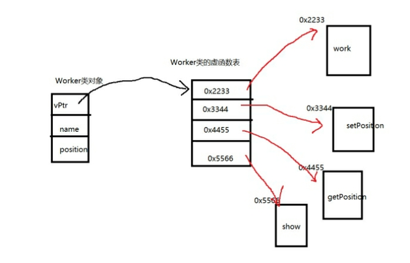
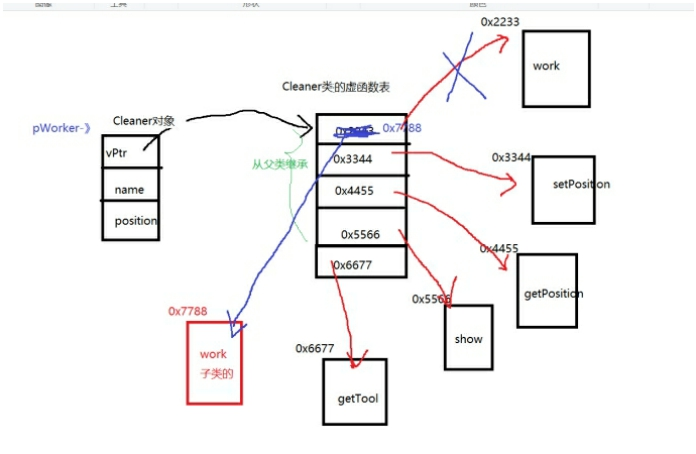
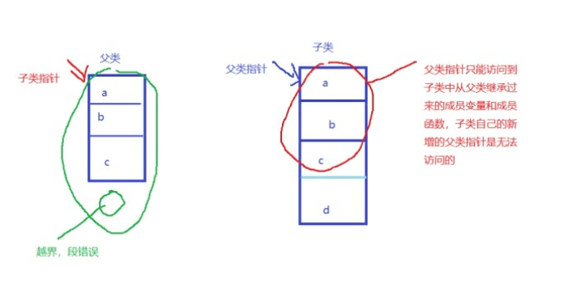
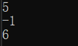
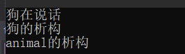

[toc]

# 1 多态的概念

多态是面向对象程序设计语言中数据抽象和继承之外的第三个基本特征。

多种状态（一种接口）多种形态

多态性(polymorphism)提供接口与具体实现之间的另一层隔离，从而将”what”和”how”分离开来。多态性改善了代码的可读性和组织性，同时也使创建的程序具有可扩展性，项目不仅在最初创建时期可以扩展，而且当项目在需要有新的功能时也能扩展。

# 2 静态多态和动态多态

c++支持编译时多态(静态多态)和运行时多态(动态多态)，运算符重载和函数重载就是编译时多态，而派生类和虚函数实现运行时多态。

静态多态和动态多态的区别就是函数地址是早绑定(静态联编)还是晚绑定(动态联编)。如果函数的调用，在==**编译阶段就可以确定函数的调用地址**==，并产生代码，就是静态多态(编译时多态)，就是说地址是早绑定的。而==**如果函数的调用地址不能编译不能在编译期间确定，而需要在运行时才能决定，这这就属于晚绑定**==(动态多态,运行时多态)。

# 3 如何实现多态

## 3.1 实现多态的四个条件

1. 继承。多个子类有一个共同的父类
2. 父类中有虚函数
3. 子类重写父类的虚函数
4. 父类指针指向子类对象

```c++
#include <iostream>
using namespace std;

class animal
{
public:
	virtual void speak() /* 虚函数 */
	{
		cout << "动物在说话" << endl;
	}
};

class dog : public animal
{
public:
	/* 重写虚函数 函数的返回值 参数 函数名一致 */
	void speak()
	{
		cout << "狗在说话" << endl;
	}
};

class cat : public animal
{
public:
	void speak()
	{
		cout << "猫在说话" << endl;
	}
};
/* 如果两个类发生了继承 父类和子类编译器会自动转换.不需要人为转换 */
void do_work(animal &obj)
{
	obj.speak(); 	/* 地址早绑定 ‐> 加上函数前面加上virtual关键字 地址晚绑定 */
}

void test01()
{
	animal p1;
	do_work(p1);

	dog p2;
	do_work(p2);

	cat p3;
	do_work(p3);
}
int main()
{
	test01();
	return 0;
}
```

result


# 4 多态实现原理

==多态的实现一个非常关键的点就在于有虚函数==，一个类中只要有虚函数，那么这个类就会有一张虚函数表（就是一个函数指针数组，这个数组里存放的是这个类中所有的虚函数的入口地址），也就是这个虚函数表是这个类的所有对象共享的

通过对象调用虚函数，得先找到虚函数表，在虚函数表中找到对应的虚函数的入口地址，最终虚函数调用成功

# 5 如何通过对象找到虚函数表

只要类中有虚函数，那么这个类的对象前四个字节就是一个保存虚函数表入口地址的指针

子类会继承父类的虚函数，如果子类重写了父类的虚函数（子类定义了和父类函数名一样参数一样返回值一样，但是函数体不一样的函数），在子类的虚函数表中，父类的这个虚函数就会被子类重写后的虚函数覆盖，所以通过父类指针指向子类对象时，调用的虚函数就是子类重写后的



  

注意：父类指针可以指向子类对象，原因是子类是父类，但是子类指针不能父类的对象



# 6 重载、重定义(隐藏)、重写 

## 6.1 隐藏

父子类中，子类定义了和父类同名的函数时，除过子类定义了和父类一模一样的虚函数时，其他都叫隐藏

- 发生继承
- 子类和父类有同名的变量和函数，父类中同名的变量和函数会被隐藏

## 6.2 重写

父子类中，子类定义了和父类一模一样的虚函数，叫重写，哪怕是函数名一样但是参数不一样的虚函数，也不叫重写，叫隐藏

- 父类中有虚函数
- 发生了继承
- 子类重写了虚函数，函数名、返回值、参数一致，函数体不一致

## 6.3 重载

一个类中，有同名的函数，就叫重载

- 函数名相同
- 同一个作用域
- 参数的个数、顺序、类型不一致
- const也可以成为重载的条件

# 7 多态实现计算器的案例

```c++
#include <iostream>
#include <string> 
using namespace std;

/* 开发时 对源码的修改是关闭的 对扩展是开发的 */
class my_calc
{
public:
	int calc(int a, int b, string cmd)
	{
		if (cmd == "+")
		{
			return a + b;
		}
		else if (cmd == "-")
		{
			return a - b;
		}
		else if (cmd == "*")
		{
			return a * b;
		}
	}
};
void test01()
{
	my_calc p;
	cout << p.calc(3, 4, "+") << endl;
	cout << p.calc(3, 4, "‐") << endl;
}
/*******************************************************************/
/* 多态实现计算器案例 */
class calc
{
public:
	virtual int mycalc(int a, int b)
	{
		return 0;
	}
};

class add : public calc
{
public:
	int mycalc(int a, int b)
	{
		return a + b;
	}
};
class sub : public calc
{
public:
	int mycalc(int a, int b)
	{
		return a - b;
	}
};
class mul : public calc
{
public:
	int mycalc(int a, int b)
	{
		return a * b;
	}
};

int do_calc(int a, int b, calc &obj)
{

	return obj.mycalc(a, b);
}

void test02()
{
	add p;
	cout << do_calc(2, 3, p) << endl;
	sub p1;
	cout << do_calc(2, 3, p1) << endl;
	mul p2;
	cout << do_calc(2, 3, p2) << endl;
}

int main()
{
	test02();
	return 0;
}
```

result



# 8 纯虚函数和抽象类

## 8.1 纯虚函数

将虚函数等于0，实质是将虚函数表的函数入口地址置为NULL

## 8.2 抽象类

在父类中有些虚函数没有必要实现，天生就是被用来重写的，此时就可以将这个函数定义为纯虚函数

抽象类：含有纯虚函数的类就叫做抽象类

抽象类的子类也可以是抽象类

 ==**抽象类不能实例化对象，抽象类天生就是用来被继承的，纯虚函数天生就是用来被重写的**==

总结：一个类中如果有纯虚函数,那么这个类就是一个抽象类,抽象类不能实例化对象继承抽象类的子类也是一个抽象类,如果子类重写了虚函数,那么子类就不是抽象类

```c++
/* 多态实现计算器案例 */
class calc
{
public:
	virtual int mycalc(int a, int b) = 0; /* 虚函数等于0 纯虚函数 */

};
class mod : public calc
{
public:
	/* 子类继承了抽象类,那么子类也是一个抽象类 */
	int mycalc(int a, int b) {} /* 如果子类重写类虚函数 就不是抽象类 */
};

/* 如果有纯虚函数的类 叫做抽象类 抽象类不能实例化对象 */
void test03()
{
	// calc p;
	mod p1;
}
```

# 9 纯虚函数和多继承和接口类

## 9.1 接口类

只有纯虚函数的类就称为接口类

接口类中只有成员函数，没有成员变量，而且所有的成员函数都是纯虚函数

多继承带来了一些争议，但是接口继承可以说一种毫无争议的运用了。

绝大数面向对象语言都不支持多继承，但是绝大数面向对象对象语言都支持接口的概念， c++中没有接口的概念，但是可以通过纯虚函数实现接口。

接口类中只有函数原型定义，没有任何数据定义。

多重继承接口不会带来二义性和复杂性问题。接口类只是一个功能声明，并不是功能实现，子类需要根据功能说明定义功能实现。

==**除了析构函数外，其他声明都是纯虚函数**==

接口类中只有行为，没有属性---》功能

比如：usb接口--》on  off的功能--》一些电子设备都有usb接口

所以：就可以定义usb接口类

只要某个设备是usb接口，就可以继承于usb接口类

电脑可以连接各种usb设备，只要是usb接口的设备，电脑都可以匹配，也就是说只要某个类继承了usb接口类，就可以和电脑进行连接

# 10 多态存在的问题

父类指针指向子类对象，比如：

```C++
Worker *p = new Cleaner; 
delete p;
```

此时只是调用了父类的析构函数，而没有调用子类的析构函数，就会出现==**内存泄漏**==的问题

解决方法：父类的析构函数定义为虚析构函数，那么子类的析构函数也会是虚析构函数

一旦析构函数也是虚函数，那么虚函数表的开头位置就是析构函数，而此时delete p;就会去调用子类的析构函数，而一旦调用了子类的析构函数，那么父类的析构函数也会被调用

# 11 虚析构

作用：在调用父类的析构函数之前，会先调用子类的析构函数

```c++
#include <iostream>
using namespace std;


class animal
{
public:
	virtual void speak() /* 虚函数 */
	{
		cout << "动物在说话" << endl;
	}
	virtual ~animal() /* 虚析构 作用 在调用基类的析构函数之前,会先调用子类的析构 */

	{
		cout << "animal的析构" << endl;
	}
};

class dog : public animal
{
public:
	/* 重写虚函数 函数的返回值 参数 函数名一致 */
	void speak()
	{
		cout << "狗在说话" << endl;
	}
	~dog()
	{
		cout << "狗的析构" << endl;
	}
};

void do_work(animal &obj)
{
	obj.speak(); /* 地址早绑定 ‐> 加上函数前面加上virtual关键字 地址晚绑定 */
}
void test01()
{
	animal *p = new dog;
	p->speak();
	delete p;
}

int main()
{
	test01();
	return 0;
}
```

result



## 11.1 构造函数不能为虚函数

构造函数在创建对象时调用，用于对象的初始化。

1. 当子类创建对象时，会首先调用子类的构造函数，然后再调用父类的构造函数(即子类不继承父类的构造函数)，因此，构造函数为虚函数没有意义。
2. 虚函数的调用，要用到虚函数表指针，指针属于类的对象上，实例化对象需要调用构造函数，如果构造函数为虚函数，前后相矛盾

## 11.2 析构函数应当为虚函数

析构函数在对象销毁前调用，用于对象的清理

1. 当子类中有属性开辟到堆区，若析构函数不为虚函数，在清理对象时，只会调用父类的析构函数，释放父类指针或者引用指向的内存，而不会调用子类的析构函数，导致内存泄漏
2. 当析构函数为虚函数时，在清理对象时，会先调用子类的析构函数，再调用父类的析构函数，正确释放内存。

# 12 纯虚析构

虚析构函数等于0

```c++
class animal
{
public:
	virtual void speak() /* 虚函数 */
	{
		cout << "动物在说话" << endl;
	}
	virtual ~animal() = 0;	/* 纯虚析构 */
};
```

# 13 final

final修饰的类不能被继承

final修饰的虚函数不能被重写

