[toc]

# 1 模板概述

c++提供了函数模板(function template)所谓函数模板，实际上是建立一个通用函数，其函数类型和形参类型不具体指定，用一个虚拟的类型来代表。这个通用函数就成为函数模板。凡是函数体相同的函数都可以用这个模板代替，不必定义多个函数，只需在模板中定义一次即可。在调用函数时系统会根据实参的类型来取代模板中的虚拟类型，从而实现不同函数的功能。

c++提供两种模板机制:函数模板和类模板

类属 - 类型参数化，又称参数模板

## 1.1 总结

模板把函数或类要处理的数据类型参数化，表现为参数的多态性，成为类属。

模板用于表达逻辑结构相同，但具体数据元素类型不同的数据对象的通用行为。

==**用模板是为了实现泛型，可以减轻编程的工作量，增强函数的重用性。**==

# 2 函数模板

## 2.1 什么是函数模板

```c++
#include <iostream>
#include <string>
using namespace std;

void swap(int &x, int &y)
{
	int temp = x;
	x = y;
	y = temp;
}

void swap(char &x, char &y)
{
	char temp = x;
	x = y;
	y = temp;
}
void test01()
{
	int a = 1;
	int b = 2;
	swap(a, b);
	cout << a << " " << b << endl;
}
void test02()
{
	char a = 1;
	char b = 2;
	swap(a, b);
	cout << a << " " << b << endl;
}

/* 函数模板来实现 */
/* class 和 typename都是一样的，用哪个都可以 */
template <class T> 	/* 定义一个模板 模板的通用类型为T */
/* 紧跟函数的定义 */
void swap_temp(T &a, T &b)
{
	T temp = a;
	a = b;
	b = temp;
}
void test03()
{
	char a = 1;
	char b = 2;
	int c = 3;
	int d = 4;
	swap_temp(a, b); /* 自动推导 */
	/* swap_temp(a,c); 自动类型推导的结果不一致 */
	swap_temp(c, d);
}

int main()
{
	test01();
	return 0;
}
```

result

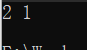

## 2.2 函数模板练习

```c++
#include <iostream>
using namespace std;
#include <string>

/* 函数模板 */
template <typename T>
T add(T a, T b)
{
	return a + b;
}

int add(int a, int b, int c)
{
	return a + b + c;
}

template <typename A, typename B>
void show(A a, B b)
{
	cout << "a = " << a << endl;
	cout << "b = " << b << endl;
}

/* size是非类型模板参数 */
template <typename T, int size>
void printArr(T *arr)
{
	int i;
	for (i = 0; i < size; i++)
	{
		cout << "arr[" << i << "] = " << arr[i] << endl;
	}
}

int main()
{
	int a = 10, b = 10;
	/* 编译器会生成对应的模板函数 */
	cout << add<int>(a, b) << endl;

	string str1 = "aaa", str2 = "bbb";
	cout << add<string>(str1, str2) << endl;

	cout << add(1, 2, 3) << endl;

	/* 可以不用<>，如果没有，就根据传的参数类型自己生成 */
	/* 如果有传类型，就必须传指定的类型的参数 */
	show<int, string>(a, str1);

	int arr[5] = {1, 2, 3, 4, 5};
	printArr<int, 5>(arr);

	string str[3] = {"aaa", "bbb", "ccc"};
	printArr<string, 3>(str);
	return 0;
}
```

result

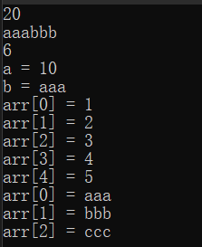

## 2.3 函数模板和普通函数的区别

- 函数模板不允许自动类型转化
- 普通函数能够自动进行类型转化

```c++
#include <iostream>
using namespace std;

int Myadd(int a, int b)
{
	cout << "普通函数" << endl;
	return a + b;
}
template <class T>
T Myadd(T a, T b)
{
	cout << "模板函数" << endl;
	return a + b;
}
void test01()
{
	int a = 10;
	char b = 20;
	Myadd(a, a);	  /* 调用普通函数 不用推导 */
	Myadd<>(a, a);	  /* 指定调用模板函数 */
	Myadd<int>(a, a); /* 指定调用模板函数 */
	Myadd(a, b);	  /* 调用普通函数 因为普通的函数可以自动类型转换 */
	/* Myadd<>(a, b);  函数模板不会做自动类型转换 */
}

int main()
{
	test01();
	return 0;
}
```

result

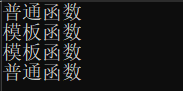

## 2.4 函数模板和普通函数在一起的调用规则

- c++编译器优先考虑普通函数
- 可以通过空模板实参列表的语法限定编译器只能通过模板匹配
- 函数模板可以像普通函数那样可以被重载
- 如果函数模板可以产生一个更好的匹配，那么选择模板

## 2.5 函数模板刨析

### 2.5.1 编译过程

hello.cpp 程序是高级 c 语言程序，这种程序易于被人读懂。为了在系统上运行 hello.c 程序，每一条 c 语句都必须转化为低级的机器指令。然后将这些机器指令打包成可执行目标文件格式，并以二进制形式存储于磁盘中。

预处理(Pre-processing) -> 编译(Compiling) ->汇编(Assembling) -> 链接(Linking)

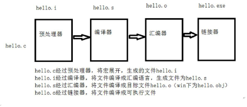

### 2.5.2 函数模板的本质

编译器并不是把函数模板处理成能够处理任何类型的函数

函数模板通过具体类型产生不同的函数

编译器会对函数模板进行两次编译，在声明的地方对模板代码本身进行编译，在调用的地方对参数替换后的代码进行编译。

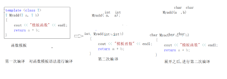

#### 2.5.2.1 总结

就是进行二次编译，第一次对函数模板进行编译，第二次在调用处对函数模板展开进行二次编译

# 3 模板具体化

```c++
class Person
{
public:
	Person(string name, int age)
	{
		this->mName = name;
		this->mAge = age;
	}
	string mName;
	int mAge;
};

/* 普通交换函数 */
template <class T>
void mySwap(T &a, T &b)
{
	T temp = a;
	a = b;
	b = temp;
}

/* 第三代具体化，显示具体化的原型和定意思以template<>开头，并通过名称来指出类型 */
/* 具体化优先于常规模板 */
template <>
void mySwap<Person>(Person &p1, Person &p2)
{
	string nameTemp;
	int ageTemp;

	nameTemp = p1.mName;
	p1.mName = p2.mName;
	p2.mName = nameTemp;

	ageTemp = p1.mAge;
	p1.mAge = p2.mAge;
	p2.mAge = ageTemp;
}

void test()
{
	Person P1("Tom", 10);
	Person P2("Jerry", 20);

	cout << "P1 Name = " << P1.mName << " P1 Age = " << P1.mAge << endl;
	cout << "P2 Name = " << P2.mName << " P2 Age = " << P2.mAge << endl;
	mySwap(P1, P2);
	cout << "P1 Name = " << P1.mName << " P1 Age = " << P1.mAge << endl;
	cout << "P2 Name = " << P2.mName << " P2 Age = " << P2.mAge << endl;
}
```

# 4 类模板

## 4.1 概念

类模板和函数模板的定义和使用类似，我们已经进行了介绍。有时，有两个或多个类，其功能是相同的，仅仅是数据类型不同。

类模板用于实现类所需数据的类型参数化

## 4.2 类模板的实现

```c++
#include <iostream>
using namespace std;
#include <string>

/* 类模板 */
template <typename T, typename C>
class Base
{
public:
	Base(T _a, C _b) :a(_a), b(_b)
	{
		cout << "Base(int, int)" << endl;
	}
	~Base()
	{
		cout << "~Base()" << endl;
	}
	void show()
	{
		cout << "a = " << a << endl;
		cout << "b = " << b << endl;
	}
protected:
	T a;
	C b;
};

#if 0
/* 类模板派生普通类 */
class Inherit :public Base<int, string>
{
public:
	Inherit(int _a, string _b, int _c) :Base(_a, _b), c(_c)
	{
		cout << "Inherit(int, string, int)" << endl;
	}
	~Inherit()
	{
		cout << "~Inherit()" << endl;
	}
	void show()
	{
		cout << "a = " << a << endl;
		cout << "b = " << b << endl;
		cout << "c = " << c << endl;
	}
private:
	int c;
};
#endif

/* 类模板派生出类模板 */
template <typename T, typename C>
class Inherit :public Base<T, C>
{
public:
	Inherit(T _a, C _b, T _c) :Base<T,C>(_a, _b), c(_c)
	{
		cout << "Inherit(int, string, int)" << endl;
	}
	~Inherit()
	{
		cout << "~Inherit()" << endl;
	}
	void show()
	{
		cout << "a = " << Base<T, C>::a << endl;
		cout << "b = " << Base<T, C>::b << endl;
		cout << "c = " << c << endl;
	}
private:
	static T c;
}; 
/* 类模板中的static关键字 */
template <typename T, typename C>
T Inherit<T, C>::c = 0;

int main()
{
	Inherit <int, string>demo(1,"aaa",3);
	demo.show();
	return 0;
}
```

result

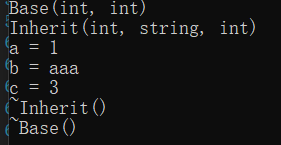

## 4.3 类模板作为函数参数

类模板作为函数的形参，该函数需要写成函数模板

```cpp
template <class T1, class T2>
class Animal
{
public:
	Animal(T1 a, T2 b)
	{
		age = a;
		data = b;
	}
	T1 age;
	T2 data;
};

void show(Animal<int, int> &p)
{
	cout << p.age << " " << p.data << endl;
}

template <class T1, class T2>
void show(Animal<T1, T2> &p)
{
	cout << p.age << " " << p.data << endl;
}

template <class T1>
void show1(T1 &p)
{
	cout << p.age << " " << p.data << endl;
}
```

## 4.4 类模板遇到继承

- 类模板遇到继承  在继承时,继承的类必须是一个模板类<>
- 类模板遇到继承,可以将子类写成类模板

```cpp
template <class T>
class Base
{
public:
	Base(T a)
	{
		this->a = a;
	}
	T a;
};

class Son1 : public Base<int>
{
public:
	Son1(int x1, int a) : Base<int>(a), x(x1)
	{
	}
	int x;
};

template <class T1, class T2>
class Son2 : public Base<T2>
{
public:
	Son2(T1 x1, T2 a) : Base<T2>(a), x(x1)
	{
	}
	T1 x;
};
void test01()
{
	Son1 p(10, 20);
	Son2<int, string> p2(10, "lucy");
}
```

## 4.5 类模板的成员函数在类内实现

```cpp
#include <iostream>
#include <string>
using namespace std;

template <class T1, class T2>
class Person
{
public:
	Person(T1 a, T2 b)
	{
		this->a = a;
		this->b = b;
	}
	void show()
	{
		cout << a << " " << b << endl;
	}
	T1 a;
	T2 b;
};
void test01()
{
	Person<int, string> p(10, "hello");
	p.show();
}
int main()
{
	test01();
	return 0;
}
```

result


## 4.6 类模板的成员函数在类外实现

类模板的成员函数放在类外实现需要写成函数模板

```cpp
#include <iostream>
#include <string>
using namespace std;

template <class T1, class T2>
class Person
{
public:
	Person(T1 a, T2 b);

	void show();
	T1 a;
	T2 b;
};

/* 类模板的成员函数在类外实现 需要写成函数模板 */
template <class T1, class T2>
Person<T1, T2>::Person(T1 a, T2 b)
{
	this->a = a;
	this->b = b;
}
template <class T1, class T2>
void Person<T1, T2>::show()
{
	cout << a << " " << b << endl;
}
void test01()
{
	Person<int, string> p(10, "hello");
	p.show();
}
int main()
{
	test01();
	return 0;
}
```

result

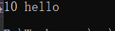

## 4.7 类模板成员函数的创建时机

类模板成员函数的创建时机是在调用时,没有调用,编译器不会创建这个函数,只有函数的声明

```cpp
#include <iostream>
#include <string>
using namespace std;

class A
{
public:
	void showA()
	{
		cout << "showA" << endl;
	}
};
class B
{
public:
	void showB()
	{
		cout << "showB" << endl;
	}
};

template <class T>
class C
{
public:
	void foo1()
	{
		obj.showA();
	}
	void foo2();
	/*
	{
	obj.showB();
	}
	*/
	T obj;
};
void test01()
{
	C<A> p;
	p.foo1(); /* 调用foo1 */
			  /* p.foo2(); */
}
int main()
{
	test01();
	return 0;
}
```

result

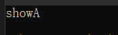

## 4.8 类模板的分文件问题 -- 顺序表扩容

类模板的分文件,必须将函数的定义和类的声明写到一个文件

main.cpp

```c++
#include "arr.h"

int main()
{
	/* 实例化一个数组对象 */
	arr <int>arr1;
	arr1.push_back(1);
	arr1.push_back(2);
	arr1.push_back(3);
	arr1.insert_data(1, 99);
	arr1.insert_data(1, 98);
	arr1.insert_data(1, 97);
	arr1.insert_data(1, 96);

	cout << "arr1[1] = " << arr1[1] << endl;
	arr1.show();
	return 0;
}
```

arr.h

```c
#ifndef _ARR_H_
#define _ARR_H_

#include <iostream>
using namespace std;


/* 定义顺序表的类模板（数组类） */
template <typename T>
class arr
{
public:
	arr(int _size = 5);
	~arr();
	void push_back(T _data);
	void pop_back();
	void insert_data(int index, T _data);

	void delete_data(int index);
	void show();
	int get_count();
	void resize();

	/* 下标运算符的重载 */
	T operator[](int index);
private:
	T *data;
	/* 容量大小 */
	int size; 
	/* 实际元素个数 */
	int count;  
};


template <typename T>
arr<T>::arr(int _size) :size(_size)
{
	cout << "arr(int)" << endl;
	data = new T[_size]();
	count = 0;
	size = _size;
}

template <typename T>
arr<T>::~arr()
{
	delete[] data;
	data = NULL;
	cout << "~arr()" << endl;
}

template <typename T>
void arr<T>::push_back(T _data)
{
	/* 如果count == size说明数组满了，调用扩容函数 */
	if (count == size)
	{
		resize();
	}
	data[count++] = _data;
}

template <typename T>
void arr<T>::pop_back()
{
	count--;
}

template <typename T>
void arr<T>::insert_data(int index, T _data)
{
	if (index < 0 || index > count)
	{
		cout << "insert error" << endl;
	}
	/* 如果count == size说明数组满了，调用扩容函数 */
	if (count == size)
	{
		resize();
	}
	int i;
	for (i = count - 1; i >= index; i--)
	{
		data[i + 1] = data[i];
	}
	data[index] = _data;
	count++;
}

template <typename T>
void arr<T>::delete_data(int index)
{
	if (index < 0 || index >= count)
	{
		cout << "insert index error" << endl;
	}
	int i;
	for (i = index; i < count - 1; i++)
	{
		data[i] = data[i + 1];
	}
	count--;
}

template <typename T>
void arr<T>::show()
{
	int i;
	for (i = 0; i < count; i++)
	{
		cout << data[i] << "  ";
	}
	cout << endl;
}

template <typename T>
int arr<T>::get_count()
{
	return count;
}

/* 扩容函数 */
template <typename T>
void arr<T>::resize()
{
	/* 以2倍的形式扩容 */
	T *tmp = new T[size * 2]();
	/* 将旧的数据拷贝到新的 */
	memcpy(tmp, data, sizeof(T)*size);
	/* 释放旧空间 */
	delete []data;
	/* 指针指向新空间 */
	data = tmp;
	/* 调整新空间的总大小 */
	size *= 2;
}

/* 下标运算符的重载 */
template <typename T>
T arr<T>::operator[](int index)
{
	return this->data[index];
}
#endif
```

result

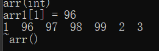

## 4.9 类模板遇到友元

```cpp
#include <iostream>
#include <string>
using namespace std;

template <class T1, class T2>
class Person;

template <class T1, class T2>
void showPerson1(Person<T1, T2> &p);

/* 类模板作为函数形参 函数需要写成 函数模板 */
template <class T1, class T2>
void showPerson(Person<T1, T2> &p)
{
	cout << p.a << " " << p.b << endl;
}

template <class T1, class T2>
class Person
{
	friend void showPerson1<>(Person<T1, T2> &p);
	friend void showPerson<>(Person<T1, T2> &p);
	friend void showPerson2(Person<T1, T2> &p) /* 定义一个全局函数并且声明为类友元 */
	{
		cout << p.a << " " << p.b << endl;
	}

public:
	Person(T1 a, T2 b)
	{
		this->a = a;
		this->b = b;
	}

private:
	T1 a;
	T2 b;
};

template <class T1, class T2>
void showPerson1(Person<T1, T2> &p)
{
	cout << p.a << " " << p.b << endl;
}

void test01()
{
	Person<int, string> p(10, "lucy");
	showPerson(p);
	showPerson1(p);
	showPerson2(p);
}

int main()
{
	test01();
	return 0;
}
```

result

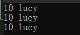

## 4.10 <<运算符的重载只能通过友元来实现

==**[]运算符的重载只能通过成员函数来实现**==

==**"<<"运算符的重载只能通过友元来实现**==

Arr.h

```c++
#ifndef _ARR_H_
#define _ARR_H_

#include <iostream>
using namespace std;

#define SIZE 5
//定义顺序表的类模板（数组类）
template <typename T>
class Arr
{
public:
	Arr(int _size = SIZE, T _val = 0);
	~Arr();
	void pushBack(T _data);
	void popBack();
	void insertData(int index, T _data);

	void deleteData(int index);
	void show();
	int getCount();

	/* 下标运算符的重载 */
	T operator[](int index);
	template <typename T>
	friend Arr<T> operator<<(ostream &out, Arr<T> &arr);

private:
	T data[SIZE];
	int size;  /* 容量大小 */
	int count; /* 实际的元素个数 */
};

#if 0
/* []运算符的重载只能通过成员函数来实现 */
template <typename T>
T operator[](Arr<T> &arr, int index)
{
	return arr.data[index];
}
#endif

/* "<<"运算符的重载只能通过友元来实现 */
template <typename T>
Arr<T> operator<<(ostream &out, Arr<T> &arr)
{
	int i;
	for (i = 0; i < arr.getCount(); i++)
	{
		out << arr[i] << " ";
	}
	out << endl;
	return arr;
}

template <typename T>
Arr<T>::Arr(int _size, T _val) : size(_size)
{
	cout << "Arr(int, int)" << endl;
	int i;
	for (i = 0; i < size; i++)
	{
		data[i] = _val;
	}
	count = 0;
}

template <typename T>
Arr<T>::~Arr()
{
	cout << "~Arr()" << endl;
}

template <typename T>
void Arr<T>::pushBack(T _data)
{
	/* 如果此时count == size，说明数组已经没有空间了 */
	count++;
	data[count - 1] = _data;
}

template <typename T>
void Arr<T>::popBack()
{
	count--;
}

template <typename T>
void Arr<T>::insertData(int index, T _data)
{
	if (index < 0 || index > count)
	{
		cout << "插入位置不正确" << endl;
	}
	int i;
	for (i = count - 1; i >= index; i--)
	{
		data[i + 1] = data[i];
	}
	data[index] = _data;
	count++;
}

template <typename T>
void Arr<T>::deleteData(int index)
{
	if (index < 0 || index >= count)
	{
		cout << "插入位置错误" << endl;
	}
	int i;
	for (i = index; i < count - 1; i++)
	{
		data[i] = data[i + 1];
	}
	count--;
}

template <typename T>
void Arr<T>::show()
{
	int i;
	for (i = 0; i < count; i++)
	{
		cout << data[i] << "  ";
	}
	cout << endl;
}

template <typename T>
int Arr<T>::getCount()
{
	return count;
}

/* 下标运算符的重载 */
template <typename T>
T Arr<T>::operator[](int index)
{
	return this->data[index];
}
#endif
```

main.cpp

```cpp
#include "Arr.h"


int main()
{
	/* 实例化一个数组对象 */
	Arr <int>arr1;
	arr1.pushBack(1);
	arr1.pushBack(2);
	arr1.pushBack(3);
	arr1.insertData(1, 99);
	arr1.show();
	cout << "arr1[1] = " << arr1[1] << endl;

	/* "<<"运算符的重载只能通过友元来实现 */
	cout << arr1;
	return 0;
}
```

result

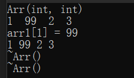
