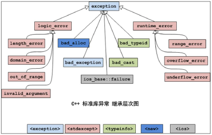
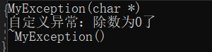
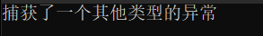
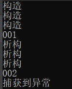
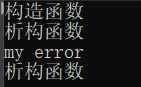
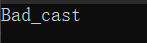
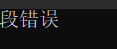
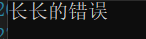

[toc]

# 1 异常基础

## 1.1 异常概念

Bjarne Stroustrup 说：提供异常的基本目的就是为了处理上面的问题。基本思想是：让一个函数在发现了自己无法处理的错误时抛出（throw）一个异常，然后它的（直接或者间接）调用者能够处理这个问题。也就是《C++ primer》中说的：将问题检测和问题处理相分离。

一种思想：在所有支持异常处理的编程语言中（例如 java），要认识到的一个思想：在异常处理过程中，由问题检测代码可以抛出一个对象给问题处理代码，通过这个对象的类型和内容，实际上完成了两个部分的通信，通信的内容是“出现了什么错误”。当然，各种语言对异常的具体实现有着或多或少的区别，但是这个通信的思想是不变的。

一句话：异常处理就是处理程序中的错误。所谓错误是指在程序运行的过程中发生的一些异常事件（如：除 0 溢出，数组下标越界，所要读取的文件不存在,空指针，内存不足等等）。

## 1.2 抛出异常的好处

1. throw时对类型没有限制
2. 跨级抛出异常
3. 抛出异常对象、使用多态来实现

## 1.3 以前怎么处理异常

在 C 语言的世界中，对错误的处理总是围绕着两种方法：一是使用整型的返回值标识错误；二是使用 errno 宏（可以简单的理解为一个全局整型变量）去记录错误。当然 C++中仍然是可以用这两种方法的。

这两种方法最大的缺陷就是会出现不一致问题。例如有些函数返回 1 表示成功，返回0 表示出错；而有些函数返回 0 表示成功，返回非 0 表示出错。

还有一个缺点就是函数的返回值只有一个，你通过函数的返回值表示错误代码，那么函数就不能返回其他的值。当然，你也可以通过指针或者 C++的引用来返回另外的值，但是这样可能会令你的程序略微晦涩难懂。

## 1.4 c++异常机制相比c语言异常处理的优势

函数的返回值可以忽略，但异常不可忽略。如果程序出现异常，但是没有被捕获，程序就会终止，这多少会促使程序员开发出来的程序更健壮一点。而如果使用 C 语言的 error 宏或者函数返回值，调用者都有可能忘记检查，从而没有对错误进行处理，结果造成程序莫名其面的终止或出现错误的结果。

整型返回值没有任何语义信息。而异常却包含语义信息，有时你从类名就能够体现出来。

整型返回值缺乏相关的上下文信息。异常作为一个类，可以拥有自己的成员，这些成员就可以传递足够的信息。

异常处理可以在调用跳级。这是一个代码编写时的问题：假设在有多个函数的调用栈中出现了某个错误，使用整型返回码要求你在每一级函数中都要进行处理。而使用异常处理的栈展开机制，只需要在一处进行处理就可以了，不需要每级函数都处理。


# 2 c++处理异常

## 2.1 异常类继承层级结构图



## 2.2 c++异常基本语法

```cpp
#include <iostream>
using namespace std;
#include <string>
#include <exception>

class MyException : public exception
{
public:
	MyException(const char *_data)
	{
		data = _data;
		cout << "MyException(char *)" << endl;
	}
	~MyException()
	{
		cout << "~MyException()" << endl;
	}
	virtual const char *what() const
	{
		return data;
	}

private:
	const char *data;
};
enum ERR_CODE
{
	ARGC_ERR = -1,
	OK
};

float myDiv(int a, int b)
{
	if (0 == b)
	{
		/* throw string("除数不能为0");  //可以抛出任何类型的异常 */
		/* throw (char *)0x1100; */
		/* throw (new invalid_argument("除数为0了")); */
		throw(new MyException("自定义异常：除数为0了"));
	}
	return a / b;
}

void fun()
{
	myDiv(10, 0);
}

int printArr(int *pArr, int size)
{
	if (NULL == pArr || size < 0)
	{
		return ARGC_ERR;
	}
	int i;
	for (i = 0; i < size; i++)
	{
		cout << pArr[i] << " ";
	}
	cout << endl;
}
int main()
{
	try
	{
		fun();
	}
	catch (string error)
	{
		cout << error << endl;
	}
	catch (int error)
	{
		cout << "产生错误" << endl;
	}
	catch (exception *error)
	{
		cout << error->what() << endl;
		delete error;
	}
	catch (...)
	{
		cout << "未知异常" << endl;
	}
	return 0;
}
```

result



### 2.2.1 总结

- 若有异常则通过 throw 操作创建一个异常对象并抛出。
- 将可能抛出异常的程序段放到 try 块之中。
- 如果在 try 段执行期间没有引起异常，那么跟在 try 后面的 catch 字句就不会执行。
- catch 子句会根据出现的先后顺序被检查，匹配的 catch 语句捕获并处理异常(或继续抛出异常)
- 如果匹配的处理未找到，则运行函数 terminate 将自动被调用，其缺省功能调用 abort 终止程序。
- 处理不了的异常，可以在 catch 的最后一个分支，使用 throw，向上抛。

c++异常处理使得异常的引发和异常的处理不必在一个函数中，这样底层的函数可以着重解决具体问题，而不必过多的考虑异常的处理。上层调用者可以在适当的位置设计对不同类型异常的处理。

## 2.3 异常严格类型匹配

异常机制和函数机制互不干涉,但是捕捉方式是通过严格类型匹配。

```cpp
#include <iostream>
#include <string.h>
#include <string>
using namespace std;

int mydive(int a, int b)
{
	string str = "hello";
	if (b == 0)
	{
		throw str; /*  处理异常 抛出异常 抛出一个类型 */
	}

	return a / b;
}
void test01()
{
	/* 尝试捕获异常 */
	try
	{
		mydive(2, 0);
	}
	catch (char) /* 如果没有捕获的抛出的异常 程序会被终止 */
	{
		/* cout << "捕获了一个char类型的异常" << endl; */
		throw 'a';
	}
	catch (int)
	{
		cout << "捕获了一个int类型的异常" << endl;
	}
	catch (double)
	{
		cout << "捕获了一个double类型的异常" << endl;
	}
	catch (...)
	{
		cout << "捕获了一个其他类型的异常" << endl;
	}
}
int main()
{
	try
	{
		test01();
	}
	catch (char)
	{
		cout << "捕获了一个char类型的异常" << endl;
	}
}
```

result



## 2.4 栈解旋

异常被抛出后，从进入 try 块起，到异常被抛掷前，这期间在栈上构造的所有对象，都会被自动析构。析构的顺序与构造的顺序相反，这一过程称为栈的解旋(unwinding).

在try到throw之间定义的对象,在throw之后会被释放

```cpp
#include <iostream>
#include <string>
using namespace std;

class Person
{
public:
	Person(string name)
	{
		cout << "构造" << endl;
		this->name = name;
	}
	~Person()
	{
		cout << "析构" << endl;
	}
	string name;
};
void fun()
{
	Person p2("bob");
	Person p3("peter");
	cout << "001" << endl;
	throw 1;
}

void test01()
{
	try
	{
		Person p1("lucy");
		fun();
	}
	catch (int)
	{
		cout << "002" << endl;
		cout << "捕获到异常" << endl;
	}
}

int main()
{
	test01();
	return 0;
}
```

result



## 2.5 异常接口的声明

为了加强程序的可读性，可以在函数声明中列出可能抛出异常的所有类型，例如：void func() throw(A,B,C);这个函数 func 能够且只能抛出类型 A,B,C 及其子类型的异常。

如果在函数声明中没有包含异常接口声明，则此函数可以抛任何类型的异常，例如:void func()

一个不抛任何类型异常的函数可声明为:void func() throw()

如果一个函数抛出了它的异常接口声明所不允许抛出的异常,unexcepted 函数会被调用，该函数默认行为调用terminate 函数中断程序。

```cpp
/* 可抛出所有类型异常 */
void TestFunction01()
{
	throw 10;
}

/* 只能抛出int char char*类型异常 */
void TestFunction02() throw(int, char, char *)
{
	string exception = "error!";
	throw exception;
}

/* 不能抛出任何类型异常 */
void TestFunction03() throw()
{
	throw 10;
}

int main()
{
	try
	{
		// TestFunction01();
		// TestFunction02();
		// TestFunction03();
	}
	catch (...)
	{
		cout << "捕获异常!" << endl;
	}

	system("pause");
	return EXIT_SUCCESS;
}
```

## 2.6 异常变量声明周期

throw 的异常是有类型的，可以是数字、字符串、类对象。 

throw 的异常是有类型的，catch 需严格匹配异常类型。

==**抛出的匿名对象的生命周期在catch里面**==

```cpp
#include <iostream>
#include <string>
using namespace std;
class Myexception
{
public:
	Myexception()
	{
		cout << "构造函数" << endl;
	}
	~Myexception()
	{
		cout << "析构函数" << endl;
	}
	void error()
	{
		cout << "my error" << endl;
	}
};
void fun()
{
	Myexception p1;
	/* throw Myexception();//如果抛出匿名对象 它的生命周期在catch里面 */
	throw p1;  /* p1声明周期在throw之后 */
}
void test01()
{
	try
	{
		fun();
	}
	catch (Myexception &p)
	{
		p.error();
	}
}
int main()
{
	test01();
	return 0;
}
```

result



## 2.7 异常的多态作用

```cpp
#include <iostream>
#include <string>
using namespace std;

/* 基类 */
class Myexception
{
public:
	virtual void error() = 0;
};

class Out_of_range : public Myexception
{
public:
	void error()
	{
		cout << "Out_of_range" << endl;
	}
};

class Bad_cast : public Myexception
{
public:
	void error()
	{
		cout << "Bad_cast" << endl;
	}
};
void fun()
{
	/* throw Out_of_range(); */
	throw Bad_cast();
}
void test01()
{
	try
	{
		fun();
	}
	catch (Myexception &p)
	{
		p.error();
	}
}
int main()
{
	test01();
	return 0;
}
```

result



# 3 c++异常库

## 3.1 c++异常库的使用

```cpp
#include <iostream>
#include <string>
/* exception */
#include <stdexcept>

using namespace std;

void fun()
{
	/**/
	/* throw out_of_range("越界"); */
	throw invalid_argument("段错误");
}
void test01()
{
	try
	{
		fun();
	}
	catch (exception &p)
	{
		cout << p.what() << endl;
	}
}
int main()
{
	test01();
	return 0;
}
```

result



## 3.2 编写自己的异常库

### 3.2.1 如何编写自己的异常类

1. 建议自己的异常类要继承标准异常类。因为 C++中可以抛出任何类型的异常，所以我们的异常类可以不继承自标准异常，但是这样可能会导致程序混乱，尤其是当我们多人协同开发时。
2. 当继承标准异常类时，应该重载父类的 what 函数和虚析构函数。
3. 因为栈展开的过程中，要复制异常类型，那么要根据你在类中添加的成员考虑是否提供自己的复制构造函数

```cpp
#include <iostream>
#include <string>
/* exception */
#include <stdexcept>
using namespace std;
class Longlongerror : public exception
{
public:
	Longlongerror(string data)
	{
		this->data = data;
	}
	Longlongerror(char *data)
	{
		this->data = data;
	}
	const char *what() const
	{
		return data.c_str();
	}
	string data;
};

void fun()
{
	throw Longlongerror("长长的错误");
}
void test01()
{
	try
	{
		fun();
	}
	catch (exception &p)
	{
		cout << p.what() << endl;
	}
}
int main()
{
	test01();
	return 0;
}
```

result


