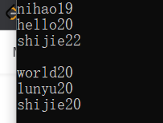
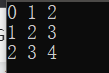

[toc]

# 1 STL初始

## 1.1 STL基本概念

- STL(Standard Template Libary, 标准模板库)
- STL从广义上分为：==容器、算法、迭代器==
- 容器和算法之间通过迭代器连接
- STL几乎所有的代码都采用了模板类或者函数模板

## 1.2 STL六大组件

STL大体分为六种：容器、算法、迭代器、仿函数、适配器、控件配置器

### 1.2.1 容器

各种数据结构，如vector、list、deque、set、ma等，用来存放数据

### 1.2.2 算法

各种常用的算法、如sort、find、copy等

### 1.2.3 迭代器

容器和算法之间连接器

### 1.2.4 仿函数

行为类似函数，作为和算法的某种策略

### 1.2.5 适配器

用来修饰容器或者仿函数或迭代器接口

### 1.2.6 空间配置器

负责空间的配置和管理

## 1.3 STL中容器、算法、迭代器

### 1.3.1 容器

放置数据，STL容器就是使用最广泛的一些数据结构的实现

常用的数据结构：数组、链表、树、队列、集合、映射表

#### 1.3.1.1 分类

容器分为关联式容器和序列式容器

##### 1.3.1.1.1 关联式容器

二叉树结构，没有严格上的物理上的顺序关系

##### 1.3.1.1.2 序列式容器

强调值得顺序，每个元素都有固定的位置

### 1.3.2 算法

有限的步骤解决逻辑/数学问题

#### 1.3.2.1 分类

##### 1.3.2.1.1 质变算法

会更改元素内容的算法、删除、拷贝

##### 1.3.2.1.2 非质变算法

运算不会改变元素内容，计数、查找

### 1.3.3 迭代器

算法要通过迭代器才能访问容器中的数据，每个容器都有自己的迭代器，用法类似于指针。

常用的迭代器种类有：双向迭代器，随机访问迭代器。

| 种类           | 功能                                                     | 支持运算                                |
| -------------- | -------------------------------------------------------- | --------------------------------------- |
| 输入迭代器     | 对数据的只读访问                                         | 只读，支持++、==、!=                    |
| 输出迭代器     | 对数据的只写访问                                         | 只写，支持++                            |
| 单向迭代器     | 读写操作，并能向前推进迭代器                             | 读写，支持++、==、!=                    |
| 双向迭代器     | 读写操作，并能向前和向后操作                             | 读写，支持++、--                        |
| 随机访问迭代器 | 读写操作，可以以跳跃的方式访问任意数据，功能最强的迭代器 | 读写，支持++、--、[n]、-n、<、<=、>、>= |

## 1.4 容器、算法、迭代器初识

### 1.4.1 vector存放内置数据类型

```
容器：vector
算法：for_each
迭代器：vector<int>::iterator
```

```cpp
#include <iostream>
#include <vector>
#include <algorithm>

using namespace std;

void my_printf(int val)
{
	printf("%d\n", val);
}

void test01()
{
	vector<int> v;
	v.push_back(10);
	v.push_back(20);
	v.push_back(30);

#if 1
	// 第一种遍历
	vector<int>::iterator it_begin = v.begin();
	vector<int>::iterator it_end = v.end();
	while (it_begin != it_end)
	{
		cout << *it_begin << endl;
		it_begin++;
	}
#endif

#if 0
	// 第二种遍历
	for (vector<int>::iterator it = v.begin(); it != v.end(); it++)
	{
		cout << *it << endl;
	}
#endif

#if 0
	// 第三种遍历
	for_each(v.begin(), v.end(), my_printf);
#endif
}

int main()
{
	test01();
	/*
	 * result：
	 *		10
	 *		20
	 *		30
	 */
	return 0;
}
```

### 1.4.2 vector存放自定义数据类型

```
(*it)到最后是什么类型，可以直接看迭代器尖括号里面的东西即可
就像下面的
函数1：(*it)是person类型的
函数2：(*it)是person *类型的
```

```c++
#include <iostream>
#include <vector>
#include <string>
#include <algorithm>

using namespace std;

class person
{
public:
	person(string _name, int _age)
	{
		this->name = _name;
		this->age = _age;
	}

public:
	string name;
	int age;

};

void test01()
{
	vector<person> v;

	person per1("nihao", 19);
	person per2("hello", 20);
	person per3("shijie", 22);
	v.push_back(per1);
	v.push_back(per2);
	v.push_back(per3);

	for (vector<person>::iterator it = v.begin(); it != v.end(); it++)
	{
		cout << (*it).name <<(*it).age << endl;
	}
	cout << endl;
}

void test02()
{
	vector<person *> v;

	person per1("world", 20);
	person per2("lunyu", 20);
	person per3("shijie", 20);
	v.push_back(&per1);
	v.push_back(&per2);
	v.push_back(&per3);

	for (vector<person *>::iterator it = v.begin(); it != v.end(); it++)
	{
		cout << (*it)->name << (*it)->age << endl;
	}
}

int main()
{
	test01();
	test02();
	return 0;
}
```

result



### 1.4.3 vector容器嵌套容器

```cpp
#include <iostream>
#include <vector>
#include <string>
#include <algorithm>

using namespace std;

// 容器嵌套容器
void test01()
{
	vector<vector<int>> v;
	
	// 容器数组
	vector<int> v1[3];


	// 给 vector<vector<int>> 赋值
	for (int k = 0; k < 3; k++)
	{
		for (int i = 0; i < 3; i++)
		{
			v1[k].push_back(i + k);
		}
	}

	// 将小容器放入大容器中
	v.push_back(v1[0]);
	v.push_back(v1[1]);
	v.push_back(v1[2]);


	// 遍历大容器
	for (vector<vector<int>>::iterator it = v.begin(); it != v.end(); it++)
	{	// 遍历小容器
		for (vector<int>::iterator it2 = (*it).begin(); it2 != (*it).end(); it2++)
		{
			cout << *it2 << " ";
		}
		cout << endl;
	}
}


int main()
{
	test01();
	return 0;
}
```

result



