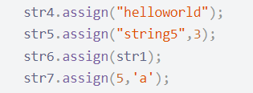
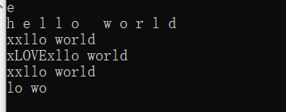
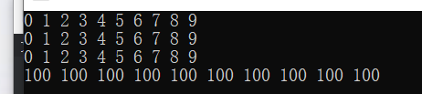

[toc]

# 1 String容器

## 1.1 头文件

```cpp
#include <string>
```

## 1.2 string基本概念

### 1.2.1 本质

```
string是C++风格的字符串，而string本质上是一个类
```

### 1.2.2 string和char *的区别

```
char *是一个指针
string是一个类，类内部封装了char *，是char *型容器
```

### 1.2.3 string与传统字符读入对比

| 操作          | string                     | 字符阵列           |
| ------------- | -------------------------- | ------------------ |
| 声明字符串    | string s;                  | char s[100];       |
| 取得第i个字符 | s[i]                       | s[i]               |
| 字符串长度    | s.length(); s.size();      | strlen(s);不计\0   |
| 读取一行      | getline(cin, s);           | gets(s);           |
| 设成某字符串  | s = "ABCD";                | strcpy(s, "ABCD"); |
| 字符串相加    | s = s + "EFG"; s += "EFG"; | strcat(s, "EFG");  |
| 字符串比较    | s == "ABCD";               | stramp(s, "ABCD"); |

### 1.2.4 特点

```
string类内部封装了许多的成员方法（例如：find,copy,delete）
string管理char *所分配的空间，不用担心下标越界
```

## 1.3 string构造函数

### 1.3.1 构造函数原型

```cpp
string();					// 创建空的字符串
string(const char *); 	 	 // 使用字符串s初始化
string(const string& str);	 // 使用字符串对象来初始化另一个string对象
string(int n, char c);		 // 使用n个字符串初始化
```

## 1.4 string赋值操作

### 1.4.1 功能描述

```
给string字符串赋值( = 或者assign)
```

### 1.4.2 赋值操作原型函数

```cpp
// 赋值操作一共有两种：一种是直接用 = ，原型如下
string& operator=(const char* s);     // char *类型字符串，赋值给当前字符串
string& operator=(const string& s);    // 把字符串赋给当前的字符串
string& operator=(char c);    // 字符赋值给当前的字符串

// 另一种是assign()
string& assign(const char* s);    // 把字符串s赋给当前的字符串
string& assign(const char* s, int n);    // 把字符串的前n个字符赋给当前的字符串
string& assign(const string& s);    // 把字符串s赋给当前字符
string& assign(int n, char c);    // 用n个字符c赋给当前字符
```



### 1.4.3 总结

```
string赋值的方法很多，但是用operator=号是较为实用的方法
```

## 1.5 string字符串拼接

### 1.5.1 功能描述

```
实现在字符串的末尾拼接字符串
```

### 1.5.2 拼接函数原型

```cpp
string& operator+=(const char* str);	// 重载+=操作符
string& operator+=(const char c);		// 重载+=操作符
string& operator+=(const string& str);		// 重载+=操作符
string& append(const char* s);				// 把字符串s连接到当前字符串结尾
string& append(const char* s, int n);				// 把字符串s的前n个字符连接到当前字符串结尾
string& append(const string &s);			// 同operator+=(const string& str)
string& append(const string &s, int pos, int n);	// 字符串s中从pos开始的n个字符连接到字符串结尾
```

### 1.5.3 示例

```cpp
#include <iostream>
#include <string>

using namespace std;

int main()
{
	string str1 = "I";
	string str2 = "you, lily";
	string str3 = "life";

	str1 += "love";			// 追加字符串
	str1 += " ";			// 追加单个字符
	str1 += str2;			// 拼接字符串对象
	cout << str1 << endl;		// result: Ilove you, lily

	str3.append(" is ");
	str3.append("movefghfafiaoh", 4);
	str3.append(str2, 0, 3);
	cout << str3 << endl;		// result: life is moveyou
	return 0;
}
```

### 1.5.4 总结

```
如果使用append(const string &s, int pos, int n)函数，应当弄明白字符的位置是从0开始的
```

## 1.6 string查找和替换

### 1.6.1 功能描述

```
查找：查找指定字符串是否存在
替换：在指定的位置替换字符串
```

### 1.6.2 函数原型

```cpp
int find(const string &str, int pos=0) const; 		// 从pos位置开始查找str第一次出现的位置
int find(const char *s, int pos=0) const;			// 从pos位置开始查找s第一次出现位置
int find(const char *s, int pos=0, int n) const; 		// 从pos位置查找s的前n个字符第一次位置
int find(const char c, int pos=0)  const; 			// 从pos位置查找字符c的第一次出现位置
int rfind(const string &str, int pos=npos) const; 	// 从pos开始查找str最后一次位置，
int rfind(const char *s, int pos=npos) const; 		// 从pos开始查找s最后一次出现位置，
int rfind(const char *s, int pos,int n) const; 		// 从pos查找s的前n个字符最后一次位置
int rfind(const char c, int pos=0) const;			// 查找字符c最后一次出现位置
string &replace(int pos, int n, const string &str);	// 替换从pos开始的n个字符为str
string &replace(int pos, int n, const char *s);		// 替换从pos开始的n个字符为字符串s

/*
 * rfind和find的区别：find默认从左往右查找，而rfind则代表从右往左查；
 * find找到字符串后返回查找到的字符串的第一个字符的下标，找不到则返回-1；
 * replace替换时要指定从哪儿个位置开始起，其后有多少个字符，替换成什么样的字符串。
 */
```

## 1.7 string字符串的比较

### 1.7.1 比较方式

```
比较字符的ASCII码值
	= return 0
	> return 1
	< return -1
```

### 1.7.2 函数原型

```cpp
// 在string类内部有这两个操作：
int compare(const string &s) const;	//与string对象字符串s比较
int compare(const char *s) const;	//与字符串s比较
```

### 1.7.3 总结

```
一般用来比较字符串是否相等
```

## 1.8 string字符存取、字符串插入删除、子串获取

### 1.8.1 函数原型

```cpp
// 在string类内部存取字符有这两个操作：
char& operator[](int n);	// 通过[]方式取字符
char& at(int n);	// 通过string类内部at方法获取字符
// 插入和删除
string& insert(int pos, const char* s);		// 通过指向字符常量区域的指针对调用该成员函数的对象来插入字符
string& insert(int pos, const string &str);	// 通过string类型的对象插入字符
string& insert(int pos, int n, char c);		// 在指定位置插入n个字符c
string& erase(int pos, int n);			// 删除从pos开始的n个字符
// 获取子串
string substr(int pos = 0, int n) const;	// 从pos位置开始的n个字符
```

### 1.8.2 示例

```cpp
#include <iostream>
#include <string>

using namespace std;

int main()
{
	/* 读取  */
	string str = "hello world";
	cout << str[1] << endl;
	for (int i = 0; i < str.size(); i++)
	{
		cout << str.at(i) << " ";
	}
	cout << endl;

	/* 修改 */
	str[0] = 'x';
	str.at(1) = 'x';
	cout << str << endl;
	
	/* 插入 */
	str.insert(1, "LOVE");
	cout << str << endl;

	/* 删除 */
	str.erase(1, 4);
	cout << str << endl;

	/* 返回子串 */
	cout << str.substr(3, 5) << endl;
	return 0;
}
```

result



# 2 vector容器

## 2.1 头文件

```cpp
#include <vector>
```

## 2.2 vector基本概念

### 2.2.1 功能

vector数据结构和数组非常相似，也称为**单端数组**

### 2.2.2 vector和普通数组区别

不同之处在于数组是静态空间，而vector可以**动态扩展**

#### 2.2.2.1 动态扩展

1. 并不是在原空间之后续接新空间，而是找更大的内存空间，然而将原数据拷贝新空间，释放原空间。
2. vector容器的迭代器是支持随机访问的迭代器

## 2.3 vector构造函数

## 2.4 函数原型

```cpp
vector<T> v;				// 采用模板实现类实现，默认构造函数
vector(v.begin(), v.end());	// 将v[begin(), end()]区间中的元素拷贝给本身
vector(n, elem);			// 构造函数将n个elem拷贝给本身
vector(const vector &vec);	// 拷贝构造函数
```

## 2.5 vector赋值操作

```cpp
vector &operator = (const vector &vec);		// 重载等号操作符
assign(begin, end);							// 将[begin, end]区间的数据拷贝赋值给本身
assign(n, elem);							// 将n个elem拷贝赋值给本身 
```

### 2.5.1 示例

```cpp
#include<iostream>
#include<vector>
using namespace std;
void printVector(vector<int>& v)
{
	for (vector<int>::iterator it = v.begin(); it != v.end(); it++)
	{
		cout << *it << " ";
	}
	cout << endl;
}
// vector赋值
void test01()
{
	vector<int>v1;
	for (int i = 0; i < 10; i++)
	{
		v1.push_back(i);
	}
	printVector(v1);
	// 赋值
	vector<int>v2;
	v2 = v1;
	printVector(v2);
	// assign
	vector<int>v3;
	v3.assign(v1.begin(), v1.end());
	printVector(v3);
	// n个elem方式赋值
	vector<int>v4;
	v4.assign(10, 100);
	printVector(v4);
}

int main()
{
	test01();
	return 0;
}
```

result



## 2.6 vector容量和大小

```cpp
empty();	// 判断容器是否为空
capacity();	// 容器的容量
size();	// 返回容器中元素的个数
resize(int num);	// 重新指定容器的长度为num，若容器变长，则以默认值0填充新位置。如果容器变短，则末尾超出容器长度的元素被删除。
resize(int num, elem);	// 重新指定容器的长度为num，若容器变长，则以elem值填充新位置。如果容器变短，则末尾超出容器长度的元素被删除
```

### 2.6.1 总结

```
判断是否为空--- empty()
返回元素个数--- size()
返回容量个数--- capacity()
重新指定大小--- resize()
```

## 2.7 vector插入和删除

```cpp
push_back(ele);	// 尾部插入元素
pop_back();	// 删除尾部元素
insert(const_iterator pos, ele);	// 迭代器指向位置pos插入ele
insert(const_iterator pos, int count, ele);	// 迭代器指向pos插入count个元素ele
erase(const_iterator start, const_iterator end);	// 删除迭代器从start到end之间的元素
clear();	// 删除容器中所有元素
```

### 2.7.1 总结

```
插入有尾部插入、通过迭代器插入某个元素、通过迭代器插入区间的元素;
删除有尾部删除，通过迭代器删除某个元素、通过迭代器删除区间的元素;
清空元素。
```

## 2.8 vector容器数据存取

```cpp
at(int idx);	// 返回索引idx所指的数据
operator[];	// 返回索引idx所指的数据
front();	// 返回容器中第一个数据元素
back();	// 返回容器中最后一个数据元素
begin();	// 返回容器首个元素迭代器
end();		// 返回容器尾元素的迭代器
```

## 2.9 vector互换容器、预留空间

### 2.9.1 互换容器

```cpp
swap(vec); // 将vec与本身的元素互换  v1.swap(v2);
```

### 2.9.2 预留空间

```cpp
// 功能描述：减少vector在动态扩展容量时的扩展次数
reserve(int len);	// 容器预留len个元素长度，预留位置不初始化，元素不可访问 v.reserve(100000);
```

## 2.10 vector总结

### 2.10.1 插入

1. 使用push_back插入时，绝大多数时不会引起迭代器失效，但容量不足时(我们没有设定resize时，系统认为不足时需要搬家他也会重新创建)系统帮你搬家就会造成迭代器失效。
2. 对于单线程没有使用迭代器或者单线程使用了迭代器并未指定大小不需要担心报错。但是如果是多线程下，一个线程只push_back(假设刚好搬家)，不操作迭代器，另一个线程不断使用迭代器循环遍历检测vec中的数据，那么push_back后，迭代器失效，造成使用迭代器遍历的线程崩溃。
3. 解决的办法就是加锁，只有获取到锁后才能push_back，另一个线程则等待，每一次遍历都是单独的是顺序的，这样我每次循环都能通过v.begin去更新迭代器。
4. insert函数的插入更加离谱，只要插入就会造成当前迭代器及其往后迭代器失效(无法索引)，每次插入都必须利用返回值更新迭代器。
5. 所以单线程下使用insert必须更新迭代器，多线程下也要更新迭代器并且必须加锁。

### 2.10.2 删除

#### 2.10.2.1 erase

1. 正确的写法只有一个，就是必须更新返回值，并且it++不能写在for循环的参3，否则自增了两次，索引寻找数据时就会有问题。
2. 删除报错都是基于没有更新迭代器的。单线程很容易理解，多线程的话，报错也是因为迭代器没有更新，例如一个线程删除并且更新了迭代器，另一个线程使用迭代器在遍历全局vec，但是由于只是在删除线程更新了，遍历的没有更新，所以就会出错。解决方法上面讲过就是加锁，确保每次循环遍历都是独立的。

#### 2.10.2.2 pop_back

pop的删除只要不写成下面的错误写法，单线程和多线程都是安全的(多线程可以参考deque那篇文章的测试)，但是由于多线程操作vector的话，必须加锁。

```cpp
void test04()
{
	vector<int> v;
	v.push_back(1);
	v.push_back(2);
	v.push_back(2);
	v.push_back(2);
	v.push_back(2);
	v.push_back(4);
	v.push_back(5);

	for (vector<int>::iterator it = v.begin(); it != v.end(); ) {
		if (*it == 2) {
			v.pop_back();	// 一般很少遍历调用pop_back
		}
		else {
			it++;
		}
	}
}
```


