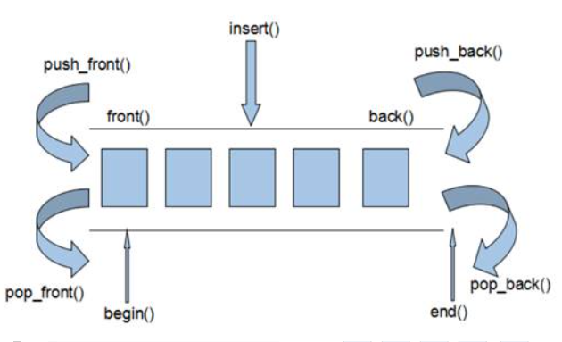
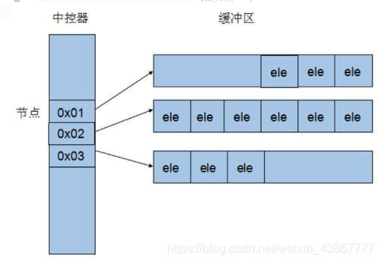
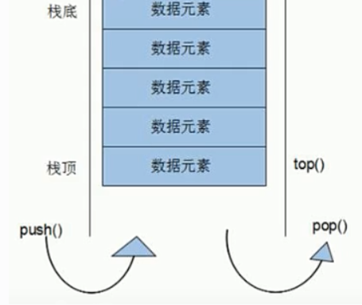
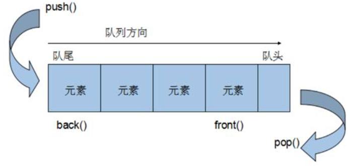

[TOC]

# 1 deque容器

## 1.1 头文件

```cpp
#include <deque>
```

## 1.2 deque容器基本概念

### 1.2.1 特性

```
双向队列，可以对头端进行插入删除操作
deque容器的迭代器也是支持随机访问的
```

### 1.2.2 deque与vector的区别

1. vector对应头部的插入删除效率低，数据量越大，效率越低

2. deque相对而言，对头部的插入删除速度比vector快

3. 如果有大量释放操作的话，vector花的时间更少

4. vector.at()比deque.at()效率高，比如vector.at(0)是固定的，deque的开始位置却是不固定的

   

### 1.2.3 deque内部工作原理

deque内部有个中控器，维护每段缓冲区中的内容，缓冲区存放真实数据，中控器维护的是每个缓冲区的地址，使得使用deque时像一片连续的内存空间。



## 1.3 deque构造函数与迭代器

### 1.3.1 函数原型

```cpp
deque<T> deqT;            // 默认构造形式
deque(beg, end);           // 构造函数将[beg,end)区间中元素拷贝给本身
deque(n, elem);            // 构造函数将n个elem拷贝给本身
deque(const deque &deq);  // 拷贝构造函数
```

### 1.3.2 迭代器

```
当仅仅是为了遍历，而不需修改时候，应当加上const关键字
const类型的容器需要const_iterator 迭代器才不会报错
```

## 1.4 deque赋值操作

### 1.4.1 函数原型

```cpp
deque& operator=(const deque &deq);      // 重载等号操作符
assign(beg, end);                         // 将[beg, end)区间中的数据拷贝赋值给本身
assign(n, elem);                          // 将n个elem拷贝赋值给本身
```

## 1.5 deque大小操作

deque容器是没有容量这个概念的,所以不像vector中有capacity函数

```cpp
empty();            // 判断容器是否为空
size();             // 返回容器中元素的个数
resize(num);        // 重新指定容器的长度为num，若容器变长，则默认值填充新位置，若容器变短，则末尾值超出容器长度的元素被删除
resize(num, elem);   // 重新指定容器的长度为num,若容器边长，则以elem值填充新位置，如果容器变短，则末尾超出容器长度的元素被删除
```

## 1.6 deque插入和删除

```cpp
// 两端插入操作： 
push_back(elem);             // 在容器尾部添加一个数据
push_front(elem);            // 在容器头部插入一个数据
pop_back();                  // 删除容器最后一个数据
pop_front();                 // 删除容器第一个数据

// 指定位置操作：
insert(pos, elem);             // 在pos位置插入一个elem元素的拷贝，返回新数据的位置
insert(pos, n, elem);           // 在pos位置插入n个elem数据，无返回值
insert(pos, beg, end);          // 在pos位置插入[beg, end）区间的数据，无返回值
clear();                      // 清空容器的所有数据
erase(beg, end);               // 删除[beg, end)区间的数据，返回下一个数据的位置
erase(pos);                   // 删除pos位置的数据，返回下一个数据的位置
```

## 1.7 deque数据存取

```cpp
at(int idx);        // 返回索引idx所指的数据
operator[];         // 返回索引idx所指的数据
front();            // 返回容器中第一个数据
back();             // 返回容器中最后一个数据
begin();			// 返回容器首迭代器
end();				// 返回容器尾迭代器
```

## 1.8 deque排序

### 1.8.1 头文件

```cpp
#include <algorithm>
```

```
sort算法默认升序;
对于支持随机访问的迭代器的容器，都可以利用sort算法直接对其进行排序
```

### 1.8.2 函数原型

```cpp
sort(iterator beg, iterator end);
```

# 2 stack容器

## 2.1 头文件

```cpp
#include <stack>
```

## 2.2 stack基本概念

```
概念: stack是一种先进后出(first in first out)的数据结构,它只有一个出口;
特性：
	栈中只有栈顶的元素才能被访问到。
	stack不提供遍历功能，也不提供迭代器。
	入栈-push
	出栈-pop
```



## 2.3 stack常用接口

### 2.3.1 函数原型

```cpp
// stack构造函数
stack<T> stkT;	// stack采用模板类实现,stack对象的默认构造形式：
stack(const stack &stk);	// 拷贝构造函数

// stack赋值操作
stack& operator=(const stack &stk);	// 重载等号操作符

// stack数据存取操作
push(elem);	// 向栈顶添加元素
pop();	// 从栈顶移除第一个元素
top();	// 返回栈顶元素

// stack大小操作
empty();	// 判断堆栈是否为空
size();	// 返回堆栈的大小
```

# 3 queue容器

## 3.1 头文件

```cpp
#include <queue>
```

## 3.2 queue基本概念

```
概念：Queue是一种先进先出(First In First Out,FIFO)的数据结构，它有两个出口
特性：
	队列容器允许从一端新增元素，从另一端移除元素
	队列中只有队头 front()和队尾 back()才可以被外界使用，因此队列不允许有遍历行为
	队列中进数据称为 — 入队 push
	队列中出数据称为 — 出队 pop
```



## 3.3 queue常用接口

```cpp
// 构造函数：
queue<T> que;	// queue采用模板类实现，queue对象的默认构造形式
queue(const queue &que);	// 拷贝构造函数

// 赋值操作：
queue& operator=(const queue &que);	// 重载等号操作符

// 数据存取：
push(elem);	// 往队尾添加元素
pop();	// 从队头移除第一个元素
back();	// 返回最后一个元素
front();	// 返回第一个元素

// 大小操作：
empty();	// 判断队列是否为空
size();	// 返回队列的大小
```

## 3.4 queue示例

```cpp
#include <queue>
#include <string>
class Person
{
public:
	Person(string name, int age)
	{
		this->m_Name = name;
		this->m_Age = age;
	}

	string m_Name;
	int m_Age;
};

void test01() {

	// 创建队列
	queue<Person> q;

	// 准备数据
	Person p1("唐僧", 30);
	Person p2("孙悟空", 1000);
	Person p3("猪八戒", 900);
	Person p4("沙僧", 800);

	// 向队列中添加元素  入队操作
	q.push(p1);
	q.push(p2);
	q.push(p3);
	q.push(p4);

	// 队列不提供迭代器，更不支持随机访问	
	while (!q.empty()) {
		// 输出队头元素
		cout << "队头元素-- 姓名： " << q.front().m_Name 
              << " 年龄： "<< q.front().m_Age << endl;
        
		cout << "队尾元素-- 姓名： " << q.back().m_Name  
              << " 年龄： " << q.back().m_Age << endl;
        
		cout << endl;
		// 弹出队头元素
		q.pop();
	}
	cout << "队列大小为：" << q.size() << endl;
}

int main() {
	test01();
	system("pause");
	return 0;
}
```

