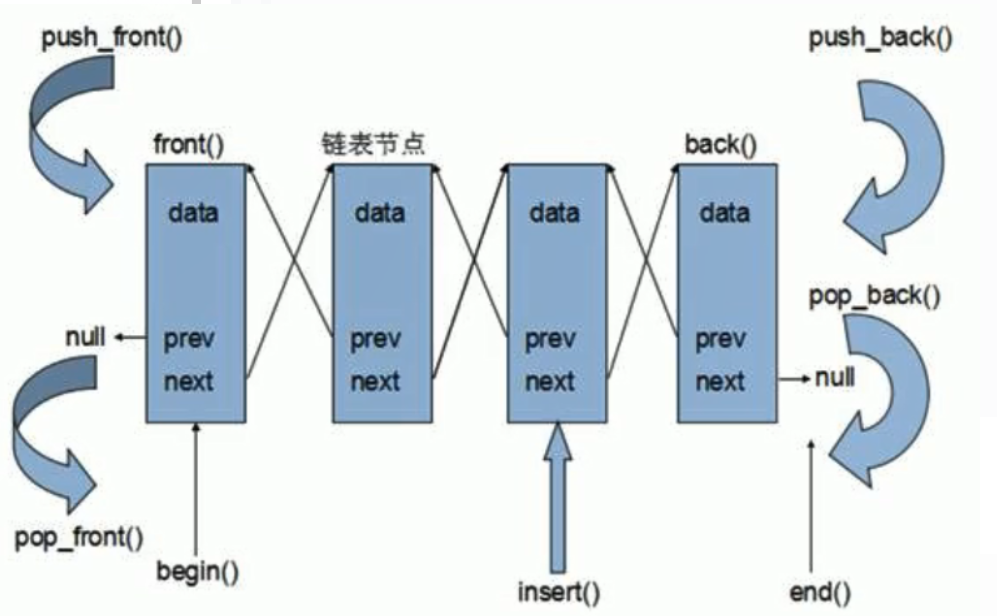
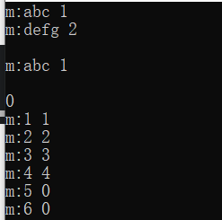
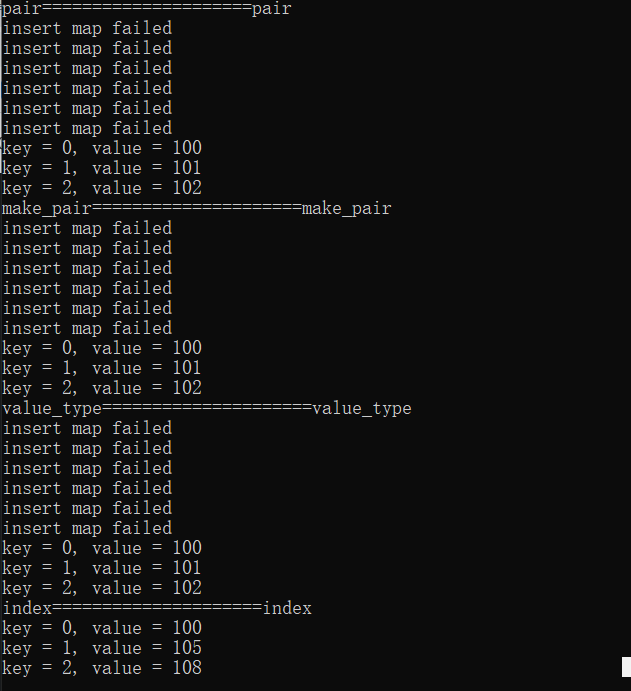

[TOC]

# 1 list容器

## 1.1 list基本概念

### 1.1.1 优点

可以对任意位置快速插入或者删除元素

### 1.1.2 缺点

容器的遍历速度，没有数组快；

占用空间比数组大

### 1.1.3 STL中的链表

STL中的链表是一个双向循环链表，迭代器只支持前移和后移，属于双向迭代器。



### 1.1.4 总结

在STL中list和vector属于两个被最长使用的容器，各有优缺点。

## 1.2 list构造函数

### 1.2.1 函数原型

```cpp
list<T> lst;	// list采用采用模板类实现, 对象的默认构造形式
list(beg, end);	// 构造函数将[beg,  end)区间中的元素拷贝给本身
list(n, elem);	// 构造函数将n个elem拷贝给本身
list(const list &lst);	// 拷贝构造函数
```

### 1.2.2 示例

```cpp
list<int> l1;	// 默认构造
list<int> l2(l1.begin(), l1.end());	// 区间方式构造(也属于拷贝)
list<int> l3(l2);	// 拷贝构造
list<int> l4(10, 999);	// 10个999(也属于拷贝)
```

## 1.3 list赋值和交换

### 1.3.1 函数原型

```cpp
assign(begin, end);	// 将[beg, end)区间中的数据拷贝赋值给本身
assign(n, elem);	// 将n个elem拷贝赋值给本身
list& operator=(const list &lst);	// 重载等号操作符
swap(lst);	// 将lst与本身的元素互换
```

### 1.3.2 示例

```cpp
list<int>l1;
l2 = l1;
l3.assign(l2.begin(),l2.end());
l4.assign(10,100);
l4.swap(l3);
```

## 1.4 list大小操作

### 1.4.1 函数原型

```cpp
size();	// 返回容器中元素的个数
empty();	// 判断容器是否为空
resize(num);	// 重新指定容器的长度为num，若容器变长，则以默认值填充新位置。如果容器变短，则末尾超出容器长度的元素被删除。
resize(num, elem);	// 重新指定容器的长度为num，若容器变长，则以elem值填充新位置。如果容器变短，则末尾超出容器长度的元素被删除。
```

### 1.4.2 示例

```cpp
#include<iostream>
#include<string>
#include<list>
#include<algorithm>
using namespace std;

// 容器中要存放的数据类型
class Person
{
public:
	Person()
	{}
	Person(string name, int age)
	{
		m_name = name;
		m_age = age;
	}

	string m_name;
	int m_age;
};


// 打印容器中的数据
void PrintList(const list<Person> &l)
{
	for (list<Person>::const_iterator it = l.begin(); it != l.end(); it++)
	{
		cout << it->m_name << " " << it->m_age << endl;// 用*it访问也可以，用指针也可以
	}
	cout << endl;
}


void test01()
{
	// list大小操作
	list<Person> l;

	string Name = "ABC";
	for (int i = 0; i < 3; i++)
	{
		// 往容器里边插入三个数据
		string name = "李";
		name += Name[i];
		Person p(name, i + 20);
		l.push_back(p);
	}

	if (!l.empty())
	{
		cout << "容器不为空,大小为：" << l.size() << endl;
	}
	else
	{
		cout << "容器为空" << endl;
	}

	Person p("默认", 100);
	l.resize(10, p);
	l.resize(1);
	PrintList(l);

}

int main() 
{
	test01();
	return 0;
}
```

## 1.5 list插入和删除

### 1.5.1 函数原型

```cpp
push_back(elem);			// 在容器尾部加入一个元素
pop_back();				// 删除容器中最后一个元素
push_front(elem);			// 在容器开头插入一个元素
pop_front();				// 从容器开头移除第一个元素
insert(pos, elem);			// 在pos位置插elem元素的拷贝，返回新数据的位置
insert(pos, n, elem);		// 在pos位置插入n个elem数据，无返回值
insert(pos, beg, end);		// 在pos位置插入[beg, end)区间的数据，无返回值
clear();					// 移除容器的所有数据
erase(beg, end);			// 删除[beg, end)区间的数据，返回下一个数据的位置
erase(pos);				// 删除pos位置的数据，返回下一个数据的位置
remove(elem);				// 删除容器中所有与elem值匹配的元素
```

## 1.6 list数据存取

### 1.6.1 函数原型

```cpp
front();	// 返回容器第一个元素
back();	// 返回容器最后一个元素
```

```
注意：
	不能用[]访问list容器中的元素
	不能用at()方式访问list容器的元素
	原因是：list本质链表，不适用连续线性空间存储数据，迭代器不支持随机访问（it = it+1错误），支持双向访问
```

## 1.7 list反转和排序

### 1.7.1 函数原型

```cpp
reverse();			// 反转链表
sort();				// 排序(成员函数，默认升序，可用仿函数来实现降序操作)
```

```
重要提示：
    所有不支持随机访问迭代器的容器,不可以用标准算法
    不支持随机访问迭代器的容器,内部会提供一些算法
    list自带的排序算法默认是从小到大升序,如果要从大到小,利用回调函数或仿函数实现降序(此处为回调函数)
```

```cpp
#include <iostream>
#include <list>
using namespace std;

template<class T>
void printList(const list<T>& L)
{
	for (list<T>::const_iterator it = L.begin(); it != L.end(); it++)
	{
		cout << *it << '\t';
	}
	cout << endl;
}

bool myCompare(int v1, int v2)
{
	// 降序 让 第一个数 > 第二个数
	return v1 > v2;
}

// 排序
void test2()
{
	list<int>L1;
	L1.push_back(20);
	L1.push_back(10);
	L1.push_back(50);
	L1.push_back(40);
	L1.push_back(30);

	cout << "排序前：" << endl;
	printList(L1);
	// 默认升序
	L1.sort();
	cout << "排序后：" << endl;
	printList(L1);

	L1.sort(myCompare);
	printList(L1);
}

int main()
{
	test2();
}
```

### 1.7.2 排序案例

```cpp
#include<iostream>
#include<string>
#include<sstream>
#include<list>
using namespace std;

class Person {
public:
	Person(string name, int age, int height)
	{
		this->m_Name = name;
		this->m_Age = age;
		this->m_Hight = height;
	}

	string printInfo()
	{
		stringstream temp;
		temp << "姓名：" << this->m_Name << "\t年龄：" << this->m_Age << "\t身高：" << this->m_Hight;
		return temp.str();
	}

	string m_Name;
	int m_Age;
	int m_Hight;

};


// 指定排序规则
bool comparePerson(Person &p1, Person &p2) 
{
	if (p1.m_Age == p2.m_Age) 
	{
		return p1.m_Hight < p2.m_Hight;
	}
	return p1.m_Age < p2.m_Age;
}

void test01()
{
	list<Person>L;

	Person p1("刘备", 35, 175);
	Person p2("曹操", 45, 180);
	Person p3("孙权", 40, 170);
	Person p4("赵云", 25, 190);
	Person p5("张飞", 35, 160);
	Person p6("关羽", 35, 200);

	L.push_back(p1);
	L.push_back(p2);
	L.push_back(p3);
	L.push_back(p4);
	L.push_back(p5);
	L.push_back(p6);

	for (list<Person>::iterator it = L.begin(); it != L.end(); it++)
	{
		cout << it->printInfo() << endl;
	}
	cout << "=============" << endl;
	L.sort(comparePerson);
	for (list<Person>::iterator it = L.begin(); it != L.end(); it++)
	{
		cout << it->printInfo() << endl;
	}
}

int main()
{
	test01();
	return 0;
}
```

```
对于自定义数据类型，必须指定排序规则，否则不知道如何进行排序。高级排序只是在排序规则上再进行一次逻辑规则的指定，并不是很复杂
```

# 2 set/multiset容器

## 2.1 set基本概念

### 2.1.1 简介

所有元素都会在插入的时候自动排序

### 2.1.2 本质

set/multiset属于关联式容器，底层结构是用二叉树实现。

### 2.1.3 区别

set中不允许有重复的元素，multiset中允许有重复的元素

## 2.2 set构造和赋值

```cpp
// 构造函数:
set< T> st; 	// 默认构造函数：
set(const set &st); 	// 拷贝构造函数
// 赋值:
set& operator=(const set &st); 	// 重载等号操作符
// 插入数据:
insert();
```

### 2.2.1 示例

```cpp
set<int> s2(s1);
set<int> s3;
s3 = s2;
```

## 2.3 set容器大小和互换

### 2.3.1 函数原型

```cpp
size();	// 返回容器中元素的数目
empty();	// 判断容器是否为空
swap(st);	// 交换两个集合容器
```

## 2.4 set容器插入和删除

### 2.4.1 函数原型

```cpp
insert(elem);	// 在容器中插入元素
clear();	// 清除所有元素
erase(pos);	// 删除pos迭代器所指的元素，返回下一个元素的迭代器。
erase(beg, end);	// 删除区间[beg,end)的所有元素 ，返回下一个元素的迭代器
erase(elem);	// 删除容器中值为elem的元素
```

## 2.5 set查找和统计

### 2.5.1 函数原型

```cpp
find(key);	// 查找key是否存在,若存在，返回该键的元素的迭代器；若不存在，返回set.end()
count(key);	// 统计key的元素个数,对于set来说只有0或1; 对于multiset能够大于1
```

### 2.5.2 示例

```cpp
set<int>::iterator pos = s1.find(12);
if(pos != s1.end())
	cout << "找到元素" << endl;
else
	cout << "未找到元素" << endl;
```

## 2.6 set容器排序

```
set容器默认排序规则是从小到大,利用仿函数可以改变排序规则
不能在放入数据之后才指定排序方式, 应当在创建的时候指定排序方式
```

### 2.6.1 示例

```cpp
// 创建了一个MyCompare类，重载函数调用运算符，并且在创建set容器时用类名作为第二个参数。
class myCompare
{
public:
	bool operator()(int v1, int v2)
    {
		return v1 > v2;
	}
};

// 下面插入的时候就会按照从大到小排列
set<int, myCompare>s1;
```

## 2.7 set和multiset区别

1. set不可以插入重复数据，而multiset可以

2. set插入数据的同时会返回插入结果，表示插入是否成功

3. multiset不会检测数据，因此可以插入重复数据

4. erase(k)函数在set容器中表示删除集合中元素k。但在multiset容器中表示删除所有等于k的元素。时间复杂度变成了O(tot+logn)，其中tot表示要删除的元素的个数。

   只想删除multiset中的一个元素可以这样操作

   ```cpp
   if((it=s.find(a))!=s.end())
   	s.erase(it);
   ```


# 3 pair

## 3.1 功能简介

```
成对出现的数据，利用对组可以返回两个数据,其中第一个数据是first,第二个数据是second;
```

## 3.2 函数原型

```cpp
pair<type, type> p(value1, value2);
pair<type, type> p = make_pair(value1, value2);
```

## 3.3 示例

```cpp
void test4() 
{
	pair<string, int> p(string("tom"), 20);
	cout << "name： " << p.first << " " << " age: " << p.second << endl;

	pair<string, int> p2 = make_pair("jerry", 10);
	cout << "name： " << p2.first << " " << " age: " << p2.second << endl;
}
```

# 4 map和pair的关系

```
map不是pair
首先，map构建的关系是映射，也就是说，如果我们想查询一个键值，那么只会返回唯一的一个对应值。但是如果使用pair的话，不仅不支持O(log)级别的查找，也不支持知一求一，因为pair的第一维可以有很多一样的，也就是说，可能会造成一个键值对应n多个对应值的情况。这显然不符合映射的概念
```

# 5 map/multimap容器

## 5.1 基本概念

### 5.1.1 简介

map中的所有元素都是pair；pair中的第一个元素为key(键值)起到索引作用，第二个元素为value(值)；所有的元素都会根据元素的键值自动排序。

### 5.1.2 本质

map/multimap属于关联式容器，底层结构是用二叉树实现。

### 5.1.3 优点

可以根据键值快速找到value值

### 5.1.4 map和multimap的区别

1. map不允许容器中有重复key值元素
2. multimap允许容器中有重复key值的元素
3. map支持[]访问，multimap由于可以存在键相同的pair，故不支持[]访问 

### 5.1.5 其他

对于自定义数据类型，map必须指定排序规则，和set容器相同

## 5.2 map常用函数

### 5.2.1 构造函数

```cpp
map<T1, T2> mp;		// map默认构造函数
map(const map &mp);	// 拷贝构造函数
```

### 5.2.2 赋值和交换

```cpp
map& operator=(const map &mp);	// 重载等号操作符
swap(mp);			// 交换两个集合容器
```

### 5.2.3 map大小操作

```cpp
size();	// 返回容器中元素的数目
empty();	// 判断容器是否为空
```

### 5.2.4 map插入操作

```cpp
#include<iostream>
#include<map>
#include<string>

using namespace std;

// map的四种插入方法
void MapInsert(map<int, int> &m)
{

	// 通过模板pair对组.返回一个对组对象.其中：对组对象的模板参1为:被插入容器的(此处为map)迭代器类型;模板参2为:布尔类型,用于判断是否插入成功.
	pair<map<int, int>::iterator, bool> pairIt = m.insert(pair<int, int>(1, 1));
	if (pairIt.second == false)
	{
		cout << "1 insert map failed" << endl;
		return;
	}

	// 通过make_pair()函数.同样返回一个对组对象
	pairIt = m.insert(make_pair(2, 2));
	if (pairIt.second == false)
	{
		cout << "2 insert map failed" << endl;
		return;
	}

	// 通过map模板类中的value_type()函数.同样返回一个对组对象
	pairIt = m.insert(map<int, int>::value_type(3, 3));
	if (pairIt.second == false)
	{
		cout << "3 insert map failed" << endl;
		return;
	}

	// 下标法插入
	// 注:map中,key不存在,以默认值0插入map;key存在,修改该key的值.
	m[4] = 4;
	m[5];	//默认为0.
	cout << m[6] << endl;	//下标打印时不存在的key会默认被初始化为0.且会被插入到map中
	// 此时map中共有6个元素
}

template <typename T>
void print_map(T &m)
{
	auto it = m.begin();
	while (it != m.end())
	{
		cout << "m:" << it->first << " " << it->second << endl;
		it++;
	}
	cout << endl;
}


int main()
{
	// 直接赋值法
	map<string, int> m1;
	m1["abc"] = 1;
	m1["defg"] = 2;
	print_map(m1);

	// 用insert添加
	map<string, int> m2;
	// 如果键已经存在不会在map中插入键和元素
	// insert({key, value})
	m2.insert({ "abc", 1 });
	m2.insert({ "abc", 2 });
	print_map(m2);

	map<int, int> m3;
	MapInsert(m3);
	print_map(m3);
	return 0;
}
```

result



#### 5.2.4.1 特别强调

1. pair、make_pair、value_type的插入方式，如果在map中已经存在该key,它是不会覆盖，而是会插入失败
2. insert({key, value})的插入方式如果键已经存在不会在map中插入键和元素
3. 只有使用中括号的形式才能使已经存在的key被覆盖
4. map的插入不会造成迭代器失效，因为插入时map根本不需要操作迭代器(不需要遍历插入)，我们只管往红黑树中插入即可，系统自动帮我们排序

```cpp
#include <iostream>
#include <string>
#include <map>

using namespace std;


void test_pair()
{
	// map 插入相同key组成的pair<int,int>, 结果是插入不进去, 不是覆盖
	map<int, int> mapObj;
	map<int, int>::iterator it;

	auto pairIt = mapObj.insert(pair<int, int>(0, 100));
	if (pairIt.second == false) {
		cout << "insert map failed" << endl;
	}
	pairIt = mapObj.insert(pair<int, int>(1, 101));
	if (pairIt.second == false) {
		cout << "insert map failed" << endl;
	}
	pairIt = mapObj.insert(pair<int, int>(2, 102));
	if (pairIt.second == false) {
		cout << "insert map failed" << endl;
	}

	printf("pair=====================pair\n");

	// 报错
	pairIt = mapObj.insert(pair<int, int>(1, 103));
	if (pairIt.second == false) {
		cout << "insert map failed" << endl;
	}
	pairIt = mapObj.insert(pair<int, int>(1, 104));
	if (pairIt.second == false) {
		cout << "insert map failed" << endl;
	}
	pairIt = mapObj.insert(pair<int, int>(1, 105));
	if (pairIt.second == false) {
		cout << "insert map failed" << endl;
	}

	// 报错
	pairIt = mapObj.insert(pair<int, int>(2, 106));
	if (pairIt.second == false) {
		cout << "insert map failed" << endl;
	}
	pairIt = mapObj.insert(pair<int, int>(2, 107));
	if (pairIt.second == false) {
		cout << "insert map failed" << endl;
	}
	pairIt = mapObj.insert(pair<int, int>(2, 108));
	if (pairIt.second == false) {
		cout << "insert map failed" << endl;
	}

	for (it = mapObj.begin(); it != mapObj.end(); it++)
	{
		printf("key = %d, value = %d\r\n", it->first, it->second);
	}
}


void test_make_pair()
{
	// map 插入相同key组成的make_pair, 结果是插入不进去, 不是覆盖
	map<int, int> mapObj;
	map<int, int>::iterator it;

	auto pairIt = mapObj.insert(make_pair(0, 100));
	if (pairIt.second == false) {
		cout << "insert map failed" << endl;
	}
	pairIt = mapObj.insert(make_pair(1, 101));
	if (pairIt.second == false) {
		cout << "insert map failed" << endl;
	}
	pairIt = mapObj.insert(make_pair(2, 102));
	if (pairIt.second == false) {
		cout << "insert map failed" << endl;
	}

	printf("make_pair=====================make_pair\n");

	// 报错
	pairIt = mapObj.insert(make_pair(1, 103));
	if (pairIt.second == false) {
		cout << "insert map failed" << endl;
	}
	pairIt = mapObj.insert(make_pair(1, 104));
	if (pairIt.second == false) {
		cout << "insert map failed" << endl;
	}
	pairIt = mapObj.insert(make_pair(1, 105));
	if (pairIt.second == false) {
		cout << "insert map failed" << endl;
	}

	// 报错
	pairIt = mapObj.insert(make_pair(2, 106));
	if (pairIt.second == false) {
		cout << "insert map failed" << endl;
	}
	pairIt = mapObj.insert(make_pair(2, 107));
	if (pairIt.second == false) {
		cout << "insert map failed" << endl;
	}
	pairIt = mapObj.insert(make_pair(2, 108));
	if (pairIt.second == false) {
		cout << "insert map failed" << endl;
	}

	for (it = mapObj.begin(); it != mapObj.end(); it++)
	{
		printf("key = %d, value = %d\r\n", it->first, it->second);
	}
}


void test_value_type()
{
	// map 插入相同key组成的value_type, 结果是插入不进去, 不是覆盖
	map<int, int> mapObj;
	map<int, int>::iterator it;

	auto pairIt = mapObj.insert(map<int, int>::value_type(0, 100));
	if (pairIt.second == false) {
		cout << "insert map failed" << endl;
	}
	pairIt = mapObj.insert(map<int, int>::value_type(1, 101));
	if (pairIt.second == false) {
		cout << "insert map failed" << endl;
	}
	pairIt = mapObj.insert(map<int, int>::value_type(2, 102));
	if (pairIt.second == false) {
		cout << "insert map failed" << endl;
	}

	printf("value_type=====================value_type\n");

	// 报错
	pairIt = mapObj.insert(map<int, int>::value_type(1, 103));
	if (pairIt.second == false) {
		cout << "insert map failed" << endl;
	}
	pairIt = mapObj.insert(map<int, int>::value_type(1, 104));
	if (pairIt.second == false) {
		cout << "insert map failed" << endl;
	}
	pairIt = mapObj.insert(map<int, int>::value_type(1, 105));
	if (pairIt.second == false) {
		cout << "insert map failed" << endl;
	}

	// 报错
	pairIt = mapObj.insert(map<int, int>::value_type(2, 106));
	if (pairIt.second == false) {
		cout << "insert map failed" << endl;
	}
	pairIt = mapObj.insert(map<int, int>::value_type(2, 107));
	if (pairIt.second == false) {
		cout << "insert map failed" << endl;
	}
	pairIt = mapObj.insert(map<int, int>::value_type(2, 108));
	if (pairIt.second == false) {
		cout << "insert map failed" << endl;
	}

	for (it = mapObj.begin(); it != mapObj.end(); it++)
	{
		printf("key = %d, value = %d\r\n", it->first, it->second);
	}
}


void test_middle()
{
	// 下标法插入.注:map中,key不存在,以默认值0插入map;key存在,修改该key的值.
	map<int, int> mapObj;
	map<int, int>::iterator it;

	mapObj[0] = 100;
	mapObj[1] = 101;
	mapObj[2] = 102;

	printf("index=====================index\n");

	// 不报错，修改成功
	mapObj[1] = 103;
	mapObj[1] = 104;
	mapObj[1] = 105;

	// 不报错，修改成功
	mapObj[2] = 106;
	mapObj[2] = 107;
	mapObj[2] = 108;

	for (it = mapObj.begin(); it != mapObj.end(); it++)
	{
		printf("key = %d, value = %d\r\n", it->first, it->second);
	}
}


int main()
{
	test_pair();
	test_make_pair();
	test_value_type();
	test_middle();
	return 0;
}
```

result



### 5.2.5 删除

```cpp
clear();	// 删除所有元素
erase(pos);	// 删除pos迭代器所指的元素，返回下一个元素的迭代器
erase(beg, end);	// 删除区间[beg,end)的所有元素 ，返回下一个元素的迭代器
erase(keyElem);	// 删除容器中key为keyElem的对组
```

#### 5.2.5.1 特别强调

1. map容器的删除是最容易犯错的，它会造成当前迭代器失效，必须通过下面三种方法去更新迭代器，否则出错。
2. 单线程下map通过find返回当前迭代器删除还是利用迭代器遍历去删除，都不需要加锁，只需要更新迭代器即可，对于find删除，不需要，因为它只能删除一个嘛。
3. 多线程下无论find删除还是遍历删除，因为都操作了迭代器，所以必须加锁。对于find删除不需要更新迭代器，对于遍历删除必须更新迭代器。


```cpp
// 删除map的某个key的元素
void EraseMap(map<int, int> &m)
{
	for (auto it = m.begin(); it != m.end();) {//使用auto更方便
		if (it->first == 3) {

			// 正确写法1 
			// 注:该方法和错误写法1看似一样,但是却是正确的,为什么呢？通过源码调试发现，
			m.erase(it++); // 这是因为当加上it++后，源码内部在destory删除前保存了下一个元素的迭代器：
						   // 语句为(实际上返回值也是用删除前保存的迭代器赋值返回)：	++_Successor;	// save successor iterator for return

			// 正确写法2 等效上面写法,必须先保存值，再自增，再删除.
			//itt = it;
			//it++;
			//m.erase(itt);	

			// 正确写法3
			//it = m.erase(it);

			// 错误写法1 
			//m.erase(it);	// 不加上it++，它会进入#if _ITERATOR_DEBUG_LEVEL == 2执行，所以删除it后，it被置为end，所以不能在使用it++.
			//it++;

			// 错误写法2   只对itt自增操作 实际it还是一样
			//itt = it;
			//m.erase(it);
			//itt++;

			// 错误写法3   用临时变量删除，最后才自增 由于itt删除后那片内存失效 it再去访问且自增当然出错
			//itt = it;   
			//m.erase(itt);  // 这里类似智能指针的auto_ptr p1被释放掉p2再使用就出错
			//it++;
		}
		else {
			it++;
		}
	}
}
```

### 5.2.6 查找统计

```cpp
find(key);	// 查找键key是否存在,若存在，返回该键的元素的迭代器；若不存在，返回map.end()
count(keyElem);	// 返回容器中key为keyElem的对组个数。对map来说，要么是0，要么是1。对multimap来说，值可能大于1
lower_bound(keyElem);	// 返回第一个key>=keyElem元素的迭代器
upper_bound(keyElem);	// 返回第一个key>keyElem元素的迭代器
equal_range(keyElem);	// 返回容器中key与keyElem相等的上下限的两个迭代器
```

#### 5.2.6.1 省时查找

```cpp
/*
 *	练习,map装有某个类的多个对象,不能用循环的方式判断某个对象是否存在,并且获取该对象进行使用
 *	练习的目的:对于服务端开发,少用循环是非常重要的,例如游戏,流媒体等
 */

class mapPushStream
{
public:
	// map模板编译时会调用默认构造,必须创建.
	mapPushStream() 
	{
		m_uid = "";
	};
	mapPushStream(string uid) 
	{
		m_uid = uid;
	};
	string HkGetUid()
	{
		return m_uid;
	}
	void HkSetUid(string uid)
	{
		m_uid = uid;
	}
private:
	string m_uid;
};


void test02(string key_uid) {
	// 模拟map中有多个对象.
	// 注:该key的定义非常重要,一般为唯一的uid,类型可以为int,为防止溢出我使用string
	map<string, mapPushStream> m;

	// 假设数据库有多个唯一的uid
	string uid1 = "wechat1";
	string uid2 = "wechat2";
	string uid3 = "wechat3";
	string uid4 = "wechat4";
	string uid5 = "wechat5";
	string uid6 = "wechat6";

	m.insert(make_pair(uid1, mapPushStream(uid1)));
	m.insert(make_pair(uid2, mapPushStream(uid2)));
	m.insert(make_pair(uid3, mapPushStream(uid3)));
	m.insert(make_pair(uid4, mapPushStream(uid4)));
	m.insert(make_pair(uid5, mapPushStream(uid5)));
	m.insert(make_pair(uid6, mapPushStream(uid6)));

	// 找出uid为key_uid的对象,并操作该对象,即打印其成员内容uid
	if (m.find(key_uid) != m.end()) {
		// 此时m[key_uid]就是我们想要拿到操作的对象
		cout << "key is exist." << " key=" << key_uid.c_str() << ",value=" << m[key_uid].HkGetUid().c_str() << endl;
	}

	// 方法2 非常耗时做法
	// 遍历map,对于map元素非常多的话非常耗时,
	// 并且多用户同时执行的话,例如1000,有100人在同时执行最多执行十万次.而这里只需要每个人一次即100次即可.
	//for (auto it = m.begin(); it != m.end(); it++) {
	//	if (it->second.HkGetUid() == key_uid) {
	//		cout << "key is exist." << " key=" << key_uid.c_str() << ",value=" << m[key_uid].HkGetUid().c_str() << endl;
	//		break;
	//	}
	//}
}
```

### 5.2.7 排序

```
map容器默认是升序排列，利用仿函数来改变map容器的排序方式
```

```cpp
class myCompare
{
public:
	bool operator()(int v1, int v2)
	{
		// 降序:
		return v1 > v2;
		// 升序
		//return v1 < v2;
	}
};
map<int, int, myCompare>m;	// 降序排列
```
