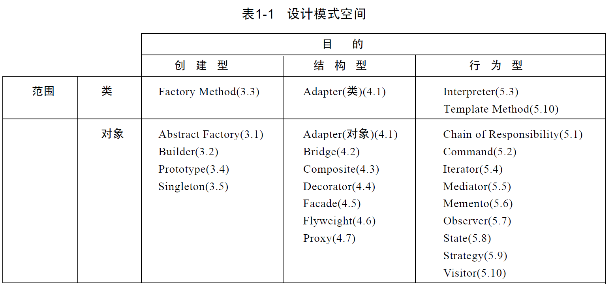

[TOC]

# 1 软件开发

简而言之，软件开发是创建和编码软件以满足某些需求的过程。它可能是客户的需求，也可能是个人需求，例如自动化任务。该程序可能很大也可能很小。但是，所有项目都受益于将项目分解为一系列步骤。

## 1.1 软件开发步骤

1. 需求评估

   如前所述，软件开发解决了需求。因此，任何项目的第一步都是清楚地确定您要解决的需求。对于大型项目，这可能涉及市场研究和与利益相关者会面。一个较小的项目可能只需要列出必备功能。

   这是该过程中最重要的一步。如果没有清楚地了解解决问题所需的条件，就很难设计出合适的解决方案。对产品有一个清晰的愿景也可以帮助你的项目保持在正轨上。当您开始设计您的项目时，可能会很想添加一些不需要但需要的功能。这称为**范围蔓延**，它可能会使项目脱轨。

2. 设计

   如果你喜欢编程，一旦你有了一个好主意，就会很想跳入代码中。但是，如果您先花时间设计软件，您的项目将会运行得更顺畅。这一步类似于在开始写论文之前写大纲。它有助于组织你的想法。您的大部分问题解决都应该在此步骤中完成，因此当您开始编码时，应该很少有并发症。

   在此步骤中，您需要考虑几件事情。如果您的软件项目需要一个界面，请开发一个概述界面外观和功能的原型。如果项目使用数据库，请设计表并绘制它们之间的关系。

   所有软件开发都需要编写算法。创建概述程序流程并描述任何复杂算法（如函数或方法）的流程图。

3. 编码

   这可以说是最直接和最有趣的一步。

   在此步骤中，您将编写代码来创建软件。在明确定义项目需求并概述设计之后，这一步应该很简单——至少在理论上是这样。实际上，这个阶段可能会出现问题，但是在编程之前完成的计划越多，它就越顺利。

4. 测试

   编写代码后，必须对其进行测试。您需要验证代码是否按预期工作并满足其旨在满足的需求。在较小的项目中，此步骤可能相当简单，主要涉及调试软件。在较大的项目中，这可能涉及与焦点小组一起测试软件，以改进软件的设计和要求。

   此步骤的顺序可能会有所不同。例如，测试驱动开发首先创建一个脚本来测试软件。当它通过测试时，编码被认为是完整的。相反，如果您使用迭代设计方法，测试将被集成到几个设计阶段。

5. 实施

   一旦软件通过测试，就可以部署了。在这个阶段，软件应该功能齐全，可以发布和/或使用。大型项目可能会分阶段发布，称为**交错发布**。

   当软件交到用户手中时，他们经常会发现在测试过程中没有发现的问题和错误。交错发布使对这些问题的响应变得易于管理。

6. 维护

   维护步骤是另一个关键阶段。一旦使用该软件，它可能无法完全满足其设计的需求，可能会发布新功能，或者可能会发现新的错误。所有这些都需要监控和修改软件。

## 1.2 开发方法

尽管上述步骤使软件开发看起来是线性的，但并非必须如此。有许多不同的方法来处理软件开发。最著名的两种方法是瀑布式和敏捷软件开发。

### 1.2.1 瀑布（waterfall）

瀑布式开发是管理项目的传统方式。它涉及按顺序完成软件开发步骤。在团队进入下一步之前，每个步骤都将完全完成。

这种方法易于管理，适用于小型软件项目。因为过程简单明了，每一步都有明确的目标，所以很容易管理。适用于目标明确、需求易于理解的项目。

当项目复杂或需求不明确时，瀑布方法就不能很好地工作。使用这种方法可能很难更改软件的设计。由于这些步骤是按顺序执行的，因此很难返回一个步骤，这使得难以响应出现的问题或调整设计。

### 1.2.2 敏捷（Agile）

敏捷旨在解决瀑布方法的许多缺点。这个过程不是从一个步骤移动到下一步直到完成，而是循环的。该项目是在一系列开发周期中逐步创建的。测试是该过程的核心。每个周期都包含从测试中吸取的教训。这种循环方法将重新设计构建到软件开发过程中。

敏捷的好处是它允许项目发展以解决测试期间发现的问题。这是以用户为中心的设计的好方法。尽管开发过程更加复杂，但对于大型项目来说也更具成本效益。问题出现时可以快速解决，并且更容易更改设计以响应出现的问题。

## 1.3 软件开发

在开始一个新的软件项目时，有许多考虑因素。项目的目的和范围将决定最佳的软件开发方法。然而，所有的方法都是基于相同的步骤。如果您是编程新手，那么直接开始编程总是很有诱惑力的。但是花时间计划你的项目是值得的。

# 2 设计模式六大原则

总原则：开闭原则（Open Close Principle）。开闭原则就是说对扩展开放，对修改关闭。高内聚低耦合。

## 2.1 单一职责原则

不要存在多于一个导致类变更的原因，也就是说每个类应该实现单一的职责，如若不然，就应该把类拆分。

## 2.2 里氏替换原则（Liskov Substitution Principle）

里氏替换原则（Liskov Substitution Principle LSP）面向对象设计的基本原则之一。里氏替换原则中说，任何基类可以出现的地方，子类一定可以出现。LSP是继承复用的基石，只有当衍生类可以替换掉基类，软件单位的功能不受到影响时，基类才能真正被复用，而衍生类也能够在基类的基础上增加新的行为，里氏替换原则是对“开-闭”原则的补充。实现"开-闭"原则的关键步骤就是抽象化。而基类与子类的继承关系就是抽象化的具体实现，所以里氏替换原则是对实现抽象化的具体步骤的规范。

里氏替换原则中，子类对弗雷的方法尽量不要重写和重载。因为父类代表了定义好的结构，通过这个规范的接口与外界交互，子类不应该随便破坏它。

## 2.3 依赖倒转原则（Dependence Inversion Principle）

这个是开闭原则的基础，具体内容：面向接口编程，依赖于抽象而不依赖于具体。写代码时用到具体类时，不与具体类交互，而是具体类的上层接口交互。

## 2.4 接口隔离原则（Interface Segregation Principle）

这个原则的意思是：每个接口中不存在子类用不到却必须实现的方法，如果不然，就要将接口拆分。使用多个隔离的接口，比使用单个接口（多个接口方法集合到一个的接口）要好。

## 2.5 迪米特法则(最少知道原则)（Demeter Principle）

一个类对自己依赖的类知道的越少越好。也就是说无论被依赖的类多么复杂，都应该将逻辑封装在方法的内部，通过public方法提供给外部。这样当被依赖的类变化时，才能最小的影响该类。

最少知道原则的另一个表达方式是：只与直接的朋友通信。类之间只要有耦合关系，就叫朋友关系。耦合分为依赖、关联、聚合、组合等。我们称出现为成员变量、方法参数、方法返回值中的类为直接朋友。局部变量、临时变量则不是直接的朋友。我们要求陌生的类不要作为局部变量出现在类中。

## 2.6 合成复用原则（Composite Reuse Principle）

原则是尽量首先使用合成/聚合的方式，而不是使用继承。

# 3 软件设计模式

## 3.1 软件设计模式的产生背景

“设计模式”这个术语最初并不是出现在软件设计中，而是被用于建筑领域的设计中。

1977 年，美国著名建筑大师、加利福尼亚大学伯克利分校环境结构中心主任克里斯托夫·亚历山大（Christopher Alexander）在他的著作《建筑模式语言：城镇、建筑、构造（A Pattern Language: Towns Building Construction）中描述了一些常见的建筑设计问题，并提出了 253 种关于对城镇、邻里、住宅、花园和房间等进行设计的基本模式。

1979 年他的另一部经典著作《建筑的永恒之道》（The Timeless Way of Building）进一步强化了设计模式的思想，为后来的建筑设计指明了方向。

1987 年，肯特·贝克（Kent Beck）和沃德·坎宁安（Ward Cunningham）首先将克里斯托夫·亚历山大的模式思想应用在 Smalltalk 中的图形用户接口的生成中，但没有引起软件界的关注。

直到 1990 年，软件工程界才开始研讨设计模式的话题，后来召开了多次关于设计模式的研讨会。

1995 年，艾瑞克·伽马（ErichGamma）、理査德·海尔姆（Richard Helm）、拉尔夫·约翰森（Ralph Johnson）、约翰·威利斯迪斯（John Vlissides）等 4 位作者合作出版了《设计模式：可复用面向对象软件的基础》（Design Patterns: Elements of Reusable Object-Oriented Software）一书，在本教程中收录了 23 个设计模式，这是设计模式领域里程碑的事件，导致了软件设计模式的突破。这 4 位作者在软件开发领域里也以他们的“四人组”（Gang of Four，GoF）匿名著称。

直到今天，狭义的设计模式还是本教程中所介绍的 23 种经典设计模式。

## 3.2 软件设计模式的概念和意义

有关软件设计模式的定义很多，有些从模式的特点来说明，有些从模式的作用来说明。本教程给出的定义是大多数学者公认的，从以下两个方面来说明。

### 3.2.1 软件设计模式的概念

软件设计模式（Software Design Pattern），又称设计模式，是一套被反复使用、多数人知晓的、经过分类编目的、代码设计经验的总结。它描述了在软件设计过程中的一些不断重复发生的问题，以及该问题的解决方案。也就是说，它是解决特定问题的一系列套路，是前辈们的代码设计经验的总结，具有一定的普遍性，可以反复使用。其目的是为了提高代码的可重用性、代码的可读性和代码的可靠性。

### 3.2.2 学习设计模式的意义

**设计模式的本质是面向对象设计原则的实际运用，是对类的封装性、继承性和多态性以及类的关联关系和组合关系的充分理解。** 

正确使用设计模式具有以下优点：

1. 可以提高程序员的思维能力、编程能力和设计能力。
2. 使程序设计更加标准化、代码编制更加工程化，使软件开发效率大大提高，从而缩短软件的开发周期。
3. 使设计的代码可重用性高、可读性强、可靠性高、灵活性好、可维护性强。

当然，软件设计模式只是一个引导。在具体的软件幵发中，必须根据设计的应用系统的特点和要求来恰当选择。对于简单的程序开发，苛能写一个简单的算法要比引入某种设计模式更加容易。但对大项目的开发或者框架设计，用设计模式来组织代码显然更好。

## 3.3 软件设计模式的基本要素

软件设计模式使人们可以更加简单方便地复用成功的设计和体系结构，它通常包含以下几个基本要素：模式名称、别名、动机、问题、解决方案、效果、结构、模式角色、合作关系、实现方法、适用性、已知应用、例程、模式扩展和相关模式等，其中最关键的元素包括以下 4 个主要部分。

1. 模式名称

   每一个模式都有自己的名字，通常用一两个词来描述，可以根据模式的问题、特点、解决方案、功能和效果来命名。模式名称（PatternName）有助于我们理解和记忆该模式，也方便我们来讨论自己的设计。

2. 问题

   问题（Problem）描述了该模式的应用环境，即何时使用该模式。它解释了设计问题和问题存在的前因后果，以及必须满足的一系列先决条件。

3. 解决方案

   模式问题的解决方案（Solution）包括设计的组成成分、它们之间的相互关系及各自的职责和协作方式。因为模式就像一个模板，可应用于多种不同场合，所以解决方案并不描述一个特定而具体的设计或实现，而是提供设计问题的抽象描述和怎样用一个具有一般意义的元素组合（类或对象的 组合）来解决这个问题。

4. 效果

   描述了模式的应用效果以及使用该模式应该权衡的问题，即模式的优缺点。主要是对时间和空间的衡量，以及该模式对系统的灵活性、扩充性、可移植性的影响，也考虑其实现问题。显式地列出这些效果（Consequence）对理解和评价这些模式有很大的帮助。

## 3.4 GoF的23种设计模式的分类和功能

设计模式有两种分类方法，即根据模式的目的来分和根据模式的作用的范围来分。

### 3.4.1 根据目的来分

根据模式是用来完成什么工作来划分，这种方式可分为创建型模式、结构型模式和行为型模式 3 种。

1. 创建型模式：用于描述“怎样创建对象”，它的主要特点是“将对象的创建与使用分离”。GoF 中提供了单例、原型、工厂方法、抽象工厂、建造者等 5 种创建型模式。
2. 结构型模式：用于描述如何将类或对象按某种布局组成更大的结构，GoF 中提供了代理、适配器、桥接、装饰、外观、享元、组合等 7 种结构型模式。
3. 行为型模式：用于描述类或对象之间怎样相互协作共同完成单个对象都无法单独完成的任务，以及怎样分配职责。GoF 中提供了模板方法、策略、命令、职责链、状态、观察者、中介者、迭代器、访问者、备忘录、解释器等 11 种行为型模式。

### 3.4.2 根据作用范围来分

根据模式是主要用于类上还是主要用于对象上来分，这种方式可分为类模式和对象模式两种。

1. 类模式：用于处理类与子类之间的关系，这些关系通过继承来建立，是静态的，在编译时刻便确定下来了。GoF 中的工厂方法、（类）适配器、模板方法、解释器属于该模式。
2. 对象模式：用于处理对象之间的关系，这些关系可以通过组合或聚合来实现，在运行时刻是可以变化的，更具动态性。GoF 中除了以上 4 种，其他的都是对象模式。

## 3.5 GoF的23种设计模式的分类表

| 范围\目的 | 创建型模式                               | 结构型模式                                                   | 行为型模式                                                   |
| --------- | ---------------------------------------- | ------------------------------------------------------------ | ------------------------------------------------------------ |
| 类模式    | 工厂方法                                 | （类）适配器                                                 | 解释器、模板方法                                             |
| 对象模式  | 抽象工厂 建造者 原型 单例 | （对象）适配器 桥接 组合 装饰 外观 享元 代理 | 职责链 命令 迭代器 中介者 备忘录 观察者 状态 策略 访问者 |

## 3.6 GoF的23种设计模式的功能

1. 抽象工厂（Abstract Factory）模式：提供一个创建产品族的接口，其每个子类可以生产一系列相关的产品。
2. 建造者（Builder）模式：将一个复杂对象分解成多个相对简单的部分，然后根据不同需要分别创建它们，最后构建成该复杂对象。
3. 工厂方法（Factory Method）模式：定义一个用于创建产品的接口，由子类决定生产什么产品。
4. 原型（Prototype）模式：将一个对象作为原型，通过对其进行复制而克隆出多个和原型类似的新实例。
5. 单例（Singleton）模式：某个类只能生成一个实例，该类提供了一个全局访问点供外部获取该实例，其拓展是有限多例模式。
6. 适配器（Adapter）模式：将一个类的接口转换成客户希望的另外一个接口，使得原本由于接口不兼容而不能一起工作的那些类能一起工作。
7. 桥接（Bridge）模式：将抽象与实现分离，使它们可以独立变化。它是用组合关系代替继承关系来实现，从而降低了抽象和实现这两个可变维度的耦合度。
8. 组合（Composite）模式：将对象组合成树状层次结构，使用户对单个对象和组合对象具有一致的访问性。
9. 装饰（Decorator）模式：动态的给对象增加一些职责，即增加其额外的功能。
10. 外观（Facade）模式：为多个复杂的子系统提供一个一致的接口，使这些子系统更加容易被访问。
11. 享元（Flyweight）模式：运用共享技术来有效地支持大量细粒度对象的复用。
12. 代理（Proxy）模式：为某对象提供一种代理以控制对该对象的访问。即客户端通过代理间接地访问该对象，从而限制、增强或修改该对象的一些特性。
13. 职责链（Chain of Responsibility）模式：把请求从链中的一个对象传到下一个对象，直到请求被响应为止。通过这种方式去除对象之间的耦合。
14. 命令（Command）模式：将一个请求封装为一个对象，使发出请求的责任和执行请求的责任分割开。
15. 解释器（Interpreter）模式：提供如何定义语言的文法，以及对语言句子的解释方法，即解释器。
16. 迭代器（Iterator）模式：提供一种方法来顺序访问聚合对象中的一系列数据，而不暴露聚合对象的内部表示。
17. 中介者（Mediator）模式：定义一个中介对象来简化原有对象之间的交互关系，降低系统中对象间的耦合度，使原有对象之间不必相互了解。
18. 备忘录（Memento）模式：在不破坏封装性的前提下，获取并保存一个对象的内部状态，以便以后恢复它。
19. 访问者（Visitor）模式：在不改变集合元素的前提下，为一个集合中的每个元素提供多种访问方式，即每个元素有多个访问者对象访问。
20. 策略（Strategy）模式：定义了一系列算法，并将每个算法封装起来，使它们可以相互替换，且算法的改变不会影响使用算法的客户。
21. 状态（State）模式：允许一个对象在其内部状态发生改变时改变其行为能力。
22. 模板方法（Template Method）模式：定义一个操作中的算法骨架，而将算法的一些步骤延迟到子类中，使得子类可以不改变该算法结构的情况下重定义该算法的某些特定步骤。
23. 观察者（Observer）模式：多个对象间存在一对多关系，当一个对象发生改变时，把这种改变通知给其他多个对象，从而影响其他对象的行为。

这 23 种设计模式不是孤立存在的，很多模式之间存在一定的关联关系，在大的系统开发中常常同时使用多种设计模式。

## 3.7 设计模式特点

| 类型   | 设计模式                     | 描述                                                         |
| ------ | ---------------------------- | ------------------------------------------------------------ |
| 创建型 | Factory 模式                 | 被实例化的子类                                               |
|        | Abstract Factory 模式        | 产品对象家族                                                 |
|        | Singleton 模式               | 针对一个类的唯一实例                                         |
|        | Builder 模式                 | 如何创建一个组合对象                                         |
|        | Prototype 模式               | 针对被实例化的类                                             |
| 结构型 | Bridge 模式                  | 对象的实现                                                   |
|        | Adapter 模式                 | 针对对象的接口                                               |
|        | Decorator 模式               | 对对象的职责，不生成子类                                     |
|        | Composite 模式               | 一个对象的结构和组成                                         |
|        | Flyweight 模式               | 对象的存储开销                                               |
|        | Facade 模式                  | 对一个子系统的接口                                           |
|        | Proxy 模式                   | 如何访问一个对象；该对象的位置                               |
| 行为型 | Template 模式                | 对算法中的某些步骤                                           |
|        | Strategy 模式                | 算法                                                         |
|        | State 模式                   | 对象的状态                                                   |
|        | Observer 模式                | 对多个对象依赖于另外一个对象，而这些对象又如何保持一致       |
|        | Memento 模式                 | 对一个对象中哪些私有信息存放在该对象之外，以及在对什么时候进行存储 |
|        | Mediator 模式                | 对象间怎样交互、和谁交互                                     |
|        | Command 模式                 | 何时、怎样满足一个请求                                       |
|        | Visitor 模式                 | 某些可作用于一个（组）对象上的操作，但不修改这些对象的类     |
|        | Chain of Responsibility 模式 | 满足一个请求的对象链                                         |
|        | Iterator 模式                | 如何遍历、访问一个聚合的各元素                               |
|        | Interpreter 模式             | 对一个语言的文法及解释                                       |

