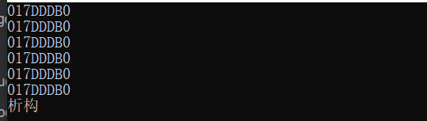
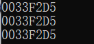
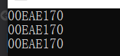

[Toc]

# 1 单例模式


## 1.1 单例（Singleton）模式的定义

指一个类只有一个实例，且该类能自行创建这个实例的一种模式。

在整个系统生命周期内，保证一个类只能产生一个实例，确保该类的唯一性。

## 1.2 为什么需要单例模式

单例模式就是为了保证程序的线程安全。

### 1.2.1 什么是线程安全

在拥有共享数据的多条线程并行执行程序中，线程安全的代码会通过同步机制保证各个线程都可以正常且正确的执行，不会出现数据污染等意外情况。

### 1.2.2 如何保证线程安全

给共享的资源加把锁，保证每个资源变量每时每刻至多被一个线程占用。让线程也拥有资源，不用去共享进程中的资源。如：使用threadlocal可以为每个线程维护一个私有的本地变量。

## 1.3 特点

1. 单例类只有一个实例对象
2. 构造函数和析构函数为私有类型，目的是禁止外部构造和析构
3. 拷贝构造函数和赋值构造函数是私有类型，目的是禁止外部拷贝和赋值，确保实例的唯一性
4. 类中有一个获取实例的静态方法，可以全局访问
5. 该单例对象必须由单例类自行创建
6. 单例类对外提供一个访问该单例的全局访问点（必须提供一个静态的公有方法，该方法创建或者获取它本身的静态私有对象并返回）
7. 私有的静态类指针指向类的实例（类外声明）
8. 绝对不要在单例的析构函数中释放单例（coredump），递归调用析构函数。死递归

## 1.4 备注

使用全局对象能够保证方便地访问实例，但是不能保证只声明一个对象。

##  1.5 应用场景

1. 需要频繁创建的一些类，使用单例可以降低系统的内存压力，减少垃圾回收（Garbage Collection - GC）。
2. 某类只要求生成一个对象的时候，一个地球
3. 某些类创建实例时占用资源教多，或实例化耗时较长，且经常使用
4. 某类需要频繁实例化，而创建的对象又频繁被销毁的时候，如多线程的线程池、网络连接池等。
5. 频繁访问数据库或文件的对象
6. 对于一些控制硬件级别的操作，或者从系统上来讲应当是单一控制逻辑的操作，如果有多个实例，则系统会完全乱套。
7. 当对象需要被共享的场合。由于单例模式只允许创建一个对象，共享对象可以节省内存，并加快对象访问速度。如Web中配置对象、数据库的连接池等。

## 1.6 实现

1. 将无参构造私有化
2. 将拷贝构造私有化
3. 定义一个静态的成员指针变量指向new出来的一个唯一对象
4. 将静态的成员指针变量私有化，提供获得唯一对象的地址的静态接口

## 1.7 分类

单例模式可以分为懒汉式和饿汉式，两者之间的区别==在于创建实例的时间不同==。

### 1.7.1 备注

一般情况下，单例类的实例都是常驻内存的，一直存在于进程的生命周期，因此不需要手动释放。如果的确需要释放实例占用的内存，一定不能在单例类的析构函数中进行delete操作，这样会造成无限循环，可以考虑增加一个destroy方法用于释放内存，或者在单例类中定义一个内嵌的垃圾回收类。

### 1.7.2 懒汉式

系统运行中，实例不存在，只有当需要使用该实例时，才会去创建并使用实例。这种方式要考虑线程安全。

#### 1.7.2.1 懒汉模式（只有在需要使用的时候才会去实例化）

1. 在多线程中就不行了，该方法是线程不安全的。（需要加锁，性能损耗。）

   如果有两个线程同时获取单例类的实例，都发现实例不存在，因此都会进行实例化，就会产生两个实例都要赋值给instance_，这是严重 的错误。为了解决这个问题，就要考虑加锁。

2. new的对象未释放

   程序在结束的时候，系统会自动析构所有的全局变量。事实上，系统也会析构所有的类的静态成员变量，就像这些静态成员也是全局变量一样。

#### 1.7.2.2 懒汉式存在的问题

在懒汉式的单例类中，其实有两种状态，单例未初始化和单例已经初始化。假设单例还未初始化，有两个线程同时调用`GetInstance`方法，这时执行`m_pInstance == NULL`肯定为真，然后两个线程都初始化一个单例，最后得到的指针并不是指向同一个地方，不满足单例类的定义了，所以懒汉式的写法会出现线程安全的问题。在多线程环境下，要对其进行修改。

```cpp
#include <iostream>
#include <mutex>
using namespace std;

// 懒汉模式
class LSingleton
{
private:
	LSingleton()		// 构造函数私有化
	{}
	static LSingleton *m_pInstance;
	class LGarbo
	{
	public:
		~LGarbo()
		{
			if (LSingleton::m_pInstance)
			{
				delete LSingleton::m_pInstance;
				cout << "析构" << endl;
			}
		}
	};
	static LGarbo Garbo;
	static mutex my_mutex;		// 创建一个互斥量
public:
	static LSingleton *GetInstance()
	{
		//static LSingleton *m_pInstance;		// 也可在这里声明定义
		if (NULL == m_pInstance)				// 判断是否第一次调用
		{
			m_pInstance = new LSingleton();
		}
		return m_pInstance;
	}
	// 加锁版本
	static LSingleton* GetInstance_lock()
	{
		// lock();		// 如果在这里加锁。则每次获取示例都会加锁，性能损耗
		// 先判断是否为空，如果为空则进入，不为空说明已经存在实例，直接返回
		if (NULL == m_pInstance)
		{
			my_mutex.lock();			// 上锁。这里只有第一次获取示例时加锁
			if (NULL == m_pInstance)
			{
				// 再判断一次，确保不会因为加锁期间多个线程同时进入
				m_pInstance = new LSingleton();
			}
			my_mutex.unlock();
		}
		return m_pInstance;
	}
};

LSingleton* LSingleton::m_pInstance = NULL;
LSingleton::LGarbo LSingleton::Garbo;			// 静态类对象类外声明
mutex LSingleton::my_mutex;						// 类外初始化


int main()
{
	LSingleton* p_LSingleton = LSingleton::GetInstance();
	LSingleton* p_LSingleton2 = LSingleton::GetInstance();
	LSingleton* p_LSingleton3 = LSingleton::GetInstance();

	cout << p_LSingleton << endl;
	cout << p_LSingleton2 << endl;
	cout << p_LSingleton3 << endl;

	// 加锁
	LSingleton* p_LSingleton4 = LSingleton::GetInstance_lock();
	LSingleton* p_LSingleton5 = LSingleton::GetInstance_lock();
	LSingleton* p_LSingleton6 = LSingleton::GetInstance_lock();

	cout << p_LSingleton4 << endl;
	cout << p_LSingleton5 << endl;
	cout << p_LSingleton6 << endl;

	return 0;
}
```

result



### 1.7.3 饿汉式

系统一运行，就初始化创建实例，当需要时，直接调用即可。这种方法本身就线程安全，没有多线程的线程安全问题。

#### 1.7.3.1 饿汉模式（在单例类定义的时候就进行实例化）

##### 1.7.3.1.1 优点

实现简单，多线程安全。（程序运行期间就进行了单例类实例化，不存在上述的线程安全问题。）

##### 1.7.3.1.2 缺点

1. 如果存在多个实例对象且这几个单例对象相互依赖，可能会出现程序崩溃的危险。原因：对编译器来说，静态成员变量的初始化顺序和析构顺序是一个未定义的行为。
2. 在程序开始时，就创建类的实例，如果HSingleton对象产生很昂贵，而本身又很少使用，这种方式单从资源利用效率的角度来讲，比懒汉式单例类稍差些。但从反应时间角度来讲，则比懒汉式单例类稍好些。

```cpp
#include <iostream>
using namespace std;

// 饿汉模式
class HSingleton
{
public:
	static HSingleton* GetInstance()
	{
		return &m_Instance;
	}
private:
	HSingleton()
	{
	}
	HSingleton(const HSingleton&);
private:
	static HSingleton m_Instance;
};

HSingleton HSingleton::m_Instance;		// 类外定义-不要忘记写

int main()
{
	HSingleton* instance = HSingleton::GetInstance();
	HSingleton* instance2 = HSingleton::GetInstance();
	HSingleton* instance3 = HSingleton::GetInstance();

	cout << instance << endl;
	cout << instance2 << endl;
	cout << instance3 << endl;
	return 0;
}
```

result




### 1.7.4 理解懒汉和饿汉

其实就是看定义的是静态成员对象变量还是静态成员对象指针变量，因为如果定义了静态成员对象变量，程序在运行之初已经分配了空间，就要调用构造函数了，而你在调用GetInstance的时候，不会在调用构造函数了，因为之前已经调用过了，你就是用的现成的，就是所谓的饿汉模式，上来就先把吃的准备好了，因为饿怕了，怕后期准备会挨饿。

而定义了静态成员对象指针变量，程序运行之初也会分配空间，但是那个是指针的空间，而不是对象的空间，所以不会调用对象的构造函数，而只有调用GetInstance进行new操作的时候，才会对其调用构造函数，就是现上轿扎耳朵眼，比较懒惰，所以叫懒汉模式。

### 1.7.5 另一种饿汉式（静态成员对象指针变量）

```cpp
#include <iostream>
using namespace std;

class HSingleton
{
private:
	HSingleton()
	{
	}
	HSingleton(const HSingleton&)
	{
	}
	HSingleton& operator=(const HSingleton&) 
	{
	}
	static HSingleton *m_pSingleton;	// 定义一个唯一指向实例的指针，并且是私有的

public:
	static HSingleton *GetSingelton();	// 定义一个公有函数，可以获取这个唯一实例
	void destory();
};

// 饿汉模式的关键：定义即实例化
HSingleton *HSingleton::m_pSingleton = new HSingleton();

HSingleton *HSingleton::GetSingelton()
{
	return m_pSingleton;
}

void HSingleton::destory()
{
	if (NULL != m_pSingleton)
	{
		delete m_pSingleton;
		m_pSingleton = NULL;
	}
}

int main()
{
	HSingleton* a1 = HSingleton::GetSingelton();
	HSingleton* a2 = HSingleton::GetSingelton();
	HSingleton* a3 = HSingleton::GetSingelton();

	cout << a1 << endl;
	cout << a2 << endl;
	cout << a3 << endl;
	a1->destory();
	return 0;
}
```

result


### 1.7.6 另一种懒汉式（内部静态变量）

```cpp
#include <iostream>
#include <mutex>
using namespace std;

class LSingleton
{
protected:
	LSingleton()
	{
	}
public:
	static mutex m_mutex;
	static LSingleton* GetSingelton();
};

mutex LSingleton::m_mutex;
LSingleton* LSingleton::GetSingelton()
{
	m_mutex.lock();
	static LSingleton obj;
	m_mutex.unlock();
	return &obj;
}

int main()
{
	LSingleton* a1 = LSingleton::GetSingelton();
	LSingleton* a2 = LSingleton::GetSingelton();
	LSingleton* a3 = LSingleton::GetSingelton();

	cout << a1 << endl;
	cout << a2 << endl;
	cout << a3 << endl;

	return 0;
}
```

result



## 1.8 特点与选择

1. 由于要进行线程同步，所以访问量比较大，或者可能访问的线程比较多时，采用饿汉实现，可以实现更好的性能。这是以空间换时间。
2. 在访问量较小的时候，采用懒汉实现。这是以时间换空间。


