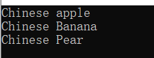

[Toc]

# 1 工厂模式

## 1.1 作用

封装对象的创建，分离对象的创建和操作过程，用于批量管理对象的创建过程，便于程序的维护和扩展。工厂模式作为一种创建模式，一般在创建复杂对象时，考虑使用；在创建简单对象时，建议直接new完成一个实例对象的创建。

## 1.2 分类

简单工厂模式、工厂方法模式、抽象工厂模式

## 1.3 简单工厂模式

简单工厂模式，又叫做静态工厂方法（Static Factory Method）模式，简单工厂模式是由一个工厂对象决定创建哪一种产品类的实例

### 1.3.1 何时使用简单工厂模式

1. 工厂类负责创建的对象比较少（如果需要添加新的类，就需要改变工厂类）
2. 客户只知道传入工厂类的参数，对于如何让创建对象（逻辑）不关心

### 1.3.2 简单工厂模式的缺点

工厂类集中了所有产品类的创建逻辑，违反了高内聚责任分配原则；它所能创建的类只是事先考虑到的，如果需要添加新的类，则就需要改变工厂类了；如果产品量较大，会使得工厂类变的非常臃肿。

该缺点在工厂方法模式中得到了一定的克服。

### 1.3.3 简单工厂模式的优点

在于工厂类中包含了必要的逻辑判断，根据客户的选择条件动态实例化相关的类，对客户端来说，去除了与具体产品的依赖。

```cpp
#include <iostream>
using namespace std;


// 定义产品类型信息
typedef enum FruitTypeFlag
{
	PEAR,
	BANANA,
	APPLE
};


// 抽象水果
class AbstractFruit
{
public:
	virtual void show() = 0;
};


// 具体的产品类
// 苹果
class Apple : public AbstractFruit
{
public:
	virtual void show()
	{
		cout << "apple" << endl;
	}
};


// 鸭梨
class Pear : public AbstractFruit
{
public:
	virtual void show()
	{
		cout << "pear" << endl;
	}
};

// 香蕉
class Banana : public AbstractFruit
{
public:
	virtual void show()
	{
		cout << "Banana" << endl;
	}
};


class FruitFactory
{
public:
	static AbstractFruit* CreateFruit(FruitTypeFlag flag)
	{
		switch (flag)
		{
		case PEAR:
			return new Pear();
			break;
		case BANANA:
			return new Banana();
			break;
		case APPLE:
			return new Apple();
			break;
		default:
			return NULL;
			break;
		}
	}
};


int main()
{
	FruitFactory* fruitCreator = new FruitFactory;
	AbstractFruit *p_pear = fruitCreator->CreateFruit(PEAR);
	p_pear->show();
	AbstractFruit *p_apple = fruitCreator->CreateFruit(APPLE);
	p_apple->show();
	AbstractFruit *p_banana = fruitCreator->CreateFruit(BANANA);
	p_banana->show();

	if (p_pear)
	{
		delete p_pear;
		p_pear = NULL;
	}
	if (p_apple)
	{
		delete p_apple;
		p_apple = NULL;
	}
	if (p_banana)
	{
		delete p_banana;
		p_banana = NULL;
	}
	return 0;
}
```

result


## 1.4 工厂方法模式

工厂方法模式在简单工厂模式的基础上增加对工厂的基类抽象，不同的产品创建采用不同的工厂创建（从工厂类的抽象基类派生），这样创建不同的产品过程就由不同的工厂分工解决：FactoryA专心负责生产ProductA，FactoryB专心负责生产ProductB，FactoryA和FactoryB之间没有关系；如果到了后期，如果需要生产ProductC时，我们则可以创建一个FactoryC工厂类，该类专心负责生产ProductC类产品。

### 1.4.1 缺点

1. 产品类数据较多时，需要实现大量的工厂类，这无疑增加了代码量。
2. 类的个数成倍增加，导致类越来越多，增加维护成本。
3. 增加系统中类的个数，复杂度和理解度增加。
4. 增加了系统的抽象性和理解难度。

### 1.4.2 优点

1. 符合开闭原则
2. 不需要记住具体类型，甚至连具体参数都不用记忆
3. 实现了对象创建和使用的分离
4. 系统的可扩展性也就变得非常好，无需修改接口和原类。

### 1.4.3 相对于简单工厂模式来说

1. 工厂方法模式相对于简单工厂模式的优势在于：便于后期产品种类的扩展。
2. 简单工厂模式 + “开闭原则” = 工厂方法模式

```cpp
#include <iostream>
using namespace std;


// 抽象水果
class AbstractFruit
{
public:
	virtual void show() = 0;
};


// 具体的产品类
// 苹果
class Apple : public AbstractFruit
{
public:
	virtual void show()
	{
		cout << "apple" << endl;
	}
};


// 鸭梨
class Pear : public AbstractFruit
{
public:
	virtual void show()
	{
		cout << "pear" << endl;
	}
};

// 香蕉
class Banana : public AbstractFruit
{
public:
	virtual void show()
	{
		cout << "Banana" << endl;
	}
};


// 抽象工厂类，提供一个创建接口
class AbstractFruitFactory
{
public:
	// 提供创建产品实例的接口，返回抽象产品类
	virtual AbstractFruit *CreateFruit() = 0;
};


// 具体的创建工厂类，使用抽象工厂类提供的接口，去创建具体的产品实例
// 苹果工厂
class AppleFactory : public AbstractFruitFactory
{
public:
	virtual AbstractFruit* CreateFruit()
	{
		return new Apple;
	}
};

// 鸭梨工厂
class PearFactory : public AbstractFruitFactory
{
public:
	virtual AbstractFruit* CreateFruit()
	{
		return new Pear;
	}
};

// 香蕉工厂
class BananaFactory : public AbstractFruitFactory
{
public:
	virtual AbstractFruit* CreateFruit()
	{
		return new Banana;
	}
};


int main()
{
	// 创建一个苹果工厂
	AbstractFruitFactory* factory_apple = new AppleFactory();
	AbstractFruit* p_apple = factory_apple->CreateFruit();
	p_apple->show();

	// 创建一个鸭梨工厂
	AbstractFruitFactory* factory_pear = new PearFactory();
	AbstractFruit* p_pear = factory_pear->CreateFruit();
	p_pear->show();

	// 创建一个香蕉工厂
	AbstractFruitFactory* factory_banana = new BananaFactory();
	AbstractFruit* p_banana = factory_banana->CreateFruit();
	p_banana->show();

	if (factory_apple)
	{
		delete factory_apple;
		factory_apple = NULL;
	}
	if (p_apple)
	{
		delete p_apple;
		p_apple = NULL;
	}
	if (factory_banana)
	{
		delete factory_banana;
		factory_banana = NULL;
	}
	if (p_banana)
	{
		delete p_banana;
		p_banana = NULL;
	}
	if (factory_pear)
	{
		delete factory_pear;
		factory_pear = NULL;
	}
	if (p_pear)
	{
		delete p_pear;
		p_pear = NULL;
	}
	return 0;
}
```

result


## 1.5 抽象工厂模式

抽象工厂模式提供创建一系列相关或相互依赖对象的接口，而无需指定它们具体的类。抽象工厂针对的是产品族，而不是产品等级结构。产品族：同一产地或者同一产商，功能不同；产品等级：功能相同，产地或者厂商不同。

### 1.5.1 优点

1. 易于切换产品系列。创建不同的工厂，即可切换所有产品
2. 具体的创建实例过程与客户端分离，客户端是通过他们的抽象接口操纵实例，产品的具体类名也被具体工厂的实现分离，不会出现在客户代码中。

### 1.5.2 缺点

当新增加一个新系列的产品时，不仅需要实现具体的产品类，还需要增加一个新的创建接口，扩展相对困难。

```cpp
#include <iostream>
using namespace std;


// 抽象苹果
class AbstractApple
{
public:
	virtual void show() = 0;
};

// 中国苹果
class ChineseApple : public AbstractApple
{
public:
	virtual void show()
	{
		cout << "Chinese apple" << endl;
	}
};

// 美国苹果
class USAApple : public AbstractApple
{
public:
	virtual void show()
	{
		cout << "USA apple" << endl;
	}
};

// 韩国苹果
class KoreanApple : public AbstractApple
{
public:
	virtual void show()
	{
		cout << "Korean apple" << endl;
	}
};


// 抽象香蕉
class AbstractBanana
{
public:
	virtual void show() = 0;
};

// 中国香蕉
class ChineseBanana : public AbstractBanana
{
public:
	virtual void show()
	{
		cout << "Chinese Banana" << endl;
	}
};

// 美国香蕉
class USABanana : public AbstractBanana
{
public:
	virtual void show()
	{
		cout << "USA Banana" << endl;
	}
};

// 韩国香蕉
class KoreanBanana : public AbstractBanana
{
public:
	virtual void show()
	{
		cout << "Korean Banana" << endl;
	}
};


// 抽象鸭梨
class AbstractPear
{
public:
	virtual void show() = 0;
};

// 中国鸭梨
class ChinesePear : public AbstractPear
{
public:
	virtual void show()
	{
		cout << "Chinese Pear" << endl;
	}
};

// 美国鸭梨
class USAPear : public AbstractPear
{
public:
	virtual void show()
	{
		cout << "USA Pear" << endl;
	}
};

// 韩国鸭梨
class KoreanPear : public AbstractPear
{
public:
	virtual void show()
	{
		cout << "Korean Pear" << endl;
	}
};


// 抽象工厂 针对产品族
class AbstrantFactory
{
public:
	virtual AbstractApple* CreateApple() = 0;
	virtual AbstractBanana* CreateBanana() = 0;
	virtual AbstractPear* CreatePear() = 0;
};

// 中国工厂
class ChineseFactory : public AbstrantFactory
{
public:
	virtual AbstractApple* CreateApple()
	{
		return new ChineseApple;
	}
	virtual AbstractBanana* CreateBanana()
	{
		return new ChineseBanana;
	}
	virtual AbstractPear* CreatePear()
	{
		return new ChinesePear;
	}
};

// 美国工厂
class USAFactory : public AbstrantFactory
{
public:
	virtual AbstractApple* CreateApple()
	{
		return new USAApple;
	}
	virtual AbstractBanana* CreateBanana()
	{
		return new USABanana;
	}
	virtual AbstractPear* CreatePear()
	{
		return new USAPear;
	}
};

// 韩国工厂
class KoreanFactory : public AbstrantFactory
{
public:
	virtual AbstractApple* CreateApple()
	{
		return new KoreanApple;
	}
	virtual AbstractBanana* CreateBanana()
	{
		return new KoreanBanana;
	}
	virtual AbstractPear* CreatePear()
	{
		return new KoreanPear;
	}
};

int main()
{
	AbstrantFactory* chinese_factory = new ChineseFactory();
	AbstractApple* p_apple = chinese_factory->CreateApple();
	AbstractBanana* p_banana = chinese_factory->CreateBanana();
	AbstractPear* p_pear = chinese_factory->CreatePear();
	p_apple->show();
	p_banana->show();
	p_pear->show();
	if (chinese_factory)
	{
		delete chinese_factory;
		chinese_factory = NULL;
	}
	if (p_apple)
	{
		delete p_apple;
		p_apple = NULL;
	}
	if (p_banana)
	{
		delete p_banana;
		p_banana = NULL;
	}
	if (p_pear)
	{
		delete p_pear;
		p_pear = NULL;
	}
	return 0;
}
```

result



## 1.6 总结

### 1.6.1 简单工厂模式

我们在实例化对象的时候通常用的式New关键字，但是有了工厂，我们在声明对象的时候就可以用工厂了，用new导致代码不够灵活，用工厂来实例化对象很灵活。

#### 1.6.1.1 使用场景

1. 工厂类负责创建的对象比较少，由于创建的对象较少，不会造成工厂方法中的业务逻辑太过复杂
2. 客户端只知道传入工厂类的参数，对于如何创建对象不太关心

#### 1.6.1.2 优点

1. 简单工厂包含必要的判断逻辑，简单工厂实现了对象的创建和使用的分离
2. 客户端无需知道所创建的具体产品类的类名，只需要具体产品类对应的参数即可
3. 在不修改任何客户端代码的情况下更换和增加新的具体产品类，在一定程度上提高了系统的灵活

#### 1.6.2.3 缺点

1. 工厂类的职责过重，简单工厂中包含逻辑判断语句，他一旦有问题，整个系统都要出问题
2. 在添加新类的时候，简单工厂就要修改，违反了开闭原则

### 1.6.2 工厂方法模式

工厂方法式简单工厂的进一步的延申，这样说是因为简单工厂违反了开闭原则，而工厂方法可以完美解决这个问题

#### 1.6.2.1 使用场景

1. 客户端不知道它所需要的对象的类
2. 抽象工厂类通过其子类来指定创建哪个对象

#### 1.6.2.2 优点

1. 工厂方法用来创建类，同时隐藏了具体产品类被实例化的细节，用户只需要关注工厂，不需要关注创建的细节
2. 再增加新的运算类时不需要修改代码，只需要增加对应的工厂即可。符合开闭原则

#### 1.6.2.3 缺点

1. 再增加新的类时，也必须增加新的工厂类，会带来额外的开销
2. 抽象层的加入使得理解难度加大

### 1.6.3 抽象工厂模式

抽象工厂模式是工厂方法的进一步延伸，由于它提供了功能更为强大的工厂类并且具备较好的可扩展性

#### 1.6.3.1 使用场景

1. 当存在多个产品系列，而客户端只使用一个系列的产品时

#### 1.6.3.2 优点

1. 易于切换产品系列。创建不同的工厂，即可切换所有产品
2. 具体的创建实例过程与客户端分离，客户端是通过他们的抽象接口操纵实例，产品的具体类名也被具体工厂的实现分离，不会出现在客户代码中。

#### 1.6.3.4 缺点

1. 抽象工厂模式增加一个产品族很简单，但是增加一个新的产品就会非常复杂。
