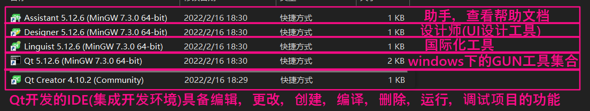
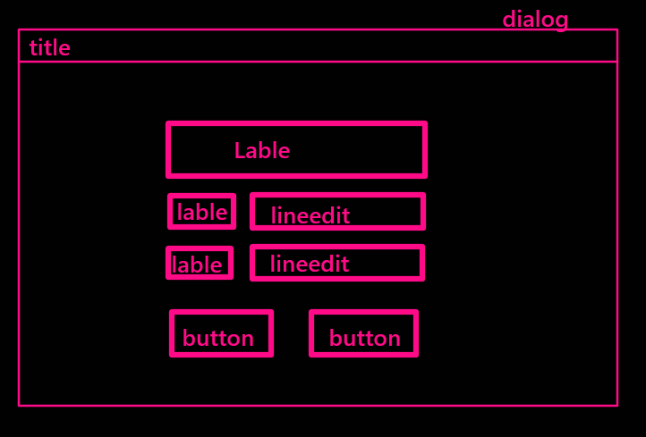

[toc]

# 1 QT简介

## 1.1 QT是什么

QT是一个c++的SDK(software development kits，软件开发工具包)，提供了常用的软件开发的一系列底层实现接口，能够让程序员快速的构建一个项目。

## 1.2 MFC

与QT功能类似的SDK

## 1.3 QT和MFC的区别

|     比较项     |                 Qt                  |           MFC            |
| :------------: | :---------------------------------: | :----------------------: |
| 支持开发的平台 | 跨平台（Windows、Linux、Android等） |       只能Windows        |
|    学习难度    |     QT封装了底层细节，入门简单      |         比较困难         |
|    学习资料    |        少而精，成体系，免费         | 多而杂，问题多，不成体系 |

## 1.4 QT的特点

1. QT是一个跨平台的C++开发库
2. 主要用来开发图形化界面程序
3. 也可以开发命令行程序
4. QT给脚本语言提供了开发库
5. 支持的平台多(x86，x64，ARM)

# 2 QT开发平台的介绍

## 2.1 QT套件

## 2.2 QtCreator的使用

1. 终端工程的搭建

   文件 -> 新建文件和项目 -> 选择项目路径，设置项目名称 -> 设置编译套件(Mingw) -> 完成

2. GUI图形化工程的搭建

   - 带ui设计界面的搭建

     文件 -> 新建文件和项目 -> 选择项目路径，设置项目名称 -> 设置编译套件(Mingw) -> 选择主页面基类(QMainWindow，QWidget，QDialog，常用QWidget)，选择创建界面文件(勾选) -> 完成

   - 不带ui设计界面的搭建(常用)

     文件 -> 新建文件和项目 -> 选择项目路径，设置项目名称 -> 设置编译套件(Mingw) -> 选择主页面基类(QMainWindow，QWidget，QDialog，常用QWidget)，选择创建界面文件(不勾选) -> 完成

3. Qt工程的编译

   一般默认的项目编译环境在：项目菜单中配置

   一般不建议手动更改

   构建目录：一定是纯英文路径

   构建步骤：

   1. qmake xxx.pro

      通过.pro文件传递给qmake工具，自动生成工程的makefile

   2. make

      编译

   3. make clean

   Qt编译工程有两种策略

   1. Debug

      测试版本，可以理解为gcc -g编译生成debug版本的可执行文件，生成的可执行文件，包括debug信息，可以使用debug菜单进入debug页面进行测试

   2. Release

      发行版本，可以理解为正常编译

4. Qt工程目录结构

   

# 3 QT添加资源文件

## 3.1 前期准备

找素材，在工程目录下新建一个文件夹(注意中英文)，将素材放入其中

## 3.2 添加资源文件

1. 选中工程目录
2. 鼠标右键
3. add new
4. 选中Qt ----> Qt Resource File
5. 设置资源文件名
6. 完成
7. 添加前缀
8. 添加文件

### 3.2.1 注意

想要在工程中找到资源，可以使用相对路径`:/前缀/带文件名的相对路径`

# 4 QT页面设计流程

1. 提需求
2. 根据需求设计页面布局
3. 根据需求设计页面中的控件
4. 根据需求选择主页面的基类
5. 写代码

## 4.1 案例

qq登录界面

