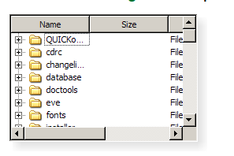
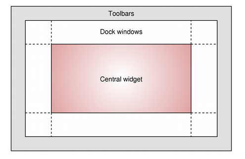

[toc]

# 1 QT下面的窗体类

QT下面提供了三种窗体类

## 1.1 QWidget

提供一个图形化窗体==**基类**==

```c++
/* 头文件 */
#include <QWidget>

/* qmake */
QT += widgets

/* 父类 */
QObject, QPaintDevice

/* 子类 */
QAbstractButton, QAbstractSlider, QAbstractSpinBox, 
QCalendarWidget, QComboBox, QDesktopWidget, 
QDialog, QDialogButtonBox, QDockWidget, QFocusFrame,
QFrame, QGroupBox, QKeySequenceEdit, QLineEdit, 
QMainWindow, QMdiSubWindow, QMenu, QMenuBar, 
QOpenGLWidget, QProgressBar, QRubberBand, 
QSizeGrip, QSplashScreen, QSplitterHandle, 
QStatusBar, QTabBar, QTabWidget, QToolBar, QWizardPage

/* 常用方法 */
/* 1.构造 */
QWidget::QWidget(QWidget *parent = nullptr, Qt::WindowFlags f = ...)
/* 2.析构 */
QWidget::~QWidget()
/* 3.添加布局 */
void QWidget::setLayout(QLayout *layout)
/* 4.设置窗口标题 */
void setWindowTitle(const QString &)
/* 5.设置窗口固定大小 */
void QWidget::setFixedSize(const QSize &s)
/* 6.设置窗口最小的显示大小，最小的宽度，高度 */
void setMinimumSize(int minw, int minh)
void setMinimumWidth(int minw)
void setMinimumHeight(int minh)
/* 7.设置窗体图标 */
void setWindowIcon(const QIcon &icon)
/* 8.显示 */
[slot] void QWidget::show()
/* 9.设置窗口的大小 */
void resize(int w, int h)
void resize(const QSize &)
/* 10.设置控件的在哪显示 */
void QWidget::setParent(QWidget *parent, Qt::WindowFlags f)
/* 11.设置控件的起始位置,对于窗体来说控件的位置 */
void move(int x, int y)
void move(const QPoint &)
/* 12.窗体自适应 */
void QWidget::adjustSize()
/* 注意：如果设置了setFixedSize就会失效 */
```

## 1.2 QMainWindow

提供一个具有菜单栏、工具栏、可变的中间窗体、状态栏的一个图形化界面


```cpp
/* 头文件 */
#include <QMainWindow>

/* qmake */
QT += widgets

/* 父类 */
QWidget

/* 常用方法 */
/* 1.构造 */
QMainWindow::QMainWindow(QWidget *parent = nullptr, Qt::WindowFlags flags = ...)
/* 2.添加菜单栏 */
void QMainWindow::setMenuBar(QMenuBar *menuBar)
/* 3.添加工具栏 */
void QMainWindow::addToolBar(QToolBar *toolbar)
void QMainWindow::addToolBar(Qt::ToolBarArea area, QToolBar *toolbar)
Qt::LeftToolBarArea         /* 停靠在左侧 */
Qt::RightToolBarArea        /* 停靠在右侧 */
Qt::TopToolBarArea          /* 停靠在顶部 */
Qt::BottomToolBarArea       /* 停靠在底部 */
Qt::AllToolBarAreas         /* 以上四个位置都可以停靠 */   
/* 4.添加中间窗体 */
void QMainWindow::setCentralWidget(QWidget *widget)
/* 5.添加状态栏 */
void QMainWindow::setStatusBar(QStatusBar *statusbar)
/* 6.添加铆接控件 */
void QMainWindow::addDockWidget(Qt::DockWidgetArea area, QDockWidget *dockwidget)
void QMainWindow::addDockWidget(Qt::DockWidgetArea area, QDockWidget *dockwidget, Qt::Orientation orientation)
```

## 1.3 QDialog

提供一个Dialog的基类

```cpp
/* 头文件 */
#include <QDialog> 

/* qmake */
QT += widgets

/* 父类 */
QWidget

/* 子类 */
QColorDialog, QErrorMessage, QFileDialog,
QFontDialog, QInputDialog, QMessageBox, 
QProgressDialog, QWizard
```

# 2 QT下面的页面布局

## 2.1 QT窗口坐标体系

坐标体系：

以左上角为原点(0,0)，X向右增大，Y向下增加。


对于嵌套窗口，其坐标是相对于父窗口来说的。

## 2.2 页面布局

QT下使用`QLayout`类来实现页面布局。页面布局主要是用来设计窗体上控件的排列方式的。

`QLayout`是一个抽象的基类，具体实现布局功能的还是由它的子类来实现，它的子类有`QBoxLayout, QFormLayout, QGridLayout, QStackedLayout`，而四个子类中最常用的是前两个：`QBoxLayout,QGridLayout`

### 2.2.1 QBoxLayout

`QBoxLayout`提供一个线性的控件布局，分为水平布局和垂直布局

```cpp
/* 头文件 */
#include <QBoxLayout> 

/* qmake */
QT += widgets

/* 父类 */
QLayout

/* 子类 */
QHBoxLayout, QVBoxLayout
```

#### 2.2.1.1 QHBoxLayout

水平布局

```cpp
/* 头文件 */
#include <QHBoxLayout>

/* qmake */
QT += widgets

/* 父类 */
QBoxLayout

/* 常用方法 */
/* 1.构造 */
QHBoxLayout::QHBoxLayout()
/* 2.添加控件 */
void QBoxLayout::addWidget(QWidget *widget, int stretch = 0, Qt::Alignment alignment = ...)
```


#### 2.2.1.2 QVBoxLayout

垂直布局

```cpp
/* 头文件 */
#include <QVBoxLayout>

/* qmake */
QT += widgets

/* 父类 */
QBoxLayout

/* 子类 */

/* 常用方法 */
/* 1.构造 */
QVBoxLayout::QVBoxLayout()
/* 2.添加控件 */
void QBoxLayout::addWidget(QWidget *widget, int stretch = 0, Qt::Alignment alignment = ...)
/* 3.添加布局 */
void QBoxLayout::addLayout(QLayout *layout, int stretch = 0)
```


### 2.2.2 QGridLayout

`QGridLayout`提供一个栅格化布局(表格布局)

```cpp
/* 头文件 */
#include <QGridLayout> 

/* qmake */
QT += widgets

/* 父类 */
QLayout

/* 常用方法 */
/* 1.构造 */
QGridLayout::QGridLayout()
QGridLayout::QGridLayout(QWidget *parent)
/* 2.添加Widget */
void QGridLayout::addWidget(QWidget *widget, 
                            int row, int column, 
                            Qt::Alignment alignment = ...)
void QGridLayout::addWidget(QWidget *widget, 
                                int fromRow, 
                                int fromColumn, 
                                int rowSpan, 
                                int columnSpan, 
                                Qt::Alignment alignment = ...)
/* 3.添加item */
void QGridLayout::addItem(QLayoutItem *item, 
                            int row, 
                            int column, i
                            nt rowSpan = 1, 
                            int columnSpan = 1, 
                            Qt::Alignment alignment = ...)
QGridLayout::addItem(QLayoutItem *item)
/* 4.添加Layout */
void QGridLayout::addLayout(QLayout *layout, 
                            int row, 
                            int column, 
                            int rowSpan, 
                            int columnSpan, 
                            Qt::Alignment alignment = ...)
void QGridLayout::addLayout(QLayout *layout, 
                            int row, int column, 
                            Qt::Alignment alignment = ...)
```


# 3 QT下常用的控件

## 3.1 QLabel

`QLabel`提供一个显示纯文本或者图片的一个类

能够显示的内容`QString、Html、QPxiMap、QMovie`

```cpp
/* 头文件 */
#include <QLabel> 

/* qmake */
QT += widgets

/* 父类 */
QFrame

/* 常用方法 */
/* 1.构造 */
QLabel::QLabel(QWidget *parent = nullptr, Qt::WindowFlags f = ...)
QLabel::QLabel(const QString &text, QWidget *parent = nullptr, Qt::WindowFlags f = ...)
/* 2.设置显示的文本 */
void setText(const QString &)
/* 3.设置显示图片 */
void setPixmap(const QPixmap &)
/* 4.设置显示位置 */
void setAlignment(Qt::Alignment)
Qt::AlignCenter

/* 常用的槽 */
/* 1.设置显示动图 */    
[slot] void QLabel::setMovie(QMovie *movie)
```

## 3.2 QLineEdit

`QlineEdit`提供一个行编辑器

```cpp
/* 头文件 */
#include <QLineEdit> 

/* qmake */
QT += widgets

/* 父类 */
QWidget

/* 常用方法 */
/* 1.构造 */
QLineEdit::QLineEdit(QWidget *parent = nullptr)
QLineEdit::QLineEdit(const QString &contents, QWidget *parent = nullptr)
/* 2.设置掩码 */
void setEchoMode(QLineEdit::EchoMode)
QLineEdit::Password
/* 3.获取文本内容 */
QString text() const
/* 4.设置提示信息 */
void setPlaceholderText(const QString &)
/* 5.设置文本信息 */
void setText(const QString &)
```

## 3.3 QPushButton

`QPushButton`提供一个按钮

```cpp
/* 头文件 */
#include <QPushButton> 

/* qmake */
QT += widgets

/* 父类 */
QAbstractButton

/* 子类 */
QCommandLinkButton
    
/* 常用方法 */
/* 1.构造 */
QPushButton::QPushButton(QWidget *parent = nullptr)
QPushButton::QPushButton(const QString &text, QWidget *parent = nullptr)
QPushButton::QPushButton(const QIcon &icon, 
                            const QString &text, 
                            QWidget *parent = nullptr)
/* 2.设置显示内容 */
void setText(const QString &text)
/* 3.设置控件的在哪显示 */
void QWidget::setParent(QWidget *parent, Qt::WindowFlags f)
/* 4.设置大小 */
void resize(const QSize &)
/* 5.设置控件的起始位置 */
void move(int x, int y)
void move(const QPoint &)
```

## 3.4 QTextEdit

提供一个超文本编辑器，即可以显示纯文本文件，也可以显示富文本文件，富文本文件的显示需要转换为HTML

```cpp
/* 头文件 */
#include <QTextEdit> 

/* qmake */
QT += widgets

/* 父类 */
QAbstractScrollArea

/* 子类 */
QTextBrowser


/* 常用方法 */
/* 1.构造 */
QTextEdit::QTextEdit(QWidget *parent = nullptr)
QTextEdit::QTextEdit(const QString &text, QWidget *parent = nullptr)
/* 2.设置显示富文本 */
void setHtml(const QString &text)

/* 常用槽 */
/* 1.设置显示纯文本 */
[slot] void QTextEdit::setText(const QString &text)
/* 2.追加 */
[slot] void QTextEdit::append(const QString &text)
/* 3.清空 */
[slot] void QTextEdit::clear()
/* 4.拷贝 */
[slot] void QTextEdit::copy()
/* 5.剪切 */
[slot] void QTextEdit::cut()
/* 6.粘贴 */
[slot] void QTextEdit::paste()
/* 7.恢复上次的操作Ctrl+Y */
[slot] void QTextEdit::redo()
/* 8.撤销上次的操作Ctrl+Z */
[slot] void QTextEdit::undo()

/* 方法介绍 */
/* 插入数据的方法 */
/* 使用QTextCursor */
[slot] void QTextEdit::insertHtml(const QString &text)
[slot] void QTextEdit::insertPlainText(const QString &text)
[slot] void QTextEdit::append(const QString &text)
[slot] void QTextEdit::paste()
/* 获取QTextEdit的文本 */
/* QTextDocument，这是QTextEdit的文本内容使用的类，如果需要获取文本内容 */
QString QTextEdit::toPlainText() const
QString toHtml() const
/* 清空QTextEdit的文本内容 */
[slot] void QTextEdit::clear()
```

## 3.5 QLCDNumber

提供一个数码管显示风格的控件

```cpp
/* 头文件 */
#include <QLCDNumber> 

/* qmake */
QT += widgets

/* 父类 */
QFrame

/* 常用方法 */
/* 1.构造 */
QLCDNumber::QLCDNumber(QWidget *parent = nullptr)
/* 2.构造的同时设置显示的宽度 */
QLCDNumber::QLCDNumber(uint numDigits, QWidget *parent = nullptr)
/* 3.设置显示风格 */
void setSegmentStyle(QLCDNumber::SegmentStyle)
QLCDNumber::Outline
QLCDNumber::Filled      /* 默认 */
QLCDNumber::Flat
/* 4.设置显示的进制 */
void setMode(QLCDNumber::Mode)          /* 设置模式，可以通用 */


/* 常用槽 */
/* 1.设置显示的进制 */
[slot] void QLCDNumber::setDecMode()    /* 十进制 */
[slot] void QLCDNumber::setOctMode()    /* 八进制 */
[slot] void QLCDNumber::setBinMode()    /* 二进制 */
[slot] void QLCDNumber::setHexMode()    /* 十六进制 */
/* 2.显示内容 */
[slot] void QLCDNumber::display(const QString &s)
[slot] void QLCDNumber::display(int num)
[slot] void QLCDNumber::display(double num)
```

## 3.6 QSplitter

提供一个分割器的类，可以将多个控件组织在一个QSplitter中，可以动态更改控件的大小

```cpp
/* 头文件 */
#include <QSplitter> 

/* qmake */
QT += widgets

/* 父类 */
QFrame

/* 常用方法 */
/* 1.构造 */
QSplitter::QSplitter(QWidget *parent = nullptr)
QSplitter::QSplitter(Qt::Orientation orientation, QWidget *parent = nullptr)
/* 2.添加控件 */
void QSplitter::addWidget(QWidget *widget)
/* 3.设置方向 */
void setOrientation(Qt::Orientation)
Qt::Horizontal      /* 水平 */
Qt::Vertical        /* 垂直 */
```

## 3.7 QListWidget

提供了一个类似于列表项的控件。这个控件可以显示和管理多个item。每个item都是一个`QListWidgetItem`类型


```cpp
/* 头文件 */
#include <QListWidget> 

/* qmake */
QT += widgets

/* 父类 */
QListView

/* 常用方法 */
/* 1.构造 */
QListWidget::QListWidget(QWidget *parent = nullptr)
/* 2.添加列表项 */
QListWidget::addItem(QListWidgetItem *item)
/* 3.当前行，也就是当前的QListWidgetItem所在的位置 */
int currentRow() const
/* 4.设置图标大小 */
void setIconSize(const QSize &size)


/* 常用的信号 */
[signal] void QListWidget::itemSelectionChanged()
```

## 3.8 QTreeWidget

提供一个树状的项目索引控件



```cpp
/* 头文件 */
#include <QTreeWidget> 

/* qmake */
QT += widgets

/* 父类 */
QTreeView

/* 常用方法 */
/* 1.构造 */
QTreeWidget::QTreeWidget(QWidget *parent = nullptr)
/* 2.设置最顶端的一个标题 */
void QTreeWidget::setHeaderLabel(const QString &label)
/* 3.添加item */
/* 使用QTreeWidgetItem的构造函数 */
/* tw就是一个QTreeWidget */
QTreeWidgetItem *it = new QTreeWidgetItem(this->tw)
/* 4.获取当前项目 */
QTreeWidgetItem *QTreeWidget::currentItem() const
/* 5.当前项的文本 */
QString QTreeWidgetItem::text(int column) const

/* 常用信号 */
/* 1.选择的item发生改变时发送下面的信号 */
[signal] void QTreeWidget::itemSelectionChanged()
```

## 3.9 QToolBox

提供一个类似于抽屉的Box，可以收纳很多的控件

```cpp
/* 头文件 */
#include <QToolBox> 

/* qmake */
QT += widgets

/* 父类 */
QFrame

/* 常用方法 */
/* 1.构造 */
QToolBox::QToolBox(QWidget *parent = nullptr, Qt::WindowFlags f = ...)
/* 2.添加item */
int QToolBox::addItem(QWidget *w, const QString &text)
int QToolBox::addItem(QWidget *widget, const QIcon &iconSet, const QString &text)
```

## 3.10 QCalendarWidget

提供一个日历控件，可以显示日历，从Qt4.2才有的

```cpp
/* 头文件 */
#include <QCalendarWidget> 

/* qmake */
QT += widgets

/* 父类 */
QWidget

/* 常用方法 */
/* 1.构造 */
QCalendarWidget::QCalendarWidget(QWidget *parent = nullptr)
```


## 3.11 QRadioButton

提供一个单选按钮，在一堆按钮中只能选择一个


```cpp
/* 头文件 */
#include <QRadioButton>

/* qmake */
QT += widgets

/* 父类 */
QAbstractButton

/* 常用方法 */
/* 1.构造 */
QRadioButton::QRadioButton(QWidget *parent = nullptr)
QRadioButton::QRadioButton(const QString &text, QWidget *parent = nullptr)
/* 2.判断当前复选框是否被选择 */
bool isChecked() const
```

## 3.12 QComboBox

提供一个下拉列表框。可以选择想要的内容


```cpp
/* 头文件 */
#include <QComboBox> 

/* qmake */
QT += widgets

/* 父类 */
QWidget

/* 子类 */
QFontComboBox

/* 常用方法 */
/* 1.构造 */
QComboBox::QComboBox(QWidget *parent = nullptr)
/* 2.添加item */
void QComboBox::addItems(const QStringList &texts)
void QComboBox::addItem(const QIcon &icon, const QString &text, const QVariant &userData = QVariant())
void QComboBox::addItem(const QString &text, const QVariant &userData = QVariant())
/* 3.获取内容 */
QString currentText() const
```

## 3.13 QCheckBox

提供一个复选框类，即一堆复选框可以实现多选功能


```cpp
/* 头文件 */
#include <QCheckBox> 

/* qmake */
QT += widgets

/* 父类 */
QAbstractButton

/* 常用方法 */
/* 1.构造 */
QCheckBox::QCheckBox(QWidget *parent = nullptr)
QCheckBox::QCheckBox(const QString &text, QWidget *parent = nullptr)
/* 2.判断当前复选框是否被选择 */
bool isChecked() const
```

## 3.14 QGroupBox

提供一个有标题的`group box`的窗体


```cpp
/* 头文件 */
#include <QGroupBox> 

/* qmake */
QT += widgets

/* 父类 */
QWidget

/* 常用方法 */
/* 1.构造 */
QGroupBox::QGroupBox(QWidget *parent = nullptr)
QGroupBox::QGroupBox(const QString &title, QWidget *parent = nullptr)
/* 2.添加控件的方法 */
/* 同Widegt */
/* 3.设置title */
void setTitle(const QString &title)
```


## 3.15 QTableWidget


```cpp
/* 头文件 */
#include <QTableWidget> 

/* qmake */
QT += widgets

/* 父类 */
QTableView

/* 常用方法 */
/* 1.构造 */
QTableWidget::QTableWidget(QWidget *parent = nullptr)
QTableWidget::QTableWidget(int rows, int columns, QWidget *parent = nullptr)
/* 2.设置指定表格显示的控件 */
void QTableWidget::setCellWidget(int row, int column, QWidget *widget)
```

# 4 Qt其他相关的类

## 4.1 QSize

提供了一个QT下的大小

```cpp
/* 头文件 */
#include <QSize> 

/* qmake */
QT += core

/* 常用方法 */
/* 1.构造 */
QSize::QSize(int width, int height)
```

## 4.2 QIcon

提供一个QT的图标

```cpp
/* 头文件 */
#include <QIcon> 

/* qmake */
QT += gui

/* 常用方法 */
/* 1.构造 */
QIcon::QIcon(const QString &fileName)
```

## 4.3 QMenuBar

提供以一个水平布局的`Menu Bar`

```cpp
/* 头文件 */
#include <QMenuBar>

/* qmake */
QT += widgets

/* 父类 */
QWidget

/* 常用方法 */
/* 1.构造 */
QMenuBar::QMenuBar(QWidget *parent = nullptr)
/* 2.添加菜单 */
QAction *QMenuBar::addMenu(QMenu *menu)
/* 3.添加Action:动作 */    
QAction *QMenuBar::addAction(const QString &text, const QObject *receiver, const char *member)
```

## 4.4 QMenu

提供一个Qt菜单


```cpp
/* 头文件 */
#include <QMenu> 

/* qmake */
QT += widgets

/* 父类 */
QWidget

/* 常用方法 */
/* 1.构造 */
QMenu::QMenu(QWidget *parent = nullptr)
QMenu::QMenu(const QString &title, QWidget *parent = nullptr)
/* 2.添加Action:动作 */
QAction *QMenu::addAction(const QString &text)
/* 3.添加分割线 */
QAction *QMenu::addSeparator()
```

## 4.5 QAction

提供一个菜单选项

```cpp
/* 头文件 */
#include <QAction> 

/* qmake */
QT += widgets

/* 父类 */
QObject

/* 子类 */
QWidgetAction

/* 常用方法 */
/* 1.构造 */
QAction::QAction(QObject *parent = nullptr)
QAction::QAction(const QString &text, QObject *parent = nullptr)
QAction::QAction(const QIcon &icon, const QString &text, QObject *parent = nullptr)
/* 2.设置Icon */
void setIcon(const QIcon &icon)
/* 3.设置快捷键 */
void setShortcut(const QKeySequence &shortcut)

/* 常用信号 */
/* 1.点击时发出信号 */
[signal] void QAction::triggered(bool checked = false)
```

## 4.6 QKeySequence

提供了快捷键的操作

```cpp
/* 头文件 */
#include <QKeySequence> 

/* qmake */
QT += gui

/* 常用方法 */
/* 1.构造 */
QKeySequence::QKeySequence()
QKeySequence::QKeySequence(const QString &key, 
                            QKeySequence::SequenceFormat format = NativeText)
QKeySequence::QKeySequence(int k1, int k2 = 0, int k3 = 0, int k4 = 0)
QKeySequence::QKeySequence(const QKeySequence &keysequence)
```


## 4.7 QFileDialog

是一个用来选择文件/文件夹的Dialog

### 4.7.1 QFontDialog

### 4.7.2 QColorDialog

跟QFileDialog是类似的

```cpp
/* 头文件 */
#include <QFileDialog> 

/* qmake */
QT += widgets

/* 父类 */
QDialog

/* 常用方法 */
/* 1.构造 */
QFileDialog::QFileDialog(QWidget *parent, Qt::WindowFlags flags)
QFileDialog::QFileDialog(QWidget *parent = nullptr, const QString &caption = QString(), 
                            const QString &directory = QString(), 
                            const QString &filter = QString())
/* 2.选择文件 */
[static] QString QFileDialog::getOpenFileName(QWidget *parent = nullptr, 
                                        const QString &caption = QString(), 
                                        const QString &dir = QString(), 
                                        const QString &filter = QString(), 
                                        QString *selectedFilter = nullptr, 
                                        QFileDialog::Options options = ...)
/* 3.选择多个文件 */
[static] QStringList QFileDialog::getOpenFileNames(QWidget *parent = nullptr, 
                                            const QString &caption = QString(), 
                                            const QString &dir = QString(), 
                                            const QString &filter = QString(), 
                                            QString *selectedFilter = nullptr, 
                                            QFileDialog::Options options = ...)
/* 4.选择文件夹 */ 
[static] QString QFileDialog::getExistingDirectory(QWidget *parent, 
                                            const QString &caption, 
                                            const QString &dir, 
                                            QFileDialog::Options options)       
/* 5.选择保存的文件 */
[static] QString QFileDialog::getSaveFileName(QWidget *parent = nullptr, 
                                        const QString &caption = QString(), 
                                        const QString &dir = QString(), 
                                        const QString &filter = QString(), 
                                        QString *selectedFilter = nullptr, 
                                        QFileDialog::Options options = ...)                      
```

## 4.8 QPixmap

提供一个可以在屏幕上绘制的图片信息


```cpp
/* 头文件 */
#include <QPixmap> 

/* qmake */
QT += gui

/* 父类 */
QPaintDevice

/* 子类 */
QBitmap

/* 常用方法 */
/* 1.构造 */
QPixmap::QPixmap()
QPixmap::QPixmap(int width, int height)
QPixmap::QPixmap(const QSize &size)
QPixmap::QPixmap(const QString &fileName, 
                    const char *format = nullptr, 
                    Qt::ImageConversionFlags flags = Qt::AutoColor)
QPixmap::QPixmap(const char *const [] xpm)
QPixmap::QPixmap(const QPixmap &pixmap)
/* 2.加载数据 */
bool QPixmap::load(const QString &fileName, 
                    const char *format = nullptr, 
                    Qt::ImageConversionFlags flags = Qt::AutoColor)
bool QPixmap::loadFromData(const uchar *data, 
                            uint len, 
                            const char *format = nullptr, 
                            Qt::ImageConversionFlags flags = Qt::AutoColor)
bool QPixmap::loadFromData(const QByteArray &data, 
                            const char *format = nullptr, 
                            Qt::ImageConversionFlags flags = Qt::AutoColor)
/* 3.设置图片大小 */
QPixmap QPixmap::scaled(const QSize &size, 
                            Qt::AspectRatioMode aspectRatioMode = Qt::IgnoreAspectRatio, 
                            Qt::TransformationMode transformMode = Qt::FastTransformation) const
Qt::IgnoreAspectRatio               /* 常用 */
Qt::KeepAspectRatio
Qt::KeepAspectRatioByExpanding
    
Qt::FastTransformation
Qt::SmoothTransformation            /* 常用 */
```

## 4.9 QDir

提供一个Qt下文件夹的类

```cpp
/* 头文件 */
#include <QDir> 

/* qmake */
QT += core

/* 常用方法 */
/* 1.构造 */
QDir::QDir(const QDir &dir)
QDir::QDir(const QString &path = QString())
QDir::QDir(const QString &path, 
            const QString &nameFilter, 
            QDir::SortFlags sort = SortFlags(Name | IgnoreCase), 
            QDir::Filters filters = AllEntries)
/* 2.获取当前文件夹中的内容 */
QFileInfoList QDir::entryInfoList(const QStringList &nameFilters, 
                                    QDir::Filters filters = NoFilter, 
                                    QDir::SortFlags sort = NoSort) const
QFileInfoList QDir::entryInfoList(QDir::Filters filters = NoFilter, 
                                    QDir::SortFlags sort = NoSort) const
```

## 4.10 QList

提供一个Qt下的线性表

这是一个模板类，定义一个所有元素为int类型的list，可以这样定义`QList<int> mylist;`

==**可以使用下标来访问成员**==

```cpp
/* 头文件 */
#include <QList> 

/* qmake */
QT += core

/* 子类 */
QByteArrayList, QItemSelection, QQueue, QStringList

/* 常用方法 */
/* 1.构造 */
QList::QList()
QList::QList(const QList<T> &other)
QList::QList(QList<T> &&other)
QList::QList(std::initializer_list<T> args)
/* 2.获取大小 */
int QList::size() const
/* 3.以什么开头 */
bool QList::startsWith(const T &value) const
/* 4.以什么结尾 */
bool QList::endsWith(const T &value) const
```

## 4.11 QFileInfo

提供一个系统文件信息的类

```cpp
/* 头文件 */
#include <QFileInfo> 

/* qmake */
QT += core

/* 常用方法 */
/* 1.构造 */
QFileInfo::QFileInfo()
QFileInfo::QFileInfo(const QString &file)
QFileInfo::QFileInfo(const QFile &file)
QFileInfo::QFileInfo(const QDir &dir, const QString &file)
QFileInfo::QFileInfo(const QFileInfo &fileinfo)
/* 2.获取文件路径 */
QString QFileInfo::filePath() const
/* 3.获取文件名 */
QString QFileInfo::fileName() const
```

## 4.12 QStringList

等价于`QList<QString>`

## 4.13 QMovie

提供一个动图的播放

```cpp
/* 头文件 */
#include <QMovie> 

/* qmake */
QT += gui

/* 父类 */
QObject

/* 常用方法 */
/* 1.构造 */
QMovie::QMovie(QObject *parent = nullptr)
QMovie::QMovie(QIODevice *device, 
                const QByteArray &format = QByteArray(), 
                QObject *parent = nullptr)
QMovie::QMovie(const QString &fileName, 
                const QByteArray &format = QByteArray(), 
                QObject *parent = nullptr)          
/* 2.倍速播放 */
void setSpeed(int percentSpeed)

/* 常用槽 */
/* 1.开始播放 */
[slot] void QMovie::start()
/* 2.停止播放 */
[slot] void QMovie::stop()
```

## 4.14 QToolBar

提供一个工具栏，在`QMainWindow`中通过`addToolBar()`来添加，可以通过`QToolBar`的`addAction()`来添加`QAction`

## 4.15 QDockWidget

提供一个可拖拽的`widget`,铆接控件



```cpp
/* 头文件 */
#include <QDockWidget> 

/* qmake */
QT += widgets

/* 父类 */
QWidget

/* 常用方法 */
/* 1.构造 */
QDockWidget::QDockWidget(const QString &title, QWidget *parent = nullptr, Qt::WindowFlags flags = ...)
QDockWidget::QDockWidget(QWidget *parent = nullptr, Qt::WindowFlags flags = ...)
```

## 4.16 QStatusBar

提供一个状态栏

```cpp
/* 头文件 */
#include <QStatusBar> 

/* qmake */
QT += widgets

/* 父类 */
QWidget

/* 常用方法 */
/* 1.构造 */
QStatusBar::QStatusBar(QWidget *parent = nullptr)

/* 常用槽 */
/* 1.显示信息 */
[slot] void QStatusBar::showMessage(const QString &message, int timeout = 0)
/* 2.清空信息 */
[slot] void QStatusBar::clearMessage()
```

## 4.17 QFile

提供一个文件类

```cpp
/* 头文件 */
#include <QFile>

/* qmake */
QT += core

/* 父类 */
QFileDevice

/* 子类 */
QTemporaryFile

/* 常用方法 */
/* 1.构造 */
QFile::QFile()
QFile::QFile(const QString &name)
QFile::QFile(QObject *parent)
QFile::QFile(const QString &name, QObject *parent)
/* 2.打开文件 */
bool QFile::open(FILE *fh, 
                    QIODevice::OpenMode mode, 
                    QFileDevice::FileHandleFlags handleFlags = DontCloseHandle)
/* 3.一次性读完所有文件内容 */
QByteArray QIODevice::readAll()
/* 4.关闭文件 */
void QFileDevice::close()
/* 5.写文件 */
qint64 QIODevice::write(const char *data, qint64 maxSize)
qint64 QIODevice::write(const char *data)
qint64 QIODevice::write(const QByteArray &byteArray)
```

```cpp
/* 实例 */
/* 构造一个文件 */
QFile f(filename);
/* 打开一个文件 */
f.open(QIODevice::ReadOnly);
/* 一次性读完所有文件内容 */
f.readAll();
/* 关闭一个文件 */
f.close();
```

## 4.18 QString

一个字符串类

### 4.18.1 如何从字符串转成QByteArray

```cpp
/* 头文件 */
#include <QString> 

/* qmake */
QT += core

/* 常用方法 */
/* 1.构造 */
QString::QString()
/* 2.将String转成QByteArray，如要求使用汉字或者是其他的特殊字符(需要翻译成其他语言的内容)建议使用这个 */
QByteArray QString::toUtf8() const
/* 3.将String转成QByteArray，如果使用网络进行数据传输，建议使用 */
QByteArray QString::toLatin1() const
/* 4.将String转成QByteArray，如果使用网络进行数据传输，建议使用 */
QByteArray QString::toLocal8Bit() const
/* 5.以什么结尾 */
bool QString::endsWith(const QString &s, Qt::CaseSensitivity cs = Qt::CaseSensitive) const
/* 6.以什么开头 */
bool QString::startsWith(const QString &s, Qt::CaseSensitivity cs = Qt::CaseSensitive) const  
/* 7.将字符串拆分成子字符串，然后返回这些字符串的列表 */
QStringList QString::split(const QString &sep, 
                            QString::SplitBehavior behavior = KeepEmptyParts, 
                            Qt::CaseSensitivity cs = Qt::CaseSensitive) const
/* 8.返回字符串的字节数 */
int QString::size() const
/* 9.字符串包含str子串返回ture,反之返回false */
bool QString::contains(const QString &str, 
                        Qt::CaseSensitivity cs = ...) const
```

## 4.19 QTimer

是一个定时器类，定时触发可以绑定timeout信号

```cpp
/* 头文件 */
#include <QTimer> 

/* qmake */
QT += core

/* 父类 */
QObject

/* 常用方法 */
/* 1.构造 */
QTimer::QTimer(QObject *parent = nullptr)
/* 2.开启计时 */
void QTimer::start(std::chrono::milliseconds msec)      /* 常用 */

/* 常用槽 */
/* 1.开启计时 */
[slot] void QTimer::start(int msec)
[slot] void QTimer::start()
/* 2.停止计时 */
[slot] void QTimer::stop()

/* 常用信号 */
/* 1.时间到了以后会发生timeout信号 */
[signal] void QTimer::timeout()     
```

## 4.20 QListWidgetItem

提供了一个列表项

```cpp
/* 头文件 */
#include <QListWidgetItem> 

/* qmake */
QT += widgets

/* 常用方法 */
/* 1.构造 */
QListWidgetItem::QListWidgetItem(QListWidget *parent = nullptr, int type = Type)
/* 2.设置列表项的文本内容 */
void QListWidgetItem::setText(const QString &text)
/* 3.设置列表项图标 */
void QListWidgetItem::setIcon(const QIcon &icon)
```

## 4.21 QTreeWidgetItem

提供一个`QTreeWidgetItem`的项

```cpp
/* 头文件 */
#include <QTreeWidgetItem> 

/* qmake */
QT += widgets

/* 常用方法 */
/* 1.构造 */
QTreeWidgetItem::QTreeWidgetItem(QTreeWidget *parent, int type = Type)
/* 2.设置文本内容 */
void QTreeWidgetItem::setText(int column, const QString &text)
/* 3.设置Icon */
void QTreeWidgetItem::setIcon(int column, const QIcon &icon)
/* 4.获取文本内容 */
QString QTreeWidgetItem::text(int column) const
/* 5.获取孩子的数目 */
int QTreeWidgetItem::childCount() const
/* 6.获取当前项的父亲 */
QTreeWidgetItem *QTreeWidgetItem::parent() const
```


## 4.22 QDateTime

提供一个日期时间类


```cpp
/* 头文件 */
#include <QDateTime> 

/* qmake */
QT += core

/* 常用方法 */
/* 1.构造 */
QDateTime::QDateTime()
QDateTime::QDateTime(const QDate &date)
QDateTime::QDateTime(const QDate &date, const QTime &time, Qt::TimeSpec spec = Qt::LocalTime)
QDateTime::QDateTime(const QDate &date, const QTime &time, Qt::TimeSpec spec, int offsetSeconds)
QDateTime::QDateTime(const QDate &date, const QTime &time, const QTimeZone &timeZone)
QDateTime::QDateTime(const QDateTime &other)
QDateTime::QDateTime(QDateTime &&other)
/* 2.获取本地时间 */
[static] QDateTime QDateTime::currentDateTime()
/* 3.格式化显示时间 */
QString QDateTime::toString(QStringView format) const
```