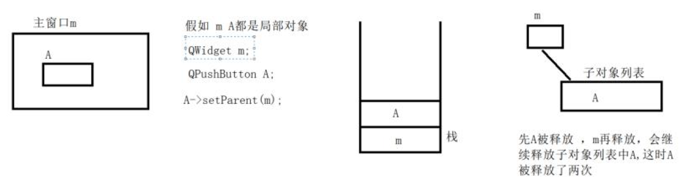

[toc]

# 1 对象模型(对象树)

在Qt中创建对象的时候会提供一个Parent对象指针。

1. `QObject`是以对象树的形式组织起来的

   - 当你创建一个`QObject`对象时，会看到`QObject`的构造函数接收一个`QObject`指针作为参数，这个参数就是parent，也就是父对象指针

     相当于，在创建`QObject`对象时，可以提供一个其父对象，我们创建的这个`QObject`对象会自动添加到其父对象的`children()`列表。

   - 当父对象是析构的时候，这个列表中的所有对象也会被析构。（注意，这里的父对象并不是继承意义上的父类）

2. `QWidget`是能够在屏幕上显示的一切组件的父类

   - `QWidget`继承自`QObject`，因此也继承了这种对象树关系，一个孩子自动地成为父组件的一个子组件。因此，它会显示在父组件的坐标系统中，被父组件的边界剪裁。
   - 用户也可以自己删除子对象，它们会自动从其父对象列表中删除。

==**Qt引入了对象树的概念，在一定程度上解决了内存问题。**==

1. 当一个`QObject`对象在堆上创建的时候，Qt会同时为其创建一个对象树。不过，对象树中对象的顺序是没有定义的。这意味着，销毁这些对象的顺序也是未定义的。
2. 任何对象树中的`QObject`对象delete的时候，如果这个对象有parent，则自动将其从parent的children()列表中删除，如果有孩子，则自动delete每一个孩子，Qt保证没有`QObject`会被delete两次，这是由析构顺序决定的。

如果`QOject`在栈上创建，Qt保持同样的行为。正常情况下，这也不会发生什么问题。

```cpp
{
	QWidget window;
	QPushButton quit = QPushButton("quit", &window);
}
```

作为父组件的window和作为子组件的quit都是`QObject`的子类(事实上，它们都是`QWidget`的子类，而`QWidget`是`QObject`的子类)。代码是正确的，quit的析构函数不会被调用两次，因为标准c++要求，局部对象的析构顺序应该按照其创建顺序的相反过程。因此，这段代码在超出作用域时，会先调用quit的析构函数，将其从父对象window的子对象列表中删除，然后才会再调用window的析构函数。

但是，如果我们使用下面的代码：

```cpp
{
	QPushButton quit("Quit");
	QWidget window;
	quit.setParent(&window);
}
```

情况又有所不同，析构顺序就有了问题。我们看到，在上面的代码中，作为父对象的window 会首先被析构，因为它是最后一个创建的对象。在析构过程中，它会调用子对象列表中每一个对象的析构函数，也就是说， quit 此时就被析构了。然后，代码继续执行，在window 析构之后，quit 也会被析构，因为quit 也是一个局部变量，在超出作用域的时候当然也需要析构。但是，这时候已经是第二次调用quit 的析构函数了，C++ 不允许调用两次析构函数，因此，程序崩溃了。
由此我们看到，Qt 的对象树机制虽然帮助我们在一定程度上解决了内存问题，但是也引入了一些值得注意的事情。这些细节在今后的开发过程中很可能时不时跳出来烦扰一下，所以，我们最好从开始就养成良好习惯。

==**在Qt中，尽量在构造的时候就指定parent对象，并且大胆的在堆上创建。**==



# 2 QT下的事件触发机制

## 2.1 信号与槽的概念

所谓信号槽，实际就是观察者模式。当某个事件发生之后，比如，按钮检测到自己被点击了一下，他就会发出一个信号(signal)。这种发出是没有目的的，类似广播。如果有对象对这个信号感兴趣，它就会使用连接(connect)函数，意思是，将想要处理的信号和自己的一个函数(称为槽(slot))绑定来处理这个信号。也就是说，当信号发出时，被连接的槽函数会自动被回调。这就类似观察者模式：当发生了感兴趣的事件，某一个操作就会被自动触发。

QT提供了信号和槽机制来实现常见的事件触发。

凡是`QObject`的子类，都支持信号和槽机制

==**如果是自定义的类的话，要实现事件触发，自定义类继承于`QObject`即可**==

`class Custom : public QObject {};`

## 2.2 如何自定义槽函数

1. 在类的定义中，加入`private slots:`
2. 在该标识下加入想要实现的槽函数声明
3. 在类对应的实现cpp中，实现槽函数的定义

### 2.2.1 注意

1. 槽函数可以时普通的成员函数，还可以是槽函数。
2. 如果信号没有参数，槽函数也不能有参数。如果信号有参数，槽函数可以有也可以没有

## 2.3 如何关联信号和槽函数

### 2.3.1 connect()函数

```cpp
QMetaObject::Connection QObject::connect(const QObject *sender, 
                                            const char *signal, 
                                            const QObject *receiver, 
                                            const char *method, 
                                            Qt::ConnectionType type = Qt::AutoConnection)
/* 
 * 参数：
 *      sender：发出信号的对象
 *      signal：发出对象发出的信号
 *      receiver：接收信号的对象
 *      method：接收对象在接收到信号之后所需要调用的函数(槽函数)
 */
```

在ui文件的工程中，可以使用"转到槽"的方式来实现信号和槽的关联。所有关联方式中，只有纯代码最靠谱。

## 2.4 自定义信号

### 2.4.1 sonwidget.h

```cpp
#ifndef SONWIDGET_H
#define SONWIDGET_H

#include <QWidget>
#include <QPushButton>

class SonWidget : public QWidget
{
    Q_OBJECT
public:
    explicit SonWidget(QWidget *parent = nullptr);

public:
    QPushButton *button2;

signals:    /* 定义信号 */
    /* 信号没有返回值，可以有参数，信号函数不需要定义，只需要声明 */
    void show_hide_signal(int a);

public slots:
    void emit_mysignal();
};

#endif // SONWIDGET_H
```

### 2.4.2 sonwidget.cpp

```cpp
#include "sonwidget.h"

SonWidget::SonWidget(QWidget *parent) : QWidget(parent)
{
    this->resize(350,240);
    this->setWindowTitle(tr("子窗口"));
    /* 构造函数的重载函数，直接指定文本内容和要显示的位置 */
    this->button2 = new QPushButton(tr("显示父窗口，隐藏子窗口"),this);
    connect(this->button2, &QPushButton::clicked, this, &SonWidget::emit_mysignal);
}

void SonWidget::emit_mysignal()
{
    /* 点击按钮的槽函数，发射信号 */
    emit show_hide_signal(10);
}
```

### 2.4.3 widget.cpp

```cpp
#include "widget.h"
#include <QDebug>

Widget::Widget(QWidget *parent)
    : QWidget(parent)
{
    this->setWindowTitle(tr("父窗口"));
    this->resize(640,480);
    this->sonwindow = new SonWidget;
    this->sonwindow->show();
    this->button1 = new QPushButton();
    this->button1->setText(tr("隐藏父窗口 显示子窗口"));
    this->button1->setParent(this);

    connect(this->button1, &QPushButton::clicked, this, &Widget::button_cb);
    connect(this->sonwindow, &SonWidget::show_hide_signal, this, &Widget::signal_cb);

}

void Widget::signal_cb(int a)
{
    qDebug() << a;
    this->show();
    this->sonwindow->hide();
}

void Widget::button_cb()
{
    this->hide();
    this->sonwindow->show();
}

Widget::~Widget()
{
}
```

### 2.4.4 widget.h

```cpp
#ifndef WIDGET_H
#define WIDGET_H

#include <QWidget>
#include "sonwidget.h"
#include <QPushButton>

class Widget : public QWidget
{
    Q_OBJECT

public:
    Widget(QWidget *parent = nullptr);
    ~Widget();
public:
    SonWidget *sonwindow;
    QPushButton *button1;
public:
    void button_cb();
    void signal_cb(int a);
};
#endif // WIDGET_H
```

## 2.5 自定义信号和槽的注意事项

1. 发送者和接收者都需要是`QObject`的子类(当然，槽函数是全局函数、Lambda表达式等无序接收者的时候除外)
2. 信号和槽函数返回值是viod
3. 信号只需要声明，不需要实现
4. 槽函数需要声明也需要实现
5. 槽函数是普通的成员函数，作为成员函数，会受到public、private、protected的影响
6. 使用emit在恰当的位置发送信号
7. 任何成员函数、static函数、全局函数和Lambda表达式都可以作为槽函数
8. 信号槽要求的信号和槽的参数一致，所谓一致，是参数类型一致
9. 如果信号和槽的参数不一致，允许的情况是，槽函数的参数可以比信号的少，即便如此，槽函数存在的那些参数的顺序也必须和信号的前面几个一致起来。这是因为，你可以在槽函数中选择忽略信号传来的数据(也就是槽函数的参数比信号的少)

## 2.6 信号传参

Qt的信号可以传递参数，参数需要在信号定义时说明。参数就是写在信号后面的参数列表中

带参数的信号，在接收时，它的槽也得带参数(用户自定义的)

在关联信号和槽时，必须信号的发送者和接收者必须都存在，信号的发送者和接收者都是类的实例。

## 2.7 信号槽的扩展

1. 一个信号可以和多个槽相连

   如果是这种情况，这些槽会一个接一个的被调用，但是它们的调用顺序是不确定的。

2. 多个信号可以连接一个槽

   只要任意一个信号发出，这个槽就会被调用

3. 一个信号可以连接到另外一个信号

   当第一个信号发出时，第二个信号被发出，除此之外，这种信号 -- 信号的方式和信号 -- 槽的方式没有什么区别

4. 槽可以被取消链接

   这种情况不经常出现，因为当一个对象delete之后，Qt会自动取消连接到这个对象上面的槽。

5. 信号槽可以断开

   使用disconnect关键字是可以断开信号槽的

6. 可以使用Lambda表达式

   在使用Qt5的时候，能够支持Qt5的编译器都是支持Lambda表达式的，在连接信号和槽的时候，槽函数可以使用Lambda表达式的方式进行处理。

## 2.8 Lambda表达式

C++11中的Lambda表达式用于定义并创建匿名对象的函数对象，以简化编程工作

### 2.8.1 lambda表达式的基本构成

```cpp
[capture](parmeters)mutable -> return-type
{
    statement
}
/* [函数对象参数](操作符重载函数参数)mutable -> 返回值{函数体} */
```

1. 函数对象参数

   `[]`,标识一个Lambda的开始，==**这部分必须存在，不能省略**==。函数对象参数时传递给编译器自动生成的函数对象类的构造函数的。函数对象参数只能使用到那些到定义lambda为止时，lambda所在的作用范围内可见的局部变量(包括Lambda所在类的this)。函数对象参数有以下形式：

   - `空`。没有使用任何函数对象参数
   - `=`。函数体内可以使用lambda所在作用范围内所有可见的局部变量(包括lambda所在类的this)，并且是==**值传递方式**==(相当于编译器自动为我们按值传递了所有的局部变量)
   - `&`。函数体内可以使用lambda所造范围内所有可见的局部变量(包括Lambda所在类的this)，并且是==**引用传递方式**==(相当于编译器自动为我们按引用传递了所有的局部变量)
   - `this`。函数体内可以使用lambda所在类的成员变量
   - `a`。将a按值进行传递。按值进行传递时，函数体内不能修改传递进来的a的拷贝，因为默认情况下函数时const的。要修改传递进来的a的拷贝，可以添加mutable修饰符
   - `&a`。将a按引用进行传递
   - `a, &b`。将a按值进行传递，b按引用进行传递。
   - `=, &a, &b`。除a和b按引用进行传递外，其他参数都按值进行传递
   - `&, a, b`。除a和b按值进行传递外，其他参数都按引用进行传递。

2. 操作符重载函数参数

   标识重载的`()`操作符的参数，没有参数时，==**这部分可以省略**==。参数可以通过按值(如:(a, b))和按引用(如:(&a, &b))两种方式传递。

3. 可修改标识符

   mutable声明，==**这部分可以省略**==。按值传递函数对象参数时，加上mutable修饰符后，可以修改按值传递进来的拷贝(注意是能修改拷贝，而不是值本身)

   ```cpp
   QPushButton *mybut1 = new QPushButton(tr("按钮1"), this);
   QPushButton *mybut2 = new QPushButton(tr("按钮2"), this);
   mybut2->move(100, 100);
   int m = 10;
   connect(mybut1, &QPushButton::clicked, this, [m]() mutable
           {
          m = 100 + 10;
          qDebug() << m;   /* 110 */ });
   connect(mybut2, &QPushButton::clicked, this, [=]()
           {
         qDebug() << m;    /* 10 */ });
   qDebug() << m; /* 10 */
   ```

4. 函数返回值

   `->返回值类型`，标识函数返回值的类型，当发挥至为void，或者函数体中只有一处return的地方(此时编译器可以自动推断出返回值类型)时，==**这部分可以省略**==

5. 函数体

   `{}`，标识函数的实现，==**这部分不能省略**==，但函数体可以为空。
