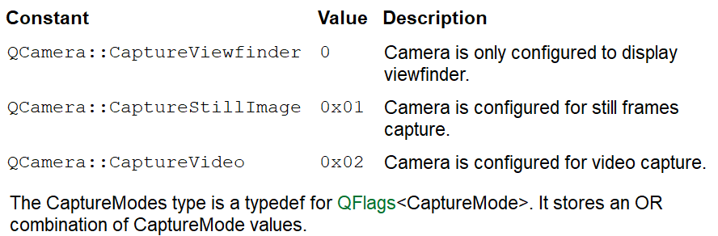

[toc]

# 1 多媒体

## 1.1 QMediaPlayer

提供一个多媒体播放器，可以播放音频，视频

```cpp
/* 头文件 */
#include <QMediaPlayer> 

/* qmake */
QT += multimedia

/* 父类 */
QMediaObject

/* 常用方法 */
/* 1.构造 */
QMediaPlayer::QMediaPlayer(QObject *parent = nullptr, QMediaPlayer::Flags flags = ...)
/* 2.播放的位置重定位 */
void setPosition(qint64 position)
/* 3.获取当前进度 */
qint64 position() const
/* 4.设置视频播放时的显示控件 */
void QMediaPlayer::setVideoOutput(QVideoWidget *output)
/* 5.获取当前资源的大小 */
qint64 duration() const
/* 6.设置音量 */
void setVolume(int volume)
/* 7.设置视频播放控件 */
void QMediaPlayer::setVideoOutput(QVideoWidget *output)

/* 常用槽 */
/* 1.加载资源 */
[slot] void QMediaPlayer::setMedia(const QMediaContent &media, 
                                    QIODevice *stream = nullptr)
/* 注意：QMediaContent是一个QUrl */
/* 例如：this->myplayer->setMedia(QUrl::fromLocalFile(filename)); */
/* 2.播放 */
[slot] void QMediaPlayer::play()
/* 3.停止播放 */
[slot] void QMediaPlayer::stop()
/* 4.暂停播放 */
[slot] void QMediaPlayer::pause()

/* 常用信号 */
/* 1.当播放位置发生改变发送如下信号 */
[signal] void QMediaPlayer::positionChanged(qint64 position)
```

## 1.2 QSlider

提供一个进度条(可以通过滑动这个滑动条，可以更改进度)


```cpp
/* 头文件 */
#include <QSlider> 

/* qmake */
QT += widgets

/* 父类 */
QAbstractSlider

/* 常用方法 */
/* 1.构造 */
QSlider::QSlider(QWidget *parent = nullptr)
QSlider::QSlider(Qt::Orientation orientation, QWidget *parent = nullptr)
Qt::Horizontal      /* 水平 */
Qt::Vertical        /* 垂直(默认) */
/* 2.获取滑动条的值 */
int value() const
/* 3.设置滑动条的值 */
void setValue(int)

/* 常用槽 */
/* 1.设置范围 */
[slot] void QAbstractSlider::setRange(int min, int max)

/* 常用信号 */
/* 1.当松开slider时发送如下信号 */
[signal] void QAbstractSlider::sliderReleased()
/* 2.当按下slider时发送如下信号 */
[signal] void QAbstractSlider::sliderPressed()
```

## 1.3 QVideoWidget

提供一个视频播放时，视频显示的窗口

```cpp
/* 头文件 */
#include <QVideoWidget> 

/* qmake */
QT += multimediawidgets

/* 父类 */
QWidget, QMediaBindableInterface

/* 子类 */
QCameraViewfinder

/* 常用方法 */
/* 1.构造 */
QVideoWidget::QVideoWidget(QWidget *parent = nullptr)
```

## 1.4 QCamera

提供一个系统摄像头设备

```cpp
/* 头文件 */
#include <QCamera> 

/* qmake */
QT += multimedia

/* 父类 */
QMediaObject

/* 常用方法 */
/* 1.构造 */
QCamera::QCamera(QObject *parent = nullptr)
QCamera::QCamera(const QByteArray &deviceName, QObject *parent = nullptr)
QCamera::QCamera(const QCameraInfo &cameraInfo, QObject *parent = nullptr)
QCamera::QCamera(QCamera::Position position, QObject *parent = nullptr)
/* 2.设置采集模式 */
void setCaptureMode(QCamera::CaptureModes mode)
QCamera::CaptureViewfinder
QCamera::CaptureStillImage
QCamera::CaptureVideo
/* 3.设置显示视频的控件 */
void QCamera::setViewfinder(QVideoWidget *viewfinder)
```



## 1.5 QCameraImageCapture

提供一个记录媒体内容(高质量图像)的类

```cpp
/* 头文件 */
#include <QCameraImageCapture> 

/* qmake */
QT += multimedia

/* 父类 */
QObject, QMediaBindableInterface

/* 常用方式 */
/* 1.构造函数*/
QCameraImageCapture::QCameraImageCapture(QMediaObject *mediaObject, QObject *parent = nullptr)
/* 2.采集图片 */
/* 3.设置采集的编码格式 */
void QCameraImageCapture::setEncodingSettings(const QImageEncoderSettings &settings)
/* 4.可以判断当前摄像头是否采集到了图片 */
bool isReadyForCapture() const

/* 常用信号 */
/* 1.当请求的图片已经采集后，会发送以下信号 */
[signal] void QCameraImageCapture::imageCaptured(int id, const QImage &preview)
/*
 * 参数:
 *      id:请求的id
 *      &preview:是一个QIamge, QImage里面存的是图片内容
 */
```

## 1.6 QCameraViewfinderSettings

提供一个配置`QCameraViewfinder`的一个参数类，从Qt5.5之后才有的

```cpp
/* 头文件 */
#include <QCameraViewfinderSettings> 

/* qmake */
QT += multimedia
```

## 1.7 QCameraViewfinder

提供一个显示视频信息的控件(没有声音)

```cpp
/* 头文件 */
#include <QCameraViewfinder> 

/* qmake */
QT += multimediawidgets

/* 父类 */
QVideoWidget

/* 常用方式 */
/* 1.构造函数*/
QCameraViewfinder::QCameraViewfinder(QWidget *parent = nullptr)
/* 2.重设大小 */
void resize(int w, int h)
void resize(const QSize &)
```

## 1.8 QMediaRecorder

提供一个多媒体采集类

```cpp
/* 头文件 */
#include <QMediaRecorder> 

/* qmake */
QT += multimedia

/* 父类 */
QObject, QMediaBindableInterface

/* 子类 */
QAudioRecorder

/* 常用方式 */
/* 1.构造函数*/
QMediaPlayer::QMediaPlayer(QObject *parent = nullptr, QMediaPlayer::Flags flags = ...)
```

## 1.9 QCameraInfo

提供一个查看摄像头设备信息的类，从Qt5.3才有的

```cpp
/* 头文件 */
#include <QCameraInfo> 

/* qmake */
QT += multimedia

/* 常用方法 */
/* 1.构造 */
QCameraInfo::QCameraInfo(const QByteArray &name = QByteArray())
QCameraInfo::QCameraInfo(const QCamera &camera)
QCameraInfo::QCameraInfo(const QCameraInfo &other)
/* 2.获取系统中，可用的摄像头信息 */
[static] QList<QCameraInfo> QCameraInfo::availableCameras(QCamera::Position position = QCamera::UnspecifiedPosition)
```

## 1.10 QImageEncoderSettings

提供一个图片采集时，图片的编码方式设置

```cpp
/* 头文件 */
#include <QImageEncoderSettings> 

/* qmake */
QT += multimedia

/* 常用方法 */
/* 1.构造 */
QImageEncoderSettings::QImageEncoderSettings()
QImageEncoderSettings::QImageEncoderSettings(const QImageEncoderSettings &other)
/* 2.设置图像编码 */
void QImageEncoderSettings::setCodec(const QString &codec)
/* 3.设置编码图像分辨率 */
void QImageEncoderSettings::setResolution(const QSize &resolution)
```

### 1.10.1 样例

```cpp
/* 样例 */
QImageEncoderSettings imageSettings;
imageSettings.setCodec("image/jpeg");
imageSettings.setResolution(1600, 1200);
imageCapture->setEncodingSettings(imageSettings);
```

## 1.11 QImage

提供一个图片类，可以用来绘制图片

```cpp
/* 头文件 */
#include <QImage> 

/* qmake */
QT += gui

/* 父类 */
QPaintDevice

/* 常用方式 */
/* 1.构造*/
QImage::QImage()
QImage::QImage(const QSize &size, QImage::Format format)
```


## 1.12 视频采集的流程

1. 查看设备

2. 查看设备采集能力(格式等一些列参数)

3. 构造QCamera

4. 设置QCamera采集到的内容的输出窗体

5. 设置QCamera图片捕获的类(QCameraImageCapture)

6. 设置QCameraImageCapture采集编码格式

7. 设置QCamera采集模式

8. 将QCamera设置为QMediaRecorder的设备

9. 开始采集

   QCamera::start()

   图片采集

   1. 摄像头加锁
   2. 使用QCameraImageCapture获取摄像头采到的内容
   3. 摄像头解锁

10. 停止采集

    QCamera::stop()

## 1.13 QAudioFormat

```cpp
/* 头文件 */
#include <QAudioFormat> 

/* qmake */
QT += multimedia

/* 常用方法 */
/* 1.构造 */
QAudioFormat::QAudioFormat()
QAudioFormat::QAudioFormat(const QAudioFormat &other)
/* 2.设置字节序 */
void QAudioFormat::setByteOrder(QAudioFormat::Endian byteOrder)
/* 3.设置通道数 */
void QAudioFormat::setChannelCount(int channels)
/* 4.设置编码 */
void QAudioFormat::setCodec(const QString &codec)
/* 5.设置采样率 */
void QAudioFormat::setSampleRate(int samplerate)
/* 6.设置采样大小 */
void QAudioFormat::setSampleSize(int sampleSize)
/* 7.设置采样类型*/
void QAudioFormat::setSampleType(QAudioFormat::SampleType sampleType)
```

## 1.14 QAudioInput

```cpp
/* 头文件 */
#include <QAudioInput> 

/* qmake */
QT += multimedia

/* 父类 */
QObject

/* 常用方法 */
/* 1.构造 */
QAudioInput::QAudioInput(const QAudioFormat &format = QAudioFormat(), 
                            QObject *parent = nullptr)
QAudioInput::QAudioInput(const QAudioDeviceInfo &audioDevice, 
                            const QAudioFormat &format = QAudioFormat(), 
                            QObject *parent = nullptr)
/* 2.开启录音 */
void QAudioInput::start(QIODevice *device)
/* 3.停止录音 */
void QAudioInput::stop()
```

## 1.15 QAudioOutput

```cpp
/* 头文件 */
#include <QAudioOutput> 

/* qmake */
QT += multimedia

/* 父类 */
QObject

/* 常用方法 */
/* 1.构造 */
QAudioOutput::QAudioOutput(const QAudioFormat &format = QAudioFormat(), 
                            QObject *parent = nullptr)
QAudioOutput::QAudioOutput(const QAudioDeviceInfo &audioDevice, 
                            const QAudioFormat &format = QAudioFormat(), 
                            QObject *parent = nullptr)
/* 2.播放音频 */
void QAudioOutput::start(QIODevice *device)
```


## 1.16 音频采集的流程

1. 需要一个QIODevice来存储录音，一般使用QFile
2. 配置音频编码格式，QAudioFormat
   - 编码，`setCodec("auido/pcm")`
   - 采样率，`setSampleRate()`
   - 采样大小，`setSampleSize()`
   - 采样类型，`setSampleType()`
   - 通道数，`setChannelCount()`
   - 字节序，`setByteOrder()`
3. 实例化录音设备
4. 开始录音
5. 停止录音

## 1.17 原始音频的播放

1. 需要一个QIODevice来存储录音，一般使用QFile(用来加载音频资源的)
2. 配置音频编码格式，QAudioFormat
   - 编码，`setCodec("auido/pcm")`
   - 采样率，`setSampleRate()`
   - 采样大小，`setSampleSize()`
   - 采样类型，`setSampleType()`
   - 通道数，`setChannelCount()`
   - 字节序，`setByteOrder()`
3. 实例化声卡播放设备
4. 开始播放
