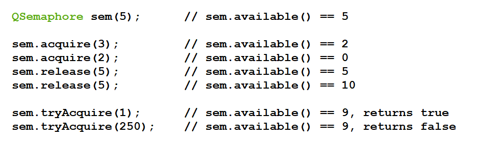

[toc]

# 1 事件

所有的事件触发以后，会关联一个事件处理函数。需要使用信号和槽取关联这个动作，只需要重写事件方法

## 1.1 QEvent

提供一个事件的基类。

```cpp
/* 头文件 */
#include <QEvent> 

/* qmake */
QT += core

/* 子类 */
QChildEvent, QDynamicPropertyChangeEvent, QStateMachine::SignalEvent, QStateMachine::WrappedEvent, QTimerEvent

/* 常用方法 */
/* 1.构造 */
QEvent::QEvent(QEvent::Type type)
```

## 1.2 QKeyEvent

提供一个键盘事件的类

```cpp
/* 头文件 */
#include <QKeyEvent> 

/* qmake */
QT += gui

/* 父类 */
QInputEvent


/* 常用方法 */
/* 1.构造 */
QKeyEvent::QKeyEvent(QEvent::Type type, 
                        int key, 
                        Qt::KeyboardModifiers modifiers, 
                        const QString &text = QString(), 
                        bool autorep = false, ushort count = 1)
QKeyEvent::QKeyEvent(QEvent::Type type, 
                        int key, 
                        Qt::KeyboardModifiers modifiers, 
                        quint32 nativeScanCode, 
                        quint32 nativeVirtualKey, 
                        quint32 nativeModifiers, 
                        const QString &text = QString(), 
                        bool autorep = false, 
                        ushort count = 1)

/* 事件 */
/* 1.按下事件 */
[virtual protected] void QWidget::keyPressEvent(QKeyEvent *event)
/* 2.松开事件 */
[virtual protected] void QWidget::keyReleaseEvent(QKeyEvent *event)
```

## 1.3 QMouseEvent

提供一个鼠标事件的类

```cpp
/* 头文件 */
#include <QMouseEvent> 

/* qmake */
QT += gui

/* 父类 */
QInputEvent


/* 常用方法 */
/* 1.构造 */
QMouseEvent(QEvent::Type type, 
                const QPointF &localPos, 
                Qt::MouseButton button, 
                Qt::MouseButtons buttons, 
                Qt::KeyboardModifiers modifiers)
QMouseEvent(QEvent::Type type, 
                const QPointF &localPos, 
                const QPointF &screenPos, 
                Qt::MouseButton button, 
                Qt::MouseButtons buttons, 
                Qt::KeyboardModifiers modifiers)
QMouseEvent(QEvent::Type type, 
                const QPointF &localPos, 
                const QPointF &windowPos, 
                const QPointF &screenPos, 
                Qt::MouseButton button, 
                Qt::MouseButtons buttons, 
                Qt::KeyboardModifiers modifiers)
QMouseEvent(QEvent::Type type, 
                const QPointF &localPos, 
                const QPointF &windowPos, 
                const QPointF &screenPos, 
                Qt::MouseButton button, 
                Qt::MouseButtons buttons, 
                Qt::KeyboardModifiers modifiers, 
                Qt::MouseEventSource source)


/* 事件 */
/* 1.双击事件 */
[virtual protected] void QWidget::mouseDoubleClickEvent(QMouseEvent *event)
/* 2.移动事件 */
[virtual protected] void QWidget::mouseMoveEvent(QMouseEvent *event)
/* 3.按下事件 */
[virtual protected] void QWidget::mousePressEvent(QMouseEvent *event)
/* 4.松开事件 */
[virtual protected] void QWidget::mouseReleaseEvent(QMouseEvent *event)
```

## 1.4 QWheelEvent

提供一个滚轮事件的类

```cpp
/* 头文件 */
#include <QWheelEvent> 

/* qmake */
QT += gui

/* 父类 */
QInputEvent

/* 常用方法 */
/* 1.构造 */
QWheelEvent::QWheelEvent(const QPointF &pos, 
                            const QPointF &globalPos, 
                            QPoint pixelDelta, 
                            QPoint angleDelta, 
                            int qt4Delta, 
                            Qt::Orientation qt4Orientation, 
                            Qt::MouseButtons buttons, 
                            Qt::KeyboardModifiers modifiers)


/* 事件 */
/* 1.滚动事件 */
[virtual protected] void QWidget::wheelEvent(QWheelEvent *event)
```

# 2 多线程

Qt下提供一个`QThread`的类来实现多线程编程。使用多线程的原因通常如下：

1. 为了提供CPU利用率
2. 为了解决界面内实现的耗时业务(一般采用定时器，或者信号和槽进行关联实现(使用一种类似于中断方式解决耗时业务))
3. 为了解决多个实时业务

一般实现特定的任务使用的是：重写run方法

## 2.1 QThread

```cpp
/* 头文件 */
#include <QThread> 

/* qmake */
QT += core

/* 父类 */
QObject


/* 常用方法 */
/* 1.构造 */
QThread::QThread(QObject *parent = nullptr)


/* 常用槽 */
/* 1.开始线程 */
[slot] void QThread::start(QThread::Priority priority = InheritPriority)
/* 2.退出线程 */
[slot] void QThread::quit()
```

## 2.2 QSemaphore

信号量

```cpp
/* 头文件 */
#include <QSemaphore> 

/* qmake */
QT += core

/* 父类 */
QObject

/* 常用方法 */
/* 1.构造 */
QSemaphore::QSemaphore(int n = 0)
/* 2.使用资源，参数是资源的个数 */
void QSemaphore::acquire(int n = 1)
/* 3.获取信号量的值 */
int QSemaphore::available() const
/* 4.释放资源，参数的资源的个数 */
void QSemaphore::release(int n = 1)
```

样例



# 3 Qt下的网络编程

## 3.1 QTcpSocket

提供一个通信套接字的类

```cpp
/* 头文件 */
#include <QTcpSocket> 

/* qmake */
QT += network

/* 父类 */
QAbstractSocket

/* 子类 */
QSctpSocket, QSslSocket


/* 常用方法 */
/* 1.构造 */
QTcpSocket::QTcpSocket(QObject *parent = nullptr)
/* 2.连接服务器 */
[virtual] void QAbstractSocket::connectToHost(const QString &hostName, 
                                                quint16 port, 
                                                QIODevice::OpenMode openMode = ReadWrite, 
                                                QAbstractSocket::NetworkLayerProtocol protocol = AnyIPProtocol)
[virtual] void QAbstractSocket::connectToHost(const QHostAddress &address, 
                                                quint16 port, 
                                                QIODevice::OpenMode openMode = ReadWrite)
/* 3.读数据 */
QByteArray QIODevice::read(qint64 maxSize)
QByteArray QIODevice::readAll()
/* 4.写数据 */
qint64 QIODevice::write(const char *data, qint64 maxSize)
qint64 QIODevice::write(const char *data)
qint64 QIODevice::write(const QByteArray &byteArray)
/* 5.获取对端信息 */
QHostAddress QAbstractSocket::peerAddress() const
quint16 QAbstractSocket::peerPort() const


/* 常用信号 */
/* 1.当有数据可读时，发送如下信号 */
[signal] void QIODevice::readyRead()
/* 2.当连接服务器成功时，发送如下信号 */
[signal] void QAbstractSocket::connected()
```

## 3.2 QTcpServer

提供一个Tcp服务器的类

```cpp
/* 头文件 */
#include <QTcpServer> 

/* qmake */
QT += network

/* 父类 */
QObject

/* 子类 */
QSctpServer

/* 常用方法 */
/* 1.构造函数 */
QTcpServer::QTcpServer(QObject *parent = nullptr)
/* 2.绑定监听 */
bool QTcpServer::listen(const QHostAddress &address = QHostAddress::Any, quint16 port = 0)
/* 3.接收客户端 */
[virtual] QTcpSocket *QTcpServer::nextPendingConnection()
/* 4.客户端发送者 */
[protected] QObject *QObject::sender() const

/* 常用信号 */
/* 1.当有客户端来连接时，发送如下信号*/
[signal] void QTcpServer::newConnection()
```

## 3.3 QHostAddress

| Constant                    | value | Description                                                  |
| :-------------------------- | ----- | ------------------------------------------------------------ |
| QHostAddress::Null          | 0     | The null address object. Equivalent to `QHostAddress()`. See also `QHostAddress::isNull()`. |
| QHostAddress::LocalHost     | 2     | The IPv4 localhost address. Equivalent to `QHostAddress("127.0.0.1")`. |
| QHostAddress::LocalHostIPv6 | 3     | The IPv6 localhost address. Equivalent to `QHostAddress("::1")`. |
| QHostAddress::Broadcast     | 1     | The IPv4 broadcast address. Equivalent to `QHostAddress("255.255.255.255")`. |
| QHostAddress::AnyIPv4       | 6     | The IPv4 any-address. Equivalent to `QHostAddress("0.0.0.0")`. A socket bound with this address will listen only on IPv4 interfaces. |
| QHostAddress::AnyIPv6       | 5     | The IPv6 any-address. Equivalent to `QHostAddress("::")`. A socket bound with this address will listen only on IPv6 interfaces. |
| QHostAddress::Any           | 4     | The dual stack any-address. A socket bound with this address will listen on both IPv4 and IPv6 interfaces. |

