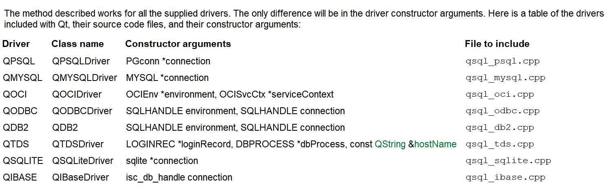

[toc]

# 1 数据库

## 1.2 Qt下sqlite3数据库操作流程

1. 打开数据库

   `QSqlDatabase::addDatabase()`指定数据库的类型

   

   `QSqlDatabase::setDatabaseName()`指定数据的文件

   `QSqlDatabase::open()`打开数据库

2. 对数据库的操作(执行sql语句)

   1. 非查询操作

      `QSqlQuery`类对象，`prepare(sql语句)`

      `QSqlQuery::exec()`

   2. 查询操作

      `QSqlQueryModel`

      `QSqlQueryModel::setQuery`

   3. 查询并显示结果

      `QTableView::setModel`

3. 使用结束

   `QSqlDatabase::close()`关闭数据库

## 1.2 QSqlDatabase

提供了通过连接访问数据库的接口

```cpp
/* 头文件 */
#include <QSqlDatabase> 

/* qmake */
QT += sql


/* 常用方法 */
/* 1.构造 */
QSqlDatabase::QSqlDatabase()
QSqlDatabase::QSqlDatabase(const QSqlDatabase &other)
[protected] QSqlDatabase::QSqlDatabase(const QString &type)
/* 2.指定数据库的类型 */
[static] QSqlDatabase QSqlDatabase::addDatabase(const QString &type, 
                                                    const QString &connectionName = QLatin1String(defaultConnection))
[static] QSqlDatabase QSqlDatabase::addDatabase(QSqlDriver *driver, 
                                                    const QString &connectionName = QLatin1String(defaultConnection))
/* 3.指定数据的文件 */
void QSqlDatabase::setDatabaseName(const QString &name)
/* 4.打开数据库 */
bool QSqlDatabase::open()
bool QSqlDatabase::open(const QString &user, const QString &password)
/* 5.关闭数据库 */
void QSqlDatabase::close()
```

## 1.3 QSqlQuery

提供一个执行和操作SQL语句的方法

```cpp
/* 头文件 */
#include <QSqlQuery> 

/* qmake */
QT += sql


/* 常用方法 */
/* 1.构造 */
QSqlQuery::QSqlQuery(QSqlResult *result)
QSqlQuery::QSqlQuery(const QString &query = QString(), QSqlDatabase db = QSqlDatabase())
QSqlQuery::QSqlQuery(QSqlDatabase db)
QSqlQuery::QSqlQuery(const QSqlQuery &other)
/* 2.非查询操作 */
bool QSqlQuery::prepare(const QString &query)
bool QSqlQuery::exec()
```

## 1.4 QSqlQueryModel

为SQL结果集提供了只读数据模型

```cpp
/* 头文件 */
#include <QSqlQueryModel> 

/* qmake */
QT += sql

/* 父类 */
QAbstractTableModel

/* 子类 */
QSqlTableModel


/* 常用方法 */
/* 1.构造 */
QSqlQueryModel::QSqlQueryModel(QObject *parent = nullptr)
/* 2.查询操作 */
void QSqlQueryModel::setQuery(const QSqlQuery &query)
void QSqlQueryModel::setQuery(const QString &query, const QSqlDatabase &db = QSqlDatabase())
```

## 1.5 QTableView

提供表视图的默认模型/视图实现

```cpp
/* 头文件 */
#include <QTableView> 

/* qmake */
QT += widgets

/* 父类 */
QAbstractItemView

/* 子类 */
QTableWidget

/* 常用方法 */
/* 1.构造 */
QTableView::QTableView(QWidget *parent = nullptr)
```