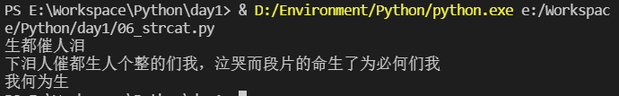

[toc]

# 1 Python特点

1. 易于学习
2. 易于维护
3. 一个广泛的标准库
4. 互动模式
5. 可移植
6. 可扩展
7. 数据库
8. GUI编程
9. 可嵌入

# 2 Python解释器的使用

1. 交互式解释python语句，在线，单步解释
2. python解释脚本

# 3 Python脚本

是按照一定的逻辑组织的python语句块写入的文件。python脚本都是以.py为后缀。python解释器只认.py后缀。

## 3.1 python的编写方法

1. 创建脚本文件  xxx.py

2. python中的注释

   解释器不会解释注释

   注释分为两类：

   - 单行注释

     以#为开头

   - 多行注释

     ```python
     '''
     	这里是多行注释
     '''
     
     """
     	这里是多行注释
     """
     ```

3. python中的语句和语句块

   python中的语句：

   以换行为结尾。如果一行写不完，可以使用续航符`\`来实现续行。

   python中的语句块：

   以冒号开始，以缩进来约束是否在同一层次上，在同一语句块内，这里面没有花括号`{}`

## 3.2 Python脚本的运行

python 脚本名

# 4 Python输入和输出

## 4.1 输入

```python
''' 将键盘输入的信息保存到变量name中 '''
name = input("请输入作者:")

if name == "老子":
    print("《老子五千言》")
elif name == "孔子":
    print("《论语》")
elif name == "司马迁":
    print("《史记》")
```

result


## 4.2 输出

```python
from threading import local


print("hello")
''' 默认换行输出，使用end则不换行输出 '''
print("world", end=" ")
print("yellow")
''' 批量化操作 '''
print("*" * 10)
print(6 + 7)
print((5 - 8))

''' 格式化输出1 '''
age = 18
print("demon_angel age is %d" % age)

''' 格式化输出2 '''
local = "陕西"
print("select * from user_info whrere age = %d and local = \'%s\'" % (age, local))
```

result


# 5 关键字

```python
import keyword 
print(keyword.kwlist)
print(len(keyword.kwlist))
```

result


## 5.1 关键字分类

```python
'False', 'None', 'True', 'and', 'as', 'assert', 'break', 'class', 'continue', 'def', 'del', 'elif', 'else', 'except', 'finally', 'for', 'from', 'global', 'if', 'import', 'in', 'is', 'lambda', 'nonlocal', 'not', 'or', 'pass', 'raise', 'return', 'try', 'while', 'with', 'yield'
```

1. bool类型

   ```python
   False, True
   ```

2. 代表0值

      ```python
      None
      ```

3. 逻辑关系

   ```python
   and, or, not
   ```

4. 导包使用

   ```python
   from, import, as
   ```

5. 断言

   ```python
   assert
   ```

6. 跳转语句

   ```python
   break, continue
   ```

7. 类的封装

   ```python
   class, finally, del
   ```

8. 函数定义

   ```python
   def, pass, lambda, return
   ```

9. 变量的修饰

   ```python
   global
   ```

10. 分支语句

    ```python
    if, else, elif
    ```

11. 循环语句

    ```python
    for, in, while
    ```

12. with语句

    ```python
    with
    ```

13. 异常

    ```python
    try, raise, except
    ```

# 6 三种基本结构

## 6.1 分支语句

```python
单分支:
    if 条件 :
        语句块
双分支:
    if 条件 :
        语句块1
    else:
        语句块2
多分支:
    只有if elif else
    if 条件1:
        语句块1
    elif 条件2:
        语句块2
    else:
        语句块3
```

## 6.2 循环语句

```
for循环：
    for 循环变量 in 循环变量的取值范围:
        循环体
while循环：
    定义一个循环变量并初始化
    while 循环条件:
        循环体
        循环变量的变化
```

```python
for i in range(1,10):
    for j in range(1, i + 1):
        print(i, '*', j, '=', j * i, end = "\t")
    print("")
```

```python
i = 1
while i < 10:
    y = 1
    while y < i + 1:
        print(i, '*', y, '=', y * i, end = "\t")
        y += 1
    i += 1
    print()
```

### 6.2.1 for/while实现死循环

#### 6.2.1.1 for

```python
import time
def count_n():
    return 1

for x in iter(count_n, 2):
    print(x)
```

#### 6.2.1.2 while

```python
while True:
    print(1)
```

## 6.3 跳转语句

```
break：跳出循环
continue：进入下一次循环
```

```python
mylist = [78, 34, 70, 56, 89, 43, 67]

for x in mylist:
    if x > 80:
        break
    else:
        print(x)

print("*" * 20)
for i in range(0,len(mylist)):
    if(mylist[i]) < 70:
        continue
    else:
        print(i,mylist[i])
```

result


# 7 数据类型

python中变量不需要声明。每个变量在使用前都必须赋值。变量赋值以后该变量才会被创建

在python中，变量就是变量，它没有类型，我们所说的“类型”是变量所指向的内存中对象的类型

等号`=`用来给变量赋值

等号`=`运算符左边是一个变量名，等号`=`运算符右边是存储在变量中的值

## 7.1 Python中的数据类型

- 数字类型（Number）
- 字符串类型（str）
- 列表（list）
- 元组（tuple）
- 字典（dict）
- 集合（set）

```python
a = 1
b = -3.24
c = '5'
d = "45"
e = True
f = [1, 2, 3, 4, 5]
g = ("tom", "jack", 2, 4, "rose")
h = {3, 7, 'a', 'n', 9}
i = {"姓名": "孙悟空", "官职": "弼马温", "师弟": {"猪八戒", "沙和尚"}}


''' type(变量名):求变量的类型 '''
print(a, type(a))
print(b, type(b))
print(c, type(c))
print(d, type(d))
print(e, type(e))
print(f, type(f))
print(g, type(g))
print(h, type(h))
print(i, type(i))
```


## 7.2 Python中数据类型的分类

1. ==不可更改==的数据类型(更改的是变量的值)

   数字类型

   字符串类型

   元组类型

2. 可更改的数据类型

   列表类型

   字典类型

   集合类型

## 7.3 Number数字类型

python3支持int、float、bool、complex(复数)

在python里，只有一种整数类型int，表示为长整型，没有python2里面的long

像大多数语言一样，数值类型的赋值和计算都是很直观的

==内置的type()函数可以用来查询变量所指的对象类型==

Number类型不能更改:==使用id(变量名)，查看变量地址==，会发现，变量的地址发生了变化。而原本地址指向的内存空间的内容并没有发生变化。

```python
a = 24
print(a, id(a))
a = 45
print(a, id(a))
a = 88
print(a, id(a))
```


### 7.3.1 数字类型的操作

|操作|符号|
| :----: | :----: |
|加|`+`|
|减|`-`|
|乘|`*`|
|整除|`//`|
|带小数点的除|`/`|
|取余数|`%`|
|指数|`**`|

## 7.4 String(字符串)

字符串，以`''`或者`""`引起来的数据，字符串不能更改

### 7.4.1 定义

```python
str1 = "hello"
str2 = 'world'
```

### 7.4.2 字符串遍历

```python
s  = "天行健，君子以自强不息；地势坤，君子以厚德载物"
''' 
    for循环实现的依次遍历字符串的每一个元素
    in后面跟一个枚举的范围
'''
for x in s:
    print(x)
'''
    range()会生成一个范围
    len(变量名)是元素个数/字节数
'''
for i in range(0, len(s)):
    print(i, s[i])
```


### 7.4.3 字符串截取

遵循左闭右开原则

截取时永远不包括stop下标的元素,这样的规则,我们称之为左闭右开

```python
"""
	字符串名[start:stop:step]
	start:起始位置下标(包含下标元素位置元素)
	stop:终止位置下标(不包含下标位置元素)
	step:步长(默认为1),>0:从左往右,<0:从右往左
"""
```

```python
s = "我们何必为了生命的片段而哭泣，我们的整个人生都催人泪下"

''' 
    字符串有两个坐标，
        从左往右看下标就是0 1 2 3 4 ...
        从右往左看下标就是-1 -2 -3 -4 -5 ...
'''

''' 从倒数第六个元素开始，打印从倒数第六个元素到最后的元素值 '''
print(s[-6:-1])
''' 从最后一个元素开始，从右往左打印，逆序 '''
print(s[-1::-1])
''' 从第0个元素开始，到第8个元素结束(不包括第八个元素)，每隔2个元素打印一个元素 '''
print(s[0:8:2])
```



### 7.4.4 字符串操作


#### 7.4.4.1 删除字符

```python
"""
	strip():删除字符串两边的空格
	rstrip():删除字符串右边的空格
	lstrip():删除字符串左边的空格
"""
"""
	如果括号中有参数，就是删除字符串中的字符，如果是字符串会删除字符串中的每一个字符
"""
```

#### 7.4.4.2 拼接 

加号运算符就可以实现，只不过，两个字符串相加，不是我们理解的strcat，而是将两个字符串内容拼接，生成一个新的字符串。

==假拼接，弄了一个新的字符串==

```python
str1 = "王阳明"
str2 = "龙场悟道"

print(str1, id(str1))
str3 = str1 + str2
print(str3, id(str3))

str1 += str1
print(str1, id(str1))
```


#### 7.7.4.3 字符串格式转换

```python
"""
    capitalized():将字符串第一个单词的首字母大写
    title():将字符串所有单词的首字母大写
    upper():所有字母大写
    lower():所有字母小写
"""
```

#### 7.7.4.4 判断字符串的格式

```python
"""
    startswith(子串1)：判断字符串是否以子串1为开头，返回值为bool类型，真返回True，假返回False
    endswith(子串1)：判断字符串是否以子串1为结尾，返回值为bool类型，真返回True，假返回False
    istitle():判断字符串是不是title格式，返回值为bool类型，真返回True，假返回False
    isupper():判断字符串是不是upper格式，返回值为bool类型，真返回True，假返回False
    islower():判断字符串是不是lower格式，返回值为bool类型，真返回True，假返回False
    isnumerica():判断字符串是不是非负整数格式，如果是，则返回True，不是返回False
"""
```

#### 7.7.4.5 字符串到数字的转换

字符串到数字的转换，使用的是**==类型的构造方法==**

```python
"""
    int(字符串)：将字符串换行为整数
    float(字符串)：将字符串转换为实数
"""
```

#### 7.7.4.6 字符串查找

```python
"""
    find(子串1):从左往右查找子串1，如果找到，返回第一个出现的起始位置下标，失败返回-1
    rfind(子串1):从右往左查找子串1，如果找到，返回第一个出现的起始位置下标，失败返回-1
    index(子串1):从左往右查找子串1，如果找到，返回第一个出现的起始位置下标，失败抛异常
    rindex(子串1):从右往左查找子串1，如果找到，返回第一个出现的起始位置下标，失败抛异常
"""
```

#### 7.7.4.7 字符串分割

```python
"""
    split():字符串切割
    splitline():字符串按行切割
"""
```

#### 7.7.4.8 将list转换为字符串

**==只能将纯字符的list转换为字符串==**

```python
"""
	join():list转字符串
"""
```

#### 7.7.4.9 字符串替换

```python
"""
	replace():字符串替换
"""
```

```python
''' 
str1 = "王阳明"
str2 = "龙场悟道"

print(str1, id(str1))
str3 = str1 + str2
print(str3, id(str3))

str1 += str1
print(str1, id(str1)) 
'''

st = "刘备：备欲同你二人结拜为生死弟兄，不知二位意下如何？       \
        张飞：俺早有此意！三人一条心，黄土变成金。有你带着俺，大事定能成功啊！  \
        关羽：关某虽一介武夫，亦颇知忠义二字。正所谓择木之禽得其良木，择主之臣得遇明主，  \
			关某平生之愿足矣。从今往后，关某之命即是刘兄之命，关某之躯即为刘兄之躯，但凭驱使，绝无二心！ \
        张飞：俺也一样！ \
        关羽：某誓与兄患难与共，终身相伴，生死相随！ \
        张飞：俺也一样！ \
        关羽：有渝此言，天人共戮之！ \
        张飞：俺也一样"

print(st.find("武夫"))
print(st[94])
print(st.rfind("终身"))
print(st[210])
# 不存在会报错
# print(st.find("巴基斯坦"))
# print(st.rfind("印度"))

print(st.index("武夫"))
print(st.rindex("终身"))
# 不存在会报错
# print(st.index("巴基斯坦"))
# print(st.rindex("印度"))


s = "log:zhangfei001:zf1234"
l = s.split(':')
print(l,type(l))

print("-" * 120)

dgql = "白日依山尽\n黄河入海流\n欲穷千里目\n更上一层楼\n"
nn = dgql.splitlines()
print(nn, len(nn))

print("-" * 120)

'''
    以下方法，只能将纯字符的list转换为字符串
'''
myl = ['h','e','l','l','o',' ','w','o','r','l','d','!']
ns = ''.join(myl)
print(ns,type(ns))

print("-" * 120)

mycon = "刘备：备欲同你二人结拜为生死弟兄，不知二位意下如何？       \
            张飞：俺早有此意！三人一条心，黄土变成金。有你带着俺，大事定能成功啊！  \
            关羽：关某虽一介武夫，亦颇知忠义二字。正所谓择木之禽得其良木，择主之臣得遇明主，  \
				关某平生之愿足矣。从今往后，关某之命即是刘兄之命，关某之躯即为刘兄之躯，但凭驱使，绝无二心！ \
            张飞：俺也一样！ \
            关羽：某誓与兄患难与共，终身相伴，生死相随！ \
            张飞：俺也一样！ \
            关羽：有渝此言，天人共戮之！ \
            张飞：俺也一样"
print(mycon)
print("*" * 120)
ns = mycon.replace("张飞","张萌萌")
print(ns)
```

result


## 7.5 list

python提供一个类似于(void *的指针)数组。，它是一个迭代器(即类似于数组，是序列化的)

### 7.5.1 定义

```python
listm = [1, 2, 3, 3.2, 'a', ['h', 'b', 'c'], ('aa', 'jack')]
```

在初始化list时，使用`[]`包含所有元素，元素之间使用逗号隔开，元素类型没有要求，list可以嵌套。==**list大小是不固定的**==，

==**list是可以更改的**==

```python
myhero = ['兰陵王','李白','韩信','澜','镜']
print(myhero, type(myhero),id(myhero))
i = 0
'''
    len():只能求(字符串，列表，元组)的元素个数
'''
print(len(myhero))
''' while循环的格式 '''
while i < len(myhero):
    print(myhero[i])
    i += 1

myhero[3] = ['鲁班七号','黄忠','孙尚香','公孙离','马可波罗','百里守约']
print(myhero,id(myhero))
```

result


### 7.5.2 操作

```python
''' 求list的元素个数 '''
len()
''' 访问list指定下标的成员 '''
list名字[index]
''' 排序 '''
sort()
''' sort()参数 '''
"""
	reverse:这个参数指定排序的方式，默认为False：代表升序
    	设置为True:则代表降序
"""
```

#### 7.5.2.1 截取

遵循左闭右开原则

截取时永远不包括stop下标的元素,这样的规则,我们称之为左闭右开

```python
"""
	list名[start:stop:step]
	start:起始位置下标(包含下标元素位置元素)
	stop:终止位置下标(不包含下标位置元素)
	step:步长(默认为1),>0:从左往右,<0:从右往左
"""
```

```python
myl = ['Jack',"Rose","Nicke","Tom","Marray","Janne"]

print(myl[::])
print(myl[-1::-1])
print(myl[-1::-2])
```

result


#### 7.5.2.2 插入

```python
'''
    append(插入的元素):追加
    insert(插入的下标位置,插入的元素):插入
'''
```

```python
l = []
l.append(['亚瑟'])
l.append(["克莱迪"])
print(l)

l.insert(0,["后羿"])
print(l)

l[0].append("鲁班七号")
print(l)
```

result


#### 7.5.2.3 删除

```python
"""
	remove(想要删除的元素的值):删除第一个值为被删除值的元素
	pop()删除最后一个元素
"""
```

```python
nl = ['关羽',"张飞","刘备","关羽"]
print(nl)
nl.remove("关羽")
print(nl)
nl.remove("关羽")
print(nl)
nl.pop()
```

result


#### 7.5.2.4 个数统计、清空

```
count(value):统计value这个值在list中出现的次数
clear():清空list
```

```python
ss = ['武大郎','西门庆','宋江','卢俊义','林冲','王英','武大郎','武大郎']
print(ss.count('武大郎'))
print(ss)
ss.clear()
print(ss)
```

result


## 7.6 tuple

python提供一个==**不可修改的序列化的数据类型**==。一般用来做函数返回值。

==**元组是不可更改的数据类型**==

### 7.6.1 定义

```python
mytuple = (3, 'hello', [1, 2, 3], (7, 8, 9))
```

### 7.6.2 元组的操作

1. 元组元素的截取，同字符串和list的截取
2. 统计某一元素的出现次数:count
3. 查找某一元素所在的位置:index

```python
''' 
    不能直接更改元组元素的值
    但是如果元组元素是可以更改的数据类型
    则可以更改元组元素的元素的内容
    （前提是元组元素是可以更改的，比如元组中有一个list，那么list中的元素是可以更改的） 
    元组类似于一个void *const p[]数组
'''

myt = (2, 3, 4, [8, 3.14, 'jack'], "堂吉诃德", ("Harrey", "Jerry", "Tom"))
print(myt, type(myt))
myt[3][0] = "hello"
print(myt)

print(myt[2::-1])
print(myt.index(("Harrey", "Jerry", "Tom")))
print(myt.index(4))

myt = (1, 3, 4, 5, 6, 3, 2, 1, 4, 3, 3)
print(myt.count(3))
```

result


## 7.7 dict

python提供一种基于键值对的数据类型，我们称之为字典，==键必须是不可更改的类型==

### 7.7.1 定义

```python
bianq = {
    '姓名':"扁鹊",
    "性别":"男",
    "别称":["毒王", "奶爸"],
    "路线":("中路", "游走", "坦克"),
    "角色":"法师",
    "技能":("善恶诊断", "致命灵药", "生命主宰")
}

myheros = {
    '坦克': ["亚瑟", "凯", "程咬金", "猪八戒", "项羽", "吕布"],
    '法师': ["安琪拉", "米莱迪", "扁鹊", "甄姬", "妲己"],
    '射手': ["鲁班七号", "黄忠", "后羿", "孙尚香", "马可波罗", "虞姬", "百里守约"],
    '刺客': ["兰陵王", "孙悟空", "云中君", "李白", "韩信"],
    '辅助': ["庄周", "刘婵", "孙膑", "盾山"]
}
```

### 7.7.2 字典的操作

1. 键值的添加

   ```python
   字典变量名[新的键] = value
   ```

2. 键值的删除

   ```python
   pop(键)
   ```

3. 键值的更改

   ```
   字典变量名[键] = new value
   ```

4. 键值的查找

   ```python
   字典变量名[键]
   ```

```python
bianq = {
    '姓名':"扁鹊",
    "性别":"男",
    "别称":["毒王", "奶爸"],
    "路线":("中路", "游走", "坦克"),
    "角色":"法师",
    "技能":("善恶诊断", "致命灵药", "生命主宰")
}

print("_" * 40)
''' 查找 '''
print(bianq["别称"])
print("-" * 40)
''' 添加 '''
bianq["压制英雄"] = ("妲己", "东皇太一")
print(bianq)
print("=" * 40)
''' 删除 '''
bianq.pop("角色")
print(bianq)
print("*" * 40)
''' 更改 '''
bianq["性别"] = "女"
print(bianq)
```

result


```python
from glob import glob
from json import load
import pickle
from turtle import pen

''' 定义一个列表表存储每位英雄的信息 '''
hero_info_list = []

def menu():
    print("-" * 50)
    print("\tWelcome to hero management system")
    print("\t\t1\t增加英雄")
    print("\t\t2\t查找英雄")
    print("\t\t3\t所有英雄")
    print("\t\t4\t删除英雄")
    print("\t\t5\t修改英雄")
    print("\t\t6\t退出程序")
    print("-" * 50)

''' 插入英雄函数 '''
def insert_hero_info():
    global hero_info_list
    #定义一个存储英雄信息的字典
    ''' hero = {'名字', '身份', '路线'} '''   #error
    hero = {}
    hero['名字'] = input("please input the hero name\t")
    hero['身份'] = input("please input the hero identity\t")
    hero['路线'] = input("please input the hero route\t")
    #将英雄的信息存入字典，追加到全局的顺序表中 
    hero_info_list.append(hero)
    print("insert hero success")

''' 查找英雄函数 '''
def search_hero_info():
    global hero_info_list
    flag = -1
    name = input("please input a hero is need to be searched\t")
    for hero in hero_info_list:
        if(hero['名字'] == name):
            print("current hero info is:\t")
            print(hero)
            print("current hero index is:\t")
            index = hero_info_list.index(hero)
            print(index)
            flag += 1
    if(-1 == flag):
        print("can not find this hero")
        #返回查找是否成功的结果，和查找到的英雄下标
        return "not exist", -1
    return "this hero is exist in the list", flag

""" 显示所有英雄 """
def show_all_heros():
    global hero_info_list
    for i in hero_info_list:
        print(i)

''' 删除英雄函数 '''
def delete_hero_info():
    global hero_info_list
    result,index = search_hero_info()
    if result == "this hero is exist in the list":
        hero_info_list.pop(index)
        print("delete current hero success")
    else:
        print("this hero is not exist in this list, can not delete")


''' 修改英雄信息'''
def alter_hero_info():
    global hero_info_list
    #先查找，再修改
    result, index = search_hero_info()
    if result == "this hero is exist in the list": #如果查找到了
        print("current hero info is:",hero_info_list[index].keys()) #取出该英雄的键值
        olddata = input("please input item to be modified:")
        newdata = input("plesase input new data:")
        hero_info_list[index][olddata] = newdata
        print("alter hero info success")
    else: #如果没找到
        print("current hero is not exist in the list")

""" savedata """
def save_data():
    global hero_info_list
    f = open("myhero.pkl", "wb")
    pickle.dump(hero_info_list, f, -1)
    f.close()

""" loaddata """
def load_data():
    global hero_info_list
    f = open("myhero.pkl",'rb')
    hero_info_list = pickle.load(f)
    f.close()

''' main函数 '''
def opt_hero_info():
#if __name__ == "__main__":
    load_data()

    while True:  #循环处理业务
        menu()
        op = input("please input you choice\t")
        if op == "1":
            insert_hero_info()
        elif op == "2":
            search_hero_info()
        elif op == "3":
            show_all_heros()   
        elif op == "4":
            delete_hero_info()             
        elif op == "5":
            alter_hero_info()
        elif op == "6":
            save_data()
            break
        else:
            print("please input correct option")
    print("好再来")
```

## 7.8 set

集合是一个无序的不重复的元素序列。

可以使用大括号`{}`或者`set()`函数创建集合。

注意：
创建一个空集合必须用`set()`而不是`{}`，因为`{}`是用来创建一个空字典

### 7.8.1 定义

```python
parame = {value01, value02, value03, ...}
或者
set(value)
'''
	value:只能是字符串,集合会将字符串拆开
'''
```

==**集合可以自动去除值相同的数据项**==

```python
''' 集合可以自动去除值相同的数据项 '''
baskset =  {'apple', 'orange', 'apple', 'pear', 'orange', 'banana'}
print(baskset)
''' 快速判断元素是否在集合内(属于关系) '''
print('orange' in baskset)
print('crabgrass' in baskset)
```

result


### 7.8.2 集合的操作

#### 7.8.2.1 添加元素

```python
"""
	s.add(x)	#将元素x添加到集合s中，如果元素已经存在，则不进行任何操作
	s.update(x)	#也可以添加元素，且参数可以是列表，元组，字典等
"""
```

#### 7.8.2.2 移出元素

```python
"""
	s.remove(x)		#将元素x从集合s中移出，如果元素不存在，则会发生错误
	s.discard(x)	#这个也可以
	s.pop()			#随机删除集合中的一个元素
					#set集合的pop方法会对集合进行无序的排列，然后将这个无序的排列集合的左面第一个元素进行删除
"""
```

#### 7.8.2.3 计算集合元素个数

```python
len(s)
```

#### 7.8.2.4 清空集合

```python
s.clear()
```

#### 7.8.2.5 判断元素是否在于集合中

```python
x in s 			
#判断元素x是否在集合s中，存在返回True，不存在返回Flase
```

```python
mys = {'妲己','花木兰','钟无艳','王昭君','貂蝉','芈月'}
mms = {'王昭君','貂蝉','妲己','西施','杨玉环','不知火舞','艾琳'}

print(mys)
print(mms)
''' 添加 '''
mys.add('嫦娥')
mms.add('安琪拉')
print(mys)
''' 删除，随机删除 '''
mys.pop()
print(mys)
```

result


```python
mys = {'妲己','花木兰','钟无艳','王昭君','貂蝉','芈月'}
mms = {'王昭君','貂蝉','妲己','西施','杨玉环','不知火舞','艾琳'}


''' mys相对于mms的补集 '''
print(mys - mms)
''' mys与mms的并集 '''
print(mys | mms)
''' mys与mms的交集 '''
print(mys & mms)
''' mys与mms的并集 - 交集 '''

''' 删除指定元素 '''
mms.remove("杨玉环")
print(mms)

''' 删除指定元素 '''
mms.discard("西施")
print(mms)

mys.update(['妇好', '穆桂英', '樊梨花', '梁红玉', '秋瑾'])
print(mys)

''' 判断元素在不在集合中 '''
print("武则天" in mys)
```

result


==**字符串，list，dict，元组是使用频率较高的数据类型**==
