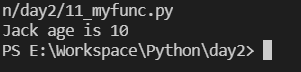
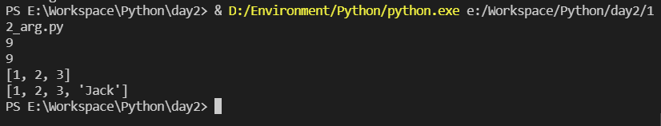
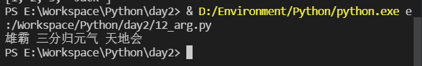
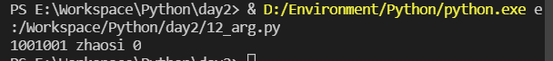
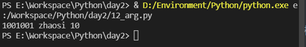
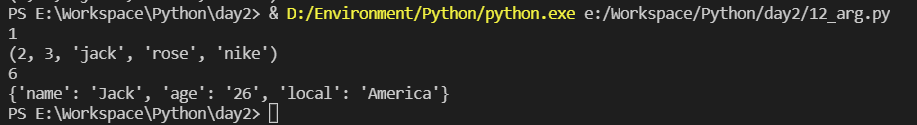
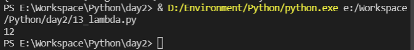
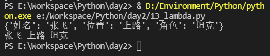
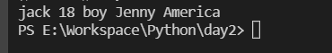

[Toc]

# 1 函数

函数是组织好的，可重复使用的，用来实现单一或相关联功能的代码段。函数能提高应用的模块性，和代码的重复利用率。你已经知道Python提供了许多内建函数，比如print()。但你也可以自己创建函数，这被叫做用户自定义函数。

## 1.1 定义

自定义函数，规则如下：

- 函数代码块以 def 关键词开头，后接函数标识符名称和圆括号 ()。
- 任何传入参数和自变量必须放在圆括号中间，圆括号之间可以用于定义参数。
- 函数的第一行语句可以选择性地使用文档字符串—用于存放函数说明。
- 函数内容以冒号 : 起始，并且缩进。
- return [表达式] 结束函数，选择性地返回一个值给调用方，不带表达式的 return 相当于返回 None。

## 1.2 语法

Python 定义函数使用 def 关键字，一般格式如下

```python
def 函数名(参数列表):
    	函数体
```

==**默认情况下，参数值和参数名称是按函数声明中定义的顺序匹配起来的**==

```python
'''
    定义一个函数名为mytest
    函数有两个参数:name和age
    函数功能:输出指定字符串
'''

def mytest(name, age):
    print("%s age is %d" % (name, age))

''' 
    if __name__ == "__main__":
        # 使用pass是因为主函数为空内容，防止报错
        pass
'''

if __name__ == "__main__":
    ''' 函数调用 '''
    mytest("Jack", 10)
```

result



## 1.3 函数调用

`接收返回值的变量 = 函数名(参数列表)`

## 1.4 参数传递

在 python 中，类型属于对象，对象有不同类型的区分，变量是没有类型的：

```python
a = [1,2,3]
a = "Runoob"
```

以上代码中，[1,2,3] 是`List`类型，"Runoob" 是`String`类型，而变量a是没有类型，她仅仅是一个对象的引用（一个指针），可以是指向`List`类型对象，也可以是指向`String`类型对象。

### 1.4.1 可更改(mutable)与不可更改(immutable)对象

在python中，`strings`, `tuple`, 和 `numbers`是不可更改的对象，而 `list,dict`等则是可以修改的对象。

不可变类型：变量赋值 a=5 后再赋值 a=10，这里实际是新生成一个 int 值对象 10，再让 a 指向它，而 5 被丢弃，不是改变 a 的值，相当于新生成了 a。

可变类型：变量赋值 la=[1,2,3,4] 后再赋值 la[2]=5 则是将 list la 的第三个元素值更改，本身la没有动，只是其内部的一部分值被修改了。

### 1.4.2 python中的参数传递

==**不可变类型**==：类似C++的值传递，如==**整数、字符串、元组**==。如 mfun(a),传递的只是a的值，没有影响a对象本身。如果在mfun(a)内部修改a的值，则是新生成一个a的对象。

==**可变类型**==：类似C++的引用传递，如==**列表，字典**==。如myfun(a)，则是将a真正的传过去，修改后myfun外部的a也会受影响

python中一切都是对象，严格意义我们不能说值传递还是引用传递，==**我们应该说传不可变对象和传可变对象**==。

[参数传递](#参数传递)

## 1.5 参数

以下是调用函数时可使用的正式参数类型：

- 必需参数
- 关键字参数
- 默认参数
- 不定长参数

### 1.5.1 必需参数

必需参数须以正确的顺序传入函数。调用时的数量必须和声明时的一样。

<a  name = "参数传递"></a>

```python
def mfun(a):
    a = 6

def myfun(a):
    a.append("Jack")

if __name__ == "__main__":
    a  = 9
    b = [1, 2, 3]
    print(a)
    ''' 不可变参数传递 '''
    mfun(a)
    print(a)
    print(b)
    ''' 可变参数传递 '''
    myfun(b)
    print(b)
```



### 1.5.2 关键字参数

关键字参数和函数调用关系紧密，函数调用使用关键字参数来确定传入的参数值。

使用关键字参数允许函数调用时参数的顺序与声明时不一致，因为 Python 解释器能够用参数名匹配参数值。

```python
def myfun(name, skill, local):
    print(name, skill, local)

myfun(skill = "三分归元气", local = "天地会", name = "雄霸")
```

result



### 1.5.3 默认参数

调用函数时，如果没有传递参数，则会使用默认参数。

```python
def init_card(id, passwd, value = 0):
    print(id, passwd, value)

# init_card("1001001", 'zhaosi')
init_card("1001001", 'zhaosi', 10)
```

result





### 1.5.4 不定长参数

需要以一个函数处理比当初声明时更多的参数。这些参数叫做不定参数。和关键字参数和默认参数不同，声明时不会命名。

加了星号`*`的参数会以元组(tuple)的形式导入，存放所有未命名的变量参数。

如果在函数调用时灭有指定参数，他就是一个空元组，我们也可以不像函数传递未命名的变量。

加了两个星号`**`的参数会以字典的形式导入。

声明函数时，参数中星号`*`可以单独出现，如果单独出现星号`*`后的参数必须用关键字传入

```python
''' 以元组形式存储不定参 '''

def myf(na, *varp):
    print(na)
    print(varp)

myf(1, 2, 3, "jack", "rose", "nike")
''' 以字典的形式存储不定参数 '''

def mnf(na, **varp):
    print(na)
    print(varp)

mnf(6, name="Jack", age="26", local="America")
```

result



## 1.6 匿名函数

Python 使用lambda来创建匿名函数。所谓匿名，意即不再使用def语句这样标准的形式定义一个函数。lambda只是一个表达式，函数体比def简单很多。

lambda的主体是一个表达式，而不是一个代码块。仅仅能在lambda表达式中封装有限的逻辑进去。

lambda函数拥有自己的命名空间，且不能访问自己参数列表之外或全局命名空间里的参数。

虽然lambda函数看起来只能写一行，却不等同于C或C++的内联函数，后者的目的是调用小函数时不占用栈内存从而增加运行效率。

```python
mymulti = lambda arg1,arg2 : arg1 * arg2
print(mymulti(3,4))
```

result



## 1.7 return语句

`return[表达式]`语句用于退出函数，选择性地向调用方返回一个表达式。不带参数值的return语句返回None。

```python
myh = {
    '姓名':'张飞',
    '位置':'上路',
    '角色':'坦克'
}

def get_info(hero):
    return hero['姓名'],hero['位置'],hero['角色']

def mytest():
    global myh
    print(myh)


if __name__ == "__main__":
    mytest()
    na, local, js = get_info(myh)
    print(na,local,js)
```

result



## 1.8 强制位置参数

Python3.8 新增了一个函数形参语法`/`用来指明函数形参必须使用指定位置参数，不能使用关键字参数的形式。

在以下的例子中，形参 a 和 b 必须使用指定位置参数，c 或 d 可以是位置形参或关键字形参，而 e 和 f 要求为关键字形参:

```python
def f(a, b, /, c, d, *, e, f):
    print(a, b, c, d, e, f)
''' 使用正确 '''
f(10, 20, 30, d=40, e=50, f=60)
''' 使用错误 '''
f(10, b=20, c=30, d=40, e=50, f=60)   # b 不能使用关键字参数的形式
f(10, 20, 30, 40, 50, f=60)           # e 必须使用关键字参数的形式
```

```python
def mytest1(name,age,sex,friend,*,local):
    print(name,age,sex,friend,local)
if __name__ == "__main__":
    mytest1("jack",age=18,friend="Jenny",sex="boy",local="America")
```

result

