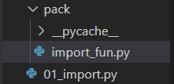
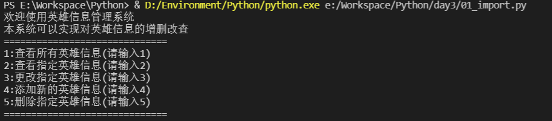
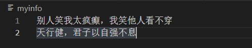
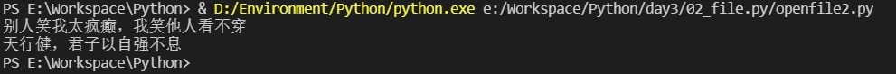
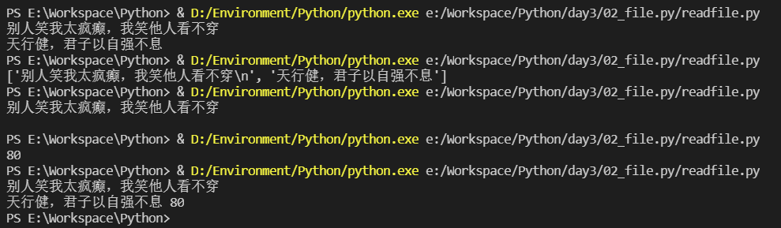
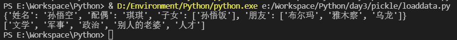
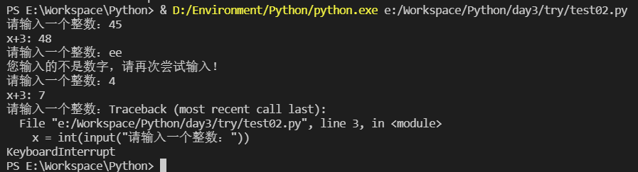

[Toc]

# 1 python包

## 1.1 安装

```bash
pip install 包名
pip install 包名 -i 安装源
```

## 1.2 检查安装是否成功

```bash
pip list
```

# 2 打包

打包类似于shell中的脚本封装，然后实现脚本调用脚本，它可以将其他脚本中的函数或者变量，导入在一个脚本中使用，这样就能够提高脚本的研发速度，提高代码复用率。==**包也是python脚本**==，只不过可以导入而已。

## 2.1 打包过程

就是将一系列的接口放入同一个脚本中的过程

# 3 导包

导包是将一个脚本中指定的内容导入到另一个脚本中使用的过程。

## 3.1 导包的方法

|格式|含义|
| :----: | :------: |
|import *|导入所有|
|from xxxx import xxx|从xxxx路径/文件名导入xxxx|
|from xxxx import xxxx as xx|从xxxx路径/文件名导入xxxx内容并重命名为xx，在调用脚本中，只能使用重命名的名字|
|import xxx|直接导包|
|import xxx as xx|直接导包，将导入内容xxx内容并重命名为xx|

### 3.1.1 `from xxxx import xxx`

#### 3.1.1.1 目录结构



```python
def init_myapp():
    print("欢迎使用英雄信息管理系统")
    print("本系统可以实现对英雄信息的增删改查")

def show_menu():
    print("="*30)
    print("1:查看所有英雄信息(请输入1)")
    print("2:查看指定英雄信息(请输入2)")
    print("3:更改指定英雄信息(请输入3)")
    print("4:添加新的英雄信息(请输入4)")
    print("5:删除指定英雄信息(请输入5)")
    print("="*30)
```

```python
from pack.myhero import *

if __name__ == "__main__":
    init_myapp()
    show_menu()
```

result



### 3.1.2 `import xxx`

```python
import tkinter

root = tkinter.Tk()
root.mainloop()
```

### 3.1.3 `import xxx as xx`

```python
import tkinter as tkf

root = tkf.Tk()
root.mainloop()
```

# 4 文件操作

## 4.1 读取键盘输入

input

## 4.2 打开文件 - open()

```python
''' 函数 '''
open(filename, mode)

"""
	功能：
		返回一个file对象
	参数：
		filename：包含你要访问的文件名称的字符串值
		mode：决定了打开文件的模式：只读，写入，追加等。
"""
```

mode参数是非强制给的，默认文件访问模式为：

|    模式    |  r   |  r+  |  w   |  w+  |  a   |  a+  |
| :--------: | :--: | :--: | :--: | :--: | :--: | :--: |
|     读     |  +   |  +   |      |  +   |      |  +   |
|     写     |      |  +   |  +   |  +   |  +   |  +   |
|    创建    |      |      |  +   |  +   |  +   |  +   |
|    覆盖    |      |      |  +   |  +   |      |      |
| 指针在开始 |  +   |  +   |  +   |  +   |      |      |
| 指针在末尾 |      |      |      |      |  +   |  +   |

## 4.3 写文件 - write()

```python
''' 函数 '''
write(string)
"""
	功能：
		将string写到文件中
	参数：
		string:要写入的内容
	返回值：
		返回写入的字符数
"""
```

```python
f  = open("myinfo", 'w', encoding="utf-8")
f.write("别人笑我太疯癫，我笑他人看不穿\n")
f.write("天行健，君子以自强不息")
f.close()
```

result



==**如果要写入一些不是字符串的东西，那么将需要先进行转换**==

```python
f = open("myfile.txt", "a+", encoding='utf-8')
dic = {
    "境内": {
        "累计确诊病例": 82724,
        "较上日新增": "未更新",
        "现存确诊": 2944
    },
    "境外": {
        "累计确诊病例": 852903,
        "较上日新增": 61778,
        "现存确诊": 691771
    },
}

str = str(dic)
f.write(str)
f.close()
```

result

```
{'境内': {'累计确诊病例': 82724, '较上日新增': '未更新', '现存确诊': 2944}, '境外': {'累计确诊病例': 852903, '较上日新增': 61778, '现存确诊': 691771}}
```

## 4.4 读文件 - read()

### 4.4.1 read()

```python
''' 函数 '''
read(size)
"""
	功能：
		从文件中读取信息
	参数：
		size:如果要读取一定数目的数据，然后作为字符串或者字节对象返回。
		size是要给可选的数字类型的参数，当size被忽略了或者为负，那么该文件的
		左右内容都将被读取并且返回。
	返回值：
		读取的文件内容
"""
```

### 4.4.2 readline()

```python
''' 函数 '''
readline()
"""
	readline()会从文件中读取单独的一行。换行符为"\n"。
	readline()如果返回一个空字符串，说明已经读取到最后一行。
"""
```

### 4.4.3 readlines()

```python
''' 函数 '''
readlines()
"""
	将返回该文件中包含的所有行。
	如果设置可选参数sizehint，则读取指定长度的字节，并且经这些字节按行分割。
"""
```

### 4.4.4 通过迭代一个文件对象，然后读取每行

```python
f = open("myinfo", 'r', encoding="utf-8")
for line in f:
    print(line,end="")
f.close()
```

result



==**不建议使用迭代这种方法**==

## 4.5 关闭文件 - close()

```python
''' 函数 '''
close()
"""
	在文本文件中，那些打开文件的模式下没有b的，指挥先对于文件起始位置进行定位。
	当你处理完一个文件后，调用close()来关闭文件并释放系统的资源，如果尝试再调用该文件，则会抛出异常。
	当处理一个文件对象时, 使用with关键字是非常好的方式。在结束后, 它会帮你正确的关闭文件。
"""
```

## 4.6 定位

### 4.6.1 tell()

```python
''' 函数 '''
tell()
"""
	返回文件对象当前所处的位置，它是从文件开头开始算起的字节数。
"""
```

### 4.6.2 seek()

```python
''' 函数 '''
seek(offset, from_what)
"""
	功能：
		改变文件当前的位置
	参数：
		from_what的值：
			0：表示文件开头
			1：表示当前位置
			2：表示文件的结尾
	返回值：
		范围内的文件内容
	seek(x,0) ： 从起始位置即文件首行首字符开始移动 x 个字符
	seek(x,1) ： 表示从当前位置往后移动x个字符
	seek(-x,2)： 表示从文件的结尾往前移动x个字符 
	from_what值默认为0，即文件开头。
"""
```

```python
with open("myinfo",'r',encoding="utf-8") as f:
    con = f.read()
    # con = f.readlines()
    # con = f.readline()
    # con = f.seek(0,2)
    wz = f.tell()
    print(con, wz)
```

result



# 5 pickle模块

python的pickle模块实现了基本的数据==**序列和反序列化**==。
通过pickle模块的序列化操作我们能够将程序中运行的对象信息保存到文件中去，==**永久存储**==。
通过pickle模块的反序列化操作，我们能够从文件中创建上一次程序保存的对象。

## 5.1 基本接口

```python
"""
	pickle.dump(obj,file,[protocol])	：有了pickle这个对象，就能对file以读取得形式打开
	x = pickle.load(file)
	注解：从 file 中读取一个字符串，并将它重构为原来的python对象。
	file: 类文件对象，有read()和readline()接口。
"""
```

## 5.2 dump()

```python
import pickle 
l = [
    {
        '姓名':'孙悟空',
        '配偶':'琪琪',
        '子女':['孙悟饭'],
        '朋友':['布尔玛','雅木察','乌龙']
    },
    {
        '姓名':'曹操',
        '爱好':['文学','军事','政治','别人的老婆','人才']
    }
]

f = open("mydata.pkl",'wb')
pickle.dump(l,f,-1)
f.close()
```

## 5.3 load()

```python
import pickle
f = open("mydata.pkl",'rb')
data = pickle.load(f)
print(data[0])
print(data[1]['爱好'])
f.close()
```

result



# 6 错误和异常

python中有两种错误很容易辨认：语法错误和异常
python assert(断言)用于判断一个表达式，在表达式条件为false的时候触发异常

## 6.1 语法错误

python的语法错误或者称之为解析错误。如while循环最后没有加`:`

## 6.2 异常

即便Python程序的语法都是正确的，在运行它的时候，也有可能发生错误。运行期间检测到的错误被称为异常。
大多数的异常都不会被程序处理，都以错误信息的形式展现出来。

```python
"""
>>> 10 *(1/0)					#0不能作为除数，触发异常
Traceback (most recent call last):
  File "<stdin>", line 1, in <module>
ZeroDivisionError: division by zero
"""

"""
>>> 4+spam*3					#spam未定义，触发异常
Traceback (most recent call last):
  File "<stdin>", line 1, in <module>
NameError: name 'spam' is not defined
"""

"""
>>> '2'+2						#int不能与str相加，触发异常
Traceback (most recent call last):
  File "<stdin>", line 1, in <module>
TypeError: must be str, not int
"""
```

异常以不同的类型出现，这些类型都作为信息的一部分打印出来: 例子中的类型有 `ZeroDivisionError`，``NameError`和`TypeError`。 
错误信息的前面部分显示了异常发生的上下文，并以调用栈的形式显示具体信息。

### 6.2.1 异常处理try/except

异常捕捉可以使用`try/except`语句

```python
try:
	执行语句
except:
	发生异常时执行的语句
```

```python
l = ["曹操", '关羽', "刘备", "孙权", "张飞"]
i = -1
# 异常的捕获
try:
    i = l.index("吕布")
except ValueError:
    print("该项不存在")

print(i)
```


### 6.2.2 try语句工作流程

1. 首先，执行try子句(在关键字try和关键字except之间的语句)
2. 如果没有异常发生，忽略except子句，try子句执行后结束
3. 如果在执行try子句的过程中发生了异常，那么try子句余下的部分将被忽略。如果异常的类型和except之后的名称相符，那么对应的except子句将被执行。
4. 如果一个异常没有任何的except匹配，那么这个异常将会传递给上层的try中。

一个try语句可能包含多个except子句，分别来处理不同的特定的异常。最多只有一个分支会被执行。

处理程序将只针对对应的try子句中的异常进行处理，而不是其他的try的处理程序中异常。

一个except子句可以同时处理多个异常，这些异常将被放在一个括号里成为一个元组

```python
except(RuntimeError, TypeError, NameError):
    pass
```

最后一个except子句可以忽略异常的名称，它将被当作通配符使用。你可以使用这种方法打印一个错误信息，然后再次把异常抛出去。

```python
import sys

try:
    f = open('myfile.txt')
    s = f.readline()
    i = int(s.strip())
except OSError as err:
    print("OS error:{0}".format(err))
except ValueError:
    print("Could not convert data to an integer.")
except:
    print("Unexpected error:", sys.exc_info()[0])
    raise
```

### 6.2.3 try/except...else

`try/except`语句还有一个可选的`else`子句，如果使用这个子句，那么必须放在所有的`except`子句之后。`else`子句将在`try`子句没有发生任何异常的时候执行。

```python
try:
	{
		执行代码
	}	
except:
	{
		发生异常时执行的代码
	}
else:
	{
		没有异常时执行的代码
	}
```

## 6.3 案例

在`try`语句中判断文件是否可以打开，如果打开文件时正常的没有发生异常则执行`else`部分的语句，读取文件内容

```python
while True:
    try:
        x = int(input("请输入一个整数："))
    except ValueError:
        print("您输入的不是数字，请再次尝试输入！")
    else:
        print("x+3:", x + 3)
```

result

