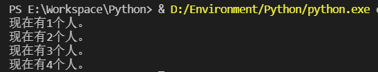

[toc]

# 1 面向对象

## 1.1 面向对象技术简介

- 类(Class)：用来描述具有相同的属性和方法的对象的集合。它定义了该集合中每个对象所共有的属性和方法，对象是类的实例。
- 方法：类中定义的函数
- 类变量：类变量在整个实例化的对象中是公用的。类变量定义在类中且在函数体之外。类变量通常不作为实例化变量使用
- 数据成员：类变量或者实例变量用于处理类及其实例对象的相关的数据
- 方法重写：如果从父类继承的方法不能满足子类的需求，可以将其进行改写，这个过程叫方法的覆盖(override)，也称为方法的重写
- 局部变量：定义在方法中的变量，只作用于当前实例的类
- 实例变量：在类的声明中，属性是用变量来表示的，这种变量就称为实例变量，实例变量就是用一个`self`修饰的变量
- 继承：即一个派生类(derived class)继承基类(base class)的字段和方法。继承也允许把一个派生类的对象作为一个基类对象对待
- 实例化：创建一个类的实例，类的具体对象
- 对象：通过类定义的数据结构实例。对象包括两个数据成员(类变量和实例变量)和方法。

和其他编程语言相比，python在尽可能不增加新的语法和语义的情况下加入了类机制。

python中的类提供了面向对象编程的所有基本功能：类的继承机制允许多个基类，派生类可以覆盖基类中的任何方法，方法中可以调用基类中的同名方法。对象可以包含任意数量和类型的数据。

## 1.2 类的定义

```python
class People():
    pass

p1 = People()
print(type(p1))
```

result


## 1.3 实例方法

```python
class People():
    def ssyHello(self):			#self是默认参数，一定要有
	    print('Hello!')

p1 = People()
p1.ssyHello()
```

result


## 1.4 构造函数

可以使用构造函数来初始化一个类

```python
class People():
    def __init__(self,sex):
	    self.sex = sex			#实例变量
        
    def sayHello(self):			#self是默认参数，一定要有
	    print('Hello!')

p1 = People('man')
p1.sayHello()
print(p1.sex)
```

result


## 1.5 类变量

```python
class People():
    sum = 0

    def __init__(self, sex):
        self.sex = sex  # 实例变量
        People.sum += 1  # People.sum也可以写成self.sum
        print('现在有%d个人。' % People.sum)

    def sayHello(self):  # self是默认参数，一定要有
        print('Hello!')


p1 = People('man')
p1.sayHello()
p2 = People('woman')
print(p1.sex)
```

result


## 1.6 类方法

定义类方法，就需要在类的方法上面加上`@classmethod`，这是一个装饰器，默认值最好使用`cls`，用其他也不会报错。

调用类方法用`类名.类方法名`

```python
class People():
    sum = 0

    def __init__(self, sex):
        self.sex = sex
        self.__class__.sum += 1
        print('现在有%d个人。' % self.__class__.sum)

    def syaHello(self):  # self是默认参数，一定要有
        print('Hello!')

    @classmethod
    def plus(cls):
        cls.sum += 1
        print("现在有%d个人。" % cls.sum)

p1 = People('man')
People.plus()
p2 = People('woman')
People.plus()
```

result



## 1.7 静态方法

静态方法基本上与类方法相似，能用静态方法的基本也能用类方法代替，尽可能少使用静态方法。

使用类方法调用类变量的时候直接可以用`cls.xxx`,但是静态方法没有默认参数,调用类变量时必须要写出类的全称,定义静态方法时要在上面加`@staticmethod`

```python
class People():
    sum = 0

    def __init__(self, sex):
        self.sex = sex
        self.__class__.sum += 1
        print('现在有%d个人。' % self.__class__.sum)

    def syaHello(self):  # self是默认参数，一定要有
        print('Hello!')

    @classmethod
    def plus(cls):
        cls.sum += 1
        print("现在有%d个人。" % cls.sum)

    @staticmethod
    def stat():
        People.sum += 1
        print("现在有%d个人。" % People.sum)


p1 = People('man')
People.stat()
```

result


## 1.8 私有

在实例方法或变量前加__,就被声明为了私有,外部不可以直接通过变量或是方法名直接访问

但是私有并不意味着真的不能在外部访问了

通过`dict`发现类中存在一个`_People__sex`的属性,这个其实就是我们设置的私有变量,我们在外部也是可以直接访问的,实例的方法也是一样可以在外部访问

```python
class People(object):
    """docstring for People"""

    def __init__(self):
        self.__sex = 'man'

    def __sayHello(self):
        print("Hello!")


p1 = People()
print(p1.__dict__)
print(p1._People__sex)
p1._People__sayHello()
```

result


## 1.9 继承

cls.py

```python
class People():
    def __init__(self, name, age):
        self.name = name
        self.age = age

    def sayHello(self):
        print('Hello!')
```

stu.py

```python
import cls
class Student(cls.People):
    pass

stu = Student('Tom',18)
stu.sayHello()
```

result


### 1.9.1 Student类继承了People类的方法

```python
import cls


class Student(cls.People):
    def __init__(self, name, age, score):
        self.score = score
        cls.People.__init__(self, name, age)

    def sayHello(self):
        print('Hi!')

stu=Student('Tom',18,90)
stu.sayHello()
```

result


子类扩展了父类的`init()`方法,但是调用父类的`init`方法时,必须要传入`self`
然后子类又重写了父类的`sayHello()`方法
调用父类的方法时也可以使用`super()`

```python
import cls


class Student(cls.People):
    def __init__(self, name, age, score):
        self.score = score
        super(Student, self).__init__(name, age)

    def sayHello(self):
        print('Hi!')


stu = Student('Tom', 18, 90)
stu.sayHello()
print(stu.name)
print(stu.age)
```

result


## 1.10 多继承

如果父类有相同的方法,子类会优先调用先被继承的类的方法

```python
class A():
    def __init__(self):
        print('a')

class B():
    def __init__(self):
        print('b')

class C(A, B):
    pass

c = C()
```

result


## 1.11 多态

```python
class C():
    def say(self):
        pass

class B(C):
    def say(self):
        print('B')

class A(C):
    def say(self):
        print('A')

b = B()
a = A()
b.say()
a.say()
```

result


# 2 综合案例

## 2.1 目录结构


## 2.2 animal_class.py

```python
''' 类的定义 '''
class animal():
    ''' 类变量，实例可以访问，类也可以访问 '''
    an_type = ['无脊椎动物', '脊椎动物', '尾索动物', '头索动物']
    an_type_next = {
        '无脊椎动物': [],
        '脊椎动物': [],
        '尾索动物': [],
        '头索动物': []
    }

    ''' 成员方法的定义 '''
    def __init__(self, type1, type2, name, shape):
        ''' 实例变量，只能是实例本身访问，类不能访问 '''
        self.name = name
        self.shape = shape
        ''' 私有变量，只针对于实例自身而言 '''
        self.__money = 0
        if(type1 in self.an_type):
            next_t = self.an_type_next[type1]
            if not(type2 in next_t):
                next_t.append(type2)

    ''' 成员方法的定义 '''
    def speack(self):
        print("************")

    ''' 类方法 '''
    @classmethod
    def get_an_type(cls):
        print(cls.an_type)
    
    ''' 静态方法 '''
    @staticmethod
    def get_name():
        print(animal.an_type_next)

    def do_work(self, days, pay):
        ''' 在类的定义过程中，可以使用__xxx这种形式来访问私有变量 '''
        self.__money += days * pay
```

## 2.3 mydog.py

```python
from animal_class import *

class dog(animal):
    def __init__(self, type1, type2, name):
        super().__init__(type1, type2, name, "四蹄犬状")
    def speack(self):
        print("旺旺")

```

## 2.4 mypeople_class.py

```python
from animal_class import *
class people(animal):
    def __init__(self, type1, type2, name):
        ''' 对象变量/实例变量，只能实例本身访问，类不能访问 '''
        self.name = name
        ''' 私有变量(只针对于实例自身而言) '''
        self.__money = 0
        if(type1 in self.an_type):
            next_t = self.an_type_next[type1]
            if not(type2 in next_t):
                next_t.append(type2)
    def speack(self):
        print("你好！")
```

## 2.5 wolfman.py

```python
from mypeople_class import *
from mydog import *

''' 多继承，默认继承第一个父类的方法(如果多个父类有同名方法时) '''
class wolf_man(people, dog):
    def __init__(self, name):
        super().__init__("脊椎动物", "哺乳动物", name)

    def change_shape(self, co):
        if(co == "月圆之夜"):
            self.shape = "四蹄犬状"

```

## 2.6 myapp.py

```python
from animal_class import *


''' 类的实例化 '''
a1 = animal(type1="脊椎动物", type2="爬行动物", name="小青", shape="细长")
print(type(a1))
a1.speack()

print(a1.name, a1.shape)

a2 = animal(type1="无脊椎动物", type2="环节动物", name="邱小姐", shape="细长")
print(animal.an_type_next)

''' get_an_type是一个classmethod。实例和类都能够调用该方法 '''
a1.get_an_type()
animal.get_an_type()
''' speack()是一个实例方法，类是无法调用的 '''
# animal.speack()

"""
    静态方法和类方法的区别：
        1.静态方法没有参数(必须使用类名才能访问类变量和类方法，无法访问实例变量和实例方法)
        2.类方法有一个参数cls, 代表的是类名
        3.实现的效果类似使用类方法
"""
a1.get_name()
animal.get_name()
```

result


## 2.7 myapp2.py

```python
from animal_class import *
from mypeople_class import *
from mydog import *
from wolfman import *


a1 = animal("脊椎动物", "哺乳动物", "赵四", "类猿")
''' 
    私有变量可以使用下述方式访问，但是python不建议外部使用私有变量
    所以尽量不要在实例化后，调用私有变量。私有变量仅限于类的定义中使用
'''
print(a1._animal__money)
a1.do_work(30, 100)
print(a1._animal__money)
a1.speack()

a2 = people("脊椎动物", "哺乳动物", "谢广坤")
a2.get_an_type()
a2.speack()
print(people.an_type_next)

a3 = dog("脊椎动物", "哺乳动物", "大黄")
a3.speack()

a4 = wolf_man("雅各布")
# print(a4.shape)
a4.speack()
a4.change_shape("月圆之夜")
print(a4.shape)
```

result

