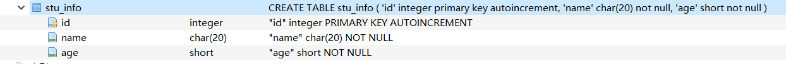
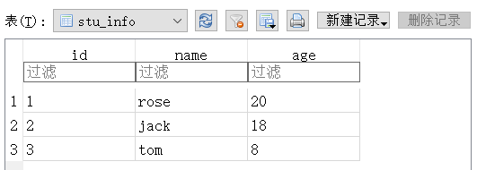
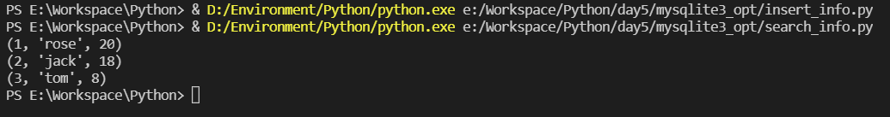
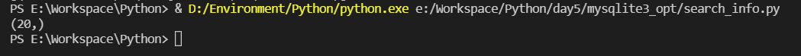
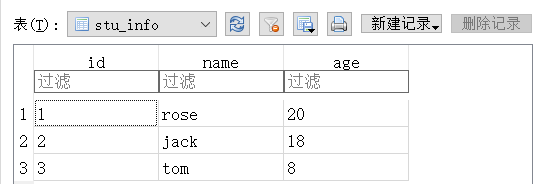
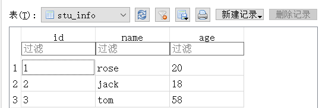
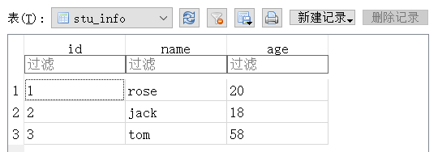
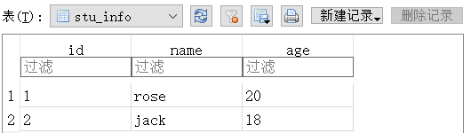

[toc]

# 1 数据库
## 1.1 API
### 1.1.1 connect

```python
''' 导包 '''
import sqlite3

connect(database, [timeout, other optional arguments])
'''
	该API打开一个连接SQLite数据库文件database的链接，可以使用":memory:"在RAM打开一个
	到database的数据库链接，而不是在磁盘打开。如果数据库打开成功，则返回一个连接对象。
	当一个数据库被多个连接访问，且其中一个修改了数据库，此时SQLite数据库被锁定，直到事务提交。
	timeout参数表示连接等待锁定的持续时间，直到发生异常断开连接。timeout参数默认是5.0(5秒)。
	如果给定的数据库名称filename不存在，则该调用将创建一个数据库。如果不想在当前目录中创建数据库，
	那么可以指定带有路径的文件名，这样就能在任意地方创建数据库
'''
```

### 1.1.2 cursor

```python
''' 导包 '''
import sqlite3

cursor([cursorClass])
'''
	创建一个cursor。
	该方法接受一个单一的可选的参数
	cursorClass。如果提供了该参数，则它必须是一个扩展自sqlite3。Cursor的自定义的cursor类
'''
```

### 1.1.3 execute

```python
''' 导包 '''
import sqlite3

cursor([cursorClass])
'''
	执行一个sql语句
	该sql语句可以被参数化，即使用占位符替代SQL文本。
	sqlite3模块支持两个类型的占位符:问号和命名占位符(命名样式)。

	cursor.execute("insert into people values (?, ?)", (who, age))
'''
```

### 1.1.4 commit

```python
''' 导包 '''
import sqlite3

commit()
'''
	提交当前的事务。
	如果未调用该方法，那么自上次调用commit()以来所做的任何动作对其他数据库连接来说是不可见的
'''
```

### 1.1.5 close

```python
''' 导包 '''
import sqlite3

close()
'''
	关闭数据库连接。
	不会自动调用commit()。如果之前未调用commit()方法，
	就直接关闭数据库连接，所做的所有更改将全部丢失
'''
```

### 1.1.6 fetchall

```python
''' 导包 '''
import sqlite3

fetchall()
'''
	获取查询结果集中所有(剩余)的行,返回一个列表
	当没有可用的行时，则返回一个空的列表
'''
```

## 1.2 样例

### 1.2.1 create_table_stu_info.py

```python
import sqlite3

conn = sqlite3.connect("mynew.db")
c = conn.cursor()
create_table_sql = "create table stu_info (         \
    'id' integer primary key autoincrement,             \
    'name' char(20) not null,                       \
    'age' short not null                            \
)"
c.execute(create_table_sql)
conn.close()
```

result



### 1.2.2 insert_info.py

```python
import imp


import sqlite3

conn = sqlite3.connect("mynew.db")

c = conn.cursor()
insert_sql = "insert into stu_info (name, age) values (\"rose\", 20),       \
                                                        (\"jack\", 18),      \
                                                        (\"tom\", 8)"
c.execute(insert_sql)
conn.commit()
conn.close()
```

result



### 1.2.3 select_info.py

```python
import sqlite3
conn = sqlite3.connect("mynew.db")

c = conn.cursor()
''' c.execute("select * from stu_info") '''

c.execute("select age from stu_info where name = \"rose\"")

"""
mycon = c.fetchall()
print(mycon)
"""
for row in c:
    print(row)

conn.close()
```

result





### 1.2.4 update_info.py

```python
import sqlite3

conn = sqlite3.connect("mynew.db")

c = conn.cursor()
c.execute("update stu_info set age = 58 where name = \'tom\'")
conn.commit()
conn.close()
```

result

update_before



update_after



### 1.2.5 delete_info.py

```python
import sqlite3

conn = sqlite3.connect("mynew.db")

c = conn.cursor()
c.execute("delete from stu_info where name = \'tom\'")
conn.commit()
conn.close()
```

result

update_before



update_after




