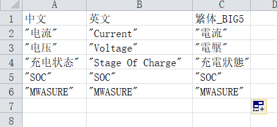

[toc]

# 1 批量文件操作

```python
for root, dirs, files in os.walk(r"C:\Users\14600\Desktop\ceshi")
```

**各字段代表的意思**

| name  | describe                                 |
| ----- | ---------------------------------------- |
| root  | 代表需要遍历的根文件夹                   |
| root  | 表示正在遍历的文件夹的**名字**（根/子）  |
| dirs  | 记录正在遍历的文件夹下的**子文件夹**集合 |
| files | 记录正在遍历的文件夹中的**文件**集合     |

## 1.1 案例1 - 删除子文件夹内某一个类型的文件

### 1.1.1 案例1描述

```
删除指定目录(内含多个子文件夹)下的某一类型文件，如以.tab结尾的文件
```

### 1.1.2 案例1代码

```python
import os

if __name__ == '__main__':
    for root, dirs, files in os.walk(r"C:\Users\14600\Desktop\ceshi"):
        for file in files:
            if file.endswith(".bat"):
                ''' 拼接文件路径  '''
                path = os.path.join(root, file)
                ''' 移除文件 '''
                os.remove(path)
    print("SUCCESS")
```

### 1.1.3 执行结果

```
实现描述
```

## 1.2 案例2 - 按文件名将文件分类

### 1.2.1 案例2描述

```
一个文件夹下有多个文件，几个文件名称相同，但是文件名的后缀不同，以一个文件的后缀创建一个以文件名称为名的文件夹，并将文件名称相同的移动到该文件夹下
```

### 1.2.2 案例2代码

```python
import os
import shutil

def function():
    dir_list = []
    ''' 获取文件夹下的所有文件名称 '''
    for root, dirs, files in os.walk(r"C:\Users\14600\Desktop\ceshi"):
        for file in files:
            if file.endswith(".txt"):
                ''' 将文件后缀名去掉 '''
                dir_name = file.replace(".txt", "")
                dir_path = "C:\\Users\\14600\\Desktop\\ceshi\\" + dir_name
                ''' 如果文件不存在则创建文件夹 '''
                if os.path.exists(dir_path) == False:
                    os.mkdir(dir_path)
                dir_list.append(dir_name)

                
    for root, file, files in os.walk(r"C:\Users\14600\Desktop\ceshi"):
        for file in files:
            ''' 将文件名称以 . 分割，意思就是将不带后缀的文件名取出来 '''
            file_name = file.split('.')[0]
            if file_name in dir_list:
                file_path = os.path.join(root, file)
                new_path = "C:\\Users\\14600\\Desktop\\ceshi\\" + file_name + "\\" + file
                print(new_path)
                ''' 将文件从 file_path 移动到 new_path '''
                shutil.move(file_path, new_path)


if __name__ == '__main__':
    function()
```

### 1.2.3 执行结果

```
实现描述
```

## 1.3 案例3 - 移动（复制）文件

### 1.3.1 案例3描述

```
将一个文件夹下所有子文件夹下的文件都移动(复制)到另一个文件夹下
```

### 1.3.2 案例3代码

```python 
import shutil
import os

def function(old_path, new_path):
    ''' 列出旧文件夹下多个子文件夹的名称 '''
    filelist = os.listdir(old_path)
    ''' 获取旧文件夹下多个文件夹下的文件并移动到新文件夹下面 '''
    for file in filelist:
        src = os.path.join(old_path, file)
        filelist2 = os.listdir(src)
        for file2 in filelist2:
            src2 = os.path.join(src, file2)
            dst = os.path.join(new_path, file2)
            ''' 拷贝 '''
            # shutil.copy(src2, dst)
            ''' 移动 '''    
            shutil.move(src2, dst)    

if __name__ == '__main__':
    function(r"C:\Users\14600\Desktop\ceshi", r"C:\Users\14600\Desktop\ceshi2")
```

### 1.3.3 执行结果

```
与描述一致
```

## 1.4 案例4 - 修改文件夹中指定文件类型中的某一行内容并保存

### 1.4.1 案例4描述

```
修改文件夹中指定文件类型中的某一行内容并保存
```

### 1.4.2 案例4代码

```python
import os


if __name__ == '__main__':
    list_text = []
    for root, dirs, files in os.walk(r'C:\Users\14600\Desktop\test\cn'):
        for file in files:
            path = os.path.join(root, file)
            if path.endswith('cn.txt'):                                     # 文件类型为cn.txt
                with open(path, 'r', encoding='utf-8') as file1:            # 以只读模式打开文件
                    string = file1.readlines()                              # 读取全部内容
                    for i in string:        
                        if 'MWASURE' in i:                                  # 文本中包含  MWASURE  字符串替换之后存入list_text
                            list_text.append(i.replace('MWASURE', ''))      
                        else:
                            list_text.append(i)

                with open(path, 'w', encoding='utf-8') as file2:            # 以只写的方式打开文件  文件存在则覆盖之前的内容
                    for i in list_text:
                        file2.write(i)                                      # 将 list_text 中的内容写入到文件中
                
            string.clear()                                                  # 每次都要清空，不然内容会叠加
            list_text.clear()
```

### 1.4.3 执行结果

```
与描述一致
```

## 1.5 案例5 - 删除文件夹中文件

### 1.5.1 案例5描述

```
删除文件夹中指定类型的文件（不含子文件下的文件）
```

### 1.5.2 案例5代码

```python
import os


# 删除path路径下file_type文件(不包括子文件夹)
def del_tmp_file(path, file_type):
    # os.listdir() 相当于 ls
    for filename in os.listdir(path):
        print(filename)
        if filename.endswith(file_type):
            full_file_name = os.path.join(path, filename)
            # 移除文件
            os.unlink(full_file_name)


if __name__ == '__main__':
    del_tmp_file(r"D:\Gitee\Self_taught\skills", "txt")
```

### 1.5.3 执行结果

```
与描述一致
```

## 1.6 案例6 - 删除文件夹下所有文件

### 1.6.1 案例6描述

```
删除文件夹下所有文件，包含文件夹下的子文件夹
```

### 1.6.2 案例6代码

```python
import os
import shutil


# 删除文件夹下所有文件，包含子文件夹
def del_folder(path):
    shutil.rmtree(path)
    os.mkdir(path)

if __name__ == '__main__':
    del_folder(r"D:\Gitee\Self_taught\skills")
```

### 1.6.3 执行结果

```
与描述一致
```

## 1.7 案例7 - 拷贝指定类型的文件

### 1.7.1 案例7描述

```
拷贝指定类型的文件到文件夹中，如果目标文件夹不存在则创建
```

### 1.7.2 案例7代码

```python
import os
import shutil


def copy_file_func(src, des, file_type):
    # 如果目标文件夹不存在则创建
    if False == os.path.exists(des):
        os.mkdir(des)
    for file in os.listdir(src):
        if file.endswith(file_type):
            full_file_name = os.path.join(src, file)
            if os.path.isfile(full_file_name):
                shutil.copy(full_file_name, des)


if __name__ == '__main__':
    copy_file_func(r"D:\Gitee\Self_taught\skills\.bat", r"C:\Users\lenovo\Desktop\ceshi", "txt")
    
```

### 1.7.3 执行结果

```
与描述一致
```

# 2 批量表格操作

## 2.1 案例1 - 将表格的页签重命名并另存为

### 2.1.1 案例1描述

```
以一个.xlsx为模板，将模板的内容复制到.xlsx文件内，并将新的.xlsx的页签重名名，并另存为
```

###  2.1.2 案例1代码

```python
import openpyxl
import shutil

''' 实现Linux cp命令 '''
def copy_file():
    src = '1.xlsx'
    for j in range(2, 6):
        dis = j.__str__() + '.xlsx'
        shutil.copy(src, dis)

def rename_xlsx():
    for j in range(1, 6):
        filename = j.__str__() + '.xlsx'.__str__()
        ''' 打开工作簿 '''
        excel01 = openpyxl.load_workbook(filename)
        ''' 将第一个页签重命名 '''
        excel01.worksheets[0].title = j.__str__()
        ''' 将第二个页签重命名 '''
        excel01.worksheets[1].title = j.__str__() + '_info'.__str__()
        ''' 保存更改 '''
        excel01.save(j.__str__() + '.xlsx')
    

if __name__ == '__main__':
    copy_file()
    rename_xlsx()
```

### 2.1.3 执行结果

```
与描述一致
```

## 2.2 案例2 - 翻译中英繁文本库

### 2.2.1 案例2描述

```
将一个txt文件中的中文转为英文和繁体中文（注：简体中文对应的英文和繁体中文已经在excel中写好了）
```

#### 2.2.1.1 Translate.xlsx中的内容



### 2.2..2 案例2代码

```python
import xlrd
import os


def cnToEn(cn_path):
    en_file = cn_path.replace('cn.txt', 'en.txt')                               # 获得翻译语言的文件名称
    file_en = open(en_file, 'w', encoding='ISO8859-1')                          # 以语言的编码格式打开文件
    with open(cn_path, 'r', encoding='gb2312') as file:                         # 打开中文文本库
        lines = file.readlines()                                                # 读取中文文本库的内容
        for line in lines:      
            ID = line.strip('\n').split('\t')[0]                                # 获取中文文本库ID
            cn_text = line.strip('\n').split('\t')[1]                           # 获取中文文本库 中文内容
            if cn_text in map_en_text:                                          # 如果中文内容在 对应的字典中 将中文内容对应的其他语言内容写入到文本库中
                file_en.write(ID + '\t' + map_en_text[cn_text] + '\n')          
            else:
                file_en.write(ID + '\t' + '""' + '\n')                          # Translate.xlsx文件中没有对应的中文文本内容 打印提示信息
                print("not find    " + cn_text)
        file_en.close()                                                         # 关闭文件


def cnToHk(cn_path):
    hk_file = cn_path.replace('cn.txt', 'hk.txt')
    file_hk = open(hk_file, 'w', encoding='big5')
    with open(cn_path, 'r', encoding='gb2312') as file:
        lines = file.readlines()
        for line in lines:
            ID = line.strip('\n').split('\t')[0]
            cn_text = line.strip('\n').split('\t')[1]
            if cn_text in map_hk_text:
                file_hk.write(ID + '\t' + map_hk_text[cn_text] + '\n')
            else:
                file_hk.write(ID + '\t' + '""' + '\n')
                print("not find    " + cn_text)
        file_hk.close()


if __name__ == '__main__':
    map_en_text = {}
    map_hk_text = {}
    wb = xlrd.open_workbook(r"C:\Users\14600\Desktop\test\Translate.xlsx")
    ws = wb.sheet_by_name('Sheet1')
    for i in range(1, ws.nrows):                                            # 将中文做为键  其他语言的作为值
        line_data = ws.row_values(i)
        cn_text = line_data[0]
        en_text = line_data[1]
        hk_text = line_data[2]

        map_en_text[cn_text] = en_text
        map_hk_text[cn_text] = hk_text
    
    for root, dirs, files in os.walk(r"C:\Users\14600\Desktop\test\cn"):
        for file in files:
            if file.endswith('cn.txt'):
                path = os.path.join(root, file)
                cnToEn(path)                                                # 中文文本转成对应的英文文本
                cnToHk(path)                                                # 中文文本转成对应的繁体文本
```

### 2.2.3 执行结果 

```
与描述一致
```

## 2.3 案例2-2 - 翻译

### 2.3.1 案例2-2描述

```
将中文文本内容转为对应的其他语种文本内容
```

### 2.3.2 案例2-2代码

```python
from  xlrd import open_workbook
import os


# 函数功能：
#   将中文文本内容转换为对应语言编码格式的文本文件
# 参数：
#   文件名称    文件类型    编码格式    内容字典
def cn_to_lang_func(cn_file, file_type, coding, text):
    lang_file = cn_file.replace('cn.txt', file_type + '.txt')
    file_lang = open(lang_file, 'w', encoding=coding)
    with open(cn_file, 'r', encoding='gb2312') as file:
        lines = file.readlines()
        for line in lines:
            id_text = line.strip('\n').split('\t')[0]
            cn_text = line.strip('\n').split('\t')[1]
            if cn_text in text:
                file_lang.write(id_text + '\t' + text[cn_text] + '\n')
            else:
                file_lang.write(id_text + '\t' + '""' + '\n')
                print('not find ' + cn_text)
        file_lang.close
            

# 函数功能：
#   有翻译和未翻译语种分开来放
# 参数说明：
#   translate工作表     对应的语种工作状态      状态
def develop_or_underdevelop(sheet_tran, sheet_lang, status):
    map_text = {}
    for i in range(1, sheet_lang.nrows):
        for j in range(1, sheet_tran.nrows):
            line_data = sheet_tran.row_values(j)
            cn_text = line_data[0]
            if 'DEVELOP' == status:
                lang_text = line_data[i]
            if 'UNDERDEVELOP' == status:
                lang_text = line_data[1]
            # 中文作为字典的键值，其他语种的作为值
            map_text[cn_text] = lang_text
        # 将当前文件夹下的以cn.txt结尾的文件转换成其他语言的文件
        for root, dirs, files in os.walk("./CN"):
            for file in files:
                if file.endswith('cn.txt'):
                    path = os.path.join(root, file)
                    cn_to_lang_func(path, sheet_lang.row_values(i)[0],sheet_lang.row_values(i)[1] , map_text)


# 函数功能：
#   加载翻译需要的文件
def tran_other_lang():
    # 打开Translate.xlsx表格
    wb = open_workbook("Translate.xlsx")

    ws = wb.sheet_by_name('Sheet1')
    # 获取开发语种和编码格式
    develop = wb.sheet_by_name('develop')
    # 获取未开发语种和编码格式
    underdevelop = wb.sheet_by_name('underdevelop')
    
    # 开发语种
    develop_or_underdevelop(ws, develop, 'DEVELOP')
    # 未开发语种
    develop_or_underdevelop(ws, underdevelop, 'UNDERDEVELOP')


if __name__ == '__main__':
    tran_other_lang()
```

### 2.3.3 案例2-2结果

```
与描述一致
```

## 2.4 案例3 - 修改工作簿的单元格

### 2.4.1 案例3描述

```
修改工作簿中某一个单元格的值
```

### 2.4.2 案例3代码

```python
from openpyxl import load_workbook

if __name__ == '__main__':
    for j in range(26, 29):
        # 拼接字符串名
        filename = '03_' + j.__str__() + '.xlsx'
        # 打开一个工作簿
        wb = load_workbook(filename)
        # 确定数据的工作表
        ws = wb.worksheets[0]
        # 向单元格中写入数据
        ws['g1'] = 'min,max'
        # 读取单元格的数据
        print(ws['a1'].value)
        # 保存，不然写入的数据不会保存
        wb.save(filename)    
```

### 2.4.3 执行结果

```
与描述一致
```

