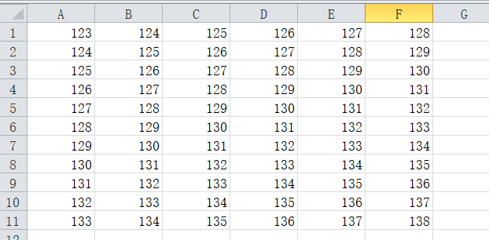
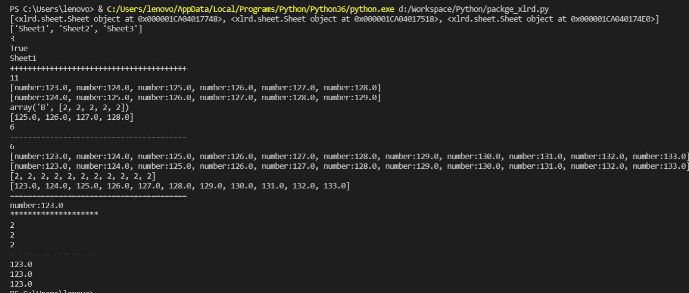

[toc]

# 1 xlrd

## 1.1 安装

```python
pip install xlrd==1.1.0
```

## 1.2 excel单元格中的数据类型

```
{0:'empty(空的)',1:'string(text)',2:'number',3:'date',4:'boolean',5:'error',6:'blank(空白表格)'}
```

## 1.3 导包

```python
import xlrd
```

## 1.4 excel工作表操作

```python
open_workbook(path)				# 打开excel工作簿
sheets()					    # 获取所有sheet对象
sheets()[index]					# 获取下标为index的工作表
sheet_by_index()				# 通过下标获取工作表
sheet_by_name()					# 通过工作表名称获取工作表
sheet_names()					# 所有工作表的名字
nsheets()						# 工作簿中工作表的数量
sheet_loaded(sheet_name or index) # 检查某个sheet是否导入完毕
sheet.name						# 获取表名
```

## 1.5 行[row]操作

```python
sheet.nrows									# 总行数
sheet.row(0)	# 该行所有的单元格数据类型和数据组成的列表
sheet.row_slice(0, start_colx=1, end_colx=4)	# 该行的列控制[切片]的单元格数据类型和数据组成的列表
sheet.row_types(3, start_colx=0, end_colx=None) # 该行的列控制[切片]单元格的数据类型组成的列表
sheet.row_values(4, start_cplx=3, end_colx=4) # 该行的列控制[切片]单元格的数据组成的列表
sheet.row_len(0)							# 该行单元格长度
```

## 1.6 列[column]操作

```python
sheet.ncols											# 总列数
sheet.col(0, start_rowx=0, end_rowx=4)					# 该列的行控制[切片]单元格数据类型和数据组成的列表
sheet.col_slice(0, start_rowx=0, end_rowx=4)			# 该列的行控制[切片]单元格数据类型和数据组成的列表
sheet.col_types(3, start_rowx=0, end_rowx=None)			# 该列的行控制[切片]单元格的数据类型组成的列表
sheet.col_values(2, start_rowx=0, end_rowx=1)			# 该列的行控制[切片]单元格的数据组成的列表
```

## 1.7 单元格

```python
sheet.cell(0,0)						# 单元格对象[数据类型和数据]
sheet.cell_type(2,3)				# 单元格数据类型
sheet.row(2)[3].ctype
sheet.cell(2,3).ctype

sheet.cell_value(3,3)				# 单元格数据
sheet.row(3)[3].value
sheet.cell(3,3).value
```

## 1.8 案例

### 1.8.1 data



### 1.8.2 code

```python
import xlrd


if __name__ == '__main__':
    wb = xlrd.open_workbook(r'D:\Workspace\Python\xlrd_test.xlsx')  # 打开工作簿
    print(wb.sheets())                              # 获取所有sheet对象
    ws = wb.sheets()[0]                             # 获取第一个工作表
    # ws2 = wb.sheet_by_index(1)                    # 获取第二个工作表
    # ws3 = wb.sheet_by_name('Sheet3')              # 获取第三个工作表
    print(wb.sheet_names())                         # 所有工作表的名字
    print(wb.nsheets)                               # 工作簿中工作表的数量
    print(wb.sheet_loaded(2))                       # 检查Sheet3是否导入完毕
    print(ws.name)                                  # 获取表名
    print('+'*40)
    print(ws.nrows)                                 # 总行数
    print(ws.row(0))                                # 第1行所有单元格数据类型和数据组成的列表
    print(ws.row_slice(1, start_colx=0, end_colx=None))     # 第2行单元格的值和数据类型组成的列表
    print(ws.row_types(2, start_colx=0, end_colx=5))        # 第3行单元格数据类型组成的列表
    print(ws.row_values(2, start_colx=0, end_colx=4))       # 第3行取第1到5列，不包含第5列组成的列表
    print(ws.row_len(0))                                    # 第1行单元格的长度
    print('-'*40)
    print(ws.ncols)                                         # 总列数
    print(ws.col(0, start_rowx=0, end_rowx=None))           # 第1列单元格数据类型和数据组成的列表
    print(ws.col_slice(0, start_rowx=0, end_rowx=None))     # 第1列单元格数据类型和数据组成的列表
    print(ws.col_types(0, start_rowx=0, end_rowx=None))     # 第1列单元格数据类型组成的列表
    print(ws.col_values(0, start_rowx=0, end_rowx=None))    # 第1列单元格的数据组成的列表
    print('='*40)
    print(ws.cell(0, 0))                                    # 单元格对象[数据类型, 数据]
    print('*'*20)
    print(ws.cell_type(0, 0))                               # 单元格的类型
    print(ws.row(0)[0].ctype)
    print(ws.cell(0, 0).ctype)
    print('-'*20)
    print(ws.cell_value(0, 0))                              # 单元格的数据
    print(ws.row(0)[0].value)
    print(ws.cell(0, 0).value)
```

### 1.8.3 result



# 2 openpyxl

## 2.1 安装

```bash
pip install openpyxl==2.5.3
```

## 2.2 工作簿

### 2.2.1 导包

```python
from openpyxl import load_workbook
from openpyxl import Workbook
```

### 2.2.2 获得一个工作簿

```python
Workbook(write_only=False, iso_dates=False)
# 功能：
# 	创建一个空白工作簿
# 参数：
# 	write_only=False。工作簿是否只写，若为True, 将在恒定内存消耗下写入无限量数据
# 	iso_dates=False。指明日期格式
# 返回：
# 	创建一个只写或非只写空白工作簿
```

```python
load_workbook(filename, read_only=False, keep_vba=KEEP_VBA, data_only=False, keep_links=True)
# 功能：
# 	打开一个已有的工作簿
# 参数：
# 	filename:要打开的文件路径或类文件对象
# 	read_only=False。是否只读，不可编辑。
# 	keep_vba=KEEP_VBA。是否保留VBA内容（并不代表能够使用它）
# 	data_only=False。控制带有公式的单元格是否具有公式(默认值)或山慈Excel读取工作表时存储的值。
# 	keep_links=True。是否应该保留外部工作簿的链接。默认值为True。
# 返回：
# 	打开一个已有的工作簿
```

### 2.2.3 工作簿的属性

```python
workbook._active_sheet_index	# 当前工作簿中活跃的工作表的序号，可以通过workbook._active_sheet_index = index指定当前活跃的工作表
workbook.active					# 返回当前工作簿中活跃的一张工作表。（默认是上一次编辑时的工作表，即光标当前所在的工作表）
workbook.worksheets				# 返回工作簿中所有工作表的列表
workbook.sheetnames				# 返回工作簿中所有工作表的名称列表
```

### 2.2.4 工作簿操作工作表的方法

```python
workbook.create_sheet(title=None, index=None)
# 功能：
# 	在工作簿内创建一个工作表(在一个可选的索引)并返回。只读模式不可用。
# 参数：
# 	title, str类型。工作表的可选标题。
# 	index, int类型。可选的插入工作表的位置。
# 		不填index默认放在最后一个位置
#  		0 代表放在第一个位置
#		-1 代表放在倒数第二个位置
# 返回：
# 	创建新的openpyxl.worksheet.worksheet.Worksheet对象。
```

```python
workbook.index(worksheet)
# 功能：
# 	返回指定工作表在工作簿中的索引
# 参数:
# 	worksheet: openpyxl.worksheet.worksheet.Worksheet对象。要返回的工作表
# 返回：
# 	索引值
```

```python
workbook.copy_worksheet(from_worksheet)
# 功能：
# 	复制工作表
# 参数：
# 	from_worksheet: openpyxl.worksheet.worksheet.Worksheet对象。要复制的工作表
# 返回：
# 	复制的工作表的副本。openpyxl.worksheet.worksheet.Worksheet对象
```

```python
workbook._add_sheet(worksheet, index=None)
# 功能：
# 	粘贴工作表。在工作簿内部指定索引位置增加一个内部工作表。只读模式不可调用。与copy_worksheet联用相当于粘贴
# 参数：
# 	worksheet: openpyxl.worksheet.worksheet.Worksheet对象。待粘贴工作表。
# 	index=None: int。指定索引位置
# 返回：
# 	None
```

```python
workbook.move_sheet(sheet, offset=0)
# 功能：
# 	移动工作表。移动工作簿中指定工作表offset个偏移量。
# 参数：
# 	sheet: str or openpyxl.worksheet.worksheet.Worksheet对象，待移动工作表。
# 	offset: int类型。偏移量
# 		正数：向右移动(1就是向右移动一个位置)
# 		负数：向左移动(-1就是向左移动一个位置)
# 返回：
# 	None
```

```python
workbook.remove(worksheet)
del workbook['sheetname'] 
# 功能：
# 	工作簿中删除指定工作表。
# 参数：
# 	worksheet: openpyxl.worksheet.worksheet.Worksheet对象。待移除工作表。
# 返回：
# 	None
```

```python
workbook.close()
# 功能：
# 	关闭工作簿。如果工作簿文件打开，则关闭它。只影响只读和只写模式。
```

### 2.2.5 保存工作簿

```python
workbook.save(filename)		# 保存工作簿到指定文件，只写模式下，只能调用一次; 只读模式无法调用
```

## 2.3 工作表

### 2.3.1 导包

```python
import openpyxl
```

### 2.3.2 从工作簿中获取一张工作表

1. 直接获取

   ```python
   workbook._active_sheet_index = index 	# 指定活跃表格的序号
   workbook.active						# 获取工作簿中活跃的一张表

2. 通过名称获取

   ```python
   workbook["sheetname"]				# 获取指定名称的工作表
   workbook[workbook.sheetnames[index]]	# 获取指定序列对应名称的工作表
   ```

3. 通过索引号获取

   ```python
   workbook.worksheets[index]				# 获取指定索引号的一张工作表
   ```

### 2.3.3 workbook属性

```python
worksheet.title 	# str。返回或设置工作表标题，确保其有效。限制为31个字符，没有特殊字符。重复的标题将按数字递增。如果新建而没有设置过，则返回默认的"Sheet"
worksheet.sheet_state = 'visible'	# 可选参数:'visible': 显示	'hidden': 隐藏	'veryHidden': 深度隐藏
```

| 属性                 | 返回值类型 | 说明                                           | 备注         |
| -------------------- | ---------- | ---------------------------------------------- | ------------ |
| worksheet.rows       | generator  | 返回工作表中有数据范围内所有行的生成器         | 可迭代(遍历) |
| worksheet.columns    | generator  | 返回工作表中有数据范围内所有列的生成器         | 可迭代(遍历) |
| worksheet.values     | generator  | 返回一个逐行生成工作表中的所有单元格值的生成器 | 可迭代(遍历) |
| worksheet.max_column | int        | 返回含内容的单元格的最大列序号                 | 从1开始      |
| worksheet.max_row    | int        | 返回含内容的单元格的最大行序号                 | 从1开始      |
| worksheet.min_column | int        | 返回含内容的单元格的最小列序号                 | 从1开始      |
| worksheet.min_row    | int        | 返回含内容的单元格的最小行序号                 | 从1开始      |

### 2.3.4 注意

上面的表格中的属性都是对于一个没有更改过的表格。如果对于修改记录的工作簿保存之后，结果就不一定是对的。

#### 2.3.4.1 怎么求得实际的行数和列数

通过观察数据来求某个工作表的行数和列数，判断某一列的数据是否为空封装一个函数来求的行数和列数

```python
worksheet.row_dimensions[row].height = 25		# 设置行高	row是行号
worksheet.column_demensions[col].width = 15.5 # 设置列宽	col是列号，必须是字母
```

| 属性                                 | 说明   | 备注                |
| ------------------------------------ | ------ | ------------------- |
| worksheet.insert_rows(index, amount) | 插入行 | amount不填，默认为1 |
| worksheet.insert_cols(index, amount) | 插入列 | amount不填，默认为1 |
| worksheet.delete_rows(index, amount) | 删除行 | amount不填，默认为1 |
| worksheet.delete_cols(index, amount) | 删除列 | amount不填，默认为1 |

## 2.4 单元格

### 2.4.1 写入

```python
# 第一种写法
ws['A1'].value = 'python'  

# 第二种写法
ws.cell(row=1,column=1,value='hello') # row, column 都可以省略不写，如下面一行
ws.cell(1,1).value = 'hello'
```

```python
worksheet.append(iterable)
# 功能：
# 	按行追加数据。如果iterable是字典类型，字典的键（可以是数字或字母字符串）将作为值对应的列号。否则，按iterable的顺序进行追加。
# 参数：
# 	iterable: list | tuple | range | generator | dict
# 返回：
# 	None
```

### 2.4.2 读

```python
worksheet['A1'].value
worksheet(row, col).value
```


