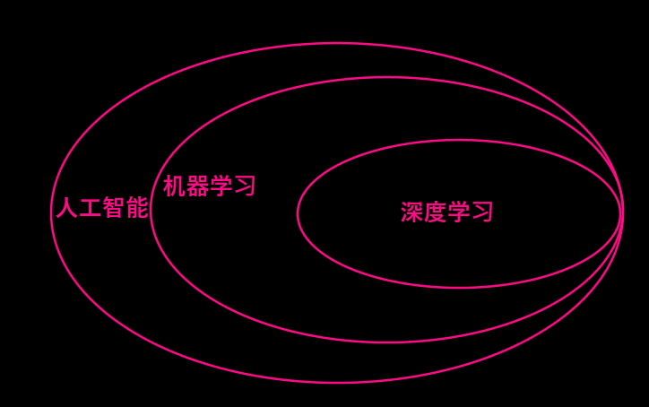
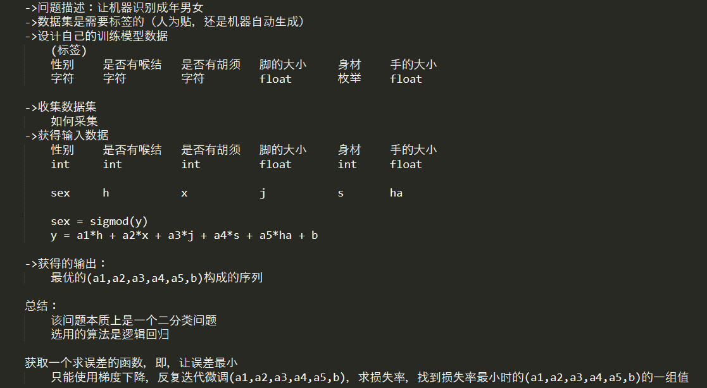

[toc]


# 页面跳转

[人工智能问题的研究流程](#人工智能问题的研究流程)

# 1 人工智能简介

## 1.1 什么是人工智能

人工智能就是由计算机来表示和执行人类的智能活动。——《人工智能的研究目标》人工智能(AI, Artificial Intelligence)

## 1.2 人工智能的发展历史

==**三次高潮两次低谷**==

### 1.2.1 第一次高潮

1950-1960

原因：计算机的诞生，催生AI

### 1.2.2 第一次低谷

1960-1980

原因：计算机能够实现的功能过于简单，达不到人们对AI的构想

### 1.2.3 第二次高潮

1980-1990

原因：计算机网络，pc机的普及，带动了专家系统的完善。催生了一系列的机器学习算法。

### 1.2.4 第二次低谷

1990-2006

原因：单核CPU的计算速度瓶颈，无法支持高级的深度学习算法，对于非结构化数据没有存储和处理方法。

### 1.2.5 第三次高潮

2006-现在

原因：多核CPU的诞生，深度学习算法的发展，弱人工智能产品的普及，大数据时代的到来，非结构化数据处理技术的完善。

## 1.3 人工智能的发展前景

因为人们对于AI的需求还没有被完全开发和引导，市场空间很大，大家普遍看好。

### 1.3.1 当前已经使用的人工智能产品

#### 1.3.1.1 国内平台：(SDK)

1. 百度AI开放平台
2. 京东AI开放平台
3. 小米AI开放平台
4. 科大讯飞AI开放平台

#### 1.3.1.2 应用(应用软件)

1. 有道翻译
2. QQ截屏识别
3. 流利说
4. 抖音
5. 美团
6. 购物平台

#### 1.3.1.3 产品

以设备为基础

1. 智能音箱
2. 人脸识别的门禁
3. AI相机
4. 无人驾驶汽车
5. ............

## 1.4 影响人工智能发展的三大要素

1. 大量的数据资源
2. 计算力
3. 基础算法和AI平台

## 1.5 人工智能的知识框架

```
				行业应用
---------------------------------------------------
	产品 				软件 				基础平台
---------------------------------------------------
	语音技术 		计算机视觉 		自然语言处理 		其他
---------------------------------------------------
				人工智能开发框架
模型训练：TensorFlow  Pytorch 	PaddlePaddle 	Caffe
模型使用：TensorFlow-Lite、 Paddle Mobile、 CoreML、 TensorRT
----------------------------------------------------
				人工智能编译器
	xxxxxxxxxxxxxxxxxxxxxxxxxx
				LLVM
----------------------------------------------------
					硬件
	计算服务器 					移动设备
	CPU  GPU 	 				ASIC  	FPGA
-----------------------------------------------------
```

我们只需要学会调用应用工程师提供的人工智能接口，将其人工智能部分的功能做进移动端产品/物联网产品中，就可以了。

## 1.6 人工智能问题的研究流程

<a name = "人工智能问题的研究流程"></a>

1. 提出问题
2. 分析适不适合机器学习
3. 机器学习问题的构建
4. 收集数据集
5. 数据的采样和拆分
6. 选择算法训练模型
7. 使用测试集测试模型
8. 使用损失函数计算损失率
9. 根据损失率判断是否是最优模型
10. 选择是否继续迭代

# 2 机器学习

让机器能够自己进行学习(通过以往的经验和数据)实现对现有算法的优化。

# 3 深度学习

机器学习过程中，采用了人工神经网络算法的都叫深度学习。

# 4 人工智能，机器学习，深度学习的关系



# 5 机器学习简介

## 5.1 机器学习有下面几种定义

1. 机器学习是一门人工智能的科学,该领域的主要研究对象是人工智能，特别是如何在经验学习中改善具体算法的性能。
2. 机器学习是对能通过经验自动改进的计算机算法的研究。
3. 机器学习是用数据或以往的经验,以此优化计算机程序的性能标准。

## 5.2 机器学习的流程

1. 提出问题

2. 分析问题适不适合使用机器学习
   
     - 数据量大
     - 问题复杂程度
     
3. 机器学习问题的构建
   
   - 数据集的问题
   - 如何特征工程
   - 如何选择算法构造模型
   - 如何确立最优模型
   
4. 收集数据集

5. 数据的特征工程
   
   - 数据集的拆分，采样
   - 特征提取和降维
   
6. 使用预定算法对训练集进行训练

7. 得到训练后的模型

8. 使用测试集测试模型的损失率(正确性)

9. 判断损失率的大小

10. 看是上述哪个环节出的问题，导致损失率高，模型不过关的问题

11. 反复迭代上述流程，直到找到预期损失率的模型

12. 获取模型

## 5.3 机器学习的研究主要分为两类研究方向

1. 第一类是传统机器学习的研究。

   该类研究主要是研究学习机制，注重探索模拟人的学习机制；

2. 第二类是大数据环境下机器学习的研究。

   该类研究主要是研究如何有效利用信息，注重从巨量数据中获取隐藏的、有效的、可理解的知识。  

## 5.4 机器学习的分类

### 5.4.1 基于学习方式的分类

#### 5.4.1.1 监督学习

是有标准答案的学习(数据集是带标签的)

#### 5.4.1.2 无监督学习

是没有标准答案的学习(数据集是不带标签的)

#### 5.4.1.3 强化学习

在学习过程中引入了奖惩机制的学习

### 5.4.2 基于数据形式的分类

#### 5.4.2.1 结构化学习

学习对象是结构化数据

#### 5.4.2.2 非结构化学习

学习对象是非结构化数据

### 5.4.3 数据形式

#### 5.4.3.1 结构化数据

能用表存储的数据(关系型数据库能存储的)

#### 5.4.3.2 非结构化数据

数据不能用表来存储(非关系型数据库存储的)

## 5.5 机器学习算法

| 问题的分类 | 问题的描述 | 例子 |
| ---------- | ---------- | ---- |
|分类问题|从n个标签中，选择一个|垃圾分类/西瓜分拣|
| 回归问题 | 预测一个值 | 房价预测/股票预测 |
| 聚类问题 | 给一堆没有分类的数据，输出分类  | 文档聚类(无监督学习) |
| 排序(名)问题 | 排出一个顺序 | 高考成绩排名/单位分房，涨薪资 |
| 并联规则学习问题 | 从数据中寻找推断关联和模型 | 如果你买过汉堡，你可能再去买汉堡(无监督学习) |
| 结构化输出问题 | 建立一个复杂的输出 | 自动翻译(序列化问题) |


### 5.5.1 解决分类问题的算法

- KNN

- 逻辑回归
- SVM
- 深度学习算法

### 5.5.2 解决回归问题

- 线性回归

- 岭回归
- 随机森林

### 5.5.3 聚类问题

- K-means

- 仿射

### 5.5.4 结构化学习

深度学习算法

### 5.5.5 决策性问题

决策树

## 5.6 机器学习问题的构建

### 5.6.1 定义一个深度学习问题并提出解决方案

1. 描述自己的问题
2. 看是否有带标签的数据生成
3. 设计自己的训练模型数据
4. 收集自己的数据集
5. 获得输入数据
6. 获得有效的输出数据



### 5.6.2 如何获得最优解

1. 求导(数学方法)
2. 最小二乘法
3. 梯度下降
4. 牛顿法
5. 拟牛顿法
6. 极大似然值法