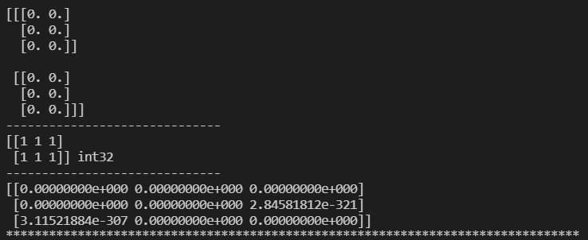

[toc]

# 1 数据集的收集

## 1.1 人工收集

人工输入

### 1.1.1 优点

人对数据比较熟悉，能够快速找到最优模型。

### 1.1.2 缺点

1. 慢，效率低下
2. 容易出错

### 1.1.3 什么时候使用

1. 数据量小
2. 没办法使用爬虫爬取时

## 1.2 机器收集

通过爬虫去收集数据

### 1.2.1 优点

1. 快，效率高
2. 不容易出错
3. 如果需要合成标签，使用机器收集较快

### 1.2.2 缺点

1. 研究的人对数据不熟悉

### 1.2.3 什么时候使用

1. 数据量大
2. 没办法人工操作的时候

## 1.3 标签的来源

分为人工贴，机器合成，特点同数据集的收集

# 2 数据集的大小

数据集的大小，取决于研究的问题。一般是有参考的

如果没有参考，就需要反复迭代求得。

# 3 数据集的质量

## 3.1 如何保证数据集的质量

1. 保证数据的正确性和真实性
2. 不要有丢失的数据项
3. 如果出现异常值，需要处理
4. 不能有坏的标签

# 4 数据集的采样

采样也叫抽样：从海量数据中，挑出一部分代表整体

## 4.1 需要保证的效果

1. 保证数据的多样性
2. 保证差异化数据的正常比例

## 4.2 如何抽样

1. 随机抽样
2. 基于hash的抽样
3. 其他方法

## 4.3 异常情况

如果研究的是异常情况(研究的是海量数据中的少数族群)

1. 向下采样
2. 向上加权

# 5 数据集的拆分

## 5.1 训练集

用于训练模型的数据

## 5.2 测试集

用于测试模型的数据

## 5.3 比例

`7:3或者8:2`

## 5.4 原则

1. 保证数据的多样性
2. 保证差异化数据的正常比例
3. 测试集和训练集不能重复

## 5.5 如何拆分

随机拆分

没有同一标准，根据具体业务而定

基于hash的拆分


# 6 数据的转换

## 6.1 目的

方便计算机计算和存储

## 6.2 数据转换的两个类表

### 6.2.1 非数值数据的转换

- 符号表
- hash

### 6.2.2 数值数据的转换

#### 6.2.2.1 归一化/正则化

##### 6.2.2.1.1 线性缩放

```
X' = w * X + b
or
X' = (X - min)/(max - min)
```

###### 6.2.2.1.1.1 什么时候使用

1. 数据较为均匀
2. 数据整体不好计算

##### 6.2.2.1.2 裁剪

```
if X < min:
	X' = min
if X > max:
	X' = max
```

###### 6.2.2.1.2.1 什么时候使用

1. 数据中出现大量异常值时使用

##### 6.2.2.1.3 对数缩放

```
X' = log(X)
```

###### 6.2.2.1.3.1 什么时候使用

数据呈现幂律分布(指数型增长和下降)

##### 6.2.2.1.4 标准分数

```
X' = (X - μ)/σ
```

###### 6.2.2.1.4.1 什么时候使用

数据有少量异常值时使用

#### 6.2.2.2 分桶

##### 6.2.2.2.1 等距的桶

数据分布较为均匀时使用，或者等距桶设计出来好处理数据

##### 6.2.2.2.2 等量的桶

数据分布不均匀时使用，为了避免等距的桶造成的资源浪费

## 6.3 什么时候使用数据转换

[人工智能问题的研究流程](./01_人工智能简介.md)

数据转换不是必须的，但是时高效的。可以提高模型生成的效率。所以是必要的。

一般数据转换会放在训练前转换，或者训练时转换。

# 7 numpy

是一个科学计算库，numpy操作对象是一个ndarray，说白了是一个n维度数组。numpy中的数组和python中的list是有区别的。

ndarray要求所有元素类型相同，且大小定义时固定。

## 7.1 安装

```
pip install numpy -i https://mirrors.aliyun.com/pypi/simple/
```

## 7.2 属性

```python
'''
	size:数组元素个数
	shape:数组的形状
	dtype:数组元素的数据类型
	itemsize:元素所占字节数
	ndim:数组的维度(轴)
	data:数组首地址
'''
```

## 7.3 ndarray的构造

```python
''' 导包 '''
import numpy as np

array(迭代器/list)

'''
	创建一个由0组成的数组
'''
zeros()

'''
	创建一个完整的数组
'''
ones()

'''
	创建一个数组，其初始内容是随机的，取决于内存的状态
	注意：默认情况下，创建的数组是dtype是float 64类型的
'''
empty()

'''
	可以根据range出来的序列，构建一个ndarray,
	可以通过reshape()函数更改ndarray的形状
'''
arange()

'''
	从起始位置到终止位置平均取多少个数
'''
linspace()

# 通过随机函数获得ndarray
'''
	随机，参数是元素个数
'''
random.random()
'''
	正太分布的随机，loc=是中间值，scale=主流数据的活动范围，size=元素个数
'''
random.normal()

'''
	改变数组形状
'''
reshape()

'''
	排序
'''
sort()

'''
	三角函数
'''
sin()/cos()

'''
	加减乘除
'''
add()/mean()

'''
	堆叠
'''
hstack()/hstack()
```

==**numpy中ndarray的操作具备广播性，所有元素依次都会执行某一操作。**==

## 7.4 使用

```python
import numpy as np

myl = [
    [1, 2, 3],
    [4, 5, 6],
    [7, 8, 9]
]
''' dtype:说的是元素类型 '''
a = np.array(myl, dtype=np.int)
print(a)

print(type(a))
# size属性：元素个数
print(a.size)
# dtype属性：元素类型
print(a.dtype)
# ndim属性：说的是矩阵的维度(轴)
print(a.ndim)
# shape属性：说的是矩阵的形状，用元组表示
# shape的元素个数，是ndim
# shape所有元素相乘，是size
print(a.shape)
# itemsize:一个元素所占的字节数
print(a.itemsize)
# data:是数组首地址
print(a.data)

print("*" * 80)
''' shape(2, 3, 2)是一个三维数组，三维数组中有两个二维数组，每一个二维数组中有三个一维数组，一维数组中有两个元素 '''
b = np.zeros(shape=(2, 3, 2))
print(b)
print("-" * 30)
c = np.ones(shape=(2, 3), dtype=np.int32)
print(c, c.dtype)
print("-" * 30)
d = np.empty((3, 3))
print(d)

print("*" * 80)
b = np.arange(1, 21, dtype=np.int32)
print(b)
print("-" * 30)
c = b.reshape((4, 5))
print(c)
print("-" * 30)
d = np.linspace(3, 10, 20)
print(d)

print("*" * 80)
b = np.random.random(10)
print(b)
print("-" * 30)
c = np.random.normal(3, 2, 20)
print(c)
print("-" * 30)
c.sort()
print(c)
```





```python
import numpy as np

a = np.array([1,2,3,4,5])
b = np.array([2,4,6,8,10])

c = a+b
print(c)

c = np.add(a,b)
print(c)

c = np.array([2, 4, 8, 16])
print(np.sqrt(c))
''' 平均数 '''
print(np.mean(c))

x = np.linspace(-6,6,20)
y = np.sin(x)
z = np.cos(x)
n = np.hstack((x,y))
w = np.vstack((x,y))
print(n)
print("*" * 80) 
print(w)
```

result


# 8 matplotlib

matplotlib是一个绘图的库，提供数据图形化显示的功能。

matplotlib使用的数据都是numpy的ndarray

## 8.1 安装

```
pip install matplotlib -i https://mirrors.aliyun.com/pypi/simple/
```

## 8.2 使用

```python
'''
    matplotlib.pyplot模块
        绘图的模块

    title():设置标题
    plot():绘制线条
        x轴的数据
        y轴的数据
        label:标签，图例显示时使用
        lw：线条宽度
        color：线条颜色
        linestyle:线条风格
            "--"
            "-."
            ":"
            "-"
    legend():显示图例
    show():显示图片
    xlim():x轴坐标的限制
    ylim():y轴坐标的限制
    scatter():显示散点图
    hist():显示直方图
'''
```

例子1

```python
import numpy as np
import matplotlib.pyplot as plt

x = np.linspace(-6, 6, 200)
y = np.sin(x)
z = np.cos(x)
plt.title("sin(x) and cos(x)")
plt.plot(x, y, label="sin(x)", color="red", linestyle="--", lw=2)
plt.plot(x, z, label="cos(x)", color="green", linestyle="-.", lw= 5)
plt.legend()
plt.show()
```

result


例子2

```python
import numpy as np
import matplotlib.pyplot as plt

jh = [40.5, 40, 37, 37.5, 36, 42, 41, 36.5, 38, 41, 43, 44]
sh = [18, 17.8, 16.5, 17.0, 16.9, 18.5, 18.3, 17, 17.5, 18, 18.3, 19]
lb = np.array([0, 1, 1, 1, 1, 0, 0, 1, 1, 0, 0, 0])

x = np.array(jh)
y = np.array(sh)

plt.title("sex")
plt.scatter(x[lb == 0], y[lb == 0], color="blue", label="man")
plt.scatter(x[lb == 1], y[lb == 1], color="red", label="woman")
plt.xlabel("foot length(cm)")
plt.ylabel("hand length(cm)")
plt.xlim(35, 45)
plt.ylim(15, 25)
plt.grid()
plt.legend()
plt.show()
```

result


例子3

```python
import numpy as np
import matplotlib.pyplot as plt

a = np.random.normal(8250, 2000, 500)

plt.hist(a, bins=10, density=True)
plt.show()
```

result

