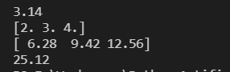
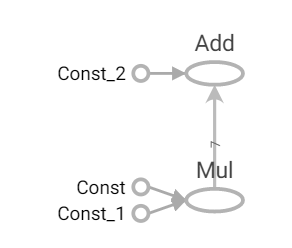
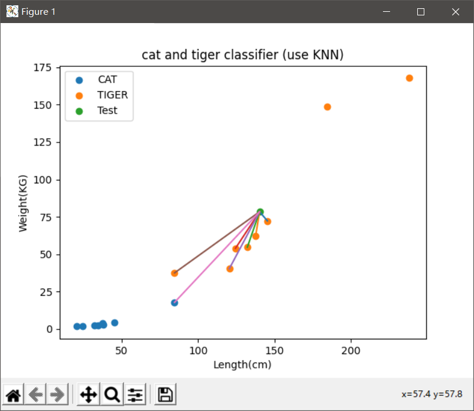
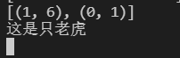
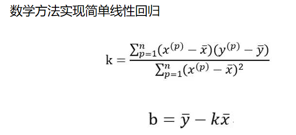
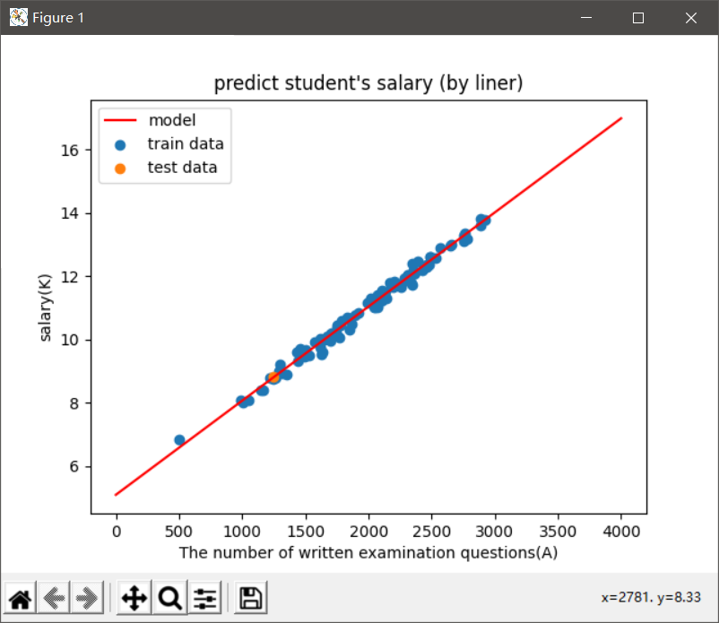

[toc]

# 1 模型分类

## 1.1 离线模型

模型一旦生成，长时间不会发生改变

## 1.2 在线模型

模型随用户数据的变化而变化，是经常发生的

==**一般情况下，离线模型是在训练前转换，在线模型在训练时转换**==

# 2 TensorFlow

Google提供一个开源的深度学习框架(SDK)，这个框架提供了一系列的人工智能的基础函数。这个框架可以用来训练模型，也可以用来使用模型。

## 2.1 如何安装TensorFlow

```bash
pip install tensorflow==1.8.0 -i https://mirrors.aliyun.com/pypi/simple/
```

## 2.2 TensorFlow使用的全是张量

张量是一个泛化的矢量

## 2.3 使用

变量类型不同，不能进行加减乘除，它没有隐式类型转换的功能。==**所有的操作必须放在Session中运行**==

```python
import tensorflow as tf

a = tf.constant(name="a", value=3.14)
b = tf.constant(name="b", value=[2.0, 3.0, 4.0])
c = tf.constant(name="c", value=8.0)

print(type(a), type(b))

s = tf.Session()
print(s.run(a))
print(s.run(b))
''' multiply()乘法 '''
print(s.run(tf.multiply(a, b)))
print(s.run(tf.multiply(a, c)))
s.close()
```

result



```python
import tensorflow as tf

a = tf.constant([3, 4, 5, 6, 7, 8, 9])
b = tf.constant(3)
c = tf.multiply(a, b)
d = tf.constant(4)
e = tf.add(c, d)

with tf.Session() as sess:
    sess.run(c)
    sess.run(e)
    print(sess.run(e))
    ''' 添加下面语句，可以在浏览器中查看执行过程 '''
    tf.summary.FileWriter(logdir="log", graph=sess.graph)
```

1. 先执行程序，会生成一个`log`的文件夹
2. 在cmd中进入到包含`log`文件夹的目录下
3. 执行`tensorboard --logdir="log"`
4. 将`url`复制到浏览器中打开即可



# 3 算法

## 3.1 KNN

又叫K近邻算法，K Nearest Neighbor

### 3.1.1 算法思想

近朱者赤近墨者黑

### 3.1.2 算法的具体实现流程

找距离测试点/事物最近的K(是奇数)个点，查看前K个点的分类情况，数目最多的类别，就是该点的类别

### 3.1.3 什么时候使用

通常用来解决分类问题

### 3.1.4 特点

1. KNN算法没有训练过程，或者说它的训练过程就是让模型记忆所有的数据和标签。
2. KNN只能做较为简单的分类问题
3. 如果训练的数据特别大，且一个样例的属性/特征较多时，容易产生计算和维度灾难。

### 3.1.5 算法实现步骤

1. 先将所有数据传递给模型
2. 模型记录所有数据和标签
3. 输入测试样例
4. 计算测试样例到所有训练集样例的欧式距离
5. 对计算出来的欧式距离进行排序
6. 获取前K个距离最短的样例信息
7. 统计前K个样例的分类信息
8. 返回个数最多的样例类型
9. 该类型就是测试点的类型

```python
import numpy as np
import matplotlib.pyplot as plt
from collections import Counter

'''
    问题：
        老虎和猫如何区分：
        数据：
            体长        体重
            cm(float)   kg(float)

'''


'''
    训练模型的函数
    KNN不需要训练，只需要记忆训练集的数据和标签
'''
def train_model(train_set, train_label):
    return train_set, train_label


'''
    封装一个预测函数
    实现一个KNN的核心算法
'''
def predict_class(test_set, train_set, train_label, K):
    # 第一个存欧式距离的list
    distance = test_set-train_set
    mydist = []
    for a in distance:
        mydist.append(np.sqrt(a[0]**2 + a[1]**2))
    print(distance)
    print(mydist)

    # 对求出的所有欧式距离排序：
    myndist = np.array(mydist)
    sort_d = np.argsort(myndist)
    # sort_d存储的是排序后下标的位置
    print(sort_d)
    myTop = sort_d[:K]
    print(myTop)
    # 获取前K个样本的标签
    topK_Label = train_label[myTop]
    # 统计出前K个样本的标签情况
    nt = Counter(topK_Label)
    ret = nt.most_common()
    # 确定前K个样本中，哪个类别较多
    print(ret)
    if ret[0][0] == 1:
        print("这是只老虎")
    elif ret[0][0] == 0:
        print("这是一只猫")
    # 返回前K个样本在原来训练集中的下标
    return myTop


# 准备数据集
mydata_set = [
    [20.5, 1.7],
    [32.3, 2.5],
    [34.7, 2.4],
    [45.4, 4.3],
    [37.7, 4.1],
    [24.5, 1.9],
    [38.3, 2.8],
    [84.7, 17.8],
    [120.5, 40.3],
    [132.3, 54.7],
    [84.7, 37.5],
    [145.4, 72.3],
    [137.7, 62.1],
    [124.5, 53.9],
    [238.3, 167.8],
    [184.7, 148.8]
]
# 准备数据集的标签
mylabel = [0, 0, 0, 0, 0, 0, 0, 0, 1, 1, 1, 1, 1, 1, 1, 1]

# 获取训练集
mytrain_data = np.array(mydata_set)
# 获取训练集的标签
mytrain_label = np.array(mylabel)
# 获取测试样例
mytest = np.array([140.3, 78.4])

# 进行KNN训练，获取训练集数据和标签
X, Y = train_model(mytrain_data, mytrain_label)
# 使用KNN的预测函数进行分类
myT = predict_class(mytest, X, Y, 7)

# 绘制测试样例，到最近的K个样本的线段
for i in myT:
    plt.plot((mytest[0], mytrain_data[i][0]), (mytest[1], mytrain_data[i][1]))

# 绘制类别0的样本信息
plt.scatter(mytrain_data[mytrain_label == 0, 0],
            mytrain_data[mytrain_label == 0, 1], label="CAT")
# 绘制类表1的样本信息
plt.scatter(mytrain_data[mytrain_label == 1, 0],
            mytrain_data[mytrain_label == 1, 1], label="TIGER")
# 绘制测试样例信息
plt.scatter(mytest[0], mytest[1], label="Test")
plt.title("cat and tiger classifier (use KNN)")
plt.xlabel("Length(cm)")
plt.ylabel("Weight(KG)")
plt.legend()
plt.show()
```

result





## 3.2 线性回归



```
一元线性回归：
	1.数据离散分布，但整体呈现线性特点(具备线性代数的某些函数特点)
	2.使用求导或其他方法获得最优的线性方程，即该线性方程为模型。
	y = w * x + b
	本质上是求y和b
	如何确定最优的w和b，即y的预测值和y的实际值之间的差异最小。

差异如何表示：
	y'：代表预测值
	y ：代表实际值

	loss：代表误差

	误差函数如下：
		loss = (y1 - y1')^2 + (y2 - y2')^2 + ... + (yn-yn')^2
	误差函数也就是我们常说的损失函数。
所以求最优模型，就相当于求损失函数的极值。
而求极值的最简单的方法就是求导

求导可得：
	Xmean
	Ymean
	m = (X1 - Xmean)(Y1 - Ymean) + ... + (Xn - Xnmean)(Yn - Ynmean)
	d = (X1-Xmean)**2 + ... + (Xn - Xnmean)**2
	w = m/d
	b = Ymean - w * Xmean
```

```python
from cProfile import label
import numpy as np
import matplotlib.pyplot as plt


def myliner(X, Y):
    # 求平均值
    Xmean = np.mean(X)
    Ymean = np.mean(Y)
    print(Xmean, Ymean)
    # 求w的方程的分子
    m = np.sum((X-Xmean)*(Y-Ymean))
    print(m)
    # 求w的方程的分母
    d = np.sum((X-Xmean)**2)
    print(d)
    # 求w
    w = m/d
    print(w)
    # 求b
    b = Ymean - w * Xmean
    print(b)
    # 返回w和b
    return (w, b)


def mypredict_salary(ti_n, mymodel):
    return mymodel[0] * ti_n + mymodel[1]


def show_model(mymodel):
    x = np.linspace(0, 4000, 20)
    y = mymodel[0] * x + mymodel[1]
    plt.plot(x, y, label="model", color="red")

#y = 0.003 * x + 5
# x 取值0-3000


x = np.random.normal(2000, 500, 100)
y = x * 0.003 + 5

tx = []
ty = []
for i in range(0, 100):
    # print(i)
    tx.append(np.random.normal(x[i], 50))
    ty.append(np.random.normal(y[i], 0.3))

train_x = np.array(tx)
train_y = np.array(ty)

mymodel = myliner(train_x, train_y)
show_model(mymodel)

mytestn = 1250
mysalary = mypredict_salary(mytestn, mymodel)

plt.scatter(train_x, train_y, label="train data")
plt.scatter(mytestn, mysalary, label="test data")
plt.xlabel("The number of written examination questions")
plt.ylabel("salary(K)")
plt.title("predict student's salary (by liner)")
plt.legend()
plt.show()
```



## 3.3 逻辑回归

是一种分类算法

```
f(x):
	f(x) < 0.5
	f(x) > 0.5
f(x)在线性代数中有一个对应函数，sigmod(x)
h = W*x + b
z = 1 + e^(-h)
目的是求最优的W和b

loss = -y * log(p) - (1-y)log(1-p)

当y = 1时： loss = -log(p)
当y = 0时： loss = -log(1-p)
在实现逻辑回归时，不能使用求导的形式来解决，此时就得反复迭代求得
```

# 4 机器学习常见算法之间的区别

## 4.1 分类算法

解决分类问题的算法

|      | KNN                                                          | 逻辑回归                                     |
| ---- | ------------------------------------------------------------ | -------------------------------------------- |
| 优点 | 简单                                                         | 简单的；<br />具有可解释型；<br />有训练过程 |
| 缺点 | 具有不可解释型；<br />没有训练的过程，训练过程是在记忆训练集和标签，不适合训练集较大的时候使用；<br />当数据量较大时，有计算灾难；<br />当维度多时，没有办法进行欧式距离计算，因此就产生了维度灾难 | 只能实现二分类                               |

==**KNN和逻辑回归都是监督学习**==

## 4.2 回归算法

解决回归问题的算法

### 4.2.1 线性回归

一元线性回归

#### 4.2.1.1 优点

简单

#### 4.2.1.2 适用的领域

研究的问题，特征和值之间的关系不是很复杂，基本的线性关系就能够描述出来