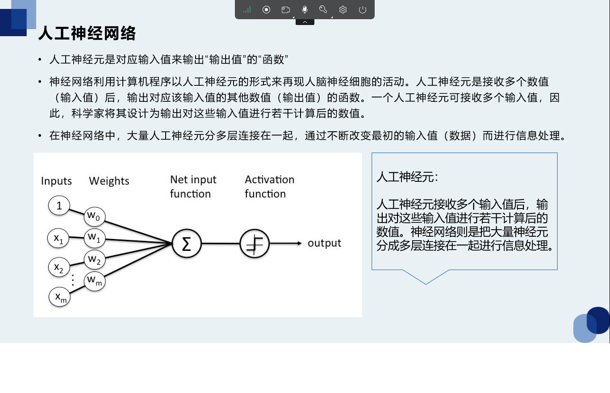
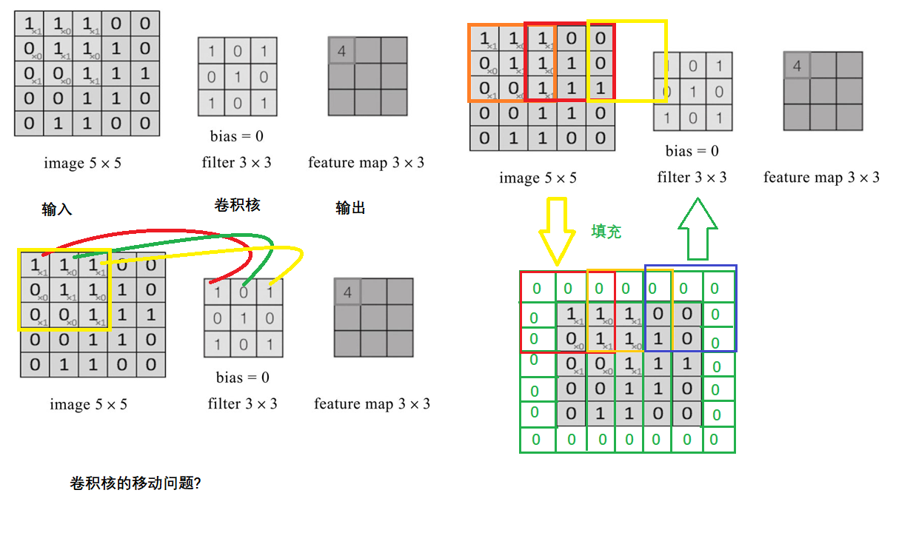

[toc]

# 1 神经网络

## 1.1 神经元结构和工作机制

### 1.1.1 结构

输入端：神经突触(多个)

处理函数：神经元

输出端：神经末梢

关联权重：神经地址

### 1.1.2 工作机制

上层的若干神经元通过神经末梢和神经递质将信号传递给下一个神经元的突触。下一个神经元通过处理将信号通过神经末梢传出，这样多个神经元组成的网络，我们称之为神经网络。

# 2 人工神经网络

## 2.1 人工神经元

科学家对人的神经元结构进行抽象和总结，发现神经元本身具备函数的特质，即为多个输入，一个输出的函数。于是构建人工神经元。



## 2.2 人工神经网络的学习机制

反复调整人工神经元的连接强度。

实际上，人工神经元接收的每个输入值都有一个"权值"(系数)。用人脑的神经细胞来解释的话，权值相当于突触的连接强度。

如果权值大的话，从上一个人工神经元接收的值就会增强。这意味着人工神经元之间信息易于传递。因此，神经网络是通过不断修正权值来改变人工神经元之间的连接强度而进行学习的。

# 3 深度学习中常用算法

1. BP神经网路（是后面算法的基础）

2. 卷积神经网络

   图像识别

   图像处理

3. 循环神经网络

   一般不会单独使用

   是用来解决序列化的问题

4. 基于attention的循环神经网络

   LSTM(基于长短期记忆的循环神经网络)

   - 自动翻译
   - 语音识别
   - 语音合成

   对抗神经网络

# 4 卷积神经网络

神经元函数主要使用卷积运算的神经网络

卷进神经网络发展的低迷期(1990 - 2006)的原因：

1. 多层神经网络在进行BP训练时的计算量非常大，当时的硬件计算能力跟不上
1. 包括SVM(支持向量机)在内的浅层机器学习算法开始崭露头角

2006年，Hinton在《科学》上发表文件，CNN再度觉醒。

2012年，ImageNet大赛上CNN夺冠。

2014年，谷歌研发出20层的VGG模型。同年，DeepFace、DeepID模型横空出世，直接将LFW数据库上的人脸识别、人脸认证的正确率刷到99.75%，已经超越人类的平均水平。

## 4.1 卷积神经网络的结构

### 4.1.1 常用层

- 输入层
- 卷积层
- 池化层
- 全连接层
- 输出层

### 4.1.2 其他层

- 正则化层
- 高级层

## 4.2 卷积层

卷积层是卷积神经网络的核心。

卷积运算又是卷积层的核心。

### 4.2.1 什么是卷积运算

#### 4.2.1.1 功能

卷积可以实现特征放大

卷积可以实现特征降维

### 4.2.2 卷积核如何确定

#### 4.2.2.1 卷积核的大小

反复迭代求得

#### 4.2.2.2 卷积核的内容

反复迭代求得

### 4.2.3 卷积核如何移动

卷积核的移动可以是移动一格，也可以移动多个格子，移动的格子数成为步长。步长也是一个超参数。

### 4.2.4 卷积核通过移动后跟输入矩阵不匹配的问题？

可以使用填充的方式来解决。

#### 4.2.4.1 如何填充

1. 填充0
2. 在矩阵周围按圈填充

### 4.2.5 卷积的过程



### 4.2.6 特殊的卷积核

- 水平边缘过滤器
- 垂直边缘过滤器
- 增强图片中心过滤器

### 4.2.7 如何计算卷积输出矩阵大小

```
[(n + 2p - f)/s] + 1

n:输入矩阵的大小(一般数据集提供的矩阵，长宽是一样的)
p:填充的圈数
f:卷积核的大小
s:步幅
```

### 4.2.8 多通道卷积

```
输入的矩阵是多通道的
卷积和也是多通道的
通常使用多个卷积核组来进行卷积。
卷积的结果个数，取决于卷积核组的个数。
```

### 4.2.9 激活函数

	卷积神经网络与标准神经网络类似，为了保证其非线性，也需要使用激活函数，即在卷积运算后，把输出值另加偏移量，输入到激活函数，然后作为下一层的输入，如下图所示：常用的激活函数有：tf.sigmoid、tf.nn.relu、tf.tanh、tf.nn.dropput等….

在人工智能中，智能反复迭代求得的参数，统称为超参数。

```
320x240 3 通道

76800 * 3 = 230400
		图像裁剪
320 x 240  ------------> 240 x 240 = 57600 

240 x 240 --------------> 118 x 118 = 13924
			卷积 
			n = 240
			f = 5
			s = 2
			p = 1
			
118 x 118 -------------> 	59 x 59 = 3481
			最大池化(2x2)
			
relu激活
59 * 59 --------------> 27 x 27 = 729
		卷积(5x5)
		n = 59
		f = 5
		s = 2
		
27 x 27 ----------------> 9 x 9
		最大池化(3x3)
sigmod激活
全连接：81维度的特征向量
而真正的结果是3个81维度的特征向量
```

## 4.3 人工智能中常见的问题

### 4.3.1 过拟合问题

特征值太多，无法正确识别，模型泛化能力较低。
例子：白马非马

### 4.3.2 欠拟合问题

特征值太少，导致无法正确识别。
例子：指鹿为马

## 4.4 池化层

```
池化(Pooling)又称为下采样，通过卷积层获得图像的特征后，理论上可以直接使用这些特征训练分类器(如softmax)。
但是，这样做将面临巨大的计算量的挑战，而且容易产生过拟合的现象。为了进一步降低网络训练参数及模型的过拟合程度，需要对卷积层进行池化/采样(Pooling)处理，池化/采样的方式通常有以下三种：
最大池化(Max Pooling):选择Pooling窗口中的最大值作为采样值。
均值池化(Mean Pooling):将Pooling窗口中的所有值相加取平均，以平均值作为采样值。
随机池化:借概率的方法，确定选择哪一项。
```

## 4.5 特殊的卷积神经网络

## 4.6 串联型

Le-Net 5

## 4.7 并联型

GoogleNet

# 2 opencv采集图片

安装

```
pip install opencv-python -i https://mirrors.aliyun.com/pypi/simple/
```

```python
import cv2 as cv

''' 打开摄像头 '''
cap = cv.VideoCapture(0)
while True:
    ''' 读取摄像头采集到的图片 '''
    ret,img = cap.read()
    ''' 打开一个窗体 '''
    cv.namedWindow("test",cv.WINDOW_AUTOSIZE)
    ''' 显示采集到的图片 '''
    cv.imshow("img", img)
    ''' 按a退出 '''
    if cv.waitKey(1) & 0xFF == ord('a'):
        break
cv.destroyAllWindows()
cap.release()
```

```python
import cv2 as cv

class_xml_path = "D:\\Environment\\Python\\Lib\\site-packages\\cv2\\data\\"
face_class_xml = class_xml_path + "haarcascade_frontalface_default.xml"

''' 打开摄像头 '''
cap = cv.VideoCapture(0)
face_c = cv.CascadeClassifier(face_class_xml)
while True:
    ''' 读取摄像头采集到的图片 '''
    ret, img = cap.read()
    ''' 打开一个窗体 '''
    # cv.namedWindow("test", cv.WINDOW_AUTOSIZE)
    ''' 转成灰度 '''
    gray_img = cv.cvtColor(img, cv.COLOR_RGB2GRAY)
    faces = face_c.detectMultiScale(gray_img, 1.3, 5)
    print(faces)
    for (x, y, w, h) in faces:
        img = cv.rectangle(img, (x,y), (x+w,y+h),(255,0,0),2)
    ''' 显示采集到的图片 '''
    cv.imshow("pic", img)
    ''' 按q退出 '''
    if cv.waitKey(1) & 0xFF == ord('q'):
        break
cv.destroyAllWindows()
cap.release()
```
