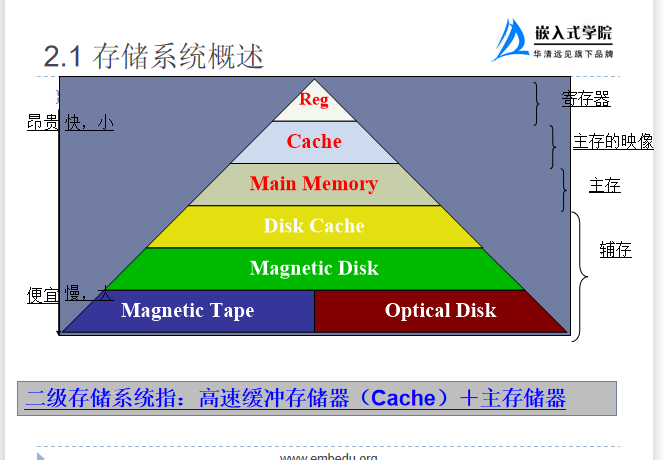
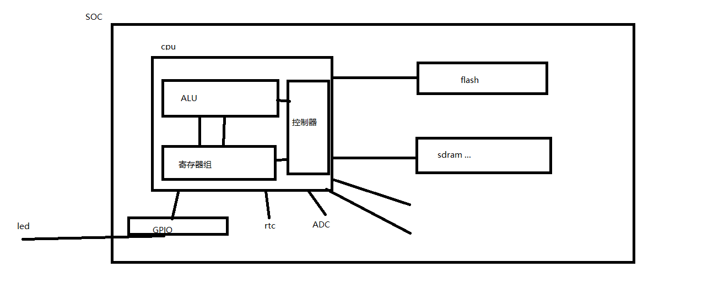
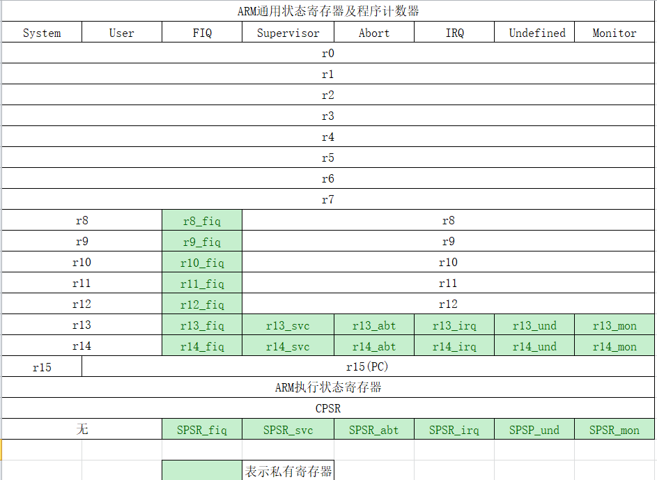
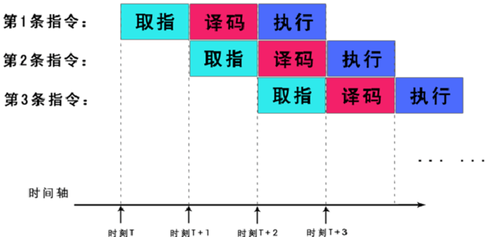
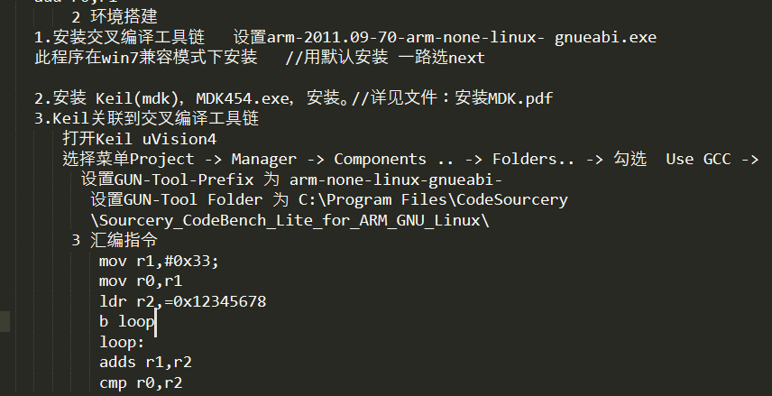
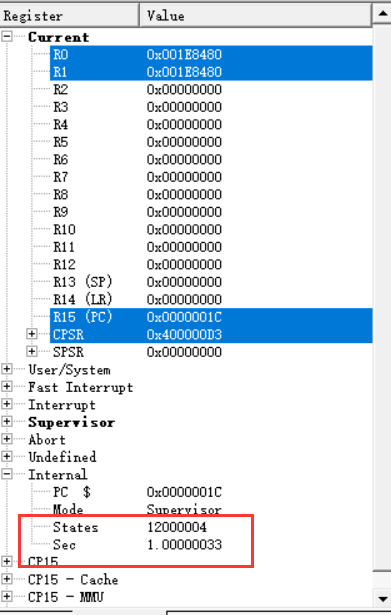

[toc]

# 1 ARM相关介绍

## 1.1 嵌入式系统

嵌入式软件 + 嵌入式硬件

### 1.1.1 嵌入式软件

裸机：APP

非裸机：OS + APP

### 1.1.2 嵌入式硬件

输入设备、输出设备、存贮器、控制器、运算器、总线

#### 1.1.2.1 存贮器

用来存放程序和数据的部件，是设备的记忆装置

包括：辅助存贮器、主存贮器、高速缓存器、寄存器

##### 1.1.2.1.1 辅助存贮器

硬盘、U盘、软盘、光盘、SD卡

==**CPU不能直接访问**==

##### 1.1.2.1.2 主存贮器

内存(sdram)，CPU可以直接访问

##### 1.1.2.1.3 高速缓冲区

cache，CPU可以直接访问

##### 1.1.2.1.4 寄存器

用来存放CPU在运算过程中的数据和结果值，CPU可以直接访问



#### 1.1.2.2 控制器

是整个嵌入式设备的指挥中心

#### 1.1.2.3 运算器

ALU，是信息进行处理和运算的部件

#### 1.1.2.4 总线

bus，连接嵌入式设备的各个模块；传送数据

##### 1.1.2.4.1 按照位置分类

- 片内总线
- 片外总线

##### 1.1.2.4.2 按照功能分类

- 数据总线
- 控制总线
- 地址总线

##### 1.1.2.4.3 按照布局分类

- 单总线
- 多总线



#### 1.1.2.5 图解

```
CPU = 控制器 + 运算器 + 寄存器组(通用)
SOC(system on chip) = CPU + 外围组件
```

## 1.2 原理图

### 1.2.1 flash

```
nor flash  --->  存贮数据 + 运行程序
nand flash --->  存贮数据
```

## 1.3 ARM体系结构

### 1.3.1 ARM是什么

1. ARM是一个公司的名称，ARM公司，该公司的主要业务是设计处理器内核。

   ```
   处理器内核 = 控制时序电路 + arm指令集/thumb指令集 + 处理器架构
   ```

2. ARM代表一款处理器的架构，ARM不是芯片，ARM公司向芯片厂商提供内核，芯片厂商用arm内核加上外围组件设计出不同的处理器芯片

### 1.3.2 ARM的编程模型

ARM内核采用的是32位(32位是指CPU一次处理的能力是32bit)架构

```
Byte : 8 bits
Halfword : 16 bits(2 byte)
Word : 32 bits(4 byte)
Doubleword 64 bits(8 byte)(Cortex-A处理器)
大部分ARM core提供:
ARM指令集(32 bit)  -->  ARM态
Thumb指令集(16 bit) --> Thumb态
```

### 1.3.3 ARM内核的状态

#### 1.3.3.1 ARM态

```
ARM启动后默认是ARM态 --> ARM指令集
```

#### 1.3.3.2 Thumb态

```
Thumb态 --> 可以从ARM态切换到Thumb态 -->Thumb指令集
```

### 1.3.4 ARM内核的工作模式

```
User(用户模式) : 非特权模式，大部分任务执行在这种模式
FIQ(快速中断模式) : 当一个高优先级(fast)中断产生时将会进入这种模式
IRQ(外部中断模式) : 当一个低优先级(normal)中断产生时将会进入这种模式
Supervisor(特权模式) : 当复位或软中断指令执行时将会进入这种模式
Abort(数据访问终止模式) : 当存取异常时将会进入这种模式
Undef(未定义指令终止模式) : 当执行未定义指令时会进入这种模式
System(系统模式) : 使用和User模式相同寄存器集的特权模式
Cortex-A特有模式:Monitor(监控模式) : 是为了安全而扩展出的用于执行安全监控代码的模式，也是一种特权模式
```

### 1.3.5 寄存器

作用：用于在指令执行过程中，存放运算数据和结果值的容器

#### 1.3.5.1 ARM内核提供的寄存器容量多大

```
普通的ARM有37个寄存器(通用寄存器),每一个寄存器的容量是4byte,总容量=37*4=148byte
contex-A的ARM内核有40个寄存器,每一个寄存器的容量是4byte,总容量=40*4=160byte
```

#### 1.3.5.2 如何标识寄存器



40个寄存器中有5类特殊寄存器，用来辅助运算

```
r13(sp)栈指针: 存放sp栈指针
r14(lr)链接寄存器 : 在执行中断或函数调用时保存当前执行指令的下一条指令地址
r15(pc)程序计数器 : pc程序的取值位置
cpsr : 当前程序状态寄存器，保存的是当前处理器的状态信息
spsr : 是cpsr的备份寄存器，通常在中断或异常时使用
```

### 1.3.6 PSR

CPSR/SPSR共32bit，每一个bit位都有其特殊的含义：

```
31bit(N):
	N=1,表示运算结果为负
	N=0,表示运算结果为正数或0
30bit(Z):
	Z=1,表示运算结果为0
	Z=0,表示运算结果为非0
29bit(C):进位/借位标志
	加法：有进位C=1;无进位C=0
	减法：有借位C=0;无借位C=1
28bit(V):
	V=1,ALU运算溢出

0-4bit:ARM内核的工作模式位
    10000  User mode;    
    10001 FIQ mode;          
    10011 SVC mode;
    10111  Abort mode;  
    11011 Undfined mode; 
    11111 System mode;  
    10110  Monitor mode;  
    10010 IRQ
```

### 1.3.7 指令流水线

```assembly
mov r0,#5
```

```
cpu--->0101--->处理-->分成三个阶段：取指--》译码--》执行
ARM内核处理指令可以使用指令流水线的方式处理，它是将一条指令的处理分成多个阶段（3个阶段）：取指 译码 执行
```



```
ARM内核不能同时对3条指令做取值动作，但是可以对第三条指令做取指时，对第二条指令做译码，同时对第一条指令做执行动作，从而达到相对意义上的并行
注意：三级流水线是最佳流水线
cpu的工作就是周期性的去处理指令（取指 译码 执行）
周期性：看cpu的主频，2.3Ghz,指该cpu在1s钟内取2.3G条指令来处理
取指：去存贮器中取，每次取32bit(刚好是一条ARM指令)
```

# 2 环境搭建

```
1.安装交叉编译工具链
```



# 3 汇编程序，程序运行时间耗时1s

```assembly
.text  
.global _start
_start:
mov r0,#0
ldr r1,=0x1E8480
@ 编写一个程序，实现程序运行时间是1s
loop1:
	add r0,#1
	cmp r0,r1
	beq loop2
	bne loop1
loop2:
.end
```

result

