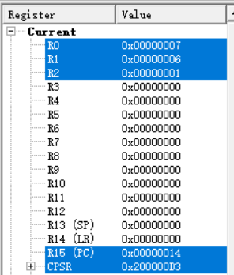
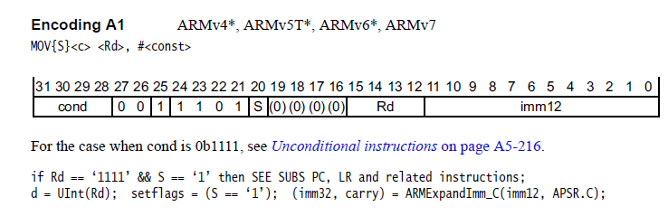
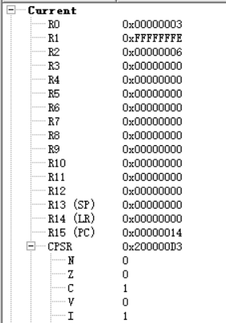
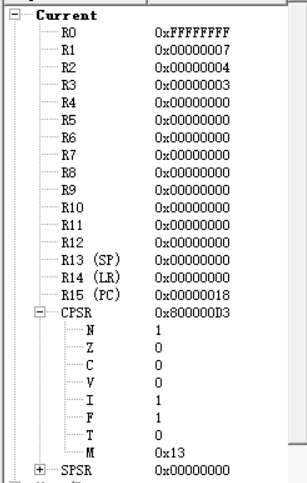
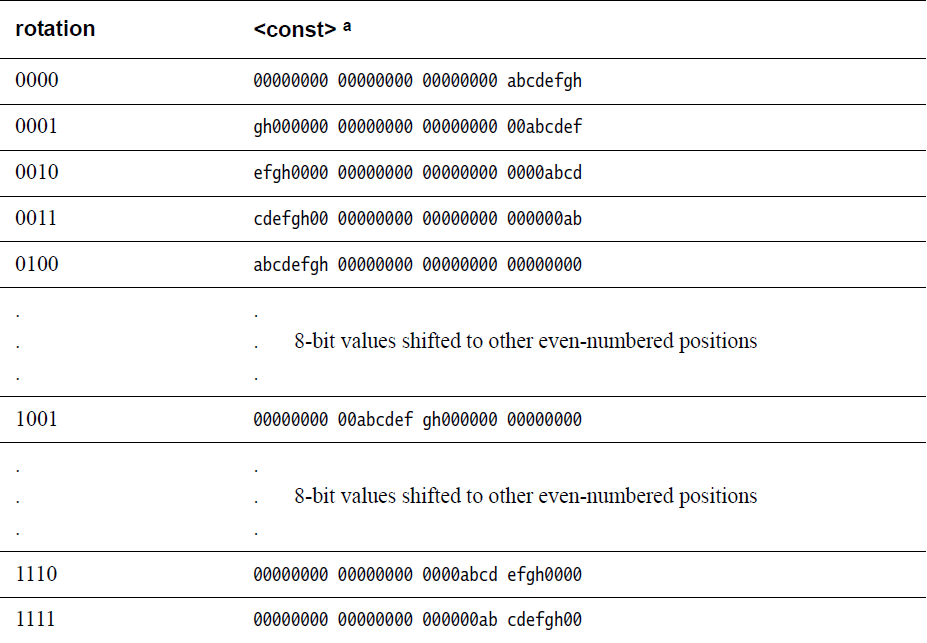
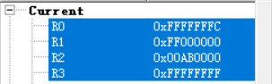
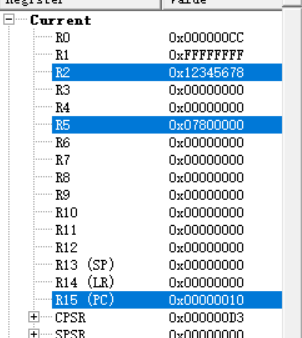
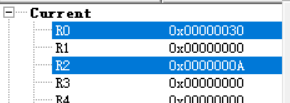
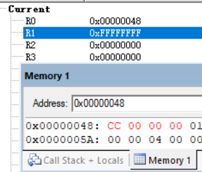
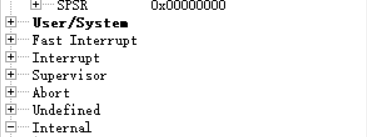

[toc]

# 1 条件码助记符

| 条件码 | 助记符后缀 | 标志          | 含义               |
| ------ | ---------- | ------------- | ------------------ |
| 0000   | EQ         | Z = 1         | 相等               |
| 0001   | NE         | Z = 0         | 不相等             |
| 0010   | CS         | C = 1         | 无符号数大于或等于 |
| 0011   | CC         | C = 0         | 无符号数小于       |
| 0100   | MI         | N = 1         | 负数               |
| 0101   | PL         | N = 0         | 正数或零           |
| 0110   | VS         | V = 1         | 溢出               |
| 0111   | VC         | V = 0         | 未溢出             |
| 1000   | HI         | C =1，Z = 0   | 无符号数大于       |
| 1001   | LS         | C = 0，Z = 1  | 无符号数大于或等于 |
| 1010   | GE         | N = V         | 带符号数大于或等于 |
| 1011   | LT         | N != V        | 带符号数小于       |
| 1100   | GT         | Z = 0，N = V  | 带符号数大于       |
| 1101   | LE         | Z = 1，N != V | 带符号数小于或等于 |
| 1110   | AL         | 任何          | 无条件执行         |

==**可以加在任何一条ARM指令后使用，但是不能单独使用**==

```assembly
.text
.global _start
_start:
@ 条件码
mov r0,#7
mov r1,#6
cmp r0,r1
movge r2,#1
movlt r2,#2

.end
```

result



# 2 指令机器码

每一条ARM指令都会被编译成机器能识别的二进制格式，这种二进制格式的指令称为指令机器码。

```
E3A01005   <=====>    mov r1,#5
1110 0011 1010 0000 0001 0000 0000 0101

28 - 31bit : 条件码 
20bit : S位,标志码
12 - 15bit : 存放目标寄存器的编号
0 - 11bit : 存放第二个操作数值

movge r5,#0xcc   <=====>   A3A050cc 
```



# 3 数据处理指令

| 助记符 | 操作         |
| ------ | ------------ |
| MOV    | 数据传送     |
| MVN    | 数据取反传送 |
| ADD    | 加           |
| ADC    | 带进位的加   |
| SUB    | 减           |
| SBC    | 带借位的减   |
| RSB    | 逆向减       |
| RSC    | 带借位逆向减 |
| AND    | 逻辑与       |
| ORR    | 逻辑或       |
| EOR    | 异或         |
| BIC    | 位清0        |
| CMP    | 比较         |
| CMN    | 取反比较     |
| TST    | 位测试       |
| TEQ    | 测试相等     |

```tex
算术指令：ADD、ADC、SUB、SBC、RSB、RSC
逻辑指令：AND、ORR、EOR、BIC
比较指令：CMP、CMN、TST、TEQ
数据搬移：MOV、MVN
```

```assembly
.text
.global _start
_start:

mov r0,#5
ldr r1,=0xFFFFFFFE
mov r2,#2
adds r0,r1		@ adds是指有进位的时候CPSR中的C位显示，加法有进位C=1，无进位C=0
adc r2,r0		@ r2 = r2 + r0 + c

.end
```

result



```assembly
.text
.global _start
_start:

mov r0,#6
mov r1,#7
subs r0,r1		@ subs是指有借位的时候CPSR中的C位显示，减法，有借位C=0，无借位C=1
mov r2,#8
mov r3,#3
sbc r2,r3		@ r2 = r2 - r3 -!c

.end
```

result



```assembly
.text
.global _start
_start:

mov r0,#0xFF
mov r1,#0xF0
@and r0,r1   @32位数的逻辑与
@orr r1,r0   @32位数的逻辑或
@eor r1,r0    @32位数的逻辑异或
@bic r0,#0x1   @32位数逻辑位清零，第一个操作数是被清的操作数，第二个操作数指明清哪些位
@bic r0,#0x2
@bic r0,#0xF0
ldr r2,=0x12FFFFFF
bic r2,#0xFF000000
bic r2,#0x8000
.end
```

```assembly
.text
.global _start
_start:

mov r0,#0x5
mov r1,#0x6
cmn r0,r1			@ 取反比较
movge r2,#1
movlt r2,#2

@ result r2 = 0x00000001
.end
```

```assembly
.text
.global _start
_start:

mov r0,#0
tst r0,#0x3		@ CPSR中的Z=0不为空，Z=1为空

@ result Z     1
.end
```

# 4 合法立即数

## 4.1 立即数

汇编指令中操作是一个小于等于32bit位的数就是立即数

## 4.2 合法立即数

该立即数中最多只有8个bit位是有效位，其他位为0

```
0xFFFFFFF    是一个特殊的合法立即数
```

mov指令可以将合法的立即数装载到通用寄存器中去

### 4.2.1 为什么要求mov指令装载的立即数是合法立即数

一条mov指令的指令宽度总共32bit，需要有条件码、操作码位、S位、目标寄存器存放位、立即数位。立即数位只占8bit。

### 4.2.2 如何判断一个立即数是一个合法的立即数

1. 看该立即数是否有连续24个0，若有该数就是一个合法的立即数
2. 循环右移偶数位

## 4.3 轮换规则



```
注意：
mov指令的机器码格式中，0 ~ 7bit存放合法立即数的有效位，8 ~ 11bit存放轮换规则，轮换规则决定了合法立即数的样式 2^4 = 16
```

```assembly
.text
.global _start
_start:

@ 合法立即数
mvn r0,#0x3
mov r1,#0xFF000000
mov r2,#0x00AB0000
mov r3,#0xFFFFFFFF

.end
```



# 5 ldr伪指令

```assembly
@ 指令格式
ldr r0,=<const>
```

ldr伪指令可以被编译成以下两种情况：

1. mov或mvn

   ```
   小于8bit
   ldr r0,=0xcc  相当于  mov r0,#0x00000cc
   极端数0xffffffff
   ldr r1,=0xFFFFFFFF  相当于  mvn r1,#0x00000000
   ```

2. ldr汇编指令

   ```
   大于0xff小于0xffffffff
   ldr r2,=0x12345678  相当于  ldr r2,[pc,#-0x00004]
   []:相当于*[地址]  --->  取该地址的内容
   存放0x12345678的位置称为数据池
   数据池 = pc + 8 + 偏移  -->  地址(指令从取值到执行经历了两个指令周期，两个指令周期的指令地址差了8个字节)
   取数据池位置处的值赋给R2  相当于   r2 = [数据池]
   ```

```assembly
.text
.global _start
_start:

ldr r0,=0xcc
ldr r1,=0xFFFFFFFF
ldr r2,=0x12345678

.end
```



# 6 移位指令

| 指令 | 作用                                  |
| ---- | ------------------------------------- |
| LSL  | 带符号的逻辑左移，低位补0             |
| LSR  | 带符号数的逻辑右移，高位补0           |
| ASR  | 右移，高位用原数的第31位(符号位)填充  |
| ROR  | 循环右移，r1的高位用移出的数填充      |
| RRX  | 右移一位，高位用C填充，C是上一次的C位 |

```assembly
.text
.global _start
_start:

mov r1,#0x7000000F
@ 指令加s是指显示影响标志码
@lsls r1,#1		@ 带符号的逻辑左移，低位补0
@lsrs r1,#1		@ 带符号数的逻辑右移，高位补0
@asr r1,#1		@ 右移，高位用原数的第31位(符号位)填充
@ror r1,#1		@ 循环右移，r1的高位用移出的数填充
@rrxs r1,r1		@ 右移一位，高位用C填充，C是上一次的C位
rrx r1,r1		

.end
```

# 7 分支指令

| 助记符 | 说明                   |
| ------ | ---------------------- |
| B      | 跳转指令               |
| BL     | 带返回的连接跳转       |
| BX     | 跳转并切换状态         |
| BLX    | 带返回的跳转并切换状态 |

```
b   标号(地址)
bl  标号(地址)
b的跳转范围 : 0x000000 ~ 0x3FFFFFC
标号的范围:0 - 23bit位，相当于FFFFFF，可以表示2^24个地址，每一个指令占4个字节，跳转最少要跨越4个地址单元，所以低两位[0 - 1]不能有值，所以处理器将该标号左移两位，腾出低两位不用，所以用26bit位来存放标号，26bit位可以表示2^26个地址，那么B指令的跳转范围最大就是64Mbyte，由于可以往上跳也可以往下跳，所以B的跳转范围就是 ±32Mbyte
2^26 = 2^20 x 2^6 = 64 x 2^10 x 2^10 = 1M x 64 = 64Mbyte
```

# 8 单寄存器传送指令

==**模拟的芯片是小端**==

| 指令 | 作用                           |
| ---- | ------------------------------ |
| LDR  | 从内存中取四个字节放到寄存器中 |
| LDRH | 从内存中取两个字节放到寄存器中 |
| LDRB | 从内存中取一个字节放到寄存器中 |
| STR  | 从寄存器中取四个字节放到内存中 |
| STRH | 从寄存器中取一个字节放到内存中 |
| STRB | 从寄存器中取两个字节放到内存中 |

```assembly
.text
.global _start
_start:

mov r0,#0x0
ldr r1,[r0]
ldr r2,=buf3
@str r1,[r2,#4]!				@ 前索引用法，先更新地址再赋值，相当于++i，!自动更新基址地址
str r1,[r2],#4					@ 后索引用法，先赋值再更新基址地址

.data
	buf:
		.space 16			@ 定义一个连续16位的地址空间
	buf1:
		.word 0xFF			@ int
		.word 0x01
		.word 0x02,0x03,0xFFFFFFFF,0x12345678
	buf2:
		.byte 'a'			@ char
		.byte 'b'
		.byte 'c'
		.byte 'd'
	buf3:
		.string "dddddddddd"		@ string
.end
```

## 8.1 案例

定义一个数组，计算出数组中所有元素的累加和

```assembly
.text
.global _start
_start:
ldr r0,=buf
mov r1,#0
mov r2,#0

loop:
	ldr r1,[r0],#4
	cmp r1,#0
	beq stop
	add r2,r1
	b loop
stop:
	nop

.data
	buf:
		.word 0x1,0x2,0x3,0x4,0x0
.end
```



# 9 块传送指令

一次可以传送多个寄存器的内容到一片内存，或者将一片内存的内容传送到多个寄存器中去

| 指令 | 作用                                     |
| ---- | ---------------------------------------- |
| LDM  | 将多个内存单元内容传送到多个寄存器中去   |
| STM  | 将多个寄存器的内容传送到多个内存单元中去 |

使用块传送指令需要加后缀，后缀表示传送方向，表明是从小地址往大地址方向传送数据，还是从大地址往小地址传送数据

## 9.1 后缀

| 后缀 | 意义              | 等价 | 方向              |
| ---- | ----------------- | ---- | ----------------- |
| IA   | 每次传送后地址加4 | i++  | 小地址 --> 大地址 |
| IB   | 每次传送前地址加4 | ++i  | 小地址 --> 大地址 |
| DA   | 每次传送后地址减4 | i--  | 大地址 --> 小地址 |
| DB   | 每次传送前地址减4 | --i  | 大地址 --> 小地址 |
| FD   | 满递减堆栈        |      |                   |
| ED   | 空递减堆栈        |      |                   |
| FA   | 满递增堆栈        |      |                   |
| EA   | 空递增堆栈        |      |                   |

前面四种用于数据块的传输，后面四种是堆栈操作

```
LDMIA = LDMFD	出栈指令     内存 --> 寄存器
STMDB = STMFD	压栈指令     寄存器 --> 内存
```

```assembly
.text
.global _start
_start:

.if 0
ldr r0,=buf
@ 将多个内存单元内容传送到多个寄存器中去，之后基址地址加4    出栈
@ldmia r0!,{r1-r3,r8,r9}
@ 基址地址加4后，将多个内存单元内容传送到多个寄存器中去
ldmib r0!,{r1-r5}
.endif

ldr r0,=bufend
@ 将多个内存单元内容传送到多个寄存器中去，之后基址地址减4
@ldmda r0!,{r1-r5}
@ 基址地址减4后，将多个内存单元内容传送到多个寄存器中去
ldmdb r0!,{r1-r5}

.data
	buf:
		.word 0x1,0x2,0x3,0xFF,0xFFFFFFFF,0x12345678
	bufend:

.end
```

```assembly
.text
.global _start
_start:

.if 0
ldr r0,=buf
@ 将多个内存单元内容传送到多个寄存器中去，之后基址地址加4    出栈
@ldmia r0!,{r1-r3,r8,r9}
@ 基址地址加4后，将多个内存单元内容传送到多个寄存器中去
ldmib r0!,{r1-r5}
.endif

ldr r0,=bufend
@ 将多个内存单元内容传送到多个寄存器中去，之后基址地址减4
@ldmda r0!,{r1-r5}
@ 基址地址减4后，将多个内存单元内容传送到多个寄存器中去
ldmdb r0!,{r1-r5}

.if 0
ldr r6,=buf1
@ 将多个寄存器的内容传送到多个内存单元中去，之后基址地址加4
@stmia r6!,{r1-r5}
@ 基址地址加4后,将多个寄存器的内容传送到多个内存单元中去
stmib r6!,{r1-r5}
.endif

ldr r6,=buf1end
@ 将多个寄存器的内容传送到多个内存单元中去，之后基址地址减4
@stmda r6!,{r1-r5}
@ 基址地址减4后,将多个寄存器的内容传送到多个内存单元中去 
stmdb r6!,{r1-r5}

stmfd r6!,{r1-r5}			@ 压栈

.data
	buf:
		.word 0x1,0x2,0x3,0xFF,0xFFFFFFFF,0x12345678
	bufend:
	buf1:
		.space 60
	buf1end:

.end
```

# 10 软交换指令

==**原子操作指令**==

原子操作：是指在执行这条指令的过程中，任何中断都不能打断它

| 指令 | 作用     |
| ---- | -------- |
| SWP  | 字交换   |
| SWPB | 字节交换 |

```assembly
.text
.global _start
_start:

ldr r1,=0xcc
ldr r0,=buf
swp r1,r1,[r0]

.data
	buf:
		.word 0xFFFFFFFF

.end
```

result



# 11 状态寄存器传输指令

| 指令 | 作用                                                         |
| ---- | ------------------------------------------------------------ |
| MRS  | 把程序状态寄存器的值送到一个通用寄存器                       |
| MSR  | 把通用寄存器的值送到程序状态寄存器或把一个立即数送到程序状态寄存器 |

**==使用指令不能从用户模式切换到特权模式==**

## 11.1 案例 -- 特权模式切换到用户模式

```assembly
.text
.global _start
_start:

@ 将程序寄存器的值传送到r0通用寄存器中
mrs r0,cpsr
@ 将低五位清0
bic r0,#0x1F
orr r0,#0x10
@ 将通用寄存器的值，送到程序状态寄存器
msr cpsr,r0

.end
```


