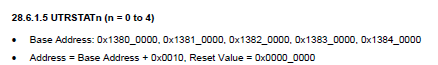

[toc]

# 1 ARM裸机编程

## 1.1 开发步骤

1. 需求分析
2. 查看原理图
3. 查芯片手册
4. code

# 2 GPIO接口编程

## 2.1 目标

LED2闪烁

## 2.2 需求分析

### 2.2.1 查看LED2和主控芯片是如何连接的

```
LED2(CHG_COK)--->CON2--->CON1-->U1A(gpx2_7)
```

### 2.2.2 查看芯片手册

```
6.2.3.202  
GPX2CON 0x11000C40 (28-31)0x1-->输出模式

6.2.3.203  
GPX3DAT   0x11000C44 (7)1/0--->高低电平
```

### 2.2.3 代码

1. 初始化LED2
2. 设置LED2亮
3. 设置LED2灭
4. 延时

## 2.3 编译led.s

在虚拟机中用交叉编译工具链编译`arm-none-linux-gnueabi-gcc`，若没有虚拟机中交叉编译工具，需要安装

### 2.3.1 安装交叉编译工具

```shell
# 在家目录下创建文件夹
mkdir toolchain
# 将gcc-4.6.4.tar.xz拷贝到toolchain中
tar -xvf gcc-4.6.4.tar.xz
cd gcc-4.6.4/bin/
pwd
cd
vim .bashrc
# 在最后一行下面添加
export PATH=$PATH:/home/hqyjxa/toolchain/gcc-4.6.4/bin
# 保存退出
source .bashrc
# 随便进入一个目录，输入arm-n，按tab键能补全为arm-none-linux-gnueabi-，说明是OK的

# 注意这个只是对普通的用户有效，不一定全部的都有效，比如root用户
# 编辑/etc/sudores可以让所有的用户生效，包括root用户，将环境变量的路径添加到其中
Defaults        secure_path="/usr/local/sbin:/usr/local/bin:/usr/sbin:/usr/b    in:/sbin:/bin:/snap/bin:/home/hqyjxa/toolchain/gcc-4.6.4/bin"
```

## 2.4 拨码开关

```
1000				SD卡
0110				flash
```

## 2.5 实现流水灯

### 2.5.1 start.s

```assembly
.text
.global _start
_start:

b main

.end
```

### 2.5.2 main.c

```c

#define GPX2CON (*(volatile unsigned int *)0x11000C40)
#define GPX2DAT (*(volatile unsigned int *)0x11000C44)

#define GPX1CON (*(volatile unsigned int *)0x11000C20)
#define GPX1DAT (*(volatile unsigned int *)0x11000C24)

#define GPF3CON (*(volatile unsigned int *)0x114001E0)
#define GPF3DAT (*(volatile unsigned int *)0x114001E4)


void InitLed()
{
	// 28 - 31bit清0，配置GPX2_7为输出模式
	GPX2CON = GPX2CON&~(0xF<<28) | (0x1<<28);
	// 0 - 3bit清0，配置GPX1_0为输出模式
	GPX1CON = GPX1CON&~(0xF) | (0x1);	
	// 16 - 19bit清0，配置GPF3_4为输出模式
	GPF3CON = GPF3CON&~(0xF<<16) | (0x1<<16);
	// 20 -23bit清0，配置GPF3_5为输出模式
	GPF3CON = GPF3CON&~(0xF<<20) | (0x1<<20);
}

/* 置1 */
void Led2On()
{
	GPX2DAT = GPX2DAT | (0x1<<7);
}

/* 清0 */
void Led2OFF()
{
	GPX2DAT = GPX2DAT & ~(0x1<<7);
}


void Led3On()
{
	GPX1DAT = GPX1DAT | (0x1);
}

void Led3OFF()
{
	GPX1DAT = GPX1DAT & ~(0x1);
}


void Led4On()
{
	GPF3DAT = GPF3DAT | (0x1<<4);
}

void Led4OFF()
{
	GPF3DAT = GPF3DAT & ~(0x1<<4);
}

void Led5On()
{
	GPF3DAT = GPF3DAT | (0x1<<5);
}

void Led5OFF()
{
	GPF3DAT = GPF3DAT & ~(0x1<<5);
}


void Delay()
{
	int i = 0;
	for(; i < 1000000; i++)
	{
		;
	}
}

void lamp()
{
	Led2On();
	Delay();
	Led2OFF();
	Delay();
	
	Led3On();
	Delay();
	Led3OFF();
	Delay();
	
	Led4On();
	Delay();
	Led4OFF();
	Delay();
	
	Led5On();
	Delay();
	Led5OFF();
	Delay();
}


int main()
{
	InitLed();
	while(1)
	{
		lamp();
	}
	return 0;
}
```


在共享文件(linux)下拷贝map.lds和makefile文件


将板子上电，在0秒之前快速按下回车键，在超级终端上执行

```shell
loadb 0x40008000
# 在超级终端中选择菜单 --> 传送 --> 发送文件 --> 选择文件名(ledc.bin) --> 选择协议(Kermit) --> 点击“发送” --> 发送成功显示(如下图)
```


```shell
go 0x40008000
# 观察板子的效果，实现流水灯效果
```

# 3 UART

通用异步收发器 --> 串口

## 3.1 串口相关

### 3.1.1 并行通信

一个时钟脉冲，可以往外并行发送多个数据

### 3.1.2 串行通信

一个时钟脉冲，只能发送一个字节数据

### 3.1.3 bps(比特率)

一秒钟传送bit位的个数

### 3.1.4 波特率

一秒钟传送码元的个数

### 3.1.5 码元

是一个数据单位，一个码元可以携带多个二进制数据位

```
1码元 = 1bit/2bit/4bit
当1码元 = 1bit时
波特率 = 比特率
```

### 3.1.6 同步通信

是指数据传送是以数据块(多个字符)为单位，字符和字符之间、字符内部的位与位之间都是同步的(有同步时钟)

### 3.1.7 异步通信

是指数据传送是以字符为单位，字符和字符之间的传送是完全异步的，字符内部的位与位之间的传送是基本同步的

## 3.2 目标

用uart实现字符的回显

### 3.2.1 分析

```
从pc这侧给uart.bin发送字符a,uart.bin通过串口给pc回传a
```

## 3.3 实现步骤

### 3.3.1 看原理图

```
uart2(CON7) ---> U3(UART_AUDIO_TXD) ---> CON4 ---> CON3 --> U1A(gpa1_1/gpa1_0)
```

### 3.3.2 配置串口

#### 3.3.2.1 配置管脚GPA1_1/GPA1_0功能为uart模式

```
6.2.2.7
GPA1CON 0x11400020 (4-7bit)0x2 (0-3bit)0x2
```


#### 3.3.2.2 配置uart收发数据的格式(奇偶位 停止位 数据位)

```
28.6.1.1
ULCON2 0x1382000 (6bit)0 (3-5bit)0xx (2)0 (0-1)0x3
```


#### 3.3.2.3 配置uart的波特率

```
波特率 --> 115200

DIV_VAL:波特率因子
DIV_VAL = (SCLK_UART/(bps * 16)) - 1

已知：
	SCLK_UART --> 外部时钟频率 = 100Mhz
	bps --> 波特率 = 115200
	DIV_VAL = (100M / (115200 * 16)) - 1 = 53.25
	
UBRDIV2用来存放波特率因子的整数部分
UFRACVAL2用来存放波特率因子的小数部分 * 16
```

```
28.6.1.11
UBRDIV2 0x13820028 (0-15bit)53
```


```
28.6.1.12
UFRACVAL2 0x1382002C (0-3bit) 0.25*16=4
```


#### 3.3.2.4 配置uart收发数据的方式

中断或轮询方式

```
28.6.1.2
UCON2 0x13820004 (2-3bit)0x1 (0-1bit)0x1	
```


### 3.3.3 数据的收发

#### 3.3.3.1 数据从哪里收，哪里发

收

```
28.6.1.10
URXH2  0x13820024  (0-7bit)
```


发

```
28.6.1.9
UTXH2   0x13820020  (0-7bit)
```


#### 3.3.3.2 何时收何时发（收发的触发）

```
28.6.1.5
UTRSTAT 0x13820010 (1bit)0发 （0bit）0收
```




##### 3.3.3.2.1 何时收发数据

当接收buffer为空时，接收数据	(0bit) 0收

##### 3.3.3.2.2 何时发送数据

当发送buffer不为空，发送数据	(1bit) 0发

## 3.4 用uart实现字符的回显

### 3.4.1 start.s

```assembly
.text
.global _start
_start:

b main

.end
```

### 3.4.2 main.c

```c
#define GPA1CON      (*(volatile unsigned int *)0x11400020)
#define ULCON2       (*(volatile unsigned int *)0x13820000)

#define UBRDIV2      (*(volatile unsigned int *)0x13820028)
#define UFRACVAL2    (*(volatile unsigned int *)0x1382002C)
#define UCON2        (*(volatile unsigned int *)0x13820004)


#define UTRSTAT      (*(volatile unsigned int *)0x13820010)


#define URXH2        (*(volatile unsigned int *)0x13820024)
#define UTXH2        (*(volatile unsigned int *)0x13820020)

void InitUart()
{
	//1 配置管脚gpa1_1/gpa1_0功能为uart模式
	GPA1CON=GPA1CON&~(0xFF)|0x22;
	//2  配置uart收发数据的格式（奇偶位 停止位 数据位）
	ULCON2=0<<6 | 0<<5 | 0<<2 |0x3;
	//3  配置uart的波特率115200
	UBRDIV2=53;
	UFRACVAL2=4;
	// 4 配置uart收发数据的方式为中断或轮询方式
	UCON2=UCON2&~(0xF)|(1<<2)|1;
}

/*接收UART数据*/
char RecvFromUart()
{
	 while(!(UTRSTAT&1))//如果接收buffer为空
	 {
		 ;//收数据 (相当于延时，期间RX接收数据)
	 }
	 return URXH2;//如果接收buffer有数据，那么buffer中的数据放到URXH2中
}

/*发送数据到uart*/
void SendToUart(char c)
{
	while(!(UTRSTAT&(1<<1)))//如果发送buffer不为空
	{
		;//发数据
	}
	UTXH2=c;//将要发送的数据存放到UTXH2中，当发送buffer为空时，将UTXH2里的值放到发送buffer中
}

int main()
{
	InitUart();
	char c=0;
	while(1)
	{
		/*c=RecvFromUart();
		SendToUart(c+1);
		*/
		c=RecvFromUart();
		if(c=='1')
		{
			SendToUart('h');
			SendToUart('e');
			SendToUart('l');
			SendToUart('l');
			SendToUart('o');
		}
		else	
		{
			SendToUart('w');
			SendToUart('o');
			SendToUart('r');
			SendToUart('l');
			SendToUart('d');
		}
	}
	return 0;
}
```

```
在共享文件(linux)下拷贝map.lds和makefile文件
和流水灯一样的操作
```

将板子上电，在0秒之前快速按下回车键，在超级终端上执行

```shell
loadb 0x40008000
# 在超级终端中选择菜单 --> 传送 --> 发送文件 --> 选择文件名(ledc.bin) --> 选择协议(Kermit) --> 点击“发送” --> 发送成功显示(如下图)
```


```shell
go 0x40008000
# 观察板子的效果
```
