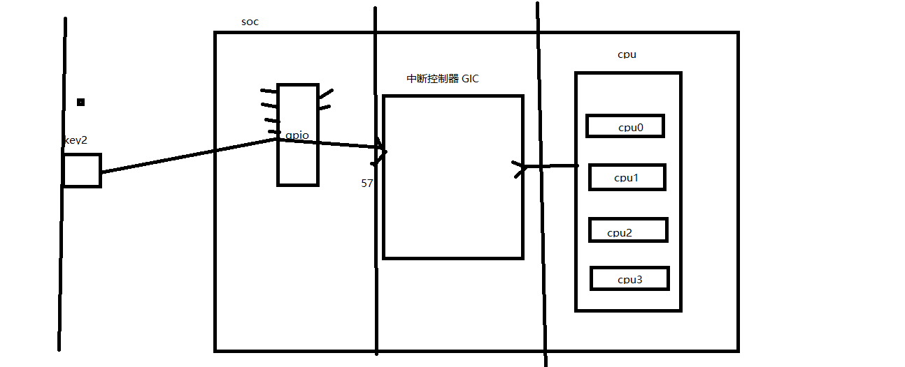
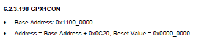
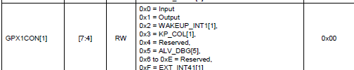
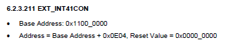
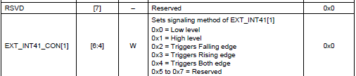
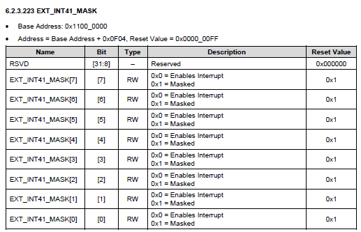
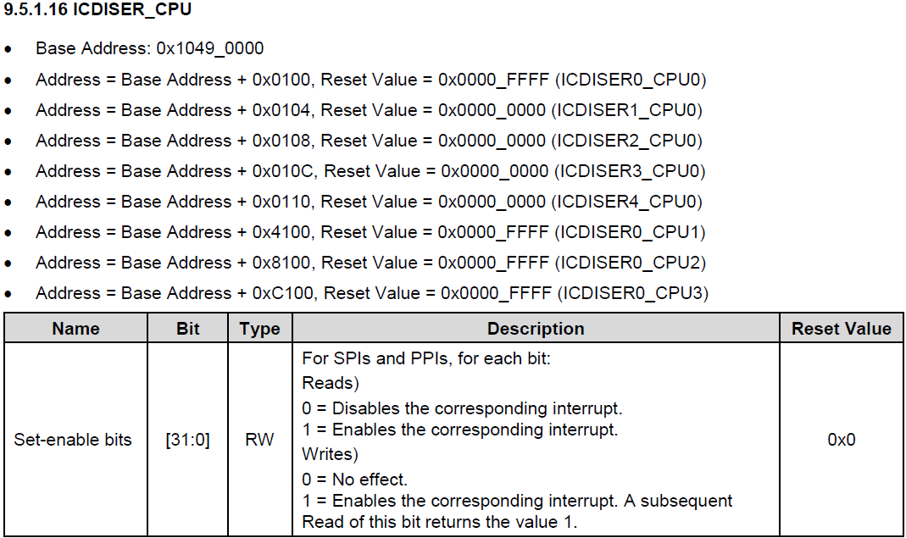

[toc]

# 1 硬件中断



## 1.1 中断基本概念

### 1.1.1 程序控制方式

是指直接在程序的控制下进行数据的输入和输出操作

### 1.1.2 中断方式

当外设需要和CPU进行数据交换时，由外设向CPU发出请求信号，使CPU暂停正在执行的程序，转去执行外设的数据的输入和输出操作，数据传送结束后，CPU在继续执行被暂停的程序。

### 1.1.3 DMA方式

外设直接从内存中拿数据，不需要CPU倒数据

## 1.2 目标

key2按键实现硬件中断

### 1.2.1 第一阶段：接线

```
key2 --> CON4 --> CON3 --> U1A(GPX1_1/XEINT9 --> 57)
```

```
1. 配置GPX1_1管脚为外部中断模式
    6.2.3.198
    GPX1CON 0x11000C20 (4-7) 0xF
```





```
2. 配置中断的触发方式 --> 下降沿触发
    6.2.3.211
    EXT_INT41CON 0x11000E04 (4-6) 0x2
```





```
3. 打开中断管脚（取消中断掩码）
    6.2.3.223
    EXT_INT41_MASK 0x11000F04   (1)0
```



### 1.2.2 第二阶段：配置中断控制器GIC

```
1. 使能57号中断
    9.5.1.16
    ICDISER1_CPU0 0x10490104  (25) 1
```

 

```
2. 把57号中断交给CPU0处理
    9.5.1.22
    ICDIPTR14_CPU0 0x10490838  (8-15)0x1
```

```
3. 设置中断优先级
    9.5.1.21
    ICDIPR14_CPU0 0x10490438  (8-15)优先级			0~255   例如：12
```

```
4. 使能cpu0中断
    9.5.1.1
    ICCICR_CPU0 0x10480000 (0)1
```

```
5. 设置CPU0的中断优先级阈值
    9.5.1.2
    ICCPMR_CPU0 0x10480004 (0-7)0xFF
```

```
6. 使能gic总开关
    9.5.1.12
    ICDDCR 0x10490000 (0)1
```

### 1.2.3 第三阶段：中断处理

```
1. 得到中断号
    9.5.1.4   
    ICCIAR_CPU0 0x1048000C  (0-9)中断号
    中断处理 --> 任何
```

```
2. 清除管脚中断标志
    6.2.3.227  
    EXT_INT41_PEND 0x11000F44 （1）1
```

```
3. 清除GIC控制器的57号中断标志
	9.5.1.19 ICDICPR1_CPU0  0x10490284  (25)1
```

```
4. 结束中断
	9.5.1.5   ICCEOIR_CPU0 0x10480010  (0-9)中断号
```

# 2 通过串口控制LDE2亮灭

## 2.1 start.s

```assembly
.text
.global _start
_start:

b  reset         @reset
nop              @undefine
nop              @swi
nop              @prefect abort
nop              @data abort
nop              @reserved
b irq_handle     @irq @key2
nop              @fiq


reset:
@设置中断向量位置为0x40008000
ldr r0,=0x40008000
mcr p15,0,r0,c12,c0,0
@svc to irq mode
mrs r0,cpsr
bic r0,#0x1F
orr r0,#0x12   @10010
msr cpsr,r0
@set irq mode stack
ldr sp,=irq_end

@irq to usr mode
mrs r0,cpsr
bic r0,#0x9F    @cpsr的第7bit位置0，允许中断发生
orr r0,#0x10
msr cpsr,r0
@set usr mode stack
ldr sp,=usr_end

b main

irq_handle:
sub lr,lr,#4
stmfd sp!,{r0-r12,lr}
bl do_irq
ldmfd sp!,{r0-r12,pc}^

.data
	irq_start:
		.space 128
	irq_end:
	usr_start:
		.space 128
	usr_end:
.end
```

## 2.2 main.c

```c
//uart config
#define GPA1CON      (*(volatile unsigned int *)0x11400020)
#define ULCON2       (*(volatile unsigned int *)0x13820000)

#define UBRDIV2      (*(volatile unsigned int *)0x13820028)
#define UFRACVAL2    (*(volatile unsigned int *)0x1382002C)
#define UCON2        (*(volatile unsigned int *)0x13820004)

#define UTRSTAT      (*(volatile unsigned int *)0x13820010)

#define URXH2        (*(volatile unsigned int *)0x13820024)
#define UTXH2        (*(volatile unsigned int *)0x13820020)

//interrupt config
#define GPX1CON             (*(volatile unsigned int *)0x11000C20)
#define EXT_INT41CON        (*(volatile unsigned int *)0x11000E04)
#define EXT_INT41_MASK      (*(volatile unsigned int *)0x11000F04)

#define ICDISER1_CPU0       (*(volatile unsigned int *)0x10490104)
#define ICDIPTR14_CPU0      (*(volatile unsigned int *)0x10490838)
#define ICDIPR14_CPU0       (*(volatile unsigned int *)0x10490438)

#define ICCICR_CPU0         (*(volatile unsigned int *)0x10480000)
#define ICCPMR_CPU0         (*(volatile unsigned int *)0x10480004)
#define ICDDCR              (*(volatile unsigned int *)0x10490000)

#define ICCIAR_CPU0         (*(volatile unsigned int *)0x1048000C)
#define EXT_INT41_PEND      (*(volatile unsigned int *)0x11000F44)
#define ICDICPR1_CPU0       (*(volatile unsigned int *)0x10490284)
#define ICCEOIR_CPU0        (*(volatile unsigned int *)0x10480010)

void InitKey2()
{
	//1 配置GPX1_1管脚为外部中断模式
	GPX1CON=GPX1CON|(0xF<<4);
	//2 配置中断的触发方式--》下降沿触发
	EXT_INT41CON=EXT_INT41CON&~(0x7<<4)|(0x2<<4);
	//3 打开中断管脚（取消中断掩码）
	EXT_INT41_MASK=EXT_INT41_MASK&~(0x1<<1);
	//4 使能57号中断
	ICDISER1_CPU0|=0x1<<(57-32);
	//5 把57号中断交给CPU0处理
	ICDIPTR14_CPU0=ICDIPTR14_CPU0&~(0xFF<<8)|(0x1<<8);
	//6 设置中断优先级
	ICDIPR14_CPU0=ICDIPR14_CPU0&~(0xFF<<8)|(12<<8);
	//7 使能cpu0中断
	ICCICR_CPU0=1;
	//8 设置CPU0的中断优先级阈值
	ICCPMR_CPU0=0xFF;
	//9 使能gic总开关
	ICDDCR=1;
}

void InitUart()
{
	//1 配置管脚gpa1_1/gpa1_0功能为uart模式
	GPA1CON=GPA1CON&~(0xFF)|0x22;
	//2  配置uart收发数据的格式（奇偶位 停止位 数据位）
	ULCON2=0<<6 | 0<<5 | 0<<2 |0x3;
	//3  配置uart的波特率115200
	UBRDIV2=53;
	UFRACVAL2=4;
	// 4 配置uart收发数据的方式为中断或轮询方式
	UCON2=UCON2&~(0xF)|(1<<2)|1;
}

/*接收UART数据*/
char RecvFromUart()
{
	 while(!(UTRSTAT&1))//如果接收buffer为空
	 {
		 ;//收数据 (相当于延时，期间RX接收数据)
	 }
	 return URXH2;//如果接收buffer有数据，那么buffer中的数据放到URXH2中
}

/*发送数据到uart*/
void SendToUart(char c)
{
	while(!(UTRSTAT&(1<<1)))//如果发送buffer不为空
	{
		;//发数据
	}
	UTXH2=c;//将要发送的数据存放到UTXH2中，当发送buffer为空时，将UTXH2里的值放到发送buffer中
}

//interrupt detail
void do_irq()
{
	//1 得到中断号
	int num=ICCIAR_CPU0&(0x3FF);
	//处理中断
	switch(num)
	{
		case 57:
		{
			SendToUart('h');
			SendToUart('e');
			SendToUart('l');
			SendToUart('l');
			SendToUart('o');
			//2 清除管脚中断标志
			EXT_INT41_PEND|=1<<1;
			//3 清除GIC控制器的57号中断标志
			ICDICPR1_CPU0|=1<<(57-32);
		}
		break;
	}
	//4 结束中断
	ICCEOIR_CPU0=ICCEOIR_CPU0&~(0x3FF)|num;
}

int main()
{
	InitUart();
	InitKey2();
	while(1)
	{			
		; //key2
	}
	return 0;
}
```
