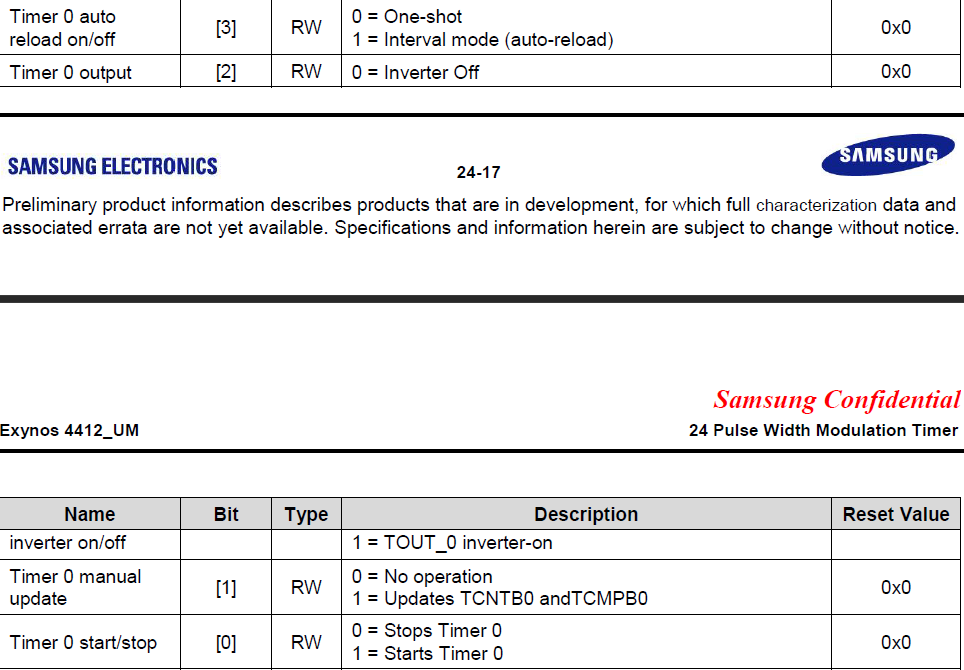

[toc]

# 1 看门狗

## 1.1 看门狗电路

是一个定时器电路，MCU的一个输出信号端和看门狗电路的输入信号端相连，MCU的复位端和看门狗的输出端相连。当MCU正常工作时，每过一段时间会给看门狗一个输入信号，叫喂狗。看门狗电路的递减计数器(会自减)会被更新，从而不会引发复位信号；当MCU死机时，长时间未给看门狗输入信号，递减计数器的值会一直递减到0，当减到0时，看门狗电路的输出端会给MCU一个复位信号。


### 1.1.1 作用

防止程序发生死循环或跑飞，防止死机

### 1.1.2 注意

递减计数器是看看门狗电路中的一个寄存器，寄存器的值递减到0，看门狗电路会给MCU复位信号，MCU会复位

# 2 看门狗案例

## 2.1 目标

5S复位开发板

## 2.2 分析

```
count = 5 每隔多长时间递减1        1 * 5
已知：
	共耗时5S
	PLCK = 100MHZ --> 看门狗电路的原始时钟脉冲
	t_watchdog = 1 / (PCLK / (Prescaler value + 1) / Division_factor)
	t_watchdog表示每隔多长时间给看门狗一个输入脉冲
假设：1级分频=250
	2级分频=128
    100MHZ / 250 / 128=3125hz
    t = 1 / 3125hz = 1 / 3125（s）
    每隔1 / 3125s外部时钟会给WT一个脉冲，需要多少个这样的脉冲才能耗时5S?
    需要=5 / 1 / 3125=15625（个）
```

```
26.4.1.1   WTCON 0x10060000 (8-15)249 (5)1 (3-4)11 (0)1
```


```
26.4.1.3   WTCNT  0x10060008  (0-15)15625
```


## 2.3 start.s

```assembly
.text
.global _start
_start:

b main

.end
```

## 2.4 main.c

```c

#define WTCON          (*(volatile unsigned int *)0x10060000 )
#define WTCNT          (*(volatile unsigned int *) 0x10060008)

void wdt_init()
{
	WTCON=WTCON&~(0xFF<<8)| (249<<8);  //一级分频
	WTCON|=0x3<<3;                     //二级分频
	WTCON|=1<<5;                       //使能看门狗
	WTCON|=1;                           //产生复位信号
	
	WTCNT=15625;                       //递减次数
}

int main()
{
	wdt_init();
	while(1)
	{
		;
	}
	return 0;
}
```

# 3 PWM

脉冲宽度调制

## 3.1 占空比

```
高电平时间 / 时钟周期
```

# 4 PWM案例

## 4.1 目标

使用PWM驱动蜂鸣器响

## 4.2 分析

```
已知:plck = 100MHZ
1 连线：BZ1 --> CON2 --> CON1 --> U1A(GPD0_0)
2 芯片手册
	(1)配置GPD0_0为PWM输出模式
	(2)配置一级分频 --> 25
	(3)配置二级分频 --> 4
	(4)设置输入波形个数
	(5)设置输入波形中高电平的持续时间
	(6)更新可持续输出波形的规则
```

```
1. 配置GPD0_0为PWM输出模式
    6.2.2.31 GPD0CON 0x114000A0 (0-3)0x2
```

```
2. 配置一级分频 --> 25
    24.5.1.1 TCFG0 0x139D0000 (0-7)24
```


```
3. 配置二级分频 --> 4
    24.5.1.2 TCFG1 0x139D0004  (0-3)0x2
    到此，输入给PWM的脉冲变成了1M/25/4=1Mhz                    
    逻辑控制器需要多少个1Mhz的波形才能产生一个400hz的波形？
    需要=1M/400=2500（个）
```


```
4. 设置输入波形个数
    24.5.1.4 TCNTB0 0x139D000C   2500
```


```
5. 设置输入波形中高电平的持续时间
    24.5.1.5 TCMPB0 0x139D0010  2500*1/2=1250
```


```
6. 更新可持续输出波形的规则
    24.5.1.3 TCON 0x139D0008 
    (3) 1 表示输出波形个数从2500自动减到0，然后再给TCNTB0=2500，继续从2500减到0循环减 类似闹钟
    (1) 1 表示立马修改TCNTB0和TCMPB0的值为新值
        0 表示不立即修改寄存器的值，当TCNTB0从2500减到0时，再修改TCNTB0的值
    (0) 1 使能输出端口
```




## 4.3 start.s

```assembly
.text
.global _start
_start:

b main

.end
```

## 4.4 main.c

```c
#define GPD0CON          (*(volatile unsigned int *)0x114000A0)
#define TCFG0            (*(volatile unsigned int *)0x139D0000)

#define TCFG1          (*(volatile unsigned int *) 0x139D0004)
#define TCNTB0         (*(volatile unsigned int *) 0x139D000C)
#define TCMPB0         (*(volatile unsigned int *) 0x139D0010)
#define TCON           (*(volatile unsigned int *) 0x139D0008)

void pwm_init()
{
	//1 配置GPD0_0为PWM输出模式
	GPD0CON=GPD0CON&~(0xF)|0x2;
	//2 配置一级分频--》25
	TCFG0=TCFG0&~(0xFF)|24;
	//3 配置二级分频--》4
	TCFG1=TCFG1&~(0xF)|0x2;
	
	//4 设置输入波形个数
	TCNTB0=2500;
	//5 设置输入波形中高电平的持续时间
	TCMPB0=2500/2;
	//6  更新可持续输出波形的规则
	TCON=TCON|1<<3|1<<1;
	TCON=TCON&~(1<<1)|1;
}

int main()
{
	pwm_init();
	while(1)
	{
		;
	}
	return 0;
}
```

