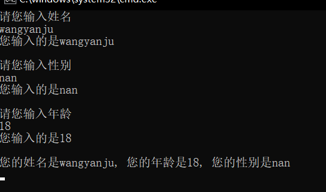

[TOC]

# 1 引用命名空间

```c#
using System;                           // 引用命名空间
using System.Collections.Generic;       // 引用命名空间
using System.Linq;                      // 引用命名空间
using System.Text;                      // 引用命名空间
using System.Threading.Tasks;           // 引用命名空间

namespace demo                        // 项目名或者命名空间
{
    class Program                      // 类
    {
        static void Main(string[] args)             // 主函数或者方法
        {
            Console.WriteLine("Hello World");
            Console.ReadKey();                  // 表示暂停这个程序相当于C++中的 System("pause");
        }
    } 
}
```

# 2 变量

用来存储数据

## 2.1 整型

## 2.2 浮点型

### 2.2.1 decimal

```markdown
1. decimal数据类型是浮点型的一种，占16个字节，共128位
2. 与double相比具有更高的精度和更小的范围，适合财务和货币运算。
3. decimal数据类型在VS编辑器中使用，只要在一个浮点类型的大写或者小写的M，则编辑器会认为这个浮点类型的值是一个decimal类型
```

$$
范围: \pm1.0\times10^{-28} 至 \pm1.0\times10^{28}
$$

## 2.3 字符串类型

## 2.4 字符类型

## 2.5 金钱类型

```csharp
// 占16个字节
// 范围	±1.0 x 10-28 至 ±7.9228 x 1028
decimal a = 1000;		// 金钱类型
```

# 3 命名规范

## 3.1 Camel

骆驼命名规范，要求变量名中首单词的首字母要小写，其余的每个单词的首字母都要大写

```
myPen     myString
```

## 3.2 Pascal

要求变量名中国每个单词的首字母都要大写，多用于给类或者方法命名

```
Person			Main      PrintHelloWorld
```

# 4 +运算符

1. 如果 + 两边有一边是字符串的话，那么此时这个+号就起到连接的作用
2. 如果＋两边都是数字，而不是字符串，那么此时加号就起到了相加的作用

# 5 占位符{}和类型转换

```csharp
using System;
using System.Collections.Generic;
using System.Linq;
using System.Text;
using System.Threading.Tasks;

namespace demo
{
    class Program
    {
        static void Main(string[] args)
        {
            int num = 10;
            int num2 = 20;
            string str = "hello";
            // {}  相当于占位符  不区分数据类型
            Console.WriteLine("num = {0}, num2 = {1}, num3 = {2}", num, num2, str);
            // 输出结果: num = 10, num2 = 20, num3 = hello

            int a = 10;
            int b = 3;
            double q = (a * 1.0) / b;
            Console.WriteLine(a % b);
            Console.WriteLine(q);
            // double q = a / b;            Console.WriteLine(q);   输出结果: 1     3
            // double q = (a * 1.0) / b;    Console.WriteLine(q);   输出结果: 1     3.3333333333333333
            // double q = (a * 1.0) / b;    Console.WriteLine("{0:0.00}", q);   输出结果: 1     3.33

            Console.ReadKey();
        }
    }
}
```

## 5.1 Convert

### 5.1.1 使用场景

如果要发生类型转换的两个变量的类型不兼容，那么这个时候就可以使用Convert类型转换。

### 5.1.2 前提

外观上要一致。

```csharp
string str = "123"; // 可以转int
string str2 = "123.45"; 	// 可以转double
```

```cs
using System;
using System.Collections.Generic;
using System.Linq;
using System.Text;
using System.Threading.Tasks;

namespace demo
{
    class Program
    {
        static void Main(string[] args)
        {
            // 强制类型转换之数据类型不兼容使用Convert
            int chinese = Convert.ToInt32(ReadAndWrite("语文"));
            int english = Convert.ToInt32(ReadAndWrite("英语"));
            int math = Convert.ToInt32(ReadAndWrite("数学"));
            Console.WriteLine("语文成绩是{0}, 英语成绩是{1}, 数学成绩是{2}", chinese, english, math);
            Console.WriteLine("您的总分是" + (chinese + english + math));
            Console.ReadKey();
        }
        static string ReadAndWrite(string Score)
        {
            Console.WriteLine("请您输入" + Score + "成绩:");
            // 使用ReadLine() 接收终端输入的内容
            string buf = Console.ReadLine();
            Console.WriteLine();
            return buf;
        }
    }
}
```


# 6 输入

```cs
using System;                           
using System.Collections.Generic;       
using System.Linq;                     
using System.Text;                      
using System.Threading.Tasks;          

namespace demo                        
{
    class Program                      
    {
        static void Main(string[] args)
        {
            Console.WriteLine("send:nice to meet you");
            // 使用ReadLine() 接收终端输入的内容
            string buf = Console.ReadLine();
            Console.WriteLine("rece:{0}", buf);
            Console.ReadKey();
        }
    }
}
```


```csharp
using System;                           
using System.Collections.Generic;       
using System.Linq;                     
using System.Text;                      
using System.Threading.Tasks;          

namespace demo                        
{
    class Program                      
    {
        static void Main(string[] args)
        {
            string name = ReadAndWrite("姓名"); 
            string sex = ReadAndWrite("性别");
            string age = ReadAndWrite("年龄");
            Console.WriteLine("您的姓名是{0}, 您的年龄是{1}, 您的性别是{2}", name, age, sex);
            Console.ReadKey();
        }
        static string ReadAndWrite(string ShuXing)
        {
            Console.WriteLine("请您输入"+ShuXing);
            // 使用ReadLine() 接收终端输入的内容
            string buf = Console.ReadLine();
            Console.WriteLine("您输入的是{0}", buf);
            Console.WriteLine();
            return buf; 
        }
    }
}
```



# 7 转义字符和@字符

```cs
\b   // 是一个退格键，\b放在字符串的两端没有效果
@"C:\desktop\a\b";			// 会让\转义字符失效
```

# 8 try-catch异常捕获

```csharp
try
{
	// 可能会出现异常的代码;
}
catch
{
    // 出现异常后要执行的代码;
}
// 执行过程: 当try中的代码出现异常的时候，出现异常的这行代码后面的代码不会被执行。而是直接跳到catch中执行catch的代码。
// 使用规律: 哪行代码有可能抛出异常，就在哪里使用
```

```csharp
using System;
using System.Collections.Generic;
using System.Linq;
using System.Text;
using System.Threading.Tasks;

namespace demo
{
    class Program
    {
        static void Main(string[] args)
        {
            int num = 0;
            bool b = true;
            Console.WriteLine("请输入一个数字:");
            try
            {
                num = Convert.ToInt32(Console.ReadLine());
            }
            // try catch之间不能有代码
            catch
            {
                Console.WriteLine("输入的字符串不能转变成数字, 程序退出!");
                b = false;
            }
            if (b)
            {
                Console.WriteLine("您输入的数字是{0}", num);
            }
            Console.ReadKey();
        }
    }
}
```


